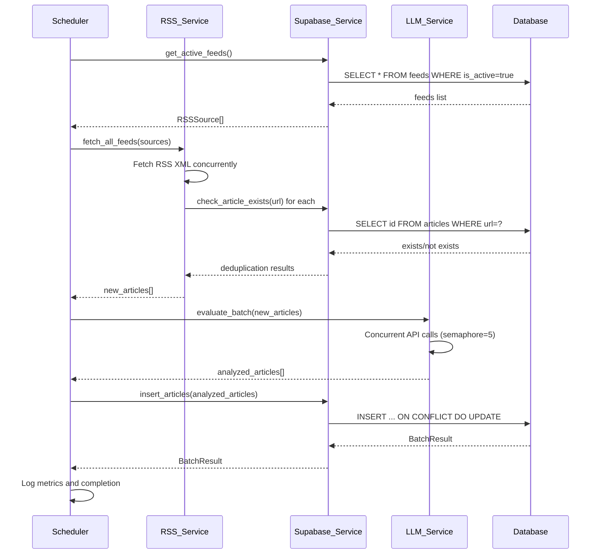

# Design Document: Background Scheduler AI Pipeline

## Overview

This design document specifies the technical architecture for Phase 3 of the Tech News Agent project: refactoring the scheduler and service layer to implement a decoupled pipeline architecture. The system will transition from "user-triggered fetching" to "background shared pool scheduled fetching" to significantly reduce LLM API consumption and improve system performance.

### Current Architecture (Phase 2)

The current implementation has the following characteristics:

- User commands (e.g., `/news_now`) trigger immediate RSS fetching
- Each user request causes LLM API calls for article analysis
- No persistent article storage between requests
- High API consumption due to repeated analysis of the same articles
- Tight coupling between user interaction and data fetching

### Target Architecture (Phase 3)

The new decoupled pipeline architecture will:

- Background scheduler periodically fetches RSS feeds (every 6 hours by default)
- Articles are deduplicated by URL before LLM processing
- LLM analysis occurs once per article and results are stored in the database
- User commands read from the pre-populated article pool
- Background scheduler does not send Discord notifications
- Separation of concerns: data fetching, AI analysis, and user notification are independent

### Key Benefits

1. **Reduced API Costs**: Each article is analyzed by LLM exactly once, regardless of how many users request it
2. **Improved Response Time**: User commands return instantly from database queries instead of waiting for RSS/LLM processing
3. **Scalability**: Supports multiple users without multiplying API costs
4. **Reliability**: Failures in background processing don't block user interactions
5. **Future-Ready**: Architecture supports personalized recommendations and multi-tenant features

## Architecture

### System Components

The refactored system consists of four primary components:

#### 1. Background Scheduler (`app/tasks/scheduler.py`)

Responsibilities:

- Initialize APScheduler with configurable CRON expressions
- Load active feeds from database at job start
- Orchestrate the pipeline: RSS fetching → Deduplication → LLM analysis → Database insertion
- Handle errors gracefully without crashing
- Log comprehensive metrics for monitoring
- Expose health check endpoint

Key characteristics:

- Runs as an async background job
- Does NOT send Discord notifications
- Does NOT import Discord bot client
- Stateless between executions

#### 2. RSS Service (`app/services/rss_service.py`)

Responsibilities:

- Fetch articles from RSS feeds concurrently
- Parse feed entries into ArticleSchema objects
- Filter articles by time window (last 7 days by default)
- Handle feed-specific failures without affecting other feeds
- Implement retry logic with exponential backoff

Enhancements needed:

- Add deduplication check against database before returning articles
- Query `articles` table by URL to identify existing articles
- Return only new articles for LLM processing

#### 3. LLM Service (`app/services/llm_service.py`)

Responsibilities:

- Batch process articles for AI analysis
- Evaluate tinkering_index (1-5 scale) using Llama 3.1 8B
- Generate ai_summary using Llama 3.3 70B
- Limit concurrent API calls using semaphore (5 concurrent max)
- Handle API failures gracefully with fallback values

Enhancements needed:

- Separate evaluation and summarization into distinct methods
- Support partial batch failures without failing entire batch
- Return articles with NULL values for failed analyses

#### 4. Supabase Service (`app/services/supabase_service.py`)

Responsibilities:

- Provide data access layer for all database operations
- Implement UPSERT logic for article insertion
- Handle database constraint violations
- Validate data before insertion

Enhancements needed:

- Add method to check article existence by URL
- Enhance `insert_articles()` to handle partial batch failures
- Add method to query unanalyzed articles (where ai_summary IS NULL)

### Data Flow



### Component Interactions

1. **Scheduler → Supabase Service**: Load feeds, check article existence, insert articles
2. **Scheduler → RSS Service**: Fetch articles from feeds
3. **Scheduler → LLM Service**: Analyze articles in batches
4. **RSS Service → Supabase Service**: Check if article URLs exist in database
5. **LLM Service**: Independent, only called by scheduler
6. **User Commands → Supabase Service**: Query pre-populated article pool (separate from background pipeline)

## Components and Interfaces

### Scheduler Module

**File**: `app/tasks/scheduler.py`

**Public Interface**:

```python
def setup_scheduler() -> None:
    """Initialize and configure the APScheduler with background jobs."""

async def background_fetch_job() -> None:
    """
    Main background job that orchestrates the pipeline.
    Runs on configurable schedule (default: every 6 hours).
    """

async def get_scheduler_health() -> dict:
    """
    Health check endpoint for monitoring.
    Returns last execution time, article counts, and failure rates.
    """
```

**Configuration**:

- `SCHEDULER_CRON`: CRON expression (default: `0 */6 * * *` - every 6 hours)
- `SCHEDULER_TIMEZONE`: Timezone for schedule (default: from settings)

**Error Handling**:

- Catch all exceptions to prevent scheduler crash
- Log errors with full context
- Continue to next scheduled execution on failure
- Retry database operations up to 3 times with exponential backoff

### RSS Service Enhancements

**File**: `app/services/rss_service.py`

**New Method**:

```python
async def fetch_new_articles(
    self,
    sources: List[RSSSource],
    supabase_service: SupabaseService
) -> List[ArticleSchema]:
    """
    Fetch articles from RSS feeds and filter out existing ones.

    Args:
        sources: List of RSS sources to fetch
        supabase_service: Service for database queries

    Returns:
        List of new articles not yet in database
    """
```

**Implementation Details**:

- Call existing `fetch_all_feeds()` to get all articles
- For each article, query database: `SELECT id FROM articles WHERE url = ?`
- Filter out articles where URL exists
- Return only new articles
- Log counts: total fetched, existing, new

### LLM Service Enhancements

**File**: `app/services/llm_service.py`

**Modified Method**:

```python
async def evaluate_batch(
    self,
    articles: List[ArticleSchema]
) -> List[ArticleSchema]:
    """
    Evaluate articles in batch with improved error handling.

    For each article:
    - Call evaluate_article() to get tinkering_index and reason
    - Call generate_summary() to get ai_summary
    - On failure, set fields to NULL and continue

    Returns:
        Articles with populated ai_analysis fields (or NULL on failure)
    """
```

**Error Handling**:

- Wrap each article processing in try-except
- On API failure: set `tinkering_index=NULL`, `ai_summary=NULL`
- Log failure with article URL and error message
- Continue processing remaining articles
- Return all articles (successful and failed)

### Supabase Service Enhancements

**File**: `app/services/supabase_service.py`

**New Methods**:

```python
async def check_article_exists(self, url: str) -> bool:
    """
    Check if an article with the given URL exists in the database.

    Args:
        url: Article URL to check

    Returns:
        True if article exists, False otherwise
    """

async def get_unanalyzed_articles(
    self,
    limit: int = 100
) -> List[dict]:
    """
    Query articles that have NULL ai_summary or tinkering_index.
    Used for re-processing failed analyses.

    Args:
        limit: Maximum number of articles to return

    Returns:
        List of article dictionaries with id, url, title, feed_id
    """
```

**Enhanced Method**:

```python
async def insert_articles(
    self,
    articles: List[dict]
) -> BatchResult:
    """
    Batch insert or update articles with improved error handling.

    Changes:
    - Process articles in batches of 100
    - Use UPSERT: INSERT ... ON CONFLICT (url) DO UPDATE
    - Track inserted_count, updated_count, failed_count separately
    - Continue on individual article failures
    - Return detailed BatchResult with failed_articles list
    """
```

## Data Models

### ArticleSchema Updates

The existing `ArticleSchema` in `app/schemas/article.py` already supports the required fields:

```python
class ArticleSchema(BaseModel):
    title: str
    url: HttpUrl
    feed_id: UUID
    feed_name: str
    category: str
    published_at: Optional[datetime]
    tinkering_index: Optional[int]  # 1-5 or NULL
    ai_summary: Optional[str]       # LLM summary or NULL
    embedding: Optional[List[float]]  # For future semantic search
```

### Database Schema

The existing database schema (from Phase 1) supports the pipeline:

**articles table**:

```sql
CREATE TABLE articles (
    id UUID PRIMARY KEY DEFAULT gen_random_uuid(),
    feed_id UUID REFERENCES feeds(id) ON DELETE CASCADE,
    title TEXT NOT NULL,
    url TEXT UNIQUE NOT NULL,  -- Used for deduplication
    published_at TIMESTAMPTZ,
    tinkering_index INTEGER,    -- NULL allowed for failed analyses
    ai_summary TEXT,            -- NULL allowed for failed analyses
    embedding VECTOR(1536),
    created_at TIMESTAMPTZ DEFAULT now()
);
```

Key constraints:

- `url` has UNIQUE constraint for deduplication
- `tinkering_index` and `ai_summary` allow NULL for failed analyses
- `feed_id` foreign key ensures referential integrity

### BatchResult Schema

Already defined in `app/schemas/article.py`:

```python
class BatchResult(BaseModel):
    inserted_count: int
    updated_count: int
    failed_count: int
    failed_articles: List[dict]  # Contains error details
```

## Correctness Properties

A property is a characteristic or behavior that should hold true across all valid executions of a system—essentially, a formal statement about what the system should do. Properties serve as the bridge between human-readable specifications and machine-verifiable correctness guarantees.

### Property 1: Active Feed Filtering

For any set of feeds retrieved from the database, all returned feeds should have `is_active = true`.

**Validates: Requirements 1.2**

### Property 2: Article Deduplication Correctness

For any list of fetched articles and any database state, the RSS service should return only articles whose URLs do not exist in the database. Specifically:

- Articles with URLs already in the database should not appear in the output
- Articles with URLs not in the database should appear in the output
- The output should contain exactly the new articles (no more, no less)

**Validates: Requirements 2.3, 2.4, 2.5**

### Property 3: Batch Processing Resilience

For any batch of items (feeds, articles, or database operations), when individual items fail, the system should continue processing remaining items. Specifically:

- Feed fetch failures should not prevent other feeds from being fetched
- Article deduplication failures should not prevent other articles from being checked
- LLM analysis failures should not prevent other articles from being analyzed
- Database insertion failures should not prevent other articles from being inserted

**Validates: Requirements 2.7, 7.2, 8.3, 4.8**

### Property 4: LLM Batch Processing Completeness

For any list of articles submitted for LLM analysis, the output should contain the same articles with analysis fields populated. For articles where API calls succeed, `tinkering_index` and `ai_summary` should have values. For articles where API calls fail, these fields should be NULL.

**Validates: Requirements 3.2, 3.3, 3.9**

### Property 5: LLM Error Handling

For any article where the Groq API returns an error, the LLM service should set `tinkering_index = NULL` and `ai_summary = NULL` for that article, and continue processing remaining articles.

**Validates: Requirements 3.7, 8.2**

### Property 6: Article Insertion Idempotence

For any article, inserting it multiple times with the same URL should not create duplicate records. The UPSERT operation should:

- Insert a new record if the URL doesn't exist
- Update the existing record if the URL already exists
- Never create duplicate URL entries

**Validates: Requirements 4.2, 4.3, 4.4**

### Property 7: Foreign Key Validation

For any article with an invalid `feed_id` (one that doesn't exist in the feeds table), the insertion should fail with a foreign key constraint error.

**Validates: Requirements 4.5**

### Property 8: Batch Result Accuracy

For any batch operation (feed fetching, article insertion), the sum of success count and failure count should equal the total input count. Specifically:

- For feed fetching: `successful_feeds + failed_feeds = total_feeds`
- For article insertion: `inserted_count + updated_count + failed_count = total_articles`

**Validates: Requirements 4.6, 7.6**

### Property 9: CRON Expression Validation

For any invalid CRON expression provided as configuration, the scheduler should raise a configuration error on startup. For any valid CRON expression, the scheduler should accept it without error.

**Validates: Requirements 6.2, 6.5**

### Property 10: Timezone Support

For any valid timezone identifier, the scheduler should correctly interpret the CRON schedule in that timezone.

**Validates: Requirements 6.6**

### Property 11: Scheduler Robustness

For any database error during scheduler execution, the scheduler should not crash. It should log the error and continue to the next scheduled execution.

**Validates: Requirements 9.5**

### Property 12: Article Time Filtering

For any article with `published_at` older than the configured time window (default 7 days), the RSS service should filter it out before deduplication checks.

**Validates: Requirements 11.1, 11.4**

### Property 13: Timestamp Parsing

For any valid RSS feed entry containing a date field, the RSS service should successfully parse it into a `published_at` timestamp.

**Validates: Requirements 11.2**

### Property 14: Batch Size Limiting

For any list of articles with count > 50, the scheduler should split them into batches where each batch has at most 50 articles. For any list with count > 100, multiple batches should be created.

**Validates: Requirements 12.1, 12.5**

### Property 15: Re-processing Logic

For any article in the database:

- If `ai_summary IS NULL`, the system should re-process it with LLM
- If `ai_summary IS NOT NULL`, the system should skip LLM processing
- If `tinkering_index IS NULL` but `ai_summary IS NOT NULL`, the system should re-process only the tinkering_index
- When re-processing occurs, the `updated_at` timestamp should be updated

**Validates: Requirements 13.1, 13.2, 13.3, 13.4, 13.6, 13.7**

### Property 16: User Query Result Filtering

For any user query to the article pool, all returned articles should satisfy:

- `tinkering_index IS NOT NULL`
- `published_at` is within the last 7 days
- Results are ordered by `tinkering_index` descending
- Result count ≤ 20

**Validates: Requirements 15.2, 15.3, 15.4**

### Property 17: Dynamic Feed Configuration

For any feed marked as `is_active = false`, it should not appear in the next scheduler execution. For any new feed added with `is_active = true`, it should appear in the next scheduler execution.

**Validates: Requirements 16.2, 16.3**

### Property 18: Serialization Round-Trip

For any valid `ArticleSchema` object, serializing it to a database record and then deserializing it back should produce an equivalent object. All required fields should be preserved, including:

- `title`, `url`, `feed_id`, `category`
- `published_at` with correct timezone information
- `tinkering_index`, `ai_summary` (including NULL values)

**Validates: Requirements 17.3, 17.4, 17.5, 17.7**

## Error Handling

### RSS Fetching Errors

**Network Failures**:

- Implement exponential backoff retry (3 attempts max)
- Retry delays: 2s, 4s, 8s
- Log each retry attempt with feed name and URL
- After all retries fail, mark feed as temporarily unavailable
- Continue processing other feeds

**Parse Failures**:

- Log malformed RSS XML with feed URL
- Skip the problematic feed
- Continue processing other feeds

**Timeout Handling**:

- Set 15-second timeout per feed request
- Treat timeouts as transient errors (retry with backoff)
- Log timeout events for monitoring

### LLM API Errors

**Rate Limiting**:

- Respect `Retry-After` header from Groq API
- Implement exponential backoff (2 retries max)
- Use semaphore to limit concurrent requests (5 max)
- Log rate limit events for capacity planning

**API Failures**:

- Catch all API exceptions per article
- Set `tinkering_index = NULL`, `ai_summary = NULL` for failed articles
- Log failure with article URL and error message
- Continue processing remaining articles
- If >30% of batch fails, log warning for investigation

**Timeout Handling**:

- Set 30-second timeout per API call
- Treat timeouts as failures (set NULL values)
- Log timeout events

### Database Errors

**Connection Failures**:

- Retry database operations up to 3 times with exponential backoff
- Retry delays: 1s, 2s, 4s
- Cache articles in memory during connection failures
- On next successful connection, process cached articles
- If all retries fail, log critical error and skip current job execution

**Constraint Violations**:

- **Unique constraint (URL)**: Expected during UPSERT, handle gracefully
- **Foreign key (feed_id)**: Log error with article URL and invalid feed_id, skip article
- **Check constraint (tinkering_index range)**: Validate before insertion, log validation errors
- **Not null constraint**: Validate required fields before insertion

**Transaction Failures**:

- Use batch operations with individual error handling
- Track success/failure per article in `BatchResult`
- Don't rollback entire batch on individual failures
- Log all constraint violations for debugging

### Scheduler Errors

**Job Execution Failures**:

- Wrap entire job in try-except to prevent scheduler crash
- Log all exceptions with full stack trace
- Continue to next scheduled execution
- Expose failure metrics via health check endpoint

**Configuration Errors**:

- Validate CRON expression on startup
- Raise clear error message for invalid expressions
- Validate timezone configuration
- Fail fast on startup for configuration issues

## Testing Strategy

### Dual Testing Approach

This feature requires both unit tests and property-based tests to ensure comprehensive coverage:

**Unit Tests**: Verify specific examples, edge cases, and error conditions

- Scheduler initialization with valid/invalid CRON expressions
- Empty feed list handling
- Database connection failure scenarios
- Health check endpoint responses
- Discord notification absence verification
- Configuration defaults (6-hour schedule, 7-day window)

**Property-Based Tests**: Verify universal properties across all inputs

- Article deduplication correctness across random article sets
- Batch processing resilience with random failure injection
- UPSERT idempotence with repeated insertions
- Serialization round-trip with random ArticleSchema objects
- Time filtering with random timestamps
- Batch size limiting with random input sizes

### Property-Based Testing Configuration

**Framework**: Hypothesis (Python)

**Test Configuration**:

- Minimum 100 iterations per property test
- Each test must reference its design document property
- Tag format: `# Feature: background-scheduler-ai-pipeline, Property {number}: {property_text}`

**Example Property Test Structure**:

```python
from hypothesis import given, strategies as st
import pytest

# Feature: background-scheduler-ai-pipeline, Property 2: Article Deduplication Correctness
@given(
    fetched_articles=st.lists(st.builds(ArticleSchema)),
    existing_urls=st.sets(st.text())
)
@pytest.mark.property_test
def test_article_deduplication_correctness(fetched_articles, existing_urls):
    """
    For any list of fetched articles and any database state,
    the RSS service should return only articles whose URLs
    do not exist in the database.
    """
    # Mock database to return existing_urls
    # Call RSS service deduplication
    # Assert output contains only articles with URLs not in existing_urls
    pass
```

### Unit Test Coverage

**Scheduler Module**:

- `test_scheduler_initialization_with_valid_cron()`
- `test_scheduler_initialization_with_invalid_cron()`
- `test_scheduler_handles_empty_feed_list()`
- `test_scheduler_handles_database_connection_failure()`
- `test_scheduler_does_not_import_discord_client()`
- `test_scheduler_does_not_call_discord_api()`
- `test_scheduler_default_schedule_is_6_hours()`
- `test_health_check_returns_200_when_healthy()`
- `test_health_check_returns_503_when_stale()`
- `test_health_check_returns_503_when_high_failure_rate()`

**RSS Service**:

- `test_rss_service_filters_old_articles()`
- `test_rss_service_uses_current_time_when_published_at_missing()`
- `test_rss_service_continues_on_individual_feed_failure()`
- `test_rss_service_respects_configurable_time_window()`
- `test_rss_service_defaults_to_7_days()`

**LLM Service**:

- `test_llm_service_sets_null_on_api_failure()`
- `test_llm_service_continues_on_individual_article_failure()`
- `test_llm_service_respects_semaphore_limit()`

**Supabase Service**:

- `test_insert_articles_upserts_on_duplicate_url()`
- `test_insert_articles_validates_foreign_key()`
- `test_insert_articles_returns_accurate_batch_result()`
- `test_check_article_exists_returns_true_for_existing()`
- `test_check_article_exists_returns_false_for_new()`
- `test_get_unanalyzed_articles_returns_null_summaries()`

### Integration Tests

**End-to-End Pipeline**:

- `test_full_pipeline_with_mock_feeds()`
- `test_pipeline_handles_partial_failures()`
- `test_pipeline_deduplicates_across_runs()`
- `test_pipeline_respects_time_window()`

**Database Integration**:

- `test_article_insertion_with_real_database()`
- `test_upsert_behavior_with_real_database()`
- `test_foreign_key_validation_with_real_database()`

### Test Data Generators

For property-based tests, define custom Hypothesis strategies:

```python
from hypothesis import strategies as st
from datetime import datetime, timedelta

# Generate valid ArticleSchema objects
article_schema_strategy = st.builds(
    ArticleSchema,
    title=st.text(min_size=1, max_size=2000),
    url=st.from_regex(r'https?://[a-z]+\.[a-z]+/[a-z]+', fullmatch=True),
    feed_id=st.uuids(),
    feed_name=st.text(min_size=1, max_size=100),
    category=st.sampled_from(['AI', 'DevOps', 'Web', 'Mobile']),
    published_at=st.datetimes(
        min_value=datetime.now() - timedelta(days=30),
        max_value=datetime.now()
    ),
    tinkering_index=st.one_of(st.none(), st.integers(min_value=1, max_value=5)),
    ai_summary=st.one_of(st.none(), st.text(max_size=5000))
)

# Generate valid CRON expressions
cron_strategy = st.sampled_from([
    '0 */6 * * *',  # Every 6 hours
    '0 0 * * *',    # Daily at midnight
    '0 9 * * 1',    # Every Monday at 9am
    '*/30 * * * *'  # Every 30 minutes
])

# Generate invalid CRON expressions
invalid_cron_strategy = st.sampled_from([
    'invalid',
    '60 * * * *',   # Invalid minute
    '* * * * * *',  # Too many fields
    ''              # Empty string
])
```

### Performance Testing

**Batch Processing Performance**:

- Measure processing time for batches of 50, 100, 500 articles
- Verify memory usage stays within acceptable limits
- Ensure concurrent LLM calls respect semaphore limit

**Database Performance**:

- Measure insertion time for batches of 100, 500, 1000 articles
- Verify UPSERT performance with varying duplicate ratios
- Test query performance for user commands

### Monitoring and Observability

**Metrics to Track**:

- Scheduler execution duration
- Feed fetch success/failure rates
- Article deduplication hit rate
- LLM API success/failure rates
- Database insertion success/failure rates
- Articles processed per execution
- Health check response times

**Logging Requirements**:

- All errors logged at ERROR level with stack traces
- Warnings logged when failure rates exceed thresholds (>30% for LLM, >50% for feeds)
- Info logs for job start/end, counts, and durations
- Debug logs for individual article processing (disabled in production)

## Implementation Notes

### Migration from Phase 2 to Phase 3

**Step 1: Enhance Supabase Service**

Add new methods without breaking existing functionality:

- `check_article_exists(url: str) -> bool`
- `get_unanalyzed_articles(limit: int) -> List[dict]`
- Enhance `insert_articles()` to return detailed `BatchResult`

**Step 2: Refactor RSS Service**

Add deduplication logic:

- Create new method `fetch_new_articles()` that wraps `fetch_all_feeds()`
- Query database for each article URL
- Filter out existing articles
- Maintain backward compatibility with existing `fetch_all_feeds()`

**Step 3: Enhance LLM Service**

Improve error handling:

- Wrap individual article processing in try-except
- Set NULL values on failures instead of raising exceptions
- Return all articles (successful and failed) in batch results

**Step 4: Refactor Scheduler**

Complete rewrite of `app/tasks/scheduler.py`:

- Remove Discord bot imports and notification code
- Implement new pipeline orchestration
- Add configuration loading from environment variables
- Add health check endpoint
- Add comprehensive error handling and logging

**Step 5: Update User Commands**

Modify Discord commands to query database instead of triggering fetches:

- `/news_now`: Query `articles` table with filters
- Remove RSS/LLM service calls from command handlers
- Add fallback message when article pool is empty

**Step 6: Testing**

- Write property-based tests for new functionality
- Write unit tests for edge cases
- Run integration tests with test database
- Verify backward compatibility

### Configuration Management

**Environment Variables**:

```bash
# Scheduler Configuration
SCHEDULER_CRON="0 */6 * * *"  # Every 6 hours (default)
SCHEDULER_TIMEZONE="Asia/Taipei"  # Timezone for schedule

# RSS Configuration
RSS_FETCH_DAYS=7  # Days to look back for articles (default: 7)
RSS_TIMEOUT=15    # Timeout per feed in seconds (default: 15)
RSS_MAX_RETRIES=3 # Max retry attempts (default: 3)

# LLM Configuration
LLM_CONCURRENT_LIMIT=5  # Max concurrent API calls (default: 5)
LLM_TIMEOUT=30          # Timeout per API call in seconds (default: 30)
LLM_MAX_RETRIES=2       # Max retry attempts (default: 2)

# Database Configuration
DB_MAX_RETRIES=3        # Max retry attempts (default: 3)
DB_RETRY_DELAY=1        # Initial retry delay in seconds (default: 1)

# Batch Processing
BATCH_SIZE=50           # Articles per batch (default: 50)
BATCH_SPLIT_THRESHOLD=100  # Split into multiple batches above this (default: 100)
```

### Deployment Considerations

**Scheduler Deployment**:

- Run scheduler as a separate process or container
- Ensure only one scheduler instance runs (avoid duplicate processing)
- Use process manager (systemd, supervisor) for auto-restart
- Monitor scheduler health via `/health/scheduler` endpoint

**Database Migrations**:

- No schema changes required (Phase 1 schema already supports this)
- Verify indexes exist on `articles.url` and `articles.published_at`
- Consider adding index on `articles.ai_summary` for NULL checks if performance issues arise

**Monitoring Setup**:

- Set up alerts for scheduler health check failures
- Monitor LLM API failure rates (alert if >30%)
- Monitor feed fetch failure rates (alert if >50%)
- Track article processing throughput
- Monitor database connection pool usage

### Performance Optimization

**Database Query Optimization**:

- Use `SELECT id FROM articles WHERE url = ?` for existence checks (index-only scan)
- Batch existence checks into single query with `WHERE url IN (...)`
- Use prepared statements for repeated queries
- Consider connection pooling for concurrent operations

**Memory Management**:

- Process articles in batches of 50 to limit memory usage
- Clear processed batches from memory before next batch
- Use generators for large result sets
- Monitor memory usage in production

**API Rate Limiting**:

- Respect Groq API rate limits (use semaphore)
- Implement token bucket algorithm if needed
- Cache API responses for identical requests (optional)
- Consider upgrading API tier if rate limits are hit frequently

### Security Considerations

**API Key Management**:

- Store Groq API key in environment variables (never in code)
- Rotate API keys periodically
- Use separate API keys for development and production
- Monitor API key usage for anomalies

**Database Security**:

- Use Supabase RLS (Row Level Security) policies
- Limit database user permissions to required operations
- Validate all user inputs before database queries
- Use parameterized queries to prevent SQL injection

**Error Message Sanitization**:

- Don't expose internal URLs or API keys in error messages
- Sanitize error messages before logging
- Use structured logging for sensitive data

### Rollback Plan

If Phase 3 deployment encounters issues:

1. **Immediate Rollback**: Revert to Phase 2 scheduler code
2. **Database State**: No rollback needed (schema unchanged)
3. **User Commands**: Revert to Phase 2 command handlers
4. **Monitoring**: Check logs for root cause
5. **Fix Forward**: Address issues and redeploy

### Future Enhancements

**Phase 4 Considerations**:

- Personalized recommendations based on user reading history
- Semantic search using article embeddings
- Multi-tenant support with user-specific feeds
- Real-time notifications for high-priority articles
- Article clustering and topic modeling
- Automated feed discovery and suggestion

**Scalability Improvements**:

- Distributed scheduler with leader election
- Horizontal scaling of LLM processing workers
- Caching layer (Redis) for frequently accessed articles
- CDN for article content delivery
- Database read replicas for user queries

## Appendix

### Glossary of Terms

- **UPSERT**: Database operation that inserts a new record or updates if it already exists
- **Deduplication**: Process of identifying and removing duplicate articles by URL
- **Batch Processing**: Processing multiple items together for efficiency
- **Exponential Backoff**: Retry strategy where delay doubles after each failure
- **Semaphore**: Concurrency control mechanism limiting simultaneous operations
- **CRON Expression**: Time-based job scheduler format (e.g., `0 */6 * * *`)
- **Idempotence**: Property where operation produces same result when repeated
- **Round-Trip**: Converting data format A→B→A and verifying equivalence

### References

- **APScheduler Documentation**: https://apscheduler.readthedocs.io/
- **Hypothesis Documentation**: https://hypothesis.readthedocs.io/
- **Groq API Documentation**: https://console.groq.com/docs
- **Supabase Python Client**: https://supabase.com/docs/reference/python
- **feedparser Documentation**: https://feedparser.readthedocs.io/
- **CRON Expression Format**: https://crontab.guru/

### Design Decisions

**Why separate background scheduler from user commands?**

- Reduces API costs by processing each article once
- Improves user response time (instant database queries)
- Enables future multi-tenant features
- Simplifies error handling and retry logic

**Why use UPSERT instead of checking existence first?**

- Atomic operation prevents race conditions
- Simpler code (one operation instead of two)
- Better performance (one database round-trip)
- Handles concurrent insertions gracefully

**Why process articles in batches?**

- Limits memory usage for large article sets
- Enables progress tracking and partial success
- Allows graceful handling of individual failures
- Improves database insertion performance

**Why use NULL for failed LLM analyses?**

- Distinguishes between "not analyzed" and "analysis failed"
- Enables re-processing of failed articles
- Maintains data integrity (no fake/default values)
- Simplifies query logic (WHERE ai_summary IS NOT NULL)

**Why not send notifications from background scheduler?**

- Separation of concerns (data vs. presentation)
- Enables multiple notification strategies
- Supports user-specific preferences
- Simplifies testing and debugging
