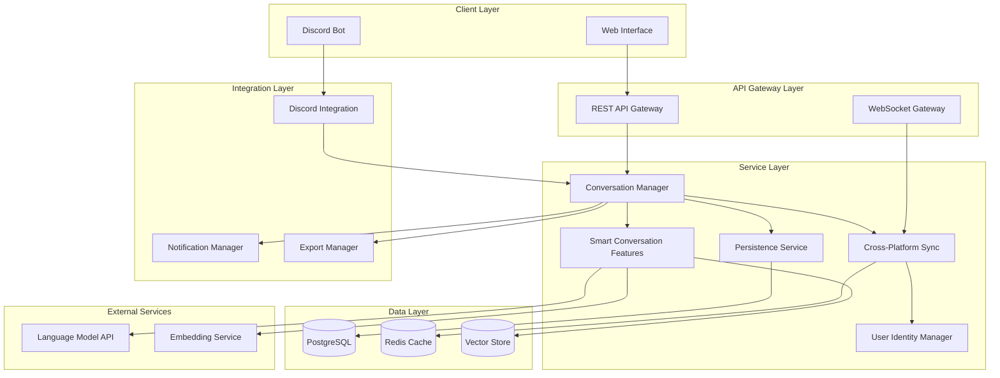

# Design Document: 聊天記錄持久化與跨平台同步系統

## Overview

聊天記錄持久化與跨平台同步系統是所有 AI Agent 功能的核心基礎設施。它提供完整的對話生命週期管理，確保用戶可以在 Web 界面和 Discord 之間無縫切換對話，並享受智能化的對話管理體驗。

### Key Capabilities

- **完整對話持久化**: 自動儲存所有對話資料，支援完整的歷史記錄和搜尋
- **跨平台無縫同步**: Web 和 Discord 間即時同步，提供連續的對話體驗
- **智能對話管理**: 自動標題生成、標籤分類、相關推薦等智能功能
- **Discord 深度整合**: 完整的 Discord Bot 指令支援和自動對話管理
- **用戶身份統一**: 跨平台身份識別和安全綁定機制
- **高效能架構**: 支援 10,000+ 並發對話，200ms 跨平台同步延遲

### Architecture Principles

1. **資料一致性**: 確保跨平台資料的強一致性和完整性
2. **即時同步**: 最小化跨平台同步延遲，提供即時體驗
3. **可擴展性**: 支援大規模用戶和對話資料的水平擴展
4. **安全性**: 端到端加密和完整的存取控制機制

## Architecture

系統採用分層架構，清楚分離持久化、同步、管理和展示層：



### Core Components

1. **Conversation Manager**: 對話生命週期管理和業務邏輯協調
2. **Persistence Service**: 資料持久化和儲存管理
3. **Cross-Platform Sync**: 跨平台即時同步機制
4. **User Identity Manager**: 用戶身份識別和平台綁定
5. **Smart Conversation Features**: 智能對話功能和分析
6. **Discord Integration**: Discord Bot 整合和指令處理

## Components and Interfaces

### Conversation Manager

**Purpose**: 對話生命週期的核心管理器，協調所有對話相關的業務邏輯。

**Key Responsibilities**:

- 對話的建立、更新、刪除和查詢
- 對話狀態管理和生命週期控制
- 跨服務協調和業務邏輯執行
- 對話權限控制和存取管理

**Interface**:

```python
class ConversationManager:
    async def create_conversation(
        self,
        user_id: str,
        platform: Platform,
        initial_message: Optional[str] = None,
        title: Optional[str] = None
    ) -> Conversation

    async def get_conversation(
        self,
        conversation_id: str,
        user_id: str
    ) -> Optional[Conversation]

    async def list_conversations(
        self,
        user_id: str,
        filters: ConversationFilters
    ) -> PaginatedResult[ConversationSummary]

    async def add_message(
        self,
        conversation_id: str,
        message: Message
    ) -> None

    async def update_conversation(
        self,
        conversation_id: str,
        updates: ConversationUpdate
    ) -> Conversation

    async def delete_conversation(
        self,
        conversation_id: str,
        user_id: str
    ) -> bool

    async def search_conversations(
        self,
        user_id: str,
        query: str,
        filters: SearchFilters
    ) -> List[ConversationMatch]
```

### Persistence Service

**Purpose**: 負責所有對話資料的持久化儲存和檢索。

**Key Responsibilities**:

- 對話和訊息的資料庫操作
- 資料完整性和一致性保證
- 查詢優化和效能管理
- 資料歸檔和清理

**Interface**:

```python
class PersistenceService:
    async def store_conversation(self, conversation: Conversation) -> str
    async def store_message(self, message: Message) -> str
    async def get_conversation_by_id(self, conversation_id: str) -> Optional[Conversation]
    async def get_messages(
        self,
        conversation_id: str,
        limit: int = 50,
        offset: int = 0
    ) -> List[Message]

    async def search_conversations_fulltext(
        self,
        user_id: str,
        query: str,
        limit: int = 20
    ) -> List[ConversationMatch]

    async def update_conversation_metadata(
        self,
        conversation_id: str,
        metadata: Dict[str, Any]
    ) -> bool

    async def archive_old_conversations(self, days_threshold: int) -> int
    async def delete_conversation_data(self, conversation_id: str) -> bool
```

### Cross-Platform Sync

**Purpose**: 處理不同平台間的對話狀態同步和資料一致性。

**Key Responsibilities**:

- 即時跨平台狀態同步
- 同步衝突檢測和解決
- 平台特定格式轉換
- 同步失敗處理和重試

**Interface**:

```python
class CrossPlatformSync:
    async def sync_message(
        self,
        message: Message,
        target_platforms: List[Platform]
    ) -> SyncResult

    async def sync_conversation_state(
        self,
        conversation_id: str,
        state_update: ConversationStateUpdate
    ) -> SyncResult

    async def handle_platform_message(
        self,
        platform_message: PlatformMessage
    ) -> ProcessedMessage

    async def resolve_sync_conflict(
        self,
        conflict: SyncConflict
    ) -> ConflictResolution

    async def get_sync_status(
        self,
        conversation_id: str
    ) -> Dict[Platform, SyncStatus]
```

### User Identity Manager

**Purpose**: 管理用戶在不同平台的身份識別和綁定關係。

**Key Responsibilities**:

- 用戶平台帳號綁定和解綁
- 身份驗證和安全檢查
- 跨平台用戶識別
- 綁定狀態管理

**Interface**:

```python
class UserIdentityManager:
    async def link_platform_account(
        self,
        user_id: str,
        platform: Platform,
        platform_user_id: str,
        verification_token: str
    ) -> LinkResult

    async def unlink_platform_account(
        self,
        user_id: str,
        platform: Platform
    ) -> bool

    async def get_user_by_platform_id(
        self,
        platform: Platform,
        platform_user_id: str
    ) -> Optional[str]

    async def get_linked_platforms(
        self,
        user_id: str
    ) -> List[PlatformLink]

    async def verify_platform_identity(
        self,
        platform: Platform,
        platform_user_id: str,
        verification_data: Dict[str, Any]
    ) -> bool
```

### Smart Conversation Features

**Purpose**: 提供智能化的對話分析、管理和推薦功能。

**Key Responsibilities**:

- 自動對話標題生成
- 對話摘要和洞察分析
- 相關對話推薦
- 用戶行為分析和個人化

**Interface**:

```python
class SmartConversationFeatures:
    async def generate_conversation_title(
        self,
        conversation: Conversation
    ) -> str

    async def generate_conversation_summary(
        self,
        conversation: Conversation
    ) -> ConversationSummary

    async def recommend_related_conversations(
        self,
        user_id: str,
        current_conversation_id: str,
        limit: int = 5
    ) -> List[ConversationRecommendation]

    async def analyze_user_conversation_patterns(
        self,
        user_id: str,
        time_range: TimeRange
    ) -> UserConversationAnalysis

    async def generate_conversation_insights(
        self,
        conversation: Conversation
    ) -> List[ConversationInsight]
```

### Discord Integration

**Purpose**: 處理 Discord Bot 的所有對話相關功能和指令。

**Key Responsibilities**:

- Discord 指令處理和回應
- Discord 特定格式處理
- 自動對話識別和管理
- Discord 用戶互動處理

**Interface**:

```python
class DiscordIntegration:
    async def handle_continue_command(
        self,
        discord_user_id: str,
        conversation_id: str,
        channel_id: str
    ) -> DiscordResponse

    async def handle_conversations_command(
        self,
        discord_user_id: str,
        filters: Optional[Dict[str, Any]] = None
    ) -> DiscordResponse

    async def handle_search_command(
        self,
        discord_user_id: str,
        query: str
    ) -> DiscordResponse

    async def handle_link_command(
        self,
        discord_user_id: str,
        verification_code: str
    ) -> DiscordResponse

    async def process_message_for_qa(
        self,
        discord_message: DiscordMessage
    ) -> Optional[QAResponse]

    async def format_conversation_for_discord(
        self,
        conversation: Conversation,
        max_length: int = 2000
    ) -> str
```

## Data Models

### Core Data Structures

```python
@dataclass
class Conversation:
    id: str
    user_id: str
    title: str
    summary: Optional[str]
    platform: Platform
    tags: List[str]
    is_archived: bool
    is_favorite: bool
    created_at: datetime
    last_message_at: datetime
    message_count: int
    metadata: Dict[str, Any]

@dataclass
class Message:
    id: str
    conversation_id: str
    role: MessageRole  # 'user' | 'assistant'
    content: str
    platform: Platform
    metadata: Dict[str, Any]
    created_at: datetime

@dataclass
class ConversationSummary:
    id: str
    title: str
    summary: str
    platform: Platform
    last_message_at: datetime
    message_count: int
    tags: List[str]
    is_favorite: bool
    is_archived: bool

@dataclass
class PlatformLink:
    user_id: str
    platform: Platform
    platform_user_id: str
    platform_username: Optional[str]
    linked_at: datetime
    is_active: bool

@dataclass
class SyncResult:
    success: bool
    synced_platforms: List[Platform]
    failed_platforms: List[Platform]
    errors: List[str]
    sync_timestamp: datetime

@dataclass
class ConversationMatch:
    conversation: ConversationSummary
    relevance_score: float
    matched_content: List[str]
    highlight_snippets: List[str]

@dataclass
class ConversationFilters:
    platform: Optional[Platform] = None
    is_archived: Optional[bool] = None
    is_favorite: Optional[bool] = None
    tags: Optional[List[str]] = None
    date_from: Optional[datetime] = None
    date_to: Optional[datetime] = None
    limit: int = 20
    offset: int = 0

@dataclass
class UserConversationAnalysis:
    user_id: str
    total_conversations: int
    active_conversations: int
    most_active_platform: Platform
    top_topics: List[str]
    conversation_frequency: Dict[str, int]
    average_conversation_length: float
    learning_progress_indicators: Dict[str, Any]
```

### Database Schema

**Enhanced Conversations Table**:

```sql
CREATE TABLE conversations (
    id UUID PRIMARY KEY DEFAULT gen_random_uuid(),
    user_id UUID NOT NULL REFERENCES users(id) ON DELETE CASCADE,
    title VARCHAR(200) NOT NULL,
    summary TEXT,
    platform VARCHAR(20) NOT NULL DEFAULT 'web',
    tags JSONB DEFAULT '[]',
    is_archived BOOLEAN DEFAULT FALSE,
    is_favorite BOOLEAN DEFAULT FALSE,
    created_at TIMESTAMP DEFAULT NOW(),
    last_message_at TIMESTAMP DEFAULT NOW(),
    message_count INTEGER DEFAULT 0,
    metadata JSONB DEFAULT '{}',

    CONSTRAINT valid_platform CHECK (platform IN ('web', 'discord'))
);

-- Indexes for performance
CREATE INDEX idx_conversations_user_id ON conversations(user_id);
CREATE INDEX idx_conversations_user_platform ON conversations(user_id, platform);
CREATE INDEX idx_conversations_last_message ON conversations(last_message_at DESC);
CREATE INDEX idx_conversations_tags ON conversations USING gin(tags);
CREATE INDEX idx_conversations_title_search ON conversations USING gin(to_tsvector('english', title));
CREATE INDEX idx_conversations_archived ON conversations(user_id, is_archived);
CREATE INDEX idx_conversations_favorite ON conversations(user_id, is_favorite);
```

**Conversation Messages Table**:

```sql
CREATE TABLE conversation_messages (
    id UUID PRIMARY KEY DEFAULT gen_random_uuid(),
    conversation_id UUID NOT NULL REFERENCES conversations(id) ON DELETE CASCADE,
    role VARCHAR(20) NOT NULL,
    content TEXT NOT NULL,
    platform VARCHAR(20) NOT NULL,
    metadata JSONB DEFAULT '{}',
    created_at TIMESTAMP DEFAULT NOW(),

    CONSTRAINT valid_role CHECK (role IN ('user', 'assistant')),
    CONSTRAINT valid_platform CHECK (platform IN ('web', 'discord'))
);

-- Indexes
CREATE INDEX idx_messages_conversation_id ON conversation_messages(conversation_id);
CREATE INDEX idx_messages_created_at ON conversation_messages(created_at DESC);
CREATE INDEX idx_messages_content_search ON conversation_messages USING gin(to_tsvector('english', content));
```

**User Platform Links Table**:

```sql
CREATE TABLE user_platform_links (
    user_id UUID NOT NULL REFERENCES users(id) ON DELETE CASCADE,
    platform VARCHAR(20) NOT NULL,
    platform_user_id VARCHAR(100) NOT NULL,
    platform_username VARCHAR(100),
    linked_at TIMESTAMP DEFAULT NOW(),
    is_active BOOLEAN DEFAULT TRUE,
    verification_data JSONB DEFAULT '{}',

    PRIMARY KEY (user_id, platform),
    UNIQUE (platform, platform_user_id),
    CONSTRAINT valid_platform CHECK (platform IN ('web', 'discord'))
);

-- Indexes
CREATE INDEX idx_platform_links_platform_user ON user_platform_links(platform, platform_user_id);
CREATE INDEX idx_platform_links_user_id ON user_platform_links(user_id);
```

**Conversation Tags Table** (for better tag management):

```sql
CREATE TABLE conversation_tags (
    id UUID PRIMARY KEY DEFAULT gen_random_uuid(),
    user_id UUID NOT NULL REFERENCES users(id) ON DELETE CASCADE,
    tag_name VARCHAR(50) NOT NULL,
    color VARCHAR(7), -- hex color code
    created_at TIMESTAMP DEFAULT NOW(),
    usage_count INTEGER DEFAULT 0,

    UNIQUE (user_id, tag_name)
);

CREATE INDEX idx_conversation_tags_user_id ON conversation_tags(user_id);
CREATE INDEX idx_conversation_tags_usage ON conversation_tags(user_id, usage_count DESC);
```

## Correctness Properties

### Property 1: 對話資料完整性

_For any_ 對話操作（建立、更新、刪除），系統 SHALL 確保資料的完整性和一致性，所有相關的訊息、元資料和索引都正確更新。

**Validates: Requirements 1.1, 1.2, 1.3**

### Property 2: 跨平台同步一致性

_For any_ 跨平台訊息同步，系統 SHALL 確保所有已連結平台的對話狀態保持一致，同步延遲不超過 200ms。

**Validates: Requirements 2.1, 2.2, 2.4**

### Property 3: 用戶身份識別準確性

_For any_ 平台用戶操作，系統 SHALL 正確識別用戶身份並映射到對應的系統帳號，確保資料隔離和安全性。

**Validates: Requirements 2.3, 5.1, 5.3**

### Property 4: 對話搜尋完整性

_For any_ 對話搜尋查詢，系統 SHALL 返回用戶有權存取的所有相關對話，支援全文搜尋和語義搜尋，結果按相關性排序。

**Validates: Requirements 3.1, 3.3**

### Property 5: Discord 指令響應性

_For any_ Discord 指令，系統 SHALL 在 3 秒內提供適當的回應，正確處理指令參數並提供有意義的錯誤訊息。

**Validates: Requirements 4.1, 4.3, 4.4, 4.5**

### Property 6: 智能功能準確性

_For any_ 智能對話功能（標題生成、摘要、推薦），系統 SHALL 基於對話內容生成準確和有用的結果，避免幻覺和不相關內容。

**Validates: Requirements 3.2, 3.5, 6.1, 6.2, 6.5**

### Property 7: 效能要求達成

_For any_ 系統操作，訊息儲存 SHALL 在 100ms 內完成，對話列表查詢 SHALL 在 500ms 內返回，跨平台同步 SHALL 在 200ms 內完成。

**Validates: Requirements 7.1, 7.2, 7.3, 7.4**

### Property 8: 資料安全保護

_For any_ 敏感資料操作，系統 SHALL 使用加密儲存，實作適當的存取控制，並記錄所有資料存取活動。

**Validates: Requirements 8.1, 8.2, 8.4, 8.5**

### Property 9: 匯出資料完整性

_For any_ 對話匯出操作，系統 SHALL 保留完整的對話格式、元資料和時間戳，支援多種格式並確保資料可讀性。

**Validates: Requirements 9.1, 9.4, 9.5**

### Property 10: 通知智能化

_For any_ 通知發送，系統 SHALL 根據用戶偏好和活躍模式選擇適當時機，避免過度打擾並提供有價值的提醒。

**Validates: Requirements 10.1, 10.2, 10.4, 10.5**

## Error Handling

### Error Categories and Responses

**同步失敗處理**:

- **網路中斷**: 實作指數退避重試機制，最多重試 3 次
- **平台 API 限制**: 實作速率限制和佇列機制
- **資料衝突**: 使用時間戳和版本號解決衝突
- **格式轉換錯誤**: 提供降級處理和錯誤通知

**身份識別錯誤**:

- **綁定失敗**: 提供清楚的錯誤訊息和重試指引
- **驗證超時**: 自動清理過期的驗證請求
- **重複綁定**: 檢測並處理重複綁定嘗試
- **權限不足**: 記錄安全事件並通知管理員

**資料操作錯誤**:

- **資料庫連線失敗**: 實作連線池和健康檢查
- **查詢超時**: 優化查詢並提供部分結果
- **儲存空間不足**: 實作自動清理和警告機制
- **資料損壞**: 實作資料完整性檢查和修復

**Discord 整合錯誤**:

- **指令解析失敗**: 提供使用說明和範例
- **回應超時**: 實作非同步處理和狀態更新
- **權限不足**: 檢查 Bot 權限並提供設定指引
- **訊息長度限制**: 自動分割長訊息或提供摘要

## Testing Strategy

### Property-Based Testing

**Framework**: Hypothesis (Python) 進行全面的屬性測試
**Configuration**: 每個屬性測試最少 100 次迭代
**Coverage**: 所有 10 個正確性屬性都有專門的測試實作

**Property Test Structure**:

```python
@given(strategies.conversations_with_messages())
def test_conversation_data_integrity(conversation_data):
    """Feature: chat-persistence-system, Property 1: 對話資料完整性"""
    # 測試對話建立、更新、刪除的資料完整性
    pass

@given(strategies.cross_platform_messages())
def test_cross_platform_sync_consistency(message_data):
    """Feature: chat-persistence-system, Property 2: 跨平台同步一致性"""
    # 測試跨平台同步的一致性和延遲
    pass
```

### Integration Testing

**跨平台整合測試**:

- Web 和 Discord 間的完整對話流程
- 用戶身份綁定和驗證流程
- 即時同步和衝突解決

**資料庫整合測試**:

- 大量資料的查詢效能
- 並發操作的資料一致性
- 資料遷移和備份恢復

**外部服務整合測試**:

- Discord API 整合和錯誤處理
- LLM 服務的智能功能測試
- 通知服務的可靠性測試

### Performance Testing

**負載測試**:

- 10,000+ 並發對話處理
- 大量歷史資料的搜尋效能
- 跨平台同步的延遲和吞吐量

**壓力測試**:

- 極限負載下的系統穩定性
- 記憶體使用和垃圾回收影響
- 資料庫連線池的效能表現

### Security Testing

**資料保護測試**:

- 加密儲存和傳輸驗證
- 存取控制和權限檢查
- 資料洩露和注入攻擊防護

**身份驗證測試**:

- 平台綁定的安全性驗證
- 偽造身份和重放攻擊防護
- 會話管理和超時處理

## Monitoring and Observability

### Key Metrics

**效能指標**:

- 訊息儲存延遲 (目標: < 100ms)
- 對話查詢回應時間 (目標: < 500ms)
- 跨平台同步延遲 (目標: < 200ms)
- 系統吞吐量和並發處理能力

**業務指標**:

- 對話建立和活躍度
- 跨平台使用分佈
- 用戶參與度和滿意度
- 智能功能使用率和準確性

**系統健康指標**:

- 資料庫連線和查詢效能
- 外部服務可用性和回應時間
- 錯誤率和異常事件頻率
- 資源使用率和擴展需求

### Alerting Thresholds

- 訊息儲存延遲 > 200ms (95th percentile)
- 跨平台同步失敗率 > 1% (5分鐘窗口)
- Discord 指令回應時間 > 5 秒 (95th percentile)
- 資料庫查詢錯誤率 > 0.1% (1分鐘窗口)
- 用戶身份驗證失敗 (任何發生)
