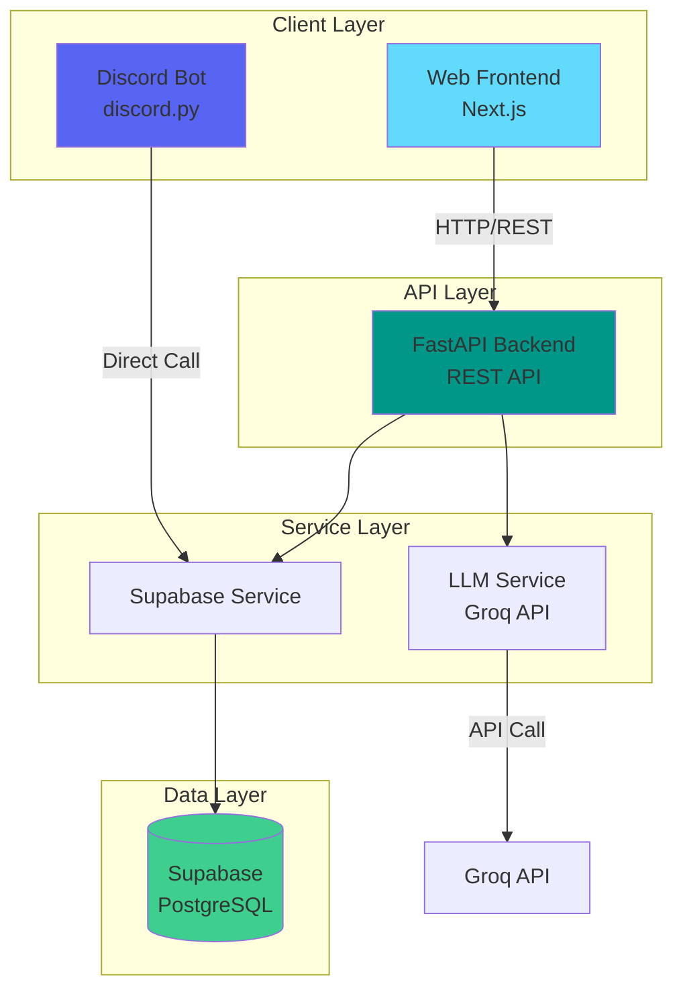
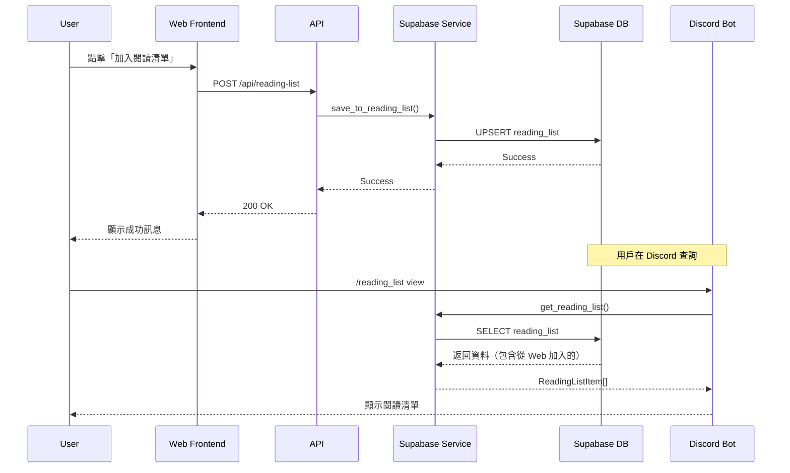
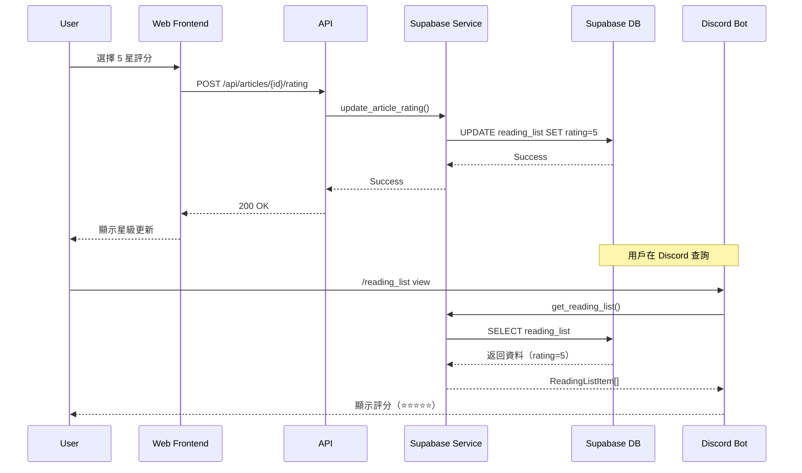
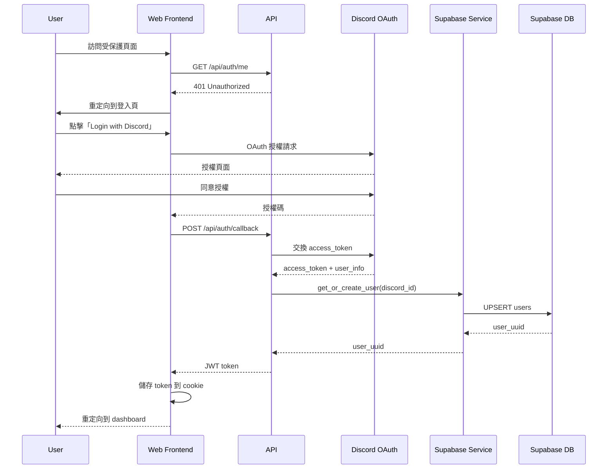
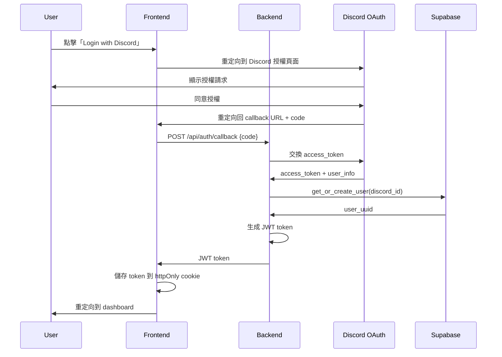

# Design Document: Cross-Platform Feature Parity

## Overview

本設計文件定義 Tech News Agent 專案的跨平台功能對齊實作方案。目標是將 Discord Bot 已有的完整功能（閱讀清單、評分、標記已讀、深度摘要、推薦系統）補齊到網頁端，確保兩個平台功能一致且資料即時同步。

### 設計目標

1. **功能對齊**: 網頁端實作與 Discord Bot 相同的功能集
2. **資料一致性**: 使用 Supabase 作為單一真實來源（Single Source of Truth）
3. **即時同步**: 任一平台的操作立即反映到另一平台
4. **用戶隔離**: 確保用戶資料完全隔離，保護隱私
5. **效能優化**: 快速回應時間，良好的使用者體驗

### 技術棧

- **Backend**: FastAPI (Python 3.11+)
- **Frontend**: Next.js 14 (React, TypeScript)
- **Database**: Supabase (PostgreSQL)
- **Authentication**: Discord OAuth 2.0
- **LLM Service**: Groq API
- **Testing**: Pytest (Backend), Jest + Playwright (Frontend)

## Architecture

### System Architecture



### 資料流程

#### 1. 閱讀清單同步流程



#### 2. 評分同步流程



### 認證流程



## Components and Interfaces

### Backend API Endpoints

#### 1. Reading List API

```python
# POST /api/reading-list
# 加入文章到閱讀清單
Request Body:
{
  "article_id": "uuid"
}

Response: 200 OK
{
  "message": "Article added to reading list",
  "article_id": "uuid"
}

# GET /api/reading-list
# 查詢閱讀清單
Query Parameters:
- status: Optional[str] = None  # "Unread", "Read", "Archived"
- page: int = 1
- page_size: int = 20

Response: 200 OK
{
  "items": [
    {
      "article_id": "uuid",
      "title": "string",
      "url": "string",
      "category": "string",
      "status": "Unread",
      "rating": 5,
      "added_at": "2024-01-01T00:00:00Z",
      "updated_at": "2024-01-01T00:00:00Z"
    }
  ],
  "page": 1,
  "page_size": 20,
  "total_count": 100,
  "has_next_page": true
}

# DELETE /api/reading-list/{article_id}
# 從閱讀清單移除文章
Response: 200 OK
{
  "message": "Article removed from reading list"
}
```

#### 2. Rating API

```python
# POST /api/articles/{article_id}/rating
# 設定或更新文章評分
Request Body:
{
  "rating": 5  # 1-5
}

Response: 200 OK
{
  "message": "Rating updated",
  "article_id": "uuid",
  "rating": 5
}

# GET /api/articles/{article_id}/rating
# 查詢文章評分
Response: 200 OK
{
  "article_id": "uuid",
  "rating": 5
}
```

#### 3. Read Status API

```python
# POST /api/articles/{article_id}/status
# 更新文章閱讀狀態
Request Body:
{
  "status": "Read"  # "Unread", "Read", "Archived"
}

Response: 200 OK
{
  "message": "Status updated",
  "article_id": "uuid",
  "status": "Read"
}
```

#### 4. Deep Summary API

```python
# POST /api/articles/{article_id}/deep-summary
# 生成文章深度摘要
Response: 200 OK
{
  "article_id": "uuid",
  "summary": "string",
  "generated_at": "2024-01-01T00:00:00Z"
}

# GET /api/articles/{article_id}/deep-summary
# 查詢已生成的深度摘要
Response: 200 OK
{
  "article_id": "uuid",
  "summary": "string",
  "generated_at": "2024-01-01T00:00:00Z"
}
```

#### 5. Recommendations API

```python
# GET /api/recommendations
# 取得個人化推薦
Query Parameters:
- time_range: Optional[str] = "week"  # "week", "month"

Response: 200 OK
{
  "recommendation": "string",
  "based_on_articles": [
    {
      "article_id": "uuid",
      "title": "string",
      "rating": 5
    }
  ],
  "generated_at": "2024-01-01T00:00:00Z"
}
```

### Frontend Components

#### 1. 新頁面

```typescript
// app/reading-list/page.tsx
// 閱讀清單頁面
export default function ReadingListPage() {
  // 顯示用戶的閱讀清單
  // 支援篩選（全部/未讀/已讀/已封存）
  // 支援分頁
  // 提供評分、標記已讀、移除等操作
}

// app/recommendations/page.tsx
// 推薦頁面
export default function RecommendationsPage() {
  // 顯示基於用戶評分的個人化推薦
  // 支援時間範圍選擇（本週/本月）
}
```

#### 2. 新組件

```typescript
// components/StarRating.tsx
// 星級評分組件
interface StarRatingProps {
  rating: number;
  onChange?: (rating: number) => void;
  readonly?: boolean;
}

// components/ReadStatusBadge.tsx
// 閱讀狀態徽章
interface ReadStatusBadgeProps {
  status: 'Unread' | 'Read' | 'Archived';
}

// components/DeepSummaryModal.tsx
// 深度摘要模態視窗
interface DeepSummaryModalProps {
  articleId: string;
  isOpen: boolean;
  onClose: () => void;
}

// components/ReadingListItem.tsx
// 閱讀清單項目卡片
interface ReadingListItemProps {
  item: ReadingListItem;
  onRate: (rating: number) => void;
  onStatusChange: (status: string) => void;
  onRemove: () => void;
}
```

#### 3. API Client 函式

```typescript
// lib/api/readingList.ts
export async function addToReadingList(articleId: string): Promise<void>;
export async function getReadingList(
  status?: string,
  page?: number,
  pageSize?: number,
): Promise<ReadingListResponse>;
export async function removeFromReadingList(articleId: string): Promise<void>;

// lib/api/ratings.ts
export async function rateArticle(
  articleId: string,
  rating: number,
): Promise<void>;
export async function getArticleRating(
  articleId: string,
): Promise<number | null>;

// lib/api/status.ts
export async function updateArticleStatus(
  articleId: string,
  status: string,
): Promise<void>;

// lib/api/deepSummary.ts
export async function generateDeepSummary(articleId: string): Promise<string>;
export async function getDeepSummary(articleId: string): Promise<string | null>;

// lib/api/recommendations.ts
export async function getRecommendations(
  timeRange?: string,
): Promise<RecommendationResponse>;
```

## Data Models

### Database Schema

#### 1. 新增資料表

```sql
-- user_reading_list (已重新命名為 reading_list)
CREATE TABLE reading_list (
  id UUID PRIMARY KEY DEFAULT gen_random_uuid(),
  user_id UUID NOT NULL REFERENCES users(id) ON DELETE CASCADE,
  article_id UUID NOT NULL REFERENCES articles(id) ON DELETE CASCADE,
  status VARCHAR(20) NOT NULL DEFAULT 'Unread' CHECK (status IN ('Unread', 'Read', 'Archived')),
  rating INTEGER CHECK (rating >= 1 AND rating <= 5),
  added_at TIMESTAMPTZ NOT NULL DEFAULT NOW(),
  updated_at TIMESTAMPTZ NOT NULL DEFAULT NOW(),

  -- 唯一性約束：每個用戶對每篇文章只能有一條記錄
  CONSTRAINT unique_user_article UNIQUE (user_id, article_id)
);

-- 索引優化
CREATE INDEX idx_reading_list_user_id ON reading_list(user_id);
CREATE INDEX idx_reading_list_status ON reading_list(user_id, status);
CREATE INDEX idx_reading_list_rating ON reading_list(user_id, rating) WHERE rating IS NOT NULL;
CREATE INDEX idx_reading_list_added_at ON reading_list(user_id, added_at DESC);

-- 自動更新 updated_at
CREATE OR REPLACE FUNCTION update_reading_list_updated_at()
RETURNS TRIGGER AS $$
BEGIN
  NEW.updated_at = NOW();
  RETURN NEW;
END;
$$ LANGUAGE plpgsql;

CREATE TRIGGER trigger_update_reading_list_updated_at
BEFORE UPDATE ON reading_list
FOR EACH ROW
EXECUTE FUNCTION update_reading_list_updated_at();
```

#### 2. 擴充現有資料表

```sql
-- articles 表擴充（支援深度摘要）
ALTER TABLE articles
ADD COLUMN IF NOT EXISTS deep_summary TEXT,
ADD COLUMN IF NOT EXISTS deep_summary_generated_at TIMESTAMPTZ;

-- 索引優化
CREATE INDEX IF NOT EXISTS idx_articles_deep_summary
ON articles(id) WHERE deep_summary IS NOT NULL;
```

#### 3. Row Level Security (RLS) 政策

```sql
-- 啟用 RLS
ALTER TABLE reading_list ENABLE ROW LEVEL SECURITY;

-- 政策：用戶只能查看自己的閱讀清單
CREATE POLICY reading_list_select_policy ON reading_list
FOR SELECT
USING (user_id = auth.uid());

-- 政策：用戶只能插入自己的閱讀清單
CREATE POLICY reading_list_insert_policy ON reading_list
FOR INSERT
WITH CHECK (user_id = auth.uid());

-- 政策：用戶只能更新自己的閱讀清單
CREATE POLICY reading_list_update_policy ON reading_list
FOR UPDATE
USING (user_id = auth.uid())
WITH CHECK (user_id = auth.uid());

-- 政策：用戶只能刪除自己的閱讀清單
CREATE POLICY reading_list_delete_policy ON reading_list
FOR DELETE
USING (user_id = auth.uid());
```

### Pydantic Schemas

#### 1. Request Schemas

```python
# backend/app/schemas/reading_list.py
from pydantic import BaseModel, Field
from uuid import UUID

class AddToReadingListRequest(BaseModel):
    article_id: UUID = Field(..., description="文章 UUID")

class UpdateRatingRequest(BaseModel):
    rating: int = Field(..., ge=1, le=5, description="評分（1-5）")

class UpdateStatusRequest(BaseModel):
    status: str = Field(..., description="閱讀狀態")

    @validator('status')
    def validate_status(cls, v):
        allowed = {'Unread', 'Read', 'Archived'}
        if v not in allowed:
            raise ValueError(f"Status must be one of {allowed}")
        return v
```

#### 2. Response Schemas

```python
# backend/app/schemas/reading_list.py
from pydantic import BaseModel, Field, HttpUrl
from typing import Optional, List
from datetime import datetime
from uuid import UUID

class ReadingListItemResponse(BaseModel):
    article_id: UUID
    title: str
    url: HttpUrl
    category: str
    status: str
    rating: Optional[int] = None
    added_at: datetime
    updated_at: datetime

class ReadingListResponse(BaseModel):
    items: List[ReadingListItemResponse]
    page: int
    page_size: int
    total_count: int
    has_next_page: bool

class DeepSummaryResponse(BaseModel):
    article_id: UUID
    summary: str
    generated_at: datetime

class RecommendationResponse(BaseModel):
    recommendation: str
    based_on_articles: List[dict]
    generated_at: datetime
```

### TypeScript Types

```typescript
// types/readingList.ts
export interface ReadingListItem {
  article_id: string;
  title: string;
  url: string;
  category: string;
  status: 'Unread' | 'Read' | 'Archived';
  rating: number | null;
  added_at: string;
  updated_at: string;
}

export interface ReadingListResponse {
  items: ReadingListItem[];
  page: number;
  page_size: number;
  total_count: number;
  has_next_page: boolean;
}

export interface DeepSummary {
  article_id: string;
  summary: string;
  generated_at: string;
}

export interface Recommendation {
  recommendation: string;
  based_on_articles: Array<{
    article_id: string;
    title: string;
    rating: number;
  }>;
  generated_at: string;
}
```

## Correctness Properties

_A property is a characteristic or behavior that should hold true across all valid executions of a system-essentially, a formal statement about what the system should do. Properties serve as the bridge between human-readable specifications and machine-verifiable correctness guarantees._

### Acceptance Criteria Testing Prework

在撰寫 correctness properties 之前，我們需要分析每個 acceptance criteria 的可測試性：

#### Requirement 1: 網頁端閱讀清單管理

1.1. WHEN 用戶在網頁端點擊文章的「加入閱讀清單」按鈕，THE Web_Frontend SHALL 將該文章加入用戶的 Reading_List
Thoughts: 這是測試一個操作的結果。我們可以生成隨機的用戶和文章，執行加入操作，然後驗證該文章出現在閱讀清單中。
Testable: yes - property

1.2. WHEN 文章成功加入 Reading_List，THE Web_Frontend SHALL 顯示成功提示訊息
Thoughts: 這是 UI 回饋測試，屬於 UI 層面的行為，不是核心業務邏輯。
Testable: no

1.3. WHEN 用戶導航到閱讀清單頁面，THE Web_Frontend SHALL 顯示該用戶所有 Reading_List 中的文章
Thoughts: 這是測試查詢操作的完整性。對於任何用戶，查詢閱讀清單應該返回該用戶加入的所有文章。
Testable: yes - property

1.4. THE Web_Frontend SHALL 按加入時間降序排列 Reading_List 中的文章
Thoughts: 這是測試排序邏輯。對於任何閱讀清單，返回的項目應該按 added_at 降序排列。
Testable: yes - property

1.5. WHEN 用戶在 Reading_List 中點擊文章，THE Web_Frontend SHALL 在新分頁開啟該文章的原始 URL
Thoughts: 這是 UI 導航行為，不是核心業務邏輯。
Testable: no

1.6. WHEN 用戶點擊「從清單移除」按鈕，THE Web_Frontend SHALL 從 Reading_List 中移除該文章
Thoughts: 這是測試移除操作。對於任何用戶和文章，執行移除後該文章不應出現在閱讀清單中。
Testable: yes - property

1.7. THE Web_Frontend SHALL 顯示每篇文章的標題、來源、分類、加入時間
Thoughts: 這是測試資料完整性。對於任何閱讀清單項目，返回的資料應包含所有必要欄位。
Testable: yes - property

1.8. WHEN Reading_List 為空，THE Web_Frontend SHALL 顯示友善的空狀態訊息
Thoughts: 這是 UI 顯示邏輯，不是核心業務邏輯。
Testable: no

#### Requirement 2: 網頁端文章評分功能

2.1. THE Web_Frontend SHALL 在每篇文章旁顯示 1-5 星的評分介面
Thoughts: 這是 UI 元件顯示，不是核心業務邏輯。
Testable: no

2.2. WHEN 用戶選擇星級評分，THE Web_Frontend SHALL 將 Rating 儲存到 Supabase
Thoughts: 這是測試評分操作。對於任何用戶、文章和評分值，執行評分後應能查詢到該評分。
Testable: yes - property

2.3. WHEN Rating 成功儲存，THE Web_Frontend SHALL 即時更新顯示的星級
Thoughts: 這是 UI 更新邏輯，不是核心業務邏輯。
Testable: no

2.4. WHEN 用戶修改已有的 Rating，THE Web_Frontend SHALL 更新該 Rating 值
Thoughts: 這是測試評分更新。對於任何已評分的文章，更新評分後應反映新值。
Testable: yes - property

2.5. THE Web_Frontend SHALL 顯示用戶當前對該文章的 Rating（如果已評分）
Thoughts: 這是測試查詢邏輯。對於任何已評分的文章，查詢應返回正確的評分值。
Testable: yes - property

2.6. WHEN 用戶尚未對文章評分，THE Web_Frontend SHALL 顯示空星級狀態
Thoughts: 這是 UI 顯示邏輯，但可以測試查詢未評分文章返回 null。
Testable: yes - edge-case

2.7. THE Web_Frontend SHALL 驗證 Rating 值在 1-5 範圍內
Thoughts: 這是輸入驗證。對於任何超出範圍的評分值，系統應拒絕。
Testable: yes - property

2.8. IF Rating 值無效，THEN THE Web_Frontend SHALL 顯示錯誤訊息且不儲存
Thoughts: 這是錯誤處理。對於無效評分，系統應返回錯誤且不修改資料。
Testable: yes - property

#### Requirement 3: 網頁端標記已讀功能

3.1. THE Web_Frontend SHALL 在每篇文章旁顯示「標記已讀」按鈕
Thoughts: 這是 UI 元件顯示，不是核心業務邏輯。
Testable: no

3.2. WHEN 用戶點擊「標記已讀」按鈕，THE Web_Frontend SHALL 更新該文章的 Read_Status 為 'Read'
Thoughts: 這是測試狀態更新。對於任何文章，執行標記已讀後狀態應為 'Read'。
Testable: yes - property

3.3. WHEN Read_Status 更新成功，THE Web_Frontend SHALL 視覺化標示該文章為已讀
Thoughts: 這是 UI 顯示邏輯，不是核心業務邏輯。
Testable: no

3.4. THE Web_Frontend SHALL 提供篩選器以顯示「全部」、「未讀」或「已讀」文章
Thoughts: 這是 UI 元件，但背後的篩選邏輯可測試。
Testable: yes - property

3.5. WHEN 用戶選擇「未讀」篩選，THE Web_Frontend SHALL 只顯示 Read_Status 為 'Unread' 的文章
Thoughts: 這是測試篩選邏輯。對於任何閱讀清單，篩選 'Unread' 應只返回未讀文章。
Testable: yes - property

3.6. WHEN 用戶選擇「已讀」篩選，THE Web_Frontend SHALL 只顯示 Read_Status 為 'Read' 的文章
Thoughts: 這是測試篩選邏輯。對於任何閱讀清單，篩選 'Read' 應只返回已讀文章。
Testable: yes - property

3.7. WHEN 用戶點擊已讀文章的「標記未讀」按鈕，THE Web_Frontend SHALL 更新 Read_Status 為 'Unread'
Thoughts: 這是測試狀態轉換。標記已讀後再標記未讀應回到原始狀態。這是一個 round-trip property。
Testable: yes - property

3.8. THE Web_Frontend SHALL 在文章列表顯示已讀/未讀狀態指示器
Thoughts: 這是 UI 顯示邏輯，不是核心業務邏輯。
Testable: no

#### Requirement 4: 網頁端深度摘要生成

4.1. THE Web_Frontend SHALL 在每篇文章旁顯示「生成深度摘要」按鈕
Thoughts: 這是 UI 元件顯示，不是核心業務邏輯。
Testable: no

4.2. WHEN 用戶點擊「生成深度摘要」按鈕，THE Web_Frontend SHALL 呼叫 LLM_Service 生成 Deep_Summary
Thoughts: 這是測試 LLM 服務整合。我們可以測試呼叫是否成功，但無法測試摘要品質。
Testable: yes - example

4.3. WHILE Deep_Summary 生成中，THE Web_Frontend SHALL 顯示載入指示器
Thoughts: 這是 UI 顯示邏輯，不是核心業務邏輯。
Testable: no

4.4. WHEN Deep_Summary 生成完成，THE Web_Frontend SHALL 在模態視窗或展開區域顯示摘要內容
Thoughts: 這是 UI 顯示邏輯，不是核心業務邏輯。
Testable: no

4.5. THE Deep_Summary SHALL 包含關鍵要點、技術細節、實用性評估
Thoughts: 這是 LLM 輸出品質要求，無法自動化測試。
Testable: no

4.6. WHEN Deep_Summary 已存在，THE Web_Frontend SHALL 直接顯示快取的摘要而不重新生成
Thoughts: 這是測試快取邏輯。對於已生成摘要的文章，第二次請求不應呼叫 LLM。
Testable: yes - property

4.7. THE Web_Frontend SHALL 將生成的 Deep_Summary 儲存到 Supabase 供重複查看
Thoughts: 這是測試持久化。生成摘要後應能從資料庫查詢到。
Testable: yes - property

4.8. IF LLM_Service 生成失敗，THEN THE Web_Frontend SHALL 顯示錯誤訊息並提供重試選項
Thoughts: 這是錯誤處理。LLM 失敗時系統應正確處理且不儲存不完整資料。
Testable: yes - property

#### Requirement 5: 網頁端個人化推薦系統

5.1. THE Web_Frontend SHALL 提供「查看推薦」功能入口
Thoughts: 這是 UI 元件顯示，不是核心業務邏輯。
Testable: no

5.2. WHEN 用戶點擊「查看推薦」，THE Web_Frontend SHALL 查詢該用戶所有 Rating >= 4 的文章
Thoughts: 這是測試查詢邏輯。對於任何用戶，應只返回評分 >= 4 的文章。
Testable: yes - property

5.3. IF 用戶沒有高評分文章（Rating >= 4），THEN THE Web_Frontend SHALL 顯示提示訊息要求用戶先評分
Thoughts: 這是測試邊界條件。沒有高評分文章時應返回特定訊息。
Testable: yes - example

5.4. WHEN 用戶有高評分文章，THE Web_Frontend SHALL 呼叫 LLM_Service 生成 Recommendation
Thoughts: 這是測試 LLM 服務整合。我們可以測試呼叫是否成功。
Testable: yes - example

5.5. THE Recommendation SHALL 基於高評分文章的標題和分類生成
Thoughts: 這是 LLM 輸入要求，可以測試傳遞的參數是否正確。
Testable: yes - property

5.6. THE Web_Frontend SHALL 顯示 Recommendation 內容，包含推薦理由和相關主題
Thoughts: 這是 UI 顯示邏輯，不是核心業務邏輯。
Testable: no

5.7. THE Web_Frontend SHALL 提供「每週推薦」和「每月推薦」兩種時間範圍選項
Thoughts: 這是 UI 元件，但背後的時間範圍篩選邏輯可測試。
Testable: yes - property

5.8. WHEN 用戶選擇時間範圍，THE Web_Frontend SHALL 只考慮該時間範圍內的高評分文章
Thoughts: 這是測試時間範圍篩選。對於任何時間範圍，應只返回該範圍內的文章。
Testable: yes - property

#### Requirement 6: 跨平台閱讀清單同步

6.1. WHEN 用戶在 Web_Frontend 加入文章到 Reading_List，THE Supabase SHALL 立即儲存該記錄
Thoughts: 這是測試寫入操作。對於任何文章，加入後應能立即查詢到。
Testable: yes - property

6.2. WHEN 用戶在 Discord_Bot 查詢 Reading_List，THE Discord_Bot SHALL 顯示包含從 Web_Frontend 加入的文章
Thoughts: 這是測試跨平台同步。在平台 A 加入的文章應在平台 B 可見。這是 round-trip property。
Testable: yes - property

6.3. WHEN 用戶在 Discord_Bot 加入文章到 Reading_List，THE Supabase SHALL 立即儲存該記錄
Thoughts: 這與 6.1 相同，只是平台不同。可以合併為一個 property。
Testable: yes - property

6.4. WHEN 用戶在 Web_Frontend 查詢 Reading_List，THE Web_Frontend SHALL 顯示包含從 Discord_Bot 加入的文章
Thoughts: 這與 6.2 相同，只是方向相反。可以合併為一個 property。
Testable: yes - property

6.5. FOR ALL 平台操作，THE Supabase SHALL 作為單一真實來源（Single Source of Truth）
Thoughts: 這是架構要求，不是可測試的功能行為。
Testable: no

6.6. WHEN 用戶在任一平台移除 Reading_List 項目，THE 另一平台 SHALL 反映該移除操作
Thoughts: 這是測試跨平台同步。在平台 A 移除的文章應在平台 B 不可見。
Testable: yes - property

6.7. THE 系統 SHALL 確保 Reading_List 操作的冪等性（重複加入相同文章不產生重複記錄）
Thoughts: 這是測試冪等性。對於任何文章，重複加入應只有一條記錄。
Testable: yes - property

6.8. THE 系統 SHALL 使用 (user_id, article_id) 作為 Reading_List 的唯一性約束
Thoughts: 這是資料庫約束，可以測試違反約束時的行為。
Testable: yes - property

#### Requirement 7: 跨平台評分同步

7.1. WHEN 用戶在 Web_Frontend 對文章評分，THE Supabase SHALL 立即儲存該 Rating
Thoughts: 這是測試寫入操作。對於任何評分，儲存後應能立即查詢到。
Testable: yes - property

7.2. WHEN 用戶在 Discord_Bot 查詢該文章，THE Discord_Bot SHALL 顯示從 Web_Frontend 設定的 Rating
Thoughts: 這是測試跨平台同步。在平台 A 設定的評分應在平台 B 可見。
Testable: yes - property

7.3-7.5: (與 7.1-7.2 類似，只是平台相反)
Thoughts: 可以合併為一個雙向同步 property。
Testable: yes - property

7.6. THE 系統 SHALL 確保每個用戶對每篇文章只有一個 Rating 值
Thoughts: 這是測試唯一性約束。對於任何用戶和文章，應只有一個評分記錄。
Testable: yes - property

7.7. THE 系統 SHALL 使用 (user_id, article_id) 作為 Rating 的唯一性約束
Thoughts: 這是資料庫約束，與 7.6 相同。
Testable: yes - property

7.8. WHEN 用戶在平台 A 評分後在平台 B 再次評分，THE 系統 SHALL 更新而非建立新記錄
Thoughts: 這是測試更新邏輯。重複評分應更新現有記錄。
Testable: yes - property

#### Requirement 8: 跨平台已讀狀態同步

8.1-8.5: (與 Requirement 7 類似，測試 Read_Status 的跨平台同步)
Thoughts: 可以合併為跨平台狀態同步 property。
Testable: yes - property

8.6. THE 系統 SHALL 支援三種 Read_Status 值：'Unread', 'Read', 'Archived'
Thoughts: 這是測試狀態值驗證。對於任何無效狀態值，系統應拒絕。
Testable: yes - property

8.7. THE 系統 SHALL 驗證 Read_Status 值只能是允許的三種狀態之一
Thoughts: 這與 8.6 相同。
Testable: yes - property

8.8. WHEN 用戶在平台 A 更新 Read_Status 後在平台 B 查詢，THE 平台 B SHALL 顯示最新的 Read_Status
Thoughts: 這是測試跨平台同步的即時性。
Testable: yes - property

#### Requirement 9: 跨平台深度摘要共享

9.1-9.4: (測試深度摘要的跨平台共享)
Thoughts: 深度摘要是文章級別的資料，不是用戶特定的。可以測試跨平台共享。
Testable: yes - property

9.5. THE 系統 SHALL 檢查 Deep_Summary 是否已存在於 Supabase
Thoughts: 這是測試快取檢查邏輯。
Testable: yes - property

9.6. IF Deep_Summary 已存在，THEN THE 系統 SHALL 直接返回快取的摘要而不呼叫 LLM_Service
Thoughts: 這是測試快取命中邏輯。已存在的摘要不應重新生成。
Testable: yes - property

9.7. THE 系統 SHALL 將 Deep_Summary 儲存在 articles 表的 ai_summary 欄位
Thoughts: 這是實作細節，不是功能行為。
Testable: no

9.8. THE Deep_Summary SHALL 對所有用戶共享（非用戶特定資料）
Thoughts: 這是測試資料共享。任何用戶生成的摘要應對所有用戶可見。
Testable: yes - property

#### Requirement 10: 用戶資料隔離

10.1. THE 系統 SHALL 使用 user_id 作為所有用戶特定資料的隔離鍵
Thoughts: 這是實作細節，不是功能行為。
Testable: no

10.2-10.3: WHEN 用戶 A/B 查詢 Reading_List，THE 系統 SHALL 只返回該用戶的記錄
Thoughts: 這是測試資料隔離。對於任何兩個不同用戶，查詢結果應完全獨立。
Testable: yes - property

10.4-10.6: THE 系統 SHALL 確保用戶 A 無法查詢或修改用戶 B 的資料
Thoughts: 這是測試授權邏輯。用戶應無法存取其他用戶的資料。
Testable: yes - property

10.7. THE 系統 SHALL 在所有資料庫查詢中強制執行 user_id 篩選
Thoughts: 這是實作細節，不是功能行為。
Testable: no

10.8. THE 系統 SHALL 使用 Row Level Security (RLS) 政策確保資料隔離
Thoughts: 這是實作細節，不是功能行為。
Testable: no

#### Requirement 11: 資料一致性保證

11.1. THE Supabase SHALL 作為唯一的資料寫入目標（Single Source of Truth）
Thoughts: 這是架構要求，不是可測試的功能行為。
Testable: no

11.2-11.3: THE 平台 SHALL 不在本地快取用戶特定資料
Thoughts: 這是實作細節，不是功能行為。
Testable: no

11.4-11.5: WHEN 用戶執行操作/查詢資料，THE 系統 SHALL 立即寫入/讀取 Supabase
Thoughts: 這是測試即時性。操作後立即查詢應反映最新狀態。
Testable: yes - property

11.6. THE 系統 SHALL 使用資料庫交易確保複合操作的原子性
Thoughts: 這是實作細節，但可以測試原子性行為。
Testable: yes - property

11.7. THE 系統 SHALL 使用樂觀鎖定或時間戳處理並發更新
Thoughts: 這是實作細節，不是功能行為。
Testable: no

11.8. WHEN 並發更新發生，THE 系統 SHALL 確保最後寫入的操作生效
Thoughts: 這是測試並發處理。並發更新應有明確的勝出規則。
Testable: yes - property

### Property Reflection

在撰寫 correctness properties 之前，我們需要識別並消除冗餘的屬性：

**冗餘分析：**

1. **跨平台同步屬性合併**: Requirements 6.1-6.4 和 7.1-7.5 以及 8.1-8.5 都在測試相同的跨平台同步模式，只是資料類型不同（閱讀清單、評分、狀態）。可以合併為一個通用的「跨平台資料同步」property。

2. **唯一性約束合併**: Requirements 6.8, 7.6, 7.7 都在測試 (user_id, article_id) 的唯一性約束，可以合併為一個 property。

3. **篩選邏輯合併**: Requirements 3.5 和 3.6 都在測試狀態篩選，可以合併為一個 property。

4. **快取邏輯合併**: Requirements 4.6 和 9.6 都在測試深度摘要的快取邏輯，可以合併為一個 property。

5. **資料隔離合併**: Requirements 10.2-10.6 都在測試用戶資料隔離，可以合併為一個 property。

**保留的獨特屬性：**

1. 閱讀清單操作（加入、移除、查詢）
2. 評分操作（設定、更新、查詢、驗證範圍）
3. 狀態操作（更新、查詢、驗證值、round-trip）
4. 深度摘要（生成、快取、共享、錯誤處理）
5. 推薦系統（高評分查詢、時間範圍篩選）
6. 跨平台同步（雙向同步、即時性）
7. 資料隔離（用戶間隔離）
8. 冪等性（重複操作）
9. 並發處理（最後寫入勝出）

### Correctness Properties

基於上述 prework 分析和 reflection，以下是系統的 correctness properties：

#### Property 1: 閱讀清單加入操作

_For any_ 用戶和文章，當用戶將文章加入閱讀清單後，查詢該用戶的閱讀清單應包含該文章。

**Validates: Requirements 1.1, 1.3, 6.1**

#### Property 2: 閱讀清單移除操作

_For any_ 用戶和文章，當用戶從閱讀清單移除文章後，查詢該用戶的閱讀清單不應包含該文章。

**Validates: Requirements 1.6, 6.6**

#### Property 3: 閱讀清單排序

_For any_ 用戶的閱讀清單，返回的項目應按 added_at 降序排列（最新加入的在最前面）。

**Validates: Requirements 1.4**

#### Property 4: 閱讀清單資料完整性

_For any_ 閱讀清單項目，返回的資料應包含 article_id, title, url, category, status, rating, added_at, updated_at 等所有必要欄位。

**Validates: Requirements 1.7**

#### Property 5: 評分設定與查詢

_For any_ 用戶、文章和有效評分值（1-5），當用戶對文章評分後，查詢該文章的評分應返回相同的評分值。

**Validates: Requirements 2.2, 2.5, 7.1**

#### Property 6: 評分更新

_For any_ 已評分的文章，當用戶更新評分後，查詢應返回新的評分值而非舊值。

**Validates: Requirements 2.4, 7.8**

#### Property 7: 評分範圍驗證

_For any_ 評分值，如果評分值不在 1-5 範圍內，系統應拒絕該評分並返回錯誤，且不應修改資料庫中的評分。

**Validates: Requirements 2.7, 2.8**

#### Property 8: 未評分文章查詢

_For any_ 未評分的文章，查詢該文章的評分應返回 null 或不存在。

**Validates: Requirements 2.6**

#### Property 9: 狀態更新

_For any_ 用戶、文章和有效狀態值（Unread, Read, Archived），當用戶更新文章狀態後，查詢該文章的狀態應返回新的狀態值。

**Validates: Requirements 3.2, 8.1**

#### Property 10: 狀態篩選

_For any_ 用戶和狀態值，當查詢閱讀清單並指定狀態篩選時，返回的所有項目的狀態應等於指定的狀態值。

**Validates: Requirements 3.4, 3.5, 3.6**

#### Property 11: 狀態 Round-Trip

_For any_ 文章，當標記為已讀後再標記為未讀，最終狀態應為未讀（與初始狀態相同）。

**Validates: Requirements 3.7**

#### Property 12: 狀態值驗證

_For any_ 狀態值，如果狀態值不是 'Unread', 'Read', 'Archived' 之一，系統應拒絕該操作並返回錯誤。

**Validates: Requirements 8.6, 8.7**

#### Property 13: 深度摘要快取

_For any_ 文章，如果深度摘要已生成並儲存，後續請求該文章的深度摘要應返回快取的摘要，而不應重新呼叫 LLM 服務。

**Validates: Requirements 4.6, 9.5, 9.6**

#### Property 14: 深度摘要持久化

_For any_ 文章，當生成深度摘要後，該摘要應儲存到資料庫，並且任何用戶都能查詢到相同的摘要。

**Validates: Requirements 4.7, 9.8**

#### Property 15: 深度摘要錯誤處理

_For any_ 文章，如果 LLM 服務生成深度摘要失敗，系統應返回錯誤訊息，且不應儲存不完整或空的摘要到資料庫。

**Validates: Requirements 4.8**

#### Property 16: 高評分文章查詢

_For any_ 用戶和評分門檻（預設 4），查詢高評分文章應只返回評分 >= 門檻的文章。

**Validates: Requirements 5.2**

#### Property 17: 推薦系統時間範圍篩選

_For any_ 用戶和時間範圍（週/月），生成推薦時應只考慮該時間範圍內加入閱讀清單的高評分文章。

**Validates: Requirements 5.7, 5.8**

#### Property 18: 跨平台閱讀清單同步

_For any_ 用戶和文章，如果用戶在平台 A（Web 或 Discord）將文章加入閱讀清單，則在平台 B 查詢閱讀清單應包含該文章。

**Validates: Requirements 6.2, 6.4**

#### Property 19: 跨平台評分同步

_For any_ 用戶、文章和評分值，如果用戶在平台 A 對文章評分，則在平台 B 查詢該文章的評分應返回相同的評分值。

**Validates: Requirements 7.2, 7.4**

#### Property 20: 跨平台狀態同步

_For any_ 用戶、文章和狀態值，如果用戶在平台 A 更新文章狀態，則在平台 B 查詢該文章的狀態應返回相同的狀態值。

**Validates: Requirements 8.2, 8.4, 8.8**

#### Property 21: 閱讀清單冪等性

_For any_ 用戶和文章，重複將相同文章加入閱讀清單應只產生一條記錄，且 (user_id, article_id) 組合應保持唯一。

**Validates: Requirements 6.7, 6.8**

#### Property 22: 評分唯一性

_For any_ 用戶和文章，該用戶對該文章應只有一個評分值，且 (user_id, article_id) 組合在評分記錄中應保持唯一。

**Validates: Requirements 7.6, 7.7**

#### Property 23: 用戶資料隔離

_For any_ 兩個不同的用戶 A 和 B，用戶 A 的閱讀清單、評分和狀態應與用戶 B 完全獨立，且用戶 A 無法查詢或修改用戶 B 的資料。

**Validates: Requirements 10.2, 10.3, 10.4, 10.5, 10.6**

#### Property 24: 操作即時性

_For any_ 用戶和操作（加入閱讀清單、評分、更新狀態），執行操作後立即查詢應反映最新的狀態。

**Validates: Requirements 11.4, 11.5**

#### Property 25: 並發更新一致性

_For any_ 文章和兩個並發的評分或狀態更新操作，系統應確保最後完成的操作生效，且不應產生資料不一致。

**Validates: Requirements 11.8**

## Error Handling

### Error Categories

#### 1. Validation Errors (400 Bad Request)

**場景：**

- 評分值超出 1-5 範圍
- 狀態值不是 'Unread', 'Read', 'Archived' 之一
- 缺少必要欄位（article_id, rating, status）
- UUID 格式無效

**處理策略：**

```python
# Backend
try:
    rating = request.rating
    if not (1 <= rating <= 5):
        raise HTTPException(
            status_code=400,
            detail="Rating must be between 1 and 5"
        )
except ValueError as e:
    raise HTTPException(
        status_code=400,
        detail=str(e)
    )
```

**Frontend 回應：**

```typescript
// 顯示使用者友善的錯誤訊息
toast.error('評分必須在 1-5 之間');
```

#### 2. Authentication Errors (401 Unauthorized)

**場景：**

- JWT token 過期或無效
- 未提供認證 token
- Discord OAuth 失敗

**處理策略：**

```python
# Backend
@router.get("/reading-list")
async def get_reading_list(
    current_user: dict = Depends(get_current_user)
):
    # get_current_user 會在 token 無效時拋出 401
    ...
```

**Frontend 回應：**

```typescript
// 重定向到登入頁面
if (error.status === 401) {
  router.push('/auth/login');
}
```

#### 3. Authorization Errors (403 Forbidden)

**場景：**

- 用戶嘗試存取其他用戶的資料
- RLS 政策阻止操作

**處理策略：**

```python
# Backend - RLS 自動處理
# Supabase RLS 政策會自動過濾不屬於當前用戶的資料
```

**Frontend 回應：**

```typescript
// 顯示權限錯誤訊息
toast.error('您沒有權限執行此操作');
```

#### 4. Not Found Errors (404 Not Found)

**場景：**

- 文章不存在
- 閱讀清單項目不存在
- Feed 不存在

**處理策略：**

```python
# Backend
response = supabase.client.table('reading_list')\
    .update({'status': status})\
    .eq('user_id', user_uuid)\
    .eq('article_id', article_id)\
    .execute()

if not response.data or len(response.data) == 0:
    raise HTTPException(
        status_code=404,
        detail="Reading list entry not found"
    )
```

**Frontend 回應：**

```typescript
// 顯示友善的錯誤訊息
toast.error('找不到該文章');
```

#### 5. Conflict Errors (409 Conflict)

**場景：**

- 違反唯一性約束（理論上不應發生，因為使用 UPSERT）
- 並發更新衝突

**處理策略：**

```python
# Backend - 使用 UPSERT 避免衝突
reading_list_data = {
    'user_id': str(user_uuid),
    'article_id': str(article_id),
    'status': 'Unread',
    'updated_at': datetime.utcnow().isoformat()
}

response = self.client.table('reading_list').upsert(
    reading_list_data,
    on_conflict='user_id,article_id'
).execute()
```

#### 6. External Service Errors (502 Bad Gateway, 503 Service Unavailable)

**場景：**

- LLM 服務（Groq API）失敗
- Supabase 連線失敗
- 網路超時

**處理策略：**

```python
# Backend
try:
    summary = await llm_service.generate_deep_summary(article_url)
except LLMServiceError as e:
    logger.error(f"LLM service failed: {e}")
    raise HTTPException(
        status_code=502,
        detail="Failed to generate summary. Please try again later."
    )
except asyncio.TimeoutError:
    raise HTTPException(
        status_code=504,
        detail="Request timeout. Please try again."
    )
```

**Frontend 回應：**

```typescript
// 提供重試選項
toast.error('生成摘要失敗，請稍後再試', {
  action: {
    label: '重試',
    onClick: () => retryGenerateSummary(),
  },
});
```

#### 7. Internal Server Errors (500 Internal Server Error)

**場景：**

- 未預期的資料庫錯誤
- 程式邏輯錯誤
- 資源耗盡

**處理策略：**

```python
# Backend
try:
    # 業務邏輯
    ...
except Exception as e:
    logger.error(
        f"Unexpected error: {e}",
        exc_info=True,
        extra={
            "user_id": user_id,
            "operation": "add_to_reading_list"
        }
    )
    raise HTTPException(
        status_code=500,
        detail="An unexpected error occurred. Please try again later."
    )
```

**Frontend 回應：**

```typescript
// 顯示通用錯誤訊息，不暴露技術細節
toast.error('發生錯誤，請稍後再試');
```

### Error Response Format

所有 API 錯誤回應遵循統一格式：

```json
{
  "detail": "Human-readable error message",
  "error_code": "OPTIONAL_ERROR_CODE",
  "field": "optional_field_name" // 用於驗證錯誤
}
```

### Logging Strategy

```python
# 錯誤日誌包含以下資訊：
logger.error(
    "Operation failed",
    exc_info=True,  # 包含堆疊追蹤
    extra={
        "user_id": user_id,
        "operation": "operation_name",
        "article_id": article_id,
        "error_type": type(e).__name__,
        "request_id": request_id  # 用於追蹤
    }
)
```

### Frontend Error Handling Pattern

```typescript
// lib/api/client.ts
async function apiCall<T>(url: string, options?: RequestInit): Promise<T> {
  try {
    const response = await fetch(url, {
      ...options,
      headers: {
        'Content-Type': 'application/json',
        Authorization: `Bearer ${getToken()}`,
        ...options?.headers,
      },
    });

    if (!response.ok) {
      const error = await response.json();

      // 根據狀態碼處理
      switch (response.status) {
        case 401:
          // 重定向到登入
          router.push('/auth/login');
          break;
        case 400:
          // 顯示驗證錯誤
          toast.error(error.detail);
          break;
        case 404:
          toast.error('找不到資源');
          break;
        case 500:
          toast.error('伺服器錯誤，請稍後再試');
          break;
        default:
          toast.error('發生錯誤');
      }

      throw new Error(error.detail);
    }

    return response.json();
  } catch (error) {
    if (error instanceof TypeError) {
      // 網路錯誤
      toast.error('網路連線失敗');
    }
    throw error;
  }
}
```

## Testing Strategy

### Dual Testing Approach

本專案採用雙重測試策略，結合單元測試和屬性測試以確保全面的測試覆蓋：

- **Unit Tests**: 驗證特定範例、邊界條件和錯誤處理
- **Property Tests**: 驗證通用屬性在所有輸入下的正確性

兩者互補且都是必要的：

- 單元測試捕捉具體的錯誤和邊界情況
- 屬性測試驗證一般性的正確性保證

### Property-Based Testing Configuration

**測試框架選擇：**

- Backend: `Hypothesis` (Python)
- Frontend: `fast-check` (TypeScript)

**配置要求：**

- 每個屬性測試最少執行 100 次迭代（因為使用隨機生成）
- 每個屬性測試必須引用設計文件中的對應屬性
- 標籤格式：`Feature: cross-platform-feature-parity, Property {number}: {property_text}`

### Backend Testing

#### 1. Property-Based Tests

```python
# tests/test_reading_list_properties.py
from hypothesis import given, strategies as st
import pytest

# Feature: cross-platform-feature-parity, Property 1: 閱讀清單加入操作
@given(
    discord_id=st.text(min_size=1, max_size=50),
    article_id=st.uuids()
)
@pytest.mark.asyncio
async def test_property_1_add_to_reading_list(discord_id, article_id):
    """
    Property 1: For any 用戶和文章，當用戶將文章加入閱讀清單後，
    查詢該用戶的閱讀清單應包含該文章。

    Validates: Requirements 1.1, 1.3, 6.1
    """
    service = SupabaseService()

    # 加入文章到閱讀清單
    await service.save_to_reading_list(discord_id, article_id)

    # 查詢閱讀清單
    reading_list = await service.get_reading_list(discord_id)

    # 驗證文章存在於清單中
    article_ids = [item.article_id for item in reading_list]
    assert article_id in article_ids

# Feature: cross-platform-feature-parity, Property 7: 評分範圍驗證
@given(
    discord_id=st.text(min_size=1, max_size=50),
    article_id=st.uuids(),
    invalid_rating=st.one_of(
        st.integers(max_value=0),
        st.integers(min_value=6)
    )
)
@pytest.mark.asyncio
async def test_property_7_rating_validation(discord_id, article_id, invalid_rating):
    """
    Property 7: For any 評分值，如果評分值不在 1-5 範圍內，
    系統應拒絕該評分並返回錯誤，且不應修改資料庫中的評分。

    Validates: Requirements 2.7, 2.8
    """
    service = SupabaseService()

    # 先加入文章到閱讀清單
    await service.save_to_reading_list(discord_id, article_id)

    # 嘗試設定無效評分
    with pytest.raises(ValueError, match="Rating must be"):
        await service.update_article_rating(discord_id, article_id, invalid_rating)

    # 驗證評分未被修改
    reading_list = await service.get_reading_list(discord_id)
    item = next((i for i in reading_list if i.article_id == article_id), None)
    assert item is not None
    assert item.rating is None  # 評分應保持為 None

# Feature: cross-platform-feature-parity, Property 21: 閱讀清單冪等性
@given(
    discord_id=st.text(min_size=1, max_size=50),
    article_id=st.uuids(),
    repeat_count=st.integers(min_value=2, max_value=5)
)
@pytest.mark.asyncio
async def test_property_21_reading_list_idempotence(
    discord_id, article_id, repeat_count
):
    """
    Property 21: For any 用戶和文章，重複將相同文章加入閱讀清單
    應只產生一條記錄，且 (user_id, article_id) 組合應保持唯一。

    Validates: Requirements 6.7, 6.8
    """
    service = SupabaseService()

    # 重複加入相同文章
    for _ in range(repeat_count):
        await service.save_to_reading_list(discord_id, article_id)

    # 查詢閱讀清單
    reading_list = await service.get_reading_list(discord_id)

    # 驗證只有一條記錄
    matching_items = [i for i in reading_list if i.article_id == article_id]
    assert len(matching_items) == 1
```

#### 2. Unit Tests

```python
# tests/test_reading_list_unit.py
import pytest
from uuid import uuid4

@pytest.mark.asyncio
async def test_add_to_reading_list_success():
    """測試成功加入文章到閱讀清單"""
    service = SupabaseService()
    discord_id = "test_user_123"
    article_id = uuid4()

    await service.save_to_reading_list(discord_id, article_id)

    reading_list = await service.get_reading_list(discord_id)
    assert len(reading_list) == 1
    assert reading_list[0].article_id == article_id
    assert reading_list[0].status == 'Unread'

@pytest.mark.asyncio
async def test_empty_reading_list():
    """測試空閱讀清單"""
    service = SupabaseService()
    discord_id = "new_user_456"

    reading_list = await service.get_reading_list(discord_id)
    assert len(reading_list) == 0

@pytest.mark.asyncio
async def test_rating_boundary_values():
    """測試評分邊界值"""
    service = SupabaseService()
    discord_id = "test_user_789"
    article_id = uuid4()

    await service.save_to_reading_list(discord_id, article_id)

    # 測試最小值
    await service.update_article_rating(discord_id, article_id, 1)
    reading_list = await service.get_reading_list(discord_id)
    assert reading_list[0].rating == 1

    # 測試最大值
    await service.update_article_rating(discord_id, article_id, 5)
    reading_list = await service.get_reading_list(discord_id)
    assert reading_list[0].rating == 5

@pytest.mark.asyncio
async def test_status_transitions():
    """測試狀態轉換"""
    service = SupabaseService()
    discord_id = "test_user_101"
    article_id = uuid4()

    await service.save_to_reading_list(discord_id, article_id)

    # Unread -> Read
    await service.update_article_status(discord_id, article_id, 'Read')
    reading_list = await service.get_reading_list(discord_id)
    assert reading_list[0].status == 'Read'

    # Read -> Archived
    await service.update_article_status(discord_id, article_id, 'Archived')
    reading_list = await service.get_reading_list(discord_id)
    assert reading_list[0].status == 'Archived'

    # Archived -> Unread
    await service.update_article_status(discord_id, article_id, 'Unread')
    reading_list = await service.get_reading_list(discord_id)
    assert reading_list[0].status == 'Unread'
```

#### 3. Integration Tests

```python
# tests/test_cross_platform_sync.py
import pytest

@pytest.mark.asyncio
async def test_cross_platform_reading_list_sync():
    """測試跨平台閱讀清單同步"""
    service = SupabaseService()
    discord_id = "sync_test_user"
    article_id = uuid4()

    # 模擬在 Web 平台加入
    await service.save_to_reading_list(discord_id, article_id)

    # 模擬在 Discord 平台查詢
    reading_list = await service.get_reading_list(discord_id)

    # 驗證同步
    assert len(reading_list) == 1
    assert reading_list[0].article_id == article_id

@pytest.mark.asyncio
async def test_cross_platform_rating_sync():
    """測試跨平台評分同步"""
    service = SupabaseService()
    discord_id = "rating_sync_user"
    article_id = uuid4()

    await service.save_to_reading_list(discord_id, article_id)

    # 模擬在 Web 平台評分
    await service.update_article_rating(discord_id, article_id, 5)

    # 模擬在 Discord 平台查詢
    reading_list = await service.get_reading_list(discord_id)

    # 驗證同步
    assert reading_list[0].rating == 5
```

### Frontend Testing

#### 1. Component Tests (Jest + React Testing Library)

```typescript
// components/__tests__/StarRating.test.tsx
import { render, screen, fireEvent } from '@testing-library/react';
import { StarRating } from '../StarRating';

describe('StarRating', () => {
  it('displays correct number of stars', () => {
    render(<StarRating rating={3} />);
    const stars = screen.getAllByRole('button');
    expect(stars).toHaveLength(5);
  });

  it('calls onChange when star is clicked', () => {
    const onChange = jest.fn();
    render(<StarRating rating={0} onChange={onChange} />);

    const stars = screen.getAllByRole('button');
    fireEvent.click(stars[3]); // Click 4th star

    expect(onChange).toHaveBeenCalledWith(4);
  });

  it('is readonly when readonly prop is true', () => {
    const onChange = jest.fn();
    render(<StarRating rating={3} onChange={onChange} readonly />);

    const stars = screen.getAllByRole('button');
    fireEvent.click(stars[4]);

    expect(onChange).not.toHaveBeenCalled();
  });
});
```

#### 2. API Client Tests (Jest + MSW)

```typescript
// lib/api/__tests__/readingList.test.ts
import { rest } from 'msw';
import { setupServer } from 'msw/node';
import { addToReadingList, getReadingList } from '../readingList';

const server = setupServer(
  rest.post('/api/reading-list', (req, res, ctx) => {
    return res(ctx.json({ message: 'Success' }));
  }),
  rest.get('/api/reading-list', (req, res, ctx) => {
    return res(
      ctx.json({
        items: [
          {
            article_id: '123',
            title: 'Test Article',
            url: 'https://example.com',
            category: 'Tech',
            status: 'Unread',
            rating: null,
            added_at: '2024-01-01T00:00:00Z',
            updated_at: '2024-01-01T00:00:00Z',
          },
        ],
        page: 1,
        page_size: 20,
        total_count: 1,
        has_next_page: false,
      }),
    );
  }),
);

beforeAll(() => server.listen());
afterEach(() => server.resetHandlers());
afterAll(() => server.close());

describe('Reading List API', () => {
  it('adds article to reading list', async () => {
    await expect(addToReadingList('123')).resolves.not.toThrow();
  });

  it('fetches reading list', async () => {
    const result = await getReadingList();
    expect(result.items).toHaveLength(1);
    expect(result.items[0].article_id).toBe('123');
  });
});
```

#### 3. E2E Tests (Playwright)

```typescript
// e2e/reading-list.spec.ts
import { test, expect } from '@playwright/test';

test.describe('Reading List', () => {
  test.beforeEach(async ({ page }) => {
    // 登入
    await page.goto('/auth/login');
    await page.click('text=Login with Discord');
    // ... 完成 OAuth 流程
  });

  test('adds article to reading list', async ({ page }) => {
    await page.goto('/dashboard');

    // 點擊第一篇文章的「加入閱讀清單」按鈕
    await page.click('[data-testid="add-to-reading-list"]:first-of-type');

    // 驗證成功訊息
    await expect(page.locator('text=已加入閱讀清單')).toBeVisible();

    // 導航到閱讀清單頁面
    await page.goto('/reading-list');

    // 驗證文章出現在清單中
    await expect(page.locator('[data-testid="reading-list-item"]')).toHaveCount(
      1,
    );
  });

  test('rates article', async ({ page }) => {
    await page.goto('/reading-list');

    // 點擊第 5 顆星
    await page.click('[data-testid="star-5"]:first-of-type');

    // 驗證評分更新
    await expect(
      page.locator('[data-testid="rating-display"]').first(),
    ).toHaveText('5');
  });

  test('filters by status', async ({ page }) => {
    await page.goto('/reading-list');

    // 選擇「已讀」篩選
    await page.click('text=已讀');

    // 驗證只顯示已讀文章
    const items = page.locator('[data-testid="reading-list-item"]');
    const count = await items.count();

    for (let i = 0; i < count; i++) {
      await expect(
        items.nth(i).locator('[data-testid="status-badge"]'),
      ).toHaveText('已讀');
    }
  });
});
```

### Test Coverage Goals

- **Backend**: 最少 80% 程式碼覆蓋率
- **Frontend**: 最少 70% 程式碼覆蓋率
- **Property Tests**: 每個 correctness property 至少一個測試
- **E2E Tests**: 涵蓋所有主要使用者流程

### Continuous Integration

```yaml
# .github/workflows/test.yml
name: Tests

on: [push, pull_request]

jobs:
  backend-tests:
    runs-on: ubuntu-latest
    steps:
      - uses: actions/checkout@v3
      - name: Set up Python
        uses: actions/setup-python@v4
        with:
          python-version: '3.11'
      - name: Install dependencies
        run: |
          cd backend
          pip install -r requirements.txt
          pip install pytest pytest-asyncio hypothesis
      - name: Run tests
        run: |
          cd backend
          pytest --cov=app --cov-report=xml
      - name: Upload coverage
        uses: codecov/codecov-action@v3

  frontend-tests:
    runs-on: ubuntu-latest
    steps:
      - uses: actions/checkout@v3
      - name: Set up Node.js
        uses: actions/setup-node@v3
        with:
          node-version: '18'
      - name: Install dependencies
        run: |
          cd frontend
          npm ci
      - name: Run unit tests
        run: |
          cd frontend
          npm run test:ci
      - name: Run E2E tests
        run: |
          cd frontend
          npx playwright install
          npm run test:e2e
```

## Performance Considerations

### Response Time Requirements

根據 Requirement 14，系統應滿足以下效能要求：

| 操作類型      | 目標回應時間 | 優化策略         |
| ------------- | ------------ | ---------------- |
| 查詢閱讀清單  | < 500ms      | 資料庫索引、分頁 |
| 評分/標記已讀 | < 300ms      | 簡單 UPDATE 操作 |
| 生成深度摘要  | < 30s        | 快取、超時控制   |
| 查詢文章列表  | < 500ms      | 索引、分頁       |

### Database Optimization

#### 1. 索引策略

```sql
-- 閱讀清單查詢優化
CREATE INDEX idx_reading_list_user_id ON reading_list(user_id);
CREATE INDEX idx_reading_list_status ON reading_list(user_id, status);
CREATE INDEX idx_reading_list_rating ON reading_list(user_id, rating)
  WHERE rating IS NOT NULL;
CREATE INDEX idx_reading_list_added_at ON reading_list(user_id, added_at DESC);

-- 文章查詢優化
CREATE INDEX idx_articles_feed_id ON articles(feed_id);
CREATE INDEX idx_articles_published_at ON articles(published_at DESC);
CREATE INDEX idx_articles_tinkering_index ON articles(tinkering_index)
  WHERE tinkering_index IS NOT NULL;

-- 訂閱查詢優化
CREATE INDEX idx_user_subscriptions_user_id ON user_subscriptions(user_id);
CREATE INDEX idx_user_subscriptions_feed_id ON user_subscriptions(feed_id);
```

#### 2. 查詢優化

```python
# 使用 JOIN 減少查詢次數
query = self.client.table('reading_list')\
    .select('article_id, status, rating, added_at, updated_at, articles(id, title, url, feeds(category))')\
    .eq('user_id', str(user_uuid))

# 使用 LIMIT 和 OFFSET 實作分頁
query = query.limit(page_size).offset((page - 1) * page_size)

# 只查詢需要的欄位
query = self.client.table('articles')\
    .select('id, title, url, tinkering_index')\
    .eq('feed_id', feed_id)
```

#### 3. 連線池管理

```python
# backend/app/core/config.py
class Settings(BaseSettings):
    # Supabase 連線設定
    supabase_url: str
    supabase_key: str

    # 連線池設定
    db_pool_size: int = 20
    db_max_overflow: int = 10
    db_pool_timeout: int = 30
```

### Caching Strategy

#### 1. 深度摘要快取

```python
# 檢查快取
existing_summary = self.client.table('articles')\
    .select('deep_summary, deep_summary_generated_at')\
    .eq('id', article_id)\
    .single()\
    .execute()

if existing_summary.data and existing_summary.data.get('deep_summary'):
    # 返回快取的摘要
    return existing_summary.data['deep_summary']

# 生成新摘要
summary = await llm_service.generate_deep_summary(article_url)

# 儲存到快取
self.client.table('articles')\
    .update({'deep_summary': summary, 'deep_summary_generated_at': datetime.utcnow()})\
    .eq('id', article_id)\
    .execute()
```

#### 2. 前端快取策略

```typescript
// 使用 SWR 進行資料快取和重新驗證
import useSWR from 'swr';

function useReadingList(status?: string) {
  const { data, error, mutate } = useSWR(
    `/api/reading-list?status=${status || ''}`,
    fetcher,
    {
      revalidateOnFocus: true,
      revalidateOnReconnect: true,
      dedupingInterval: 2000, // 2 秒內不重複請求
    },
  );

  return {
    readingList: data,
    isLoading: !error && !data,
    isError: error,
    mutate,
  };
}
```

### Pagination

#### 1. Backend 分頁實作

```python
@router.get("/reading-list", response_model=ReadingListResponse)
async def get_reading_list(
    page: int = Query(1, ge=1, description="頁碼（從 1 開始）"),
    page_size: int = Query(20, ge=1, le=100, description="每頁項目數（1-100）"),
    status: Optional[str] = Query(None, description="狀態篩選"),
    current_user: dict = Depends(get_current_user)
):
    # 計算 offset
    offset = (page - 1) * page_size

    # 查詢資料
    query = supabase.client.table('reading_list')\
        .select('*', count='exact')\
        .eq('user_id', user_id)

    if status:
        query = query.eq('status', status)

    # 執行分頁查詢
    response = query\
        .order('added_at', desc=True)\
        .range(offset, offset + page_size - 1)\
        .execute()

    # 計算是否有下一頁
    total_count = response.count or 0
    has_next_page = (page * page_size) < total_count

    return ReadingListResponse(
        items=response.data,
        page=page,
        page_size=page_size,
        total_count=total_count,
        has_next_page=has_next_page
    )
```

#### 2. Frontend 無限滾動

```typescript
// lib/hooks/useInfiniteScroll.ts
export function useInfiniteScroll({
  onLoadMore,
  hasMore,
  loading,
}: {
  onLoadMore: () => void;
  hasMore: boolean;
  loading: boolean;
}) {
  useEffect(() => {
    const handleScroll = () => {
      if (loading || !hasMore) return;

      const scrollTop = window.scrollY;
      const scrollHeight = document.documentElement.scrollHeight;
      const clientHeight = window.innerHeight;

      // 距離底部 200px 時觸發載入
      if (scrollTop + clientHeight >= scrollHeight - 200) {
        onLoadMore();
      }
    };

    window.addEventListener('scroll', handleScroll);
    return () => window.removeEventListener('scroll', handleScroll);
  }, [loading, hasMore, onLoadMore]);
}
```

### LLM Service Optimization

#### 1. 超時控制

```python
# backend/app/services/llm_service.py
import asyncio

class LLMService:
    async def generate_deep_summary(
        self,
        article_url: str,
        timeout: int = 30
    ) -> str:
        try:
            # 使用 asyncio.wait_for 設定超時
            summary = await asyncio.wait_for(
                self._call_groq_api(article_url),
                timeout=timeout
            )
            return summary
        except asyncio.TimeoutError:
            raise LLMServiceError(
                f"Summary generation timed out after {timeout} seconds"
            )
```

#### 2. 重試機制

```python
async def _call_groq_api_with_retry(
    self,
    article_url: str,
    max_retries: int = 3
) -> str:
    for attempt in range(max_retries):
        try:
            return await self._call_groq_api(article_url)
        except Exception as e:
            if attempt == max_retries - 1:
                raise

            # 指數退避
            wait_time = 2 ** attempt
            logger.warning(f"Retry {attempt + 1}/{max_retries} after {wait_time}s")
            await asyncio.sleep(wait_time)
```

### Frontend Performance

#### 1. Code Splitting

```typescript
// app/reading-list/page.tsx
import dynamic from 'next/dynamic';

// 動態載入重型組件
const DeepSummaryModal = dynamic(
  () => import('@/components/DeepSummaryModal'),
  { ssr: false },
);
```

#### 2. Image Optimization

```typescript
// 使用 Next.js Image 組件
import Image from 'next/image';

<Image
  src={articleImage}
  alt={articleTitle}
  width={400}
  height={300}
  loading="lazy"
  placeholder="blur"
/>
```

#### 3. Debouncing

```typescript
// 搜尋輸入防抖
import { useDebouncedCallback } from 'use-debounce';

const debouncedSearch = useDebouncedCallback(
  (value: string) => {
    performSearch(value);
  },
  500, // 500ms 延遲
);
```

### Monitoring and Metrics

```python
# backend/app/middleware/metrics.py
from prometheus_client import Counter, Histogram
import time

# 定義指標
request_count = Counter(
    'api_requests_total',
    'Total API requests',
    ['method', 'endpoint', 'status']
)

request_duration = Histogram(
    'api_request_duration_seconds',
    'API request duration',
    ['method', 'endpoint']
)

@app.middleware("http")
async def metrics_middleware(request: Request, call_next):
    start_time = time.time()

    response = await call_next(request)

    duration = time.time() - start_time

    # 記錄指標
    request_count.labels(
        method=request.method,
        endpoint=request.url.path,
        status=response.status_code
    ).inc()

    request_duration.labels(
        method=request.method,
        endpoint=request.url.path
    ).observe(duration)

    return response
```

## Security Design

### Authentication

#### 1. Discord OAuth 2.0 Flow



#### 2. JWT Token 管理

```python
# backend/app/api/auth.py
from jose import JWTError, jwt
from datetime import datetime, timedelta

SECRET_KEY = settings.jwt_secret_key
ALGORITHM = "HS256"
ACCESS_TOKEN_EXPIRE_MINUTES = 60 * 24 * 7  # 7 天

def create_access_token(data: dict) -> str:
    to_encode = data.copy()
    expire = datetime.utcnow() + timedelta(minutes=ACCESS_TOKEN_EXPIRE_MINUTES)
    to_encode.update({"exp": expire})
    encoded_jwt = jwt.encode(to_encode, SECRET_KEY, algorithm=ALGORITHM)
    return encoded_jwt

def verify_token(token: str) -> dict:
    try:
        payload = jwt.decode(token, SECRET_KEY, algorithms=[ALGORITHM])
        return payload
    except JWTError:
        raise HTTPException(
            status_code=401,
            detail="Invalid authentication credentials"
        )

async def get_current_user(
    authorization: str = Header(None)
) -> dict:
    if not authorization or not authorization.startswith("Bearer "):
        raise HTTPException(
            status_code=401,
            detail="Missing or invalid authorization header"
        )

    token = authorization.split(" ")[1]
    payload = verify_token(token)

    return {
        "user_id": payload.get("user_id"),
        "discord_id": payload.get("discord_id")
    }
```

#### 3. Frontend Token Storage

```typescript
// lib/auth/token.ts
export function setAuthToken(token: string) {
  // 使用 httpOnly cookie 儲存 token（更安全）
  document.cookie = `auth_token=${token}; path=/; max-age=${7 * 24 * 60 * 60}; secure; samesite=strict`;
}

export function getAuthToken(): string | null {
  const cookies = document.cookie.split(';');
  const authCookie = cookies.find((c) => c.trim().startsWith('auth_token='));
  return authCookie ? authCookie.split('=')[1] : null;
}

export function clearAuthToken() {
  document.cookie = 'auth_token=; path=/; max-age=0';
}
```

### Authorization

#### 1. Row Level Security (RLS) 政策

```sql
-- 啟用 RLS
ALTER TABLE reading_list ENABLE ROW LEVEL SECURITY;
ALTER TABLE user_subscriptions ENABLE ROW LEVEL SECURITY;

-- 閱讀清單 RLS 政策
CREATE POLICY reading_list_select_policy ON reading_list
FOR SELECT
USING (user_id = auth.uid());

CREATE POLICY reading_list_insert_policy ON reading_list
FOR INSERT
WITH CHECK (user_id = auth.uid());

CREATE POLICY reading_list_update_policy ON reading_list
FOR UPDATE
USING (user_id = auth.uid())
WITH CHECK (user_id = auth.uid());

CREATE POLICY reading_list_delete_policy ON reading_list
FOR DELETE
USING (user_id = auth.uid());

-- 訂閱 RLS 政策
CREATE POLICY user_subscriptions_select_policy ON user_subscriptions
FOR SELECT
USING (user_id = auth.uid());

CREATE POLICY user_subscriptions_insert_policy ON user_subscriptions
FOR INSERT
WITH CHECK (user_id = auth.uid());

CREATE POLICY user_subscriptions_delete_policy ON user_subscriptions
FOR DELETE
USING (user_id = auth.uid());

-- 文章表：所有用戶可讀，但不可寫
CREATE POLICY articles_select_policy ON articles
FOR SELECT
USING (true);

-- Feeds 表：所有用戶可讀
CREATE POLICY feeds_select_policy ON feeds
FOR SELECT
USING (is_active = true);
```

#### 2. API 層級授權檢查

```python
# backend/app/api/reading_list.py
@router.post("/reading-list")
async def add_to_reading_list(
    request: AddToReadingListRequest,
    current_user: dict = Depends(get_current_user)
):
    """
    加入文章到閱讀清單

    Authorization: 需要有效的 JWT token
    """
    # current_user 由 get_current_user 依賴注入
    # 如果 token 無效，會在此之前拋出 401 錯誤

    discord_id = current_user["discord_id"]
    article_id = request.article_id

    # 執行操作（RLS 自動確保只能操作自己的資料）
    await supabase_service.save_to_reading_list(discord_id, article_id)

    return {"message": "Article added to reading list"}
```

### Input Validation

#### 1. Backend 驗證

```python
# backend/app/schemas/reading_list.py
from pydantic import BaseModel, Field, validator
from uuid import UUID

class UpdateRatingRequest(BaseModel):
    rating: int = Field(..., ge=1, le=5, description="評分（1-5）")

    @validator('rating')
    def validate_rating(cls, v):
        if not isinstance(v, int):
            raise ValueError("Rating must be an integer")
        if not (1 <= v <= 5):
            raise ValueError("Rating must be between 1 and 5")
        return v

class UpdateStatusRequest(BaseModel):
    status: str = Field(..., description="閱讀狀態")

    @validator('status')
    def validate_status(cls, v):
        allowed = {'Unread', 'Read', 'Archived'}
        if v not in allowed:
            raise ValueError(f"Status must be one of {allowed}")
        return v

class AddToReadingListRequest(BaseModel):
    article_id: UUID = Field(..., description="文章 UUID")

    @validator('article_id')
    def validate_article_id(cls, v):
        # UUID 驗證由 Pydantic 自動處理
        # 額外檢查：確保文章存在
        return v
```

#### 2. Frontend 驗證

```typescript
// lib/validation/readingList.ts
import { z } from 'zod';

export const ratingSchema = z.number().int().min(1).max(5);

export const statusSchema = z.enum(['Unread', 'Read', 'Archived']);

export const articleIdSchema = z.string().uuid();

export function validateRating(rating: number): boolean {
  try {
    ratingSchema.parse(rating);
    return true;
  } catch {
    return false;
  }
}

export function validateStatus(status: string): boolean {
  try {
    statusSchema.parse(status);
    return true;
  } catch {
    return false;
  }
}
```

### SQL Injection Prevention

```python
# 使用參數化查詢（Supabase client 自動處理）
# ✅ 安全
response = self.client.table('reading_list')\
    .select('*')\
    .eq('user_id', user_id)\
    .eq('article_id', article_id)\
    .execute()

# ❌ 不安全（不要這樣做）
# query = f"SELECT * FROM reading_list WHERE user_id = '{user_id}'"
```

### XSS Prevention

#### 1. Frontend 輸出編碼

```typescript
// React 自動轉義 HTML
// ✅ 安全
<div>{article.title}</div>

// ❌ 不安全（避免使用 dangerouslySetInnerHTML）
<div dangerouslySetInnerHTML={{ __html: article.title }} />

// 如果必須渲染 HTML，使用 DOMPurify
import DOMPurify from 'dompurify';

<div dangerouslySetInnerHTML={{
  __html: DOMPurify.sanitize(article.content)
}} />
```

#### 2. Content Security Policy

```typescript
// next.config.js
const securityHeaders = [
  {
    key: 'Content-Security-Policy',
    value: [
      "default-src 'self'",
      "script-src 'self' 'unsafe-eval' 'unsafe-inline'",
      "style-src 'self' 'unsafe-inline'",
      "img-src 'self' data: https:",
      "font-src 'self' data:",
      "connect-src 'self' https://api.groq.com https://*.supabase.co",
    ].join('; '),
  },
  {
    key: 'X-Frame-Options',
    value: 'DENY',
  },
  {
    key: 'X-Content-Type-Options',
    value: 'nosniff',
  },
  {
    key: 'Referrer-Policy',
    value: 'origin-when-cross-origin',
  },
];

module.exports = {
  async headers() {
    return [
      {
        source: '/:path*',
        headers: securityHeaders,
      },
    ];
  },
};
```

### CSRF Protection

```python
# backend/app/middleware/csrf.py
from fastapi import Request, HTTPException
from starlette.middleware.base import BaseHTTPMiddleware

class CSRFMiddleware(BaseHTTPMiddleware):
    async def dispatch(self, request: Request, call_next):
        # 對於 state-changing 操作（POST, PUT, DELETE），檢查 CSRF token
        if request.method in ["POST", "PUT", "DELETE", "PATCH"]:
            csrf_token = request.headers.get("X-CSRF-Token")

            if not csrf_token:
                raise HTTPException(
                    status_code=403,
                    detail="CSRF token missing"
                )

            # 驗證 CSRF token
            # （實作細節取決於 token 生成策略）

        response = await call_next(request)
        return response
```

### Rate Limiting

```python
# backend/app/middleware/rate_limit.py
from slowapi import Limiter, _rate_limit_exceeded_handler
from slowapi.util import get_remote_address
from slowapi.errors import RateLimitExceeded

limiter = Limiter(key_func=get_remote_address)

app.state.limiter = limiter
app.add_exception_handler(RateLimitExceeded, _rate_limit_exceeded_handler)

# 應用到端點
@router.post("/reading-list")
@limiter.limit("100/minute")  # 每分鐘最多 100 次請求
async def add_to_reading_list(
    request: Request,
    body: AddToReadingListRequest,
    current_user: dict = Depends(get_current_user)
):
    ...

@router.post("/articles/{article_id}/deep-summary")
@limiter.limit("10/hour")  # 深度摘要限制更嚴格
async def generate_deep_summary(
    request: Request,
    article_id: str,
    current_user: dict = Depends(get_current_user)
):
    ...
```

### Secrets Management

```python
# backend/app/core/config.py
from pydantic_settings import BaseSettings
from functools import lru_cache

class Settings(BaseSettings):
    # 從環境變數讀取敏感資訊
    supabase_url: str
    supabase_key: str
    jwt_secret_key: str
    discord_client_id: str
    discord_client_secret: str
    groq_api_key: str

    class Config:
        env_file = ".env"
        env_file_encoding = "utf-8"

@lru_cache()
def get_settings() -> Settings:
    return Settings()

settings = get_settings()
```

```bash
# .env.example
SUPABASE_URL=https://your-project.supabase.co
SUPABASE_KEY=your-supabase-anon-key
JWT_SECRET_KEY=your-jwt-secret-key
DISCORD_CLIENT_ID=your-discord-client-id
DISCORD_CLIENT_SECRET=your-discord-client-secret
GROQ_API_KEY=your-groq-api-key
```

### Logging and Auditing

```python
# backend/app/middleware/audit.py
import logging
from datetime import datetime

audit_logger = logging.getLogger("audit")

@app.middleware("http")
async def audit_middleware(request: Request, call_next):
    # 記錄請求
    audit_logger.info(
        "API Request",
        extra={
            "timestamp": datetime.utcnow().isoformat(),
            "method": request.method,
            "path": request.url.path,
            "user_id": getattr(request.state, "user_id", None),
            "ip_address": request.client.host
        }
    )

    response = await call_next(request)

    # 記錄回應
    audit_logger.info(
        "API Response",
        extra={
            "timestamp": datetime.utcnow().isoformat(),
            "status_code": response.status_code,
            "path": request.url.path
        }
    )

    return response
```

### Security Checklist

在部署前，確認以下安全措施已實作：

- [ ] 所有 API 端點都需要認證
- [ ] RLS 政策已啟用並測試
- [ ] 輸入驗證已實作（前後端）
- [ ] SQL 注入防護（使用參數化查詢）
- [ ] XSS 防護（輸出編碼、CSP）
- [ ] CSRF 防護
- [ ] Rate limiting 已設定
- [ ] Secrets 儲存在環境變數中
- [ ] HTTPS 已啟用
- [ ] 安全標頭已設定
- [ ] 錯誤訊息不洩漏敏感資訊
- [ ] 日誌記錄已實作
- [ ] 定期安全審計

---

## Implementation Roadmap

### Phase 1: Backend API 實作（Week 1-2）

1. 建立資料庫 schema 和 RLS 政策
2. 實作 Reading List API
3. 實作 Rating API
4. 實作 Read Status API
5. 實作 Deep Summary API
6. 實作 Recommendations API
7. 撰寫單元測試和屬性測試

### Phase 2: Frontend 實作（Week 3-4）

1. 建立閱讀清單頁面
2. 建立推薦頁面
3. 實作 StarRating 組件
4. 實作 ReadStatusBadge 組件
5. 實作 DeepSummaryModal 組件
6. 實作 API client 函式
7. 撰寫組件測試和 E2E 測試

### Phase 3: 整合測試與優化（Week 5）

1. 跨平台同步測試
2. 效能測試與優化
3. 安全性審計
4. 文件完善

### Phase 4: 部署與監控（Week 6）

1. 部署到 staging 環境
2. 使用者驗收測試
3. 部署到 production 環境
4. 監控與日誌設定

---

## Conclusion

本設計文件定義了 Tech News Agent 跨平台功能對齊的完整技術方案。透過使用 Supabase 作為單一真實來源、實作 RLS 政策確保資料隔離、以及採用雙重測試策略（單元測試 + 屬性測試），我們能夠確保系統的正確性、安全性和效能。

關鍵設計決策：

1. **單一真實來源**: Supabase 作為唯一的資料寫入目標，確保跨平台一致性
2. **即時同步**: 不使用本地快取，所有操作直接讀寫資料庫
3. **資料隔離**: 使用 RLS 政策在資料庫層級強制執行用戶隔離
4. **冪等性**: 使用 UPSERT 操作確保重複操作的安全性
5. **效能優化**: 透過索引、分頁和快取策略確保快速回應
6. **安全性**: 多層次的安全措施（認證、授權、輸入驗證、RLS）

下一步是根據此設計文件建立詳細的任務清單（tasks.md），並開始實作。
