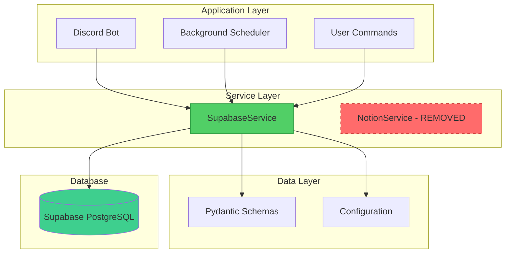
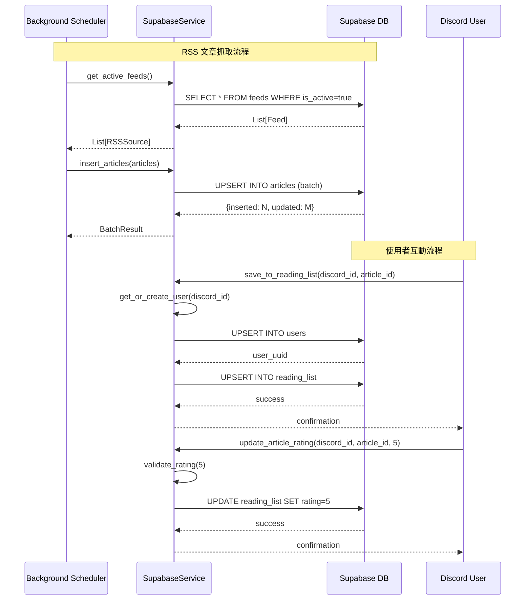
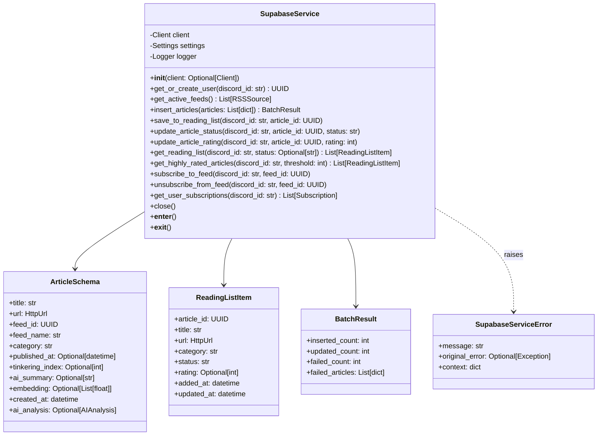
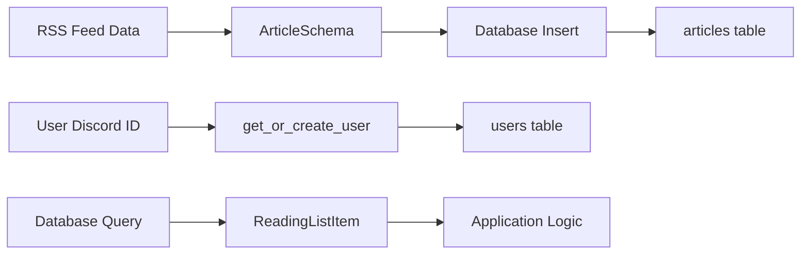

# Design Document: Data Access Layer Refactor

## Overview

本設計文件描述 Tech News Agent 資料存取層重構（Phase 2）的實作細節。此階段將完全移除 Notion 服務依賴，實作基於 Supabase 的資料存取層，提供型別安全的 CRUD 操作介面，支援多租戶架構。

### 目標

1. 實作 SupabaseService 類別，提供完整的資料庫操作介面
2. 更新 Article Schema 以匹配 Supabase 資料庫結構
3. 移除所有 Notion 相關程式碼與依賴
4. 實作健全的錯誤處理與日誌記錄機制
5. 支援批次操作以提升效能
6. 確保程式碼可測試性

### 非目標

- 資料遷移工具（Phase 1 為全新安裝，無需遷移）
- UI/Discord Bot 邏輯變更（保持現有介面）
- 效能優化超出基本批次操作範圍
- 實作快取層（未來增強功能）

### 設計原則

1. **型別安全**：使用 Pydantic 與 Python type hints 確保型別正確性
2. **錯誤透明**：提供清晰的錯誤訊息，包含足夠的上下文資訊
3. **可測試性**：支援依賴注入，所有方法都有明確的介面
4. **效能考量**：使用批次操作處理大量資料
5. **多租戶隔離**：透過 discord_id 自動管理使用者資料隔離

## Architecture

### 系統架構圖



### 資料流程圖



### 類別關係圖



## Components and Interfaces

### 1. SupabaseService 類別

**職責**：提供所有 Supabase 資料庫操作的統一介面

**檔案位置**：`app/services/supabase_service.py`

**主要方法**：

```python
class SupabaseService:
    """Supabase 資料存取層服務"""

    def __init__(self, client: Optional[Client] = None):
        """初始化 Supabase 服務

        Args:
            client: 可選的 Supabase client（用於測試依賴注入）

        Raises:
            SupabaseServiceError: 當配置缺失或連線失敗時
        """

    async def get_or_create_user(self, discord_id: str) -> UUID:
        """取得或建立使用者

        Args:
            discord_id: Discord 使用者 ID

        Returns:
            使用者的 UUID

        Raises:
            SupabaseServiceError: 當資料庫操作失敗時
        """

    async def get_active_feeds(self) -> List[RSSSource]:
        """取得所有啟用的 RSS 訂閱源

        Returns:
            啟用的訂閱源列表，按 category 和 name 排序

        Raises:
            SupabaseServiceError: 當資料庫查詢失敗時
        """

    async def insert_articles(self, articles: List[dict]) -> BatchResult:
        """批次插入或更新文章

        Args:
            articles: 文章資料字典列表

        Returns:
            BatchResult 包含插入、更新、失敗的統計資訊

        Raises:
            SupabaseServiceError: 當資料庫操作失敗時
        """

    async def save_to_reading_list(
        self,
        discord_id: str,
        article_id: UUID
    ) -> None:
        """將文章加入使用者的閱讀清單

        Args:
            discord_id: Discord 使用者 ID
            article_id: 文章 UUID

        Raises:
            SupabaseServiceError: 當資料庫操作失敗時
            ValueError: 當 article_id 格式無效時
        """

    async def update_article_status(
        self,
        discord_id: str,
        article_id: UUID,
        status: str
    ) -> None:
        """更新文章閱讀狀態

        Args:
            discord_id: Discord 使用者 ID
            article_id: 文章 UUID
            status: 新狀態（'Unread', 'Read', 'Archived'）

        Raises:
            SupabaseServiceError: 當資料庫操作失敗時
            ValueError: 當 status 無效時
        """

    async def update_article_rating(
        self,
        discord_id: str,
        article_id: UUID,
        rating: int
    ) -> None:
        """更新文章評分

        Args:
            discord_id: Discord 使用者 ID
            article_id: 文章 UUID
            rating: 評分（1-5）

        Raises:
            SupabaseServiceError: 當資料庫操作失敗時
            ValueError: 當 rating 超出範圍時
        """

    async def get_reading_list(
        self,
        discord_id: str,
        status: Optional[str] = None
    ) -> List[ReadingListItem]:
        """查詢使用者的閱讀清單

        Args:
            discord_id: Discord 使用者 ID
            status: 可選的狀態篩選

        Returns:
            閱讀清單項目列表，按 added_at 降序排列

        Raises:
            SupabaseServiceError: 當資料庫查詢失敗時
        """

    async def get_highly_rated_articles(
        self,
        discord_id: str,
        threshold: int = 4
    ) -> List[ReadingListItem]:
        """查詢使用者的高評分文章

        Args:
            discord_id: Discord 使用者 ID
            threshold: 評分門檻（預設 4）

        Returns:
            高評分文章列表，按 rating 降序、added_at 降序排列

        Raises:
            SupabaseServiceError: 當資料庫查詢失敗時
        """

    async def subscribe_to_feed(
        self,
        discord_id: str,
        feed_id: UUID
    ) -> None:
        """訂閱 RSS 來源

        Args:
            discord_id: Discord 使用者 ID
            feed_id: 訂閱源 UUID

        Raises:
            SupabaseServiceError: 當資料庫操作失敗時
        """

    async def unsubscribe_from_feed(
        self,
        discord_id: str,
        feed_id: UUID
    ) -> None:
        """取消訂閱 RSS 來源

        Args:
            discord_id: Discord 使用者 ID
            feed_id: 訂閱源 UUID

        Raises:
            SupabaseServiceError: 當資料庫操作失敗時
        """

    async def get_user_subscriptions(
        self,
        discord_id: str
    ) -> List[Subscription]:
        """查詢使用者的所有訂閱

        Args:
            discord_id: Discord 使用者 ID

        Returns:
            訂閱列表，按 subscribed_at 降序排列

        Raises:
            SupabaseServiceError: 當資料庫查詢失敗時
        """

    async def close(self) -> None:
        """關閉連線並清理資源"""

    async def __aenter__(self):
        """支援 async context manager"""
        return self

    async def __aexit__(self, exc_type, exc_val, exc_tb):
        """支援 async context manager，自動清理資源"""
        await self.close()
```

**內部輔助方法**：

```python
def _validate_status(self, status: str) -> str:
    """驗證並正規化狀態值"""

def _validate_rating(self, rating: int) -> None:
    """驗證評分範圍"""

def _validate_uuid(self, uuid_str: str) -> UUID:
    """驗證 UUID 格式"""

def _validate_url(self, url: str) -> str:
    """驗證 URL 格式"""

def _truncate_text(self, text: str, max_length: int) -> str:
    """截斷文字至指定長度"""

def _handle_database_error(self, error: Exception, context: dict) -> None:
    """處理資料庫錯誤，包裝為 SupabaseServiceError"""
```

### 2. SupabaseServiceError 例外類別

**職責**：統一的服務層例外，包含豐富的錯誤上下文

**檔案位置**：`app/core/exceptions.py`

**介面**：

```python
class SupabaseServiceError(Exception):
    """Supabase 服務層例外"""

    def __init__(
        self,
        message: str,
        original_error: Optional[Exception] = None,
        context: Optional[dict] = None
    ):
        """初始化例外

        Args:
            message: 使用者友善的錯誤訊息
            original_error: 原始例外（如果有）
            context: 額外的上下文資訊
        """
        self.message = message
        self.original_error = original_error
        self.context = context or {}
        super().__init__(self.message)

    def __str__(self) -> str:
        """格式化錯誤訊息"""
        parts = [self.message]
        if self.context:
            parts.append(f"Context: {self.context}")
        if self.original_error:
            parts.append(f"Original error: {self.original_error}")
        return " | ".join(parts)
```

### 3. 更新的 ArticleSchema

**職責**：定義文章資料模型，匹配 Supabase 資料庫結構

**檔案位置**：`app/schemas/article.py`

**變更內容**：

```python
class ArticleSchema(BaseModel):
    """文章資料模型（更新以匹配 Supabase 結構）"""

    # 基本資訊
    title: str = Field(..., max_length=2000)
    url: HttpUrl

    # 來源資訊（重新命名）
    feed_id: UUID  # 新增：關聯到 feeds 表
    feed_name: str  # 重新命名自 source_name
    category: str  # 重新命名自 source_category

    # 時間資訊
    published_at: Optional[datetime] = None  # 新增：文章發布時間
    created_at: datetime = Field(default_factory=datetime.utcnow)  # 新增：系統建立時間

    # AI 分析結果
    tinkering_index: Optional[int] = Field(None, ge=1, le=5)  # 移至頂層
    ai_summary: Optional[str] = Field(None, max_length=5000)  # 新增：AI 摘要
    ai_analysis: Optional[AIAnalysis] = None  # 保留：完整 AI 分析

    # 向量嵌入
    embedding: Optional[List[float]] = None  # 新增：用於語義搜尋

    # 移除的欄位：
    # - content_preview: 不再需要，使用 ai_summary 替代
    # - raw_data: 不再需要，資料庫結構化儲存
```

### 4. BatchResult 資料類別

**職責**：表示批次操作的結果統計

**檔案位置**：`app/schemas/article.py`

**介面**：

```python
class BatchResult(BaseModel):
    """批次操作結果"""

    inserted_count: int = Field(description="成功插入的記錄數")
    updated_count: int = Field(description="成功更新的記錄數")
    failed_count: int = Field(description="失敗的記錄數")
    failed_articles: List[dict] = Field(
        default_factory=list,
        description="失敗的文章資訊（包含錯誤原因）"
    )

    @property
    def total_processed(self) -> int:
        """總處理數量"""
        return self.inserted_count + self.updated_count + self.failed_count

    @property
    def success_rate(self) -> float:
        """成功率（0-1）"""
        if self.total_processed == 0:
            return 1.0
        return (self.inserted_count + self.updated_count) / self.total_processed
```

### 5. Subscription 資料類別

**職責**：表示使用者訂閱資訊

**檔案位置**：`app/schemas/article.py`

**介面**：

```python
class Subscription(BaseModel):
    """使用者訂閱資訊"""

    feed_id: UUID
    name: str
    url: HttpUrl
    category: str
    subscribed_at: datetime
```

### 6. 配置更新

**職責**：移除 Notion 配置，保留 Supabase 配置

**檔案位置**：`app/core/config.py`

**變更內容**：

```python
class Settings(BaseSettings):
    # 移除 Notion 配置
    # notion_token: str  # REMOVED
    # notion_feeds_db_id: str  # REMOVED
    # notion_read_later_db_id: str  # REMOVED
    # notion_weekly_digests_db_id: str  # REMOVED

    # Supabase Configuration（保持不變）
    supabase_url: str
    supabase_key: str

    # Discord Configuration（保持不變）
    discord_token: str
    discord_channel_id: int

    # LLM Configuration（保持不變）
    groq_api_key: str

    # Timezone Configuration（保持不變）
    timezone: str = "Asia/Taipei"
```

### 7. 依賴更新

**職責**：移除 Notion 依賴，確保 Supabase 依賴

**檔案位置**：`requirements.txt`

**變更內容**：

```
# 移除
# notion-client==2.2.1

# 確保存在
supabase>=2.0.0
```

## Data Models

### 資料庫表格對應

本設計使用 Phase 1 建立的資料庫結構，以下是主要表格與對應的 Python 模型：

| 資料庫表格         | Python 模型     | 用途                 |
| ------------------ | --------------- | -------------------- |
| users              | (內部使用)      | 使用者管理           |
| feeds              | RSSSource       | RSS 訂閱源           |
| articles           | ArticleSchema   | 文章內容             |
| user_subscriptions | Subscription    | 使用者訂閱關聯       |
| reading_list       | ReadingListItem | 使用者閱讀清單與互動 |

### 資料驗證規則

**ArticleSchema 驗證**：

- `title`: 最大 2000 字元
- `url`: 必須是有效的 HTTP/HTTPS URL
- `tinkering_index`: 1-5 之間的整數（如果提供）
- `ai_summary`: 最大 5000 字元
- `embedding`: 1536 維度的浮點數列表（如果提供）

**ReadingListItem 驗證**：

- `status`: 必須是 'Unread', 'Read', 或 'Archived'
- `rating`: 1-5 之間的整數（如果提供）

**方法參數驗證**：

- `discord_id`: 非空字串
- `article_id`: 有效的 UUID 格式
- `feed_id`: 有效的 UUID 格式
- `rating`: 1-5 之間的整數
- `status`: 'Unread', 'Read', 或 'Archived'（不區分大小寫，自動正規化為 Title Case）

### 資料轉換流程



## Correctness Properties

_A property is a characteristic or behavior that should hold true across all valid executions of a system-essentially, a formal statement about what the system should do. Properties serve as the bridge between human-readable specifications and machine-verifiable correctness guarantees._

### Property 1: Article Schema Structure Validation

_For any_ ArticleSchema instance, it should contain all required fields (feed_id as UUID, published_at as Optional[datetime], tinkering_index as Optional[int] with range 1-5, ai_summary as Optional[str], embedding as Optional[List[float]], created_at as datetime) and should not contain the removed fields (content_preview, raw_data).

**Validates: Requirements 2.1, 2.2, 2.3, 2.4, 2.5, 2.6, 2.7, 2.8**

### Property 2: User Creation Idempotency

_For any_ discord_id, calling get_or_create_user multiple times should always return the same UUID without creating duplicate user records.

**Validates: Requirements 3.2, 3.3, 3.4**

### Property 3: Active Feeds Filtering

_For any_ database state containing both active and inactive feeds, get_active_feeds should return only feeds where is_active is true, and all returned feeds should contain id, name, url, and category fields.

**Validates: Requirements 4.2, 4.3**

### Property 4: Active Feeds Ordering

_For any_ result set from get_active_feeds, the results should be ordered first by category, then by name within each category.

**Validates: Requirements 4.4**

### Property 5: Article UPSERT Idempotency

_For any_ article data, inserting it multiple times based on URL should result in only one article record in the database, with the latest data values.

**Validates: Requirements 5.2, 5.3, 5.4**

### Property 6: Article Foreign Key Validation

_For any_ article with a feed_id that does not exist in the feeds table, insert_articles should fail with a descriptive foreign key constraint error.

**Validates: Requirements 5.5**

### Property 7: Batch Operation Statistics Accuracy

_For any_ batch of articles processed by insert_articles, the returned BatchResult counts (inserted_count, updated_count, failed_count) should accurately reflect the actual database operations performed.

**Validates: Requirements 5.7, 15.4**

### Property 8: Reading List UPSERT Idempotency

_For any_ user and article combination, calling save_to_reading_list multiple times should not create duplicate entries, and should update the updated_at timestamp on subsequent calls.

**Validates: Requirements 6.3, 6.4**

### Property 9: Reading List Initial Status

_For any_ new reading list entry created by save_to_reading_list, the initial status should be 'Unread'.

**Validates: Requirements 6.5**

### Property 10: Reading List Article Validation

_For any_ article_id that does not exist in the articles table, save_to_reading_list should fail with a descriptive foreign key constraint error.

**Validates: Requirements 6.6**

### Property 11: Status Validation

_For any_ status value not in the set {'Unread', 'Read', 'Archived'} (case-insensitive), update_article_status should raise a ValueError with the allowed values listed.

**Validates: Requirements 7.2, 7.3**

### Property 12: Status Update Persistence

_For any_ valid status update via update_article_status, the database should reflect the new status value, and the updated_at timestamp should be updated.

**Validates: Requirements 7.5, 7.6**

### Property 13: Rating Validation

_For any_ rating value outside the range [1, 5], update_article_rating should raise a ValueError with the allowed range specified.

**Validates: Requirements 8.2, 8.3**

### Property 14: Rating Update Persistence

_For any_ valid rating update via update_article_rating, the database should reflect the new rating value, and the updated_at timestamp should be updated.

**Validates: Requirements 8.5, 8.6**

### Property 15: Reading List Status Filtering

_For any_ status filter provided to get_reading_list, all returned articles should have exactly that status value.

**Validates: Requirements 9.3**

### Property 16: Reading List Complete Retrieval

_For any_ user's reading list, calling get_reading_list without a status filter should return articles of all statuses.

**Validates: Requirements 9.4**

### Property 17: Reading List Data Completeness

_For any_ item returned by get_reading_list, it should contain all required fields from the join with articles table: article_id, title, url, category, status, rating, added_at, updated_at.

**Validates: Requirements 9.5, 9.7**

### Property 18: Reading List Ordering

_For any_ result set from get_reading_list, the results should be ordered by added_at in descending order (newest first).

**Validates: Requirements 9.6**

### Property 19: Highly Rated Articles Threshold

_For any_ threshold value, get_highly_rated_articles should return only articles with rating greater than or equal to that threshold, and should include article details from the join.

**Validates: Requirements 10.4, 10.5**

### Property 20: Highly Rated Articles Ordering

_For any_ result set from get_highly_rated_articles, the results should be ordered first by rating descending, then by added_at descending.

**Validates: Requirements 10.6**

### Property 21: Subscription Idempotency

_For any_ user and feed combination, calling subscribe_to_feed multiple times should not create duplicate subscription records.

**Validates: Requirements 11.3, 11.4**

### Property 22: Unsubscription Idempotency

_For any_ user and feed combination, calling unsubscribe_from_feed should remove the subscription if it exists, and should complete without error if the subscription does not exist.

**Validates: Requirements 11.7, 11.8**

### Property 23: User Subscriptions Data Completeness

_For any_ subscription returned by get_user_subscriptions, it should contain all required fields from the join with feeds table: feed_id, name, url, category, subscribed_at.

**Validates: Requirements 12.3, 12.5**

### Property 24: User Subscriptions Ordering

_For any_ result set from get_user_subscriptions, the results should be ordered by subscribed_at in descending order (newest first).

**Validates: Requirements 12.4**

### Property 25: Database Operation Logging

_For any_ database operation performed by SupabaseService, an INFO level log entry should be created before the operation, and an ERROR level log entry should be created if the operation fails.

**Validates: Requirements 13.1, 13.2**

### Property 26: Constraint Violation Error Messages

_For any_ database constraint violation (unique, foreign key, check, not null), the raised SupabaseServiceError should contain a descriptive message indicating which constraint was violated and which field or reference caused the issue.

**Validates: Requirements 13.3, 13.4, 13.5, 13.6**

### Property 27: Exception Wrapping

_For any_ database exception raised during SupabaseService operations, it should be caught and wrapped in a SupabaseServiceError with a descriptive message and the original exception preserved.

**Validates: Requirements 13.8**

### Property 28: Partial Batch Failure Handling

_For any_ batch of articles where some fail validation or insertion, insert_articles should continue processing remaining articles, log the failures, and return accurate statistics including which articles failed and why.

**Validates: Requirements 15.3**

### Property 29: Transient Error Retry

_For any_ transient database error (connection timeout, temporary unavailability), SupabaseService methods should retry the operation with exponential backoff before failing.

**Validates: Requirements 15.6**

### Property 30: URL Validation

_For any_ article with an invalid URL (not HTTP/HTTPS), insert_articles should reject it with a descriptive validation error.

**Validates: Requirements 16.1**

### Property 31: Tinkering Index Validation

_For any_ article with a tinkering_index outside the range [1, 5], insert_articles should reject it with a descriptive validation error.

**Validates: Requirements 16.2**

### Property 32: Text Truncation

_For any_ article with a title longer than 2000 characters or ai_summary longer than 5000 characters, insert_articles should automatically truncate them to the maximum length.

**Validates: Requirements 16.3, 16.4**

### Property 33: UUID Format Validation

_For any_ article_id parameter that is not a valid UUID format, save_to_reading_list should raise a ValueError with a descriptive message.

**Validates: Requirements 16.5**

### Property 34: Status Normalization

_For any_ status value provided to update_article_status (regardless of case), it should be normalized to Title Case before database update.

**Validates: Requirements 16.6**

### Property 35: Validation Error Details

_For any_ validation failure in SupabaseService methods, a ValueError should be raised with specific details about which validation rule failed and what the expected format or range is.

**Validates: Requirements 16.7**

### Property 36: Context Manager Resource Cleanup

_For any_ usage of SupabaseService as an async context manager, resources should be automatically cleaned up when exiting the context, regardless of whether an exception occurred.

**Validates: Requirements 17.3**

## Error Handling

### 錯誤處理策略

SupabaseService 採用分層錯誤處理策略，確保所有錯誤都有清晰的訊息和適當的上下文資訊。

### 1. 配置錯誤

**場景**：缺少必要的環境變數或配置無效

**處理方式**：

- 在 `__init__` 方法中立即檢查配置
- 拋出 `SupabaseServiceError` 並提供清晰的錯誤訊息
- 包含故障排除提示

**範例**：

```python
if not settings.supabase_url or not settings.supabase_key:
    raise SupabaseServiceError(
        "Supabase configuration is missing",
        context={
            "supabase_url_present": bool(settings.supabase_url),
            "supabase_key_present": bool(settings.supabase_key),
            "troubleshooting": "Check .env file and ensure SUPABASE_URL and SUPABASE_KEY are set"
        }
    )
```

### 2. 連線錯誤

**場景**：無法連接到 Supabase 資料庫

**處理方式**：

- 在初始化時驗證連線
- 實作重試邏輯（最多 3 次，指數退避）
- 提供網路故障排除建議

**範例錯誤訊息**：

```
Error: Failed to connect to Supabase
Context: {
  "supabase_url": "https://xxx.supabase.co",
  "attempt": 3,
  "last_error": "Connection timeout",
  "troubleshooting": [
    "Check network connection",
    "Verify Supabase project is active",
    "Check firewall settings",
    "Visit https://status.supabase.com for service status"
  ]
}
```

### 3. 約束違反錯誤

**場景**：違反資料庫約束（UNIQUE, FOREIGN KEY, CHECK, NOT NULL）

**處理方式**：

- 解析 PostgreSQL 錯誤訊息
- 識別違反的約束類型
- 提供使用者友善的錯誤訊息

**錯誤訊息對應表**：

| 約束類型    | PostgreSQL 錯誤碼 | 使用者友善訊息範例                                               |
| ----------- | ----------------- | ---------------------------------------------------------------- |
| UNIQUE      | 23505             | "Duplicate entry: A user with discord_id 'xxx' already exists"   |
| FOREIGN KEY | 23503             | "Invalid reference: feed_id 'xxx' does not exist in feeds table" |
| CHECK       | 23514             | "Validation failed: rating must be between 1 and 5, got 6"       |
| NOT NULL    | 23502             | "Missing required field: 'title' cannot be null"                 |

**實作範例**：

```python
def _handle_database_error(self, error: Exception, context: dict) -> None:
    """處理資料庫錯誤並包裝為 SupabaseServiceError"""
    error_str = str(error).lower()

    if "duplicate key" in error_str or "23505" in error_str:
        # 解析重複的欄位名稱
        field = self._extract_field_from_error(error_str)
        raise SupabaseServiceError(
            f"Duplicate entry: {field} already exists",
            original_error=error,
            context={**context, "constraint_type": "unique"}
        )

    elif "foreign key" in error_str or "23503" in error_str:
        # 解析外鍵參考
        reference = self._extract_reference_from_error(error_str)
        raise SupabaseServiceError(
            f"Invalid reference: {reference} does not exist",
            original_error=error,
            context={**context, "constraint_type": "foreign_key"}
        )

    elif "check constraint" in error_str or "23514" in error_str:
        # 解析檢查約束名稱
        constraint = self._extract_constraint_from_error(error_str)
        raise SupabaseServiceError(
            f"Validation failed: {constraint}",
            original_error=error,
            context={**context, "constraint_type": "check"}
        )

    elif "not null" in error_str or "23502" in error_str:
        # 解析缺少的欄位
        field = self._extract_field_from_error(error_str)
        raise SupabaseServiceError(
            f"Missing required field: '{field}' cannot be null",
            original_error=error,
            context={**context, "constraint_type": "not_null"}
        )

    else:
        # 通用資料庫錯誤
        raise SupabaseServiceError(
            f"Database operation failed: {error}",
            original_error=error,
            context=context
        )
```

### 4. 驗證錯誤

**場景**：輸入資料不符合驗證規則

**處理方式**：

- 在資料庫操作前進行驗證
- 拋出 `ValueError` 並提供具體的驗證錯誤
- 包含預期的格式或範圍

**範例**：

```python
def _validate_rating(self, rating: int) -> None:
    """驗證評分範圍"""
    if not isinstance(rating, int) or rating < 1 or rating > 5:
        raise ValueError(
            f"Invalid rating: {rating}. Rating must be an integer between 1 and 5 (inclusive)"
        )

def _validate_status(self, status: str) -> str:
    """驗證並正規化狀態值"""
    normalized = status.strip().title()
    allowed_statuses = {'Unread', 'Read', 'Archived'}

    if normalized not in allowed_statuses:
        raise ValueError(
            f"Invalid status: '{status}'. Allowed values are: {', '.join(allowed_statuses)}"
        )

    return normalized

def _validate_uuid(self, uuid_str: str) -> UUID:
    """驗證 UUID 格式"""
    try:
        return UUID(uuid_str)
    except (ValueError, AttributeError, TypeError) as e:
        raise ValueError(
            f"Invalid UUID format: '{uuid_str}'. Expected format: xxxxxxxx-xxxx-xxxx-xxxx-xxxxxxxxxxxx"
        ) from e
```

### 5. 批次操作錯誤

**場景**：批次操作中部分記錄失敗

**處理方式**：

- 不中斷整個批次處理
- 記錄每個失敗的記錄與原因
- 在 BatchResult 中返回詳細的失敗資訊
- 記錄 WARNING 級別日誌

**實作範例**：

```python
async def insert_articles(self, articles: List[dict]) -> BatchResult:
    """批次插入文章，處理部分失敗"""
    if not articles:
        return BatchResult(inserted_count=0, updated_count=0, failed_count=0)

    result = BatchResult(inserted_count=0, updated_count=0, failed_count=0)

    # 分批處理（每批 100 筆）
    for chunk in self._chunk_list(articles, 100):
        for article in chunk:
            try:
                # 驗證資料
                self._validate_article_data(article)

                # UPSERT 操作
                response = await self.client.table('articles').upsert(article).execute()

                # 判斷是插入還是更新（根據 response 判斷）
                if self._is_insert(response):
                    result.inserted_count += 1
                else:
                    result.updated_count += 1

            except Exception as e:
                result.failed_count += 1
                result.failed_articles.append({
                    "article": article,
                    "error": str(e),
                    "error_type": type(e).__name__
                })
                logger.warning(
                    f"Failed to insert article: {article.get('url', 'unknown')}",
                    extra={"error": str(e)}
                )

    logger.info(
        f"Batch insert completed: {result.inserted_count} inserted, "
        f"{result.updated_count} updated, {result.failed_count} failed"
    )

    return result
```

### 6. 暫時性錯誤與重試

**場景**：網路超時、資料庫暫時不可用

**處理方式**：

- 實作指數退避重試邏輯
- 最多重試 3 次
- 記錄每次重試嘗試
- 最終失敗時提供完整的重試歷史

**實作範例**：

```python
async def _execute_with_retry(
    self,
    operation: Callable,
    max_retries: int = 3,
    base_delay: float = 1.0
) -> Any:
    """執行操作並在暫時性錯誤時重試"""
    last_error = None

    for attempt in range(max_retries):
        try:
            return await operation()
        except Exception as e:
            last_error = e
            error_str = str(e).lower()

            # 判斷是否為暫時性錯誤
            is_transient = any(keyword in error_str for keyword in [
                'timeout', 'connection', 'temporary', 'unavailable'
            ])

            if not is_transient or attempt == max_retries - 1:
                # 非暫時性錯誤或已達最大重試次數
                raise

            # 計算退避時間
            delay = base_delay * (2 ** attempt)
            logger.warning(
                f"Transient error on attempt {attempt + 1}/{max_retries}, "
                f"retrying in {delay}s: {e}"
            )
            await asyncio.sleep(delay)

    # 不應該到達這裡，但為了型別安全
    raise last_error
```

### 7. 日誌記錄策略

**日誌級別使用**：

- **DEBUG**: 詳細的資料庫查詢參數、返回的記錄數
- **INFO**: 成功的資料庫操作、批次處理統計
- **WARNING**: 部分失敗、重試嘗試、資料驗證警告
- **ERROR**: 資料庫錯誤、連線失敗、約束違反

**日誌格式**：

```python
# INFO 級別：成功操作
logger.info(
    "Retrieved reading list",
    extra={
        "discord_id": discord_id,
        "status_filter": status,
        "result_count": len(results)
    }
)

# ERROR 級別：錯誤操作
logger.error(
    "Failed to update article status",
    extra={
        "discord_id": discord_id,
        "article_id": str(article_id),
        "status": status,
        "error": str(e)
    },
    exc_info=True  # 包含完整的 stack trace
)
```

### 8. 錯誤恢復建議

每個錯誤類型都應提供可操作的恢復建議：

| 錯誤類型   | 恢復建議                                            |
| ---------- | --------------------------------------------------- |
| 配置錯誤   | 檢查 .env 檔案，確保所有必要變數已設定              |
| 連線錯誤   | 檢查網路連線、Supabase 專案狀態、防火牆設定         |
| 約束違反   | 檢查輸入資料的唯一性、參考完整性、值範圍            |
| 驗證錯誤   | 修正輸入資料格式，確保符合 API 文件規範             |
| 批次失敗   | 檢查 failed_articles 列表，修正問題後重試失敗的記錄 |
| 暫時性錯誤 | 等待片刻後重試，或檢查 Supabase 服務狀態            |

## Testing Strategy

### 測試方法概述

本專案採用雙重測試策略，結合單元測試與屬性測試（Property-Based Testing），確保 SupabaseService 的正確性與可靠性。

### 屬性測試庫選擇

**選用庫**：Hypothesis (https://hypothesis.readthedocs.io/)

**理由**：

- Python 生態系統中最成熟的屬性測試庫
- 與 pytest 無縫整合
- 支援複雜的資料生成策略
- 自動縮減失敗案例（shrinking）
- 儲存失敗案例以便重現

**配置**：

```python
# conftest.py
from hypothesis import settings, Verbosity

# 全域配置
settings.register_profile("default", max_examples=100, verbosity=Verbosity.normal)
settings.register_profile("ci", max_examples=200, verbosity=Verbosity.verbose)
settings.register_profile("dev", max_examples=50, verbosity=Verbosity.normal)

# 根據環境選擇配置
import os
settings.load_profile(os.getenv("HYPOTHESIS_PROFILE", "default"))
```

### 單元測試 (Unit Tests)

單元測試專注於特定的例子、邊界條件和錯誤處理。

**測試範圍**：

1. **配置與初始化**
   - 正確載入環境變數
   - 缺少配置時拋出錯誤
   - 連線驗證

2. **資料驗證**
   - 特定的無效輸入（空字串、None、錯誤格式）
   - 邊界值（rating=0, rating=6, tinkering_index=0, tinkering_index=6）
   - 特殊字元處理

3. **錯誤處理**
   - 特定的約束違反場景
   - 網路錯誤模擬
   - 重試邏輯驗證

4. **邊界條件**
   - 空列表輸入
   - 單一記錄操作
   - 大批次操作（100+ 記錄）

**範例單元測試**：

```python
import pytest
from uuid import uuid4
from app.services.supabase_service import SupabaseService, SupabaseServiceError

class TestSupabaseServiceInitialization:
    """測試服務初始化"""

    def test_init_with_valid_config(self, mock_supabase_client):
        """正常初始化應該成功"""
        service = SupabaseService(client=mock_supabase_client)
        assert service.client is not None

    def test_init_without_config_raises_error(self, monkeypatch):
        """缺少配置應該拋出錯誤"""
        monkeypatch.delenv('SUPABASE_URL', raising=False)
        monkeypatch.delenv('SUPABASE_KEY', raising=False)

        with pytest.raises(SupabaseServiceError, match="configuration is missing"):
            SupabaseService()

class TestValidation:
    """測試資料驗證"""

    def test_validate_rating_with_zero(self, service):
        """評分為 0 應該拋出 ValueError"""
        with pytest.raises(ValueError, match="between 1 and 5"):
            service._validate_rating(0)

    def test_validate_rating_with_six(self, service):
        """評分為 6 應該拋出 ValueError"""
        with pytest.raises(ValueError, match="between 1 and 5"):
            service._validate_rating(6)

    def test_validate_status_case_insensitive(self, service):
        """狀態驗證應該不區分大小寫"""
        assert service._validate_status("unread") == "Unread"
        assert service._validate_status("READ") == "Read"
        assert service._validate_status("ArChIvEd") == "Archived"

    def test_validate_status_invalid(self, service):
        """無效狀態應該拋出 ValueError"""
        with pytest.raises(ValueError, match="Allowed values are"):
            service._validate_status("Pending")

    def test_validate_uuid_invalid_format(self, service):
        """無效 UUID 格式應該拋出 ValueError"""
        with pytest.raises(ValueError, match="Invalid UUID format"):
            service._validate_uuid("not-a-uuid")

    def test_truncate_long_title(self, service):
        """超長標題應該被截斷"""
        long_title = "a" * 3000
        truncated = service._truncate_text(long_title, 2000)
        assert len(truncated) == 2000

class TestErrorHandling:
    """測試錯誤處理"""

    @pytest.mark.asyncio
    async def test_duplicate_user_handled_gracefully(self, service, mock_db):
        """重複建立使用者應該返回現有 UUID"""
        discord_id = "test_user_123"

        # 第一次建立
        uuid1 = await service.get_or_create_user(discord_id)

        # 第二次建立（應該返回相同 UUID）
        uuid2 = await service.get_or_create_user(discord_id)

        assert uuid1 == uuid2

    @pytest.mark.asyncio
    async def test_foreign_key_violation_descriptive_error(self, service, mock_db):
        """外鍵違反應該提供清晰的錯誤訊息"""
        invalid_feed_id = uuid4()
        article = {
            "feed_id": str(invalid_feed_id),
            "title": "Test",
            "url": "https://example.com/test"
        }

        with pytest.raises(SupabaseServiceError, match="does not exist"):
            await service.insert_articles([article])

class TestBatchOperations:
    """測試批次操作"""

    @pytest.mark.asyncio
    async def test_empty_batch_returns_zero_counts(self, service):
        """空批次應該返回零計數"""
        result = await service.insert_articles([])
        assert result.inserted_count == 0
        assert result.updated_count == 0
        assert result.failed_count == 0

    @pytest.mark.asyncio
    async def test_partial_batch_failure(self, service, mock_db):
        """部分失敗的批次應該繼續處理"""
        articles = [
            {"title": "Valid 1", "url": "https://example.com/1", "feed_id": str(uuid4())},
            {"title": "", "url": "https://example.com/2", "feed_id": str(uuid4())},  # 無效
            {"title": "Valid 2", "url": "https://example.com/3", "feed_id": str(uuid4())},
        ]

        result = await service.insert_articles(articles)

        assert result.failed_count == 1
        assert len(result.failed_articles) == 1
        assert result.inserted_count + result.updated_count == 2
```

### 屬性測試 (Property-Based Tests)

屬性測試驗證系統在大量隨機輸入下的通用行為。每個測試至少執行 100 次迭代。

**測試標籤格式**：

```python
# Feature: data-access-layer-refactor, Property {number}: {property_text}
```

**範例屬性測試**：

```python
from hypothesis import given, strategies as st
from hypothesis.strategies import composite
import pytest
from uuid import UUID

# 自訂策略
@composite
def discord_ids(draw):
    """生成有效的 Discord ID"""
    return draw(st.text(min_size=1, max_size=100, alphabet=st.characters(blacklist_characters="\x00")))

@composite
def valid_articles(draw):
    """生成有效的文章資料"""
    return {
        "title": draw(st.text(min_size=1, max_size=2000)),
        "url": draw(st.from_regex(r"https?://[a-z0-9.-]+\.[a-z]{2,}/[a-z0-9-]*", fullmatch=True)),
        "feed_id": str(draw(st.uuids())),
        "tinkering_index": draw(st.one_of(st.none(), st.integers(min_value=1, max_value=5))),
        "ai_summary": draw(st.one_of(st.none(), st.text(max_size=5000))),
    }

@composite
def ratings(draw):
    """生成有效的評分"""
    return draw(st.integers(min_value=1, max_value=5))

@composite
def statuses(draw):
    """生成有效的狀態"""
    return draw(st.sampled_from(['Unread', 'Read', 'Archived', 'unread', 'READ', 'archived']))

# Feature: data-access-layer-refactor, Property 2: User Creation Idempotency
@given(discord_id=discord_ids())
@pytest.mark.asyncio
async def test_user_creation_idempotency(service, mock_db, discord_id):
    """
    For any discord_id, calling get_or_create_user multiple times
    should always return the same UUID without creating duplicate user records.
    """
    # 第一次呼叫
    uuid1 = await service.get_or_create_user(discord_id)
    assert isinstance(uuid1, UUID)

    # 第二次呼叫
    uuid2 = await service.get_or_create_user(discord_id)
    assert isinstance(uuid2, UUID)

    # 應該返回相同的 UUID
    assert uuid1 == uuid2

    # 驗證資料庫中只有一筆記錄
    users = await mock_db.table('users').select('*').eq('discord_id', discord_id).execute()
    assert len(users.data) == 1

# Feature: data-access-layer-refactor, Property 5: Article UPSERT Idempotency
@given(article=valid_articles())
@pytest.mark.asyncio
async def test_article_upsert_idempotency(service, mock_db, article):
    """
    For any article data, inserting it multiple times based on URL
    should result in only one article record in the database.
    """
    # 第一次插入
    result1 = await service.insert_articles([article])
    assert result1.inserted_count == 1

    # 修改標題後再次插入相同 URL
    article_updated = {**article, "title": "Updated Title"}
    result2 = await service.insert_articles([article_updated])
    assert result2.updated_count == 1
    assert result2.inserted_count == 0

    # 驗證資料庫中只有一筆記錄
    articles = await mock_db.table('articles').select('*').eq('url', article['url']).execute()
    assert len(articles.data) == 1
    assert articles.data[0]['title'] == "Updated Title"

# Feature: data-access-layer-refactor, Property 11: Status Validation
@given(status=st.text().filter(lambda s: s.lower() not in ['unread', 'read', 'archived']))
@pytest.mark.asyncio
async def test_status_validation_rejects_invalid(service, status):
    """
    For any status value not in the set {'Unread', 'Read', 'Archived'} (case-insensitive),
    update_article_status should raise a ValueError.
    """
    discord_id = "test_user"
    article_id = UUID('12345678-1234-5678-1234-567812345678')

    with pytest.raises(ValueError, match="Allowed values are"):
        await service.update_article_status(discord_id, article_id, status)

# Feature: data-access-layer-refactor, Property 13: Rating Validation
@given(rating=st.integers().filter(lambda r: r < 1 or r > 5))
@pytest.mark.asyncio
async def test_rating_validation_rejects_invalid(service, rating):
    """
    For any rating value outside the range [1, 5],
    update_article_rating should raise a ValueError.
    """
    discord_id = "test_user"
    article_id = UUID('12345678-1234-5678-1234-567812345678')

    with pytest.raises(ValueError, match="between 1 and 5"):
        await service.update_article_rating(discord_id, article_id, rating)

# Feature: data-access-layer-refactor, Property 32: Text Truncation
@given(
    title=st.text(min_size=2001, max_size=5000),
    summary=st.text(min_size=5001, max_size=10000)
)
@pytest.mark.asyncio
async def test_text_truncation(service, mock_db, title, summary):
    """
    For any article with a title longer than 2000 characters or
    ai_summary longer than 5000 characters, insert_articles should
    automatically truncate them to the maximum length.
    """
    article = {
        "title": title,
        "url": "https://example.com/test",
        "feed_id": str(UUID('12345678-1234-5678-1234-567812345678')),
        "ai_summary": summary
    }

    result = await service.insert_articles([article])
    assert result.inserted_count == 1

    # 驗證截斷
    saved = await mock_db.table('articles').select('*').eq('url', article['url']).execute()
    assert len(saved.data[0]['title']) <= 2000
    assert len(saved.data[0]['ai_summary']) <= 5000

# Feature: data-access-layer-refactor, Property 15: Reading List Status Filtering
@given(
    articles_data=st.lists(
        st.tuples(st.uuids(), st.sampled_from(['Unread', 'Read', 'Archived'])),
        min_size=5,
        max_size=20
    ),
    filter_status=st.sampled_from(['Unread', 'Read', 'Archived'])
)
@pytest.mark.asyncio
async def test_reading_list_status_filtering(service, mock_db, articles_data, filter_status):
    """
    For any status filter provided to get_reading_list,
    all returned articles should have exactly that status value.
    """
    discord_id = "test_user"
    user_uuid = await service.get_or_create_user(discord_id)

    # 建立測試資料
    for article_id, status in articles_data:
        await mock_db.table('reading_list').insert({
            'user_id': str(user_uuid),
            'article_id': str(article_id),
            'status': status
        }).execute()

    # 查詢並驗證
    results = await service.get_reading_list(discord_id, status=filter_status)

    # 所有結果都應該有指定的狀態
    assert all(item.status == filter_status for item in results)

    # 結果數量應該匹配
    expected_count = sum(1 for _, s in articles_data if s == filter_status)
    assert len(results) == expected_count

# Feature: data-access-layer-refactor, Property 18: Reading List Ordering
@given(
    articles_data=st.lists(
        st.tuples(st.uuids(), st.datetimes()),
        min_size=3,
        max_size=10
    )
)
@pytest.mark.asyncio
async def test_reading_list_ordering(service, mock_db, articles_data):
    """
    For any result set from get_reading_list,
    the results should be ordered by added_at in descending order (newest first).
    """
    discord_id = "test_user"
    user_uuid = await service.get_or_create_user(discord_id)

    # 建立測試資料
    for article_id, added_at in articles_data:
        await mock_db.table('reading_list').insert({
            'user_id': str(user_uuid),
            'article_id': str(article_id),
            'added_at': added_at.isoformat(),
            'status': 'Unread'
        }).execute()

    # 查詢
    results = await service.get_reading_list(discord_id)

    # 驗證排序（降序）
    added_at_list = [item.added_at for item in results]
    assert added_at_list == sorted(added_at_list, reverse=True)

# Feature: data-access-layer-refactor, Property 21: Subscription Idempotency
@given(discord_id=discord_ids(), feed_id=st.uuids())
@pytest.mark.asyncio
async def test_subscription_idempotency(service, mock_db, discord_id, feed_id):
    """
    For any user and feed combination, calling subscribe_to_feed
    multiple times should not create duplicate subscription records.
    """
    # 第一次訂閱
    await service.subscribe_to_feed(discord_id, feed_id)

    # 第二次訂閱
    await service.subscribe_to_feed(discord_id, feed_id)

    # 驗證只有一筆訂閱記錄
    user_uuid = await service.get_or_create_user(discord_id)
    subscriptions = await mock_db.table('user_subscriptions')\
        .select('*')\
        .eq('user_id', str(user_uuid))\
        .eq('feed_id', str(feed_id))\
        .execute()

    assert len(subscriptions.data) == 1

# Feature: data-access-layer-refactor, Property 34: Status Normalization
@given(status=statuses())
@pytest.mark.asyncio
async def test_status_normalization(service, mock_db, status):
    """
    For any status value provided to update_article_status (regardless of case),
    it should be normalized to Title Case before database update.
    """
    discord_id = "test_user"
    article_id = UUID('12345678-1234-5678-1234-567812345678')

    # 建立測試資料
    user_uuid = await service.get_or_create_user(discord_id)
    await mock_db.table('reading_list').insert({
        'user_id': str(user_uuid),
        'article_id': str(article_id),
        'status': 'Unread'
    }).execute()

    # 更新狀態
    await service.update_article_status(discord_id, article_id, status)

    # 驗證正規化
    result = await mock_db.table('reading_list')\
        .select('status')\
        .eq('user_id', str(user_uuid))\
        .eq('article_id', str(article_id))\
        .execute()

    saved_status = result.data[0]['status']
    assert saved_status == status.strip().title()
    assert saved_status in ['Unread', 'Read', 'Archived']
```

### 整合測試

整合測試驗證 SupabaseService 與真實 Supabase 資料庫的互動。

**前置條件**：

- 測試用的 Supabase 專案
- 測試環境變數（`.env.test`）

**測試範圍**：

1. 完整的 CRUD 操作流程
2. 多使用者並發操作
3. 大批次資料處理
4. 資料庫約束驗證

**範例整合測試**：

```python
@pytest.mark.integration
class TestSupabaseServiceIntegration:
    """整合測試（需要真實 Supabase 連線）"""

    @pytest.mark.asyncio
    async def test_full_article_workflow(self, real_supabase_service, test_feed):
        """測試完整的文章工作流程"""
        # 1. 插入文章
        articles = [
            {
                "title": "Test Article 1",
                "url": "https://example.com/article1",
                "feed_id": str(test_feed.id),
                "tinkering_index": 3
            },
            {
                "title": "Test Article 2",
                "url": "https://example.com/article2",
                "feed_id": str(test_feed.id),
                "tinkering_index": 5
            }
        ]

        result = await real_supabase_service.insert_articles(articles)
        assert result.inserted_count == 2
        assert result.failed_count == 0

        # 2. 加入閱讀清單
        discord_id = f"test_user_{uuid4()}"
        article_url = articles[0]['url']

        # 取得文章 ID
        article_response = await real_supabase_service.client.table('articles')\
            .select('id')\
            .eq('url', article_url)\
            .execute()
        article_id = UUID(article_response.data[0]['id'])

        await real_supabase_service.save_to_reading_list(discord_id, article_id)

        # 3. 查詢閱讀清單
        reading_list = await real_supabase_service.get_reading_list(discord_id)
        assert len(reading_list) == 1
        assert reading_list[0].status == 'Unread'

        # 4. 更新狀態
        await real_supabase_service.update_article_status(discord_id, article_id, 'Read')

        # 5. 評分
        await real_supabase_service.update_article_rating(discord_id, article_id, 5)

        # 6. 查詢高評分文章
        highly_rated = await real_supabase_service.get_highly_rated_articles(discord_id, threshold=4)
        assert len(highly_rated) == 1
        assert highly_rated[0].rating == 5
```

### 測試執行指令

```bash
# 執行所有測試
pytest tests/ -v

# 只執行單元測試
pytest tests/unit/ -v

# 只執行屬性測試
pytest tests/property/ -v -m property

# 執行整合測試（需要測試資料庫）
pytest tests/integration/ -v -m integration --db-url=$TEST_SUPABASE_URL

# 使用 CI 配置執行屬性測試（更多迭代）
HYPOTHESIS_PROFILE=ci pytest tests/property/ -v

# 產生測試覆蓋率報告
pytest tests/ --cov=app/services/supabase_service --cov-report=html --cov-report=term

# 執行特定屬性測試並顯示詳細輸出
pytest tests/property/test_supabase_service.py::test_user_creation_idempotency -v -s
```

### 測試 Fixtures

**conftest.py**：

```python
import pytest
from unittest.mock import AsyncMock, MagicMock
from app.services.supabase_service import SupabaseService

@pytest.fixture
def mock_supabase_client():
    """模擬 Supabase client"""
    client = MagicMock()
    client.table = MagicMock(return_value=MagicMock())
    return client

@pytest.fixture
async def service(mock_supabase_client):
    """建立測試用的 SupabaseService"""
    return SupabaseService(client=mock_supabase_client)

@pytest.fixture
async def mock_db():
    """模擬資料庫操作"""
    db = AsyncMock()
    # 設定預設行為
    db.table.return_value.select.return_value.execute.return_value.data = []
    return db

@pytest.fixture
async def real_supabase_service():
    """真實的 Supabase 服務（用於整合測試）"""
    service = SupabaseService()
    yield service
    await service.close()

@pytest.fixture
async def test_feed(real_supabase_service):
    """建立測試用的 feed"""
    feed_data = {
        "name": "Test Feed",
        "url": f"https://example.com/feed/{uuid4()}",
        "category": "Test",
        "is_active": True
    }
    response = await real_supabase_service.client.table('feeds').insert(feed_data).execute()
    return response.data[0]
```

### 測試覆蓋率目標

- **整體覆蓋率**: ≥ 90%
- **SupabaseService 類別**: ≥ 95%
- **錯誤處理路徑**: ≥ 85%
- **驗證邏輯**: 100%

### 持續整合配置

**.github/workflows/test.yml**：

```yaml
name: Tests

on: [push, pull_request]

jobs:
  test:
    runs-on: ubuntu-latest

    steps:
      - uses: actions/checkout@v3

      - name: Set up Python
        uses: actions/setup-python@v4
        with:
          python-version: '3.11'

      - name: Install dependencies
        run: |
          pip install -r requirements.txt
          pip install pytest pytest-asyncio pytest-cov hypothesis

      - name: Run unit tests
        run: pytest tests/unit/ -v --cov=app/services/supabase_service

      - name: Run property tests (CI profile)
        env:
          HYPOTHESIS_PROFILE: ci
        run: pytest tests/property/ -v

      - name: Upload coverage
        uses: codecov/codecov-action@v3
```
