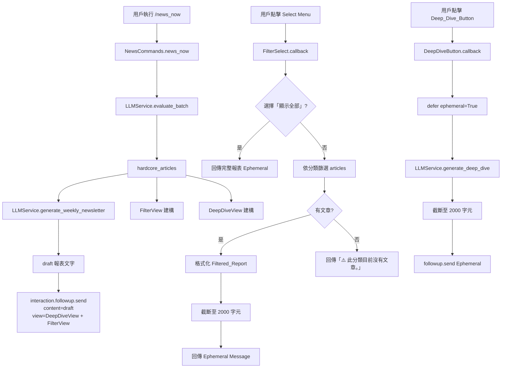
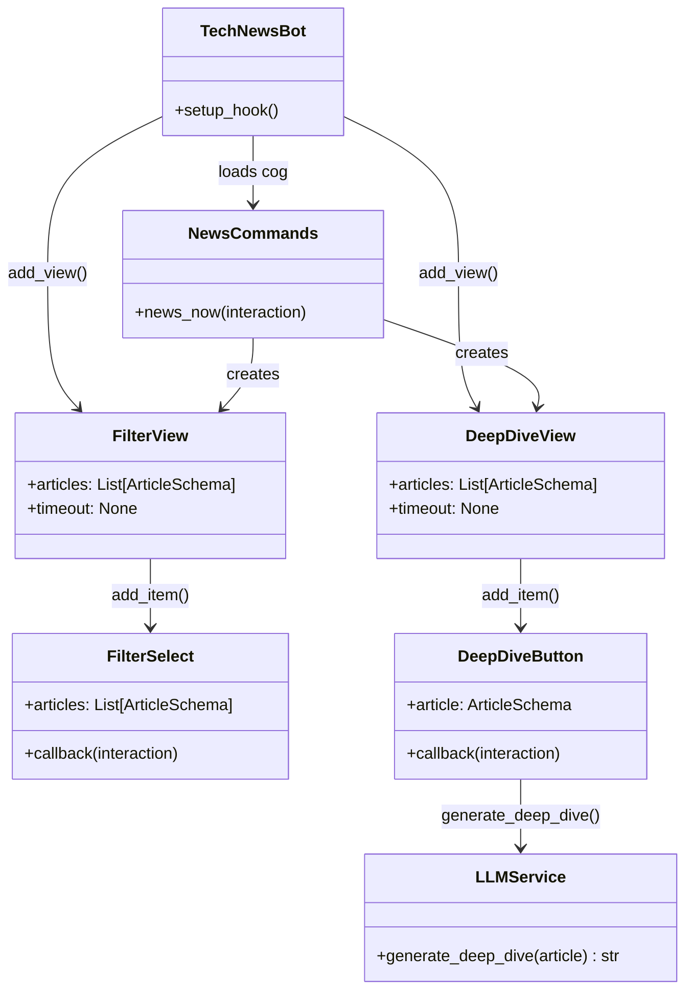

# 技術設計文件：Discord 互動增強功能

## 概覽

本功能在現有的 Discord Bot 技術新聞策展系統上，新增兩項互動增強能力：

1. **互動式分類篩選（Filter_View）**：在 `/news_now` 報表訊息附上 Discord Select Menu，讓用戶可依文章分類即時篩選，結果以 Ephemeral Message 回傳。
2. **文章深度摘要展開（Deep_Dive_View）**：在每篇精選文章旁附上「📖 詳細摘要」按鈕，點擊後由 LLM 即時生成深度技術分析，以 Ephemeral Message 私下回傳。

兩項功能均採用 `timeout=None` 的持久性 View，並在 Bot 的 `setup_hook` 中透過 `bot.add_view()` 註冊，確保 Bot 重啟後互動仍然有效。

### 設計目標

- 最小化對現有 `news_commands.py` 的侵入性修改
- 所有新 UI 元件集中於 `interactions.py`，維持職責分離
- `LLMService` 新增 `generate_deep_dive` 方法，與現有方法並列，不破壞既有介面

---

## 架構



### 元件關係



---

## 元件與介面

### 1. `FilterSelect`（`discord.ui.Select`）

負責渲染分類下拉選單，並處理用戶選擇事件。

```python
class FilterSelect(discord.ui.Select):
    def __init__(self, articles: List[ArticleSchema]):
        # 動態從 articles 提取不重複分類，最多 24 個（Discord 限制）
        # 加入「📋 顯示全部」作為第一個選項
        ...

    async def callback(self, interaction: discord.Interaction):
        # 依選擇的分類篩選 self.articles
        # 格式化並截斷至 2000 字元
        # 以 ephemeral=True 回傳
        ...
```

**設計決策**：`FilterSelect` 持有 `articles` 的引用，在 callback 中直接篩選，避免需要外部狀態查詢。

### 2. `FilterView`（`discord.ui.View`）

```python
class FilterView(discord.ui.View):
    def __init__(self, articles: List[ArticleSchema]):
        super().__init__(timeout=None)
        self.add_item(FilterSelect(articles))
```

### 3. `DeepDiveButton`（`discord.ui.Button`）

```python
class DeepDiveButton(discord.ui.Button):
    def __init__(self, article: ArticleSchema):
        # label: f"📖 {article.title[:20]}..." 或完整標題
        # custom_id: f"deep_dive_{md5(url)[:8]}"
        # style: discord.ButtonStyle.secondary
        ...

    async def callback(self, interaction: discord.Interaction):
        await interaction.response.defer(ephemeral=True)
        # 呼叫 LLMService.generate_deep_dive(self.article)
        # 截斷至 2000 字元
        # followup.send(ephemeral=True)
        ...
```

### 4. `DeepDiveView`（`discord.ui.View`）

```python
class DeepDiveView(discord.ui.View):
    def __init__(self, articles: List[ArticleSchema]):
        super().__init__(timeout=None)
        # 最多取前 5 篇（Discord View 元件數量限制考量）
        for article in articles[:5]:
            self.add_item(DeepDiveButton(article))
```

**設計決策**：限制 5 篇而非 25 篇，是因為 `FilterView` 已佔用一個 Action Row（Select Menu），而 Discord 每則訊息最多 5 個 Action Row，每個 Row 最多 5 個按鈕。實際上 `DeepDiveView` 與 `FilterView` 會合併為同一個 View 發送，因此按鈕上限為 4 個 Row × 5 = 20，但需求規格明確限制為 5 篇。

### 5. `LLMService.generate_deep_dive`

```python
async def generate_deep_dive(self, article: ArticleSchema) -> str:
    # 使用 SUMMARIZE_MODEL（llama-3.3-70b-versatile）
    # max_tokens=600
    # 系統提示要求繁體中文輸出
    # 包含：核心技術概念、應用場景、潛在風險、建議下一步
    # 若 content_preview 為空，僅以 title 作為輸入
    ...
```

### 6. `TechNewsBot.setup_hook` 修改

```python
async def setup_hook(self):
    await self.load_extension("app.bot.cogs.news_commands")
    await self.load_extension("app.bot.cogs.interactions")
    from app.bot.cogs.interactions import ReadLaterView, FilterView, DeepDiveView
    self.add_view(ReadLaterView(articles=[]))
    self.add_view(FilterView(articles=[]))
    self.add_view(DeepDiveView(articles=[]))
```

### 7. `NewsCommands.news_now` 修改

在現有流程的步驟 5 中，將 `ReadLaterView` 替換為同時包含篩選與深度摘要功能的組合 View：

```python
from app.bot.cogs.interactions import FilterView, DeepDiveView

# 建立組合 View（Filter + DeepDive 合併）
combined_view = FilterView(articles=hardcore_articles)
for item in DeepDiveView(articles=hardcore_articles[:5]).children:
    combined_view.add_item(item)

await interaction.followup.send(content=draft, view=combined_view)
```

---

## 資料模型

本功能不新增資料庫 Schema，所有狀態均存於 View 實例的記憶體中。

### 現有模型使用

| 欄位                            | 用途                                    |
| ------------------------------- | --------------------------------------- |
| `ArticleSchema.source_category` | `FilterSelect` 動態產生分類選項         |
| `ArticleSchema.title`           | `DeepDiveButton` 標籤截斷顯示           |
| `ArticleSchema.url`             | `DeepDiveButton` custom_id MD5 雜湊來源 |
| `ArticleSchema.content_preview` | `generate_deep_dive` LLM 提示輸入       |
| `ArticleSchema.ai_analysis`     | `generate_deep_dive` LLM 提示補充資訊   |

### 字元截斷規則

```
DISCORD_CHAR_LIMIT = 2000
TRUNCATION_SUFFIX = "..."

if len(content) > DISCORD_CHAR_LIMIT:
    content = content[:DISCORD_CHAR_LIMIT - len(TRUNCATION_SUFFIX)] + TRUNCATION_SUFFIX
```

此規則適用於：Filtered_Report、Deep_Dive_Analysis 兩種輸出。

### `DeepDiveButton` custom_id 格式

```
custom_id = f"deep_dive_{hashlib.md5(str(article.url).encode()).hexdigest()[:8]}"
```

與現有 `ReadLaterButton` 的 `read_later_{hash}` 格式保持一致。

### `FilterSelect` 選項建構邏輯

```python
# 1. 提取所有分類並計算出現頻率
from collections import Counter
category_counts = Counter(a.source_category for a in articles)

# 2. 取出現頻率最高的前 24 個
top_categories = [cat for cat, _ in category_counts.most_common(24)]

# 3. 建構選項：「顯示全部」排第一
options = [discord.SelectOption(label="📋 顯示全部", value="__all__")]
options += [discord.SelectOption(label=cat, value=cat) for cat in top_categories]
```

---

## 正確性屬性

_屬性（Property）是在系統所有合法執行中都應成立的特性或行為，本質上是對系統應做什麼的形式化陳述。屬性作為人類可讀規格與機器可驗證正確性保證之間的橋樑。_

### 屬性 1：FilterSelect 選項包含所有分類且「顯示全部」排第一

_對於任意_ 非空文章列表，建構 `FilterSelect` 後，其選項清單的第一個選項 value 應為 `"__all__"`，且其餘選項應包含文章列表中所有出現的 `source_category`（最多 24 個，依出現頻率排序）。

**驗證需求：1.2、1.3、1.4**

---

### 屬性 2：訊息截斷不變量

_對於任意_ 字串內容，若其長度超過 2000 字元，截斷後的結果長度應恰好等於 2000，且末尾三個字元應為 `"..."`。

**驗證需求：2.3、4.6**

---

### 屬性 3：篩選結果只包含指定分類的文章

_對於任意_ 文章列表和任意有效分類值，篩選後的結果中每篇文章的 `source_category` 都應等於所選分類。

**驗證需求：2.1**

---

### 屬性 4：DeepDiveView 按鈕數量不超過上限

_對於任意_ 長度的文章列表，`DeepDiveView` 的 `children` 數量應等於 `min(len(articles), 5)`。

**驗證需求：3.1、3.4**

---

### 屬性 5：DeepDiveButton 標籤與 custom_id 格式正確性

_對於任意_ `ArticleSchema`，`DeepDiveButton` 的標籤應符合格式 `"📖 {title[:20]}..."` 或 `"📖 {title}"`（標題不超過 20 字元時），且 `custom_id` 應符合格式 `"deep_dive_{md5(url)[:8]}"`。

**驗證需求：3.2、3.3**

---

### 屬性 6：generate_deep_dive 的 prompt 包含文章關鍵欄位

_對於任意_ `ArticleSchema`（包含 `content_preview` 為空的邊界情況），呼叫 `generate_deep_dive` 時傳送給 LLM 的 prompt 應包含文章的 `title`，且當 `content_preview` 非空時也應包含 `content_preview`。

**驗證需求：5.2、5.4**

---

### 屬性 7：View 持久性 timeout 不變量

_對於任意_ 文章列表，`FilterView` 和 `DeepDiveView` 實例的 `timeout` 屬性應為 `None`。

**驗證需求：6.1、6.2**

---

## 錯誤處理

### Discord 互動層

| 情境                               | 處理方式                                                                        |
| ---------------------------------- | ------------------------------------------------------------------------------- |
| `FilterSelect.callback` 發生例外   | `logger.error` 記錄，回傳 `"❌ 篩選時發生錯誤，請稍後再試。"` ephemeral         |
| `DeepDiveButton.callback` 發生例外 | `logger.error` 記錄，回傳 `"❌ 生成深度摘要時發生錯誤，請稍後再試。"` ephemeral |
| 篩選分類無對應文章                 | 回傳 `"⚠️ 此分類目前沒有文章。"` ephemeral，不視為錯誤                          |

### LLM 服務層

| 情境                              | 處理方式                                                  |
| --------------------------------- | --------------------------------------------------------- |
| `generate_deep_dive` API 呼叫失敗 | 拋出 `LLMServiceError`，由 `DeepDiveButton.callback` 捕捉 |
| LLM 回傳空內容                    | 回傳預設字串 `"無法生成深度摘要內容。"`                   |

### Bot 啟動層

| 情境                      | 處理方式                                              |
| ------------------------- | ----------------------------------------------------- |
| `add_view` 時文章資料缺失 | `logger.warning` 記錄，跳過該 View 的註冊，不拋出例外 |

---

## 測試策略

### 雙軌測試方法

本功能採用單元測試與屬性測試並行的策略：

- **單元測試**：驗證具體範例、邊界條件與錯誤處理
- **屬性測試**：驗證對所有輸入都成立的通用屬性

### 屬性測試配置

使用 Python 的 **Hypothesis** 函式庫進行屬性測試，每個屬性測試至少執行 **100 次迭代**。

每個屬性測試必須以註解標記對應的設計屬性：

```python
# Feature: discord-interaction-enhancement, Property {N}: {property_text}
```

### 屬性測試清單

| 屬性                      | 測試方法                                     | 對應設計屬性 |
| ------------------------- | -------------------------------------------- | ------------ |
| FilterSelect 選項建構     | 生成隨機 ArticleSchema 列表，驗證選項格式    | 屬性 1       |
| 訊息截斷不變量            | 生成隨機長字串，驗證截斷結果                 | 屬性 2       |
| 篩選結果分類一致性        | 生成隨機文章列表和分類，驗證篩選結果         | 屬性 3       |
| DeepDiveView 按鈕數量     | 生成不同長度的文章列表，驗證按鈕數量         | 屬性 4       |
| DeepDiveButton 格式       | 生成隨機 ArticleSchema，驗證標籤和 custom_id | 屬性 5       |
| generate_deep_dive prompt | Mock LLM 呼叫，驗證 prompt 內容              | 屬性 6       |
| View timeout 不變量       | 生成隨機文章列表，驗證 timeout=None          | 屬性 7       |

### 單元測試清單

| 測試情境                                      | 類型     |
| --------------------------------------------- | -------- |
| `FilterSelect` placeholder 文字正確           | 範例     |
| 選擇「顯示全部」回傳所有文章                  | 範例     |
| 選擇不存在分類回傳警告訊息                    | 邊界條件 |
| `generate_deep_dive` 使用 `SUMMARIZE_MODEL`   | 範例     |
| `generate_deep_dive` 系統提示包含「繁體中文」 | 範例     |
| `generate_deep_dive` max_tokens 為 600        | 範例     |
| `content_preview` 為空時仍以 title 生成       | 邊界條件 |
| 超過 24 個分類時選項數量不超過 25             | 邊界條件 |
