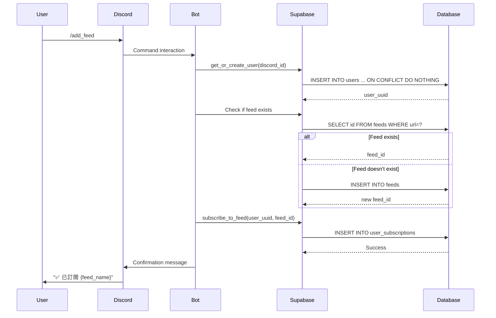
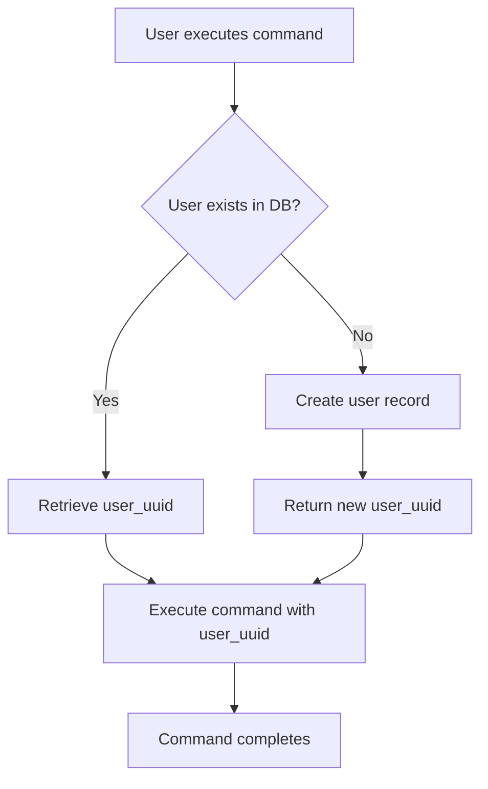

# Design Document: Discord Multi-tenant UI

## Overview

This design document specifies the technical architecture for Phase 4 of the Tech News Agent project: refactoring Discord commands and interactive UI to support multi-tenant operations. The system will transition from a single-user model to a true multi-tenant architecture where each Discord user has independent subscriptions, reading lists, and personalized recommendations.

### Current State (Phase 3)

The current implementation has the following characteristics:

- `/news_now` triggers immediate RSS fetching and LLM analysis
- Interactive buttons (Read Later, Mark as Read) are not fully functional
- No user-specific subscriptions (all users see the same feeds)
- No persistent user data in the database
- Article IDs are not properly passed to interactive components

### Target State (Phase 4)

The new multi-tenant architecture will:

- Automatically register users on first interaction
- Support personal feed subscriptions per user
- Read articles from the shared pool (populated by background scheduler)
- Properly integrate interactive buttons with the database
- Provide personalized reading lists and recommendations
- Maintain persistent interactive components across bot restarts

### Key Benefits

1. **True Multi-tenancy**: Each user has independent subscriptions and reading lists
2. **Instant Response**: `/news_now` reads from database instead of fetching RSS
3. **Personalization**: Recommendations based on individual user ratings
4. **Data Persistence**: All user interactions are stored in the database
5. **Scalability**: Supports unlimited users without performance degradation

## Architecture

### System Components

The refactored system consists of four primary components:

#### 1. User Registration Middleware

**Purpose**: Ensure every Discord user exists in the database before processing commands

**Implementation**:

- Create a decorator `@ensure_user_registered` that wraps command handlers
- Call `supabase_service.get_or_create_user(interaction.user.id)` before command execution
- Cache the user UUID in the interaction context for subsequent operations
- Handle registration failures gracefully with user-friendly error messages

**Example**:

```python
async def ensure_user_registered(interaction: discord.Interaction) -> UUID:
    """Ensure user exists in database and return user UUID."""
    discord_id = str(interaction.user.id)
    supabase = SupabaseService()
    user_uuid = await supabase.get_or_create_user(discord_id)
    return user_uuid
```

#### 2. Personal Subscription Management

**Commands**:

- `/add_feed <name> <url> <category>`: Subscribe to a feed
- `/list_feeds`: View subscribed feeds
- `/unsubscribe_feed <feed_name>`: Unsubscribe from a feed

**Data Flow**:



#### 3. Article Pool Query System

**Command**: `/news_now`

**New Behavior**:

- Query `articles` table for articles from user's subscribed feeds
- Filter by time window (last 7 days) and tinkering_index (NOT NULL)
- Order by tinkering_index descending
- Limit to top 20 articles
- Group by category for display

**SQL Query**:

```sql
SELECT a.id, a.title, a.url, a.category, a.tinkering_index, a.ai_summary, a.published_at
FROM articles a
JOIN feeds f ON a.feed_id = f.id
JOIN user_subscriptions us ON f.id = us.feed_id
WHERE us.user_id = $1
  AND a.published_at >= NOW() - INTERVAL '7 days'
  AND a.tinkering_index IS NOT NULL
ORDER BY a.tinkering_index DESC
LIMIT 20
```

**Performance Considerations**:

- Use database indexes on `user_subscriptions.user_id`, `articles.feed_id`, `articles.published_at`
- Cache user subscriptions for the duration of the command execution
- Limit result set to avoid Discord message size limits

#### 4. Interactive Components Integration

**Components**:

- `ReadLaterButton`: Save article to reading list
- `MarkReadButton`: Mark article as read
- `RatingSelect`: Rate article 1-5 stars
- `FilterSelect`: Filter articles by category
- `DeepDiveButton`: Generate detailed analysis

**Article ID Propagation**:

All interactive components must include `article_id` (UUID) in their `custom_id`:

```python
class ReadLaterButton(discord.ui.Button):
    def __init__(self, article_id: UUID, article_title: str):
        # Format: read_later_{uuid}
        custom_id = f"read_later_{article_id}"
        label = f"⭐ {article_title[:20]}..."
        super().__init__(
            style=discord.ButtonStyle.primary,
            label=label,
            custom_id=custom_id
        )
        self.article_id = article_id

    async def callback(self, interaction: discord.Interaction):
        await interaction.response.defer(ephemeral=True)
        discord_id = str(interaction.user.id)
        supabase = SupabaseService()
        await supabase.save_to_reading_list(discord_id, self.article_id)
        self.disabled = True
        await interaction.message.edit(view=self.view)
        await interaction.followup.send(
            f"✅ 已加入閱讀清單！", ephemeral=True
        )
```

**Custom ID Parsing**:

When a button is clicked, parse the `custom_id` to extract the article_id:

```python
async def callback(self, interaction: discord.Interaction):
    # Parse custom_id: "read_later_123e4567-e89b-12d3-a456-426614174000"
    parts = interaction.data['custom_id'].split('_', 2)
    action = f"{parts[0]}_{parts[1]}"  # "read_later"
    article_id = UUID(parts[2])  # UUID object

    # Use article_id for database operations
    ...
```

## Components and Interfaces

### 1. User Registration Decorator

**File**: `app/bot/utils/decorators.py` (new file)

```python
from functools import wraps
from uuid import UUID
import discord
from app.services.supabase_service import SupabaseService

async def ensure_user_registered(interaction: discord.Interaction) -> UUID:
    """
    Ensure user exists in database and return user UUID.

    Args:
        interaction: Discord interaction object

    Returns:
        User UUID from database

    Raises:
        SupabaseServiceError: If user registration fails
    """
    discord_id = str(interaction.user.id)
    supabase = SupabaseService()
    user_uuid = await supabase.get_or_create_user(discord_id)
    return user_uuid

def require_user_registration(func):
    """
    Decorator to ensure user is registered before command execution.
    Adds user_uuid to the function arguments.
    """
    @wraps(func)
    async def wrapper(self, interaction: discord.Interaction, *args, **kwargs):
        try:
            user_uuid = await ensure_user_registered(interaction)
            return await func(self, interaction, user_uuid, *args, **kwargs)
        except Exception as e:
            logger.error(f"User registration failed: {e}")
            await interaction.response.send_message(
                "❌ 無法註冊使用者，請稍後再試。", ephemeral=True
            )
    return wrapper
```

### 2. Subscription Management Commands

**File**: `app/bot/cogs/subscription_commands.py` (new file)

```python
class SubscriptionCommands(commands.Cog):
    @app_commands.command(name="add_feed")
    @app_commands.describe(
        name="訂閱源名稱",
        url="RSS/Atom 網址",
        category="分類"
    )
    async def add_feed(
        self,
        interaction: discord.Interaction,
        name: str,
        url: str,
        category: str
    ):
        """訂閱一個 RSS 來源"""
        await interaction.response.defer(ephemeral=True)

        try:
            # 1. Register user
            user_uuid = await ensure_user_registered(interaction)

            # 2. Check if feed exists
            supabase = SupabaseService()
            response = supabase.client.table('feeds')\
                .select('id')\
                .eq('url', url)\
                .execute()

            if response.data:
                feed_id = UUID(response.data[0]['id'])
            else:
                # 3. Create new feed
                response = supabase.client.table('feeds')\
                    .insert({
                        'name': name,
                        'url': url,
                        'category': category,
                        'is_active': True
                    })\
                    .execute()
                feed_id = UUID(response.data[0]['id'])

            # 4. Subscribe user to feed
            await supabase.subscribe_to_feed(str(interaction.user.id), feed_id)

            await interaction.followup.send(
                f"✅ 已成功訂閱 **{name}** ({category})", ephemeral=True
            )

        except Exception as e:
            logger.error(f"add_feed error: {e}")
            await interaction.followup.send(
                f"❌ 訂閱失敗：{e}", ephemeral=True
            )

    @app_commands.command(name="list_feeds")
    async def list_feeds(self, interaction: discord.Interaction):
        """查看已訂閱的 RSS 來源"""
        await interaction.response.defer(ephemeral=True)

        try:
            user_uuid = await ensure_user_registered(interaction)
            supabase = SupabaseService()
            subscriptions = await supabase.get_user_subscriptions(str(interaction.user.id))

            if not subscriptions:
                await interaction.followup.send(
                    "📭 你還沒有訂閱任何 RSS 來源！\n"
                    "使用 `/add_feed` 來訂閱。",
                    ephemeral=True
                )
                return

            lines = ["📚 **你的訂閱清單**\n"]
            for sub in subscriptions:
                lines.append(f"• **{sub.name}** ({sub.category})")
                lines.append(f"  🔗 {sub.url}")
                lines.append("")

            content = "\n".join(lines)
            await interaction.followup.send(content, ephemeral=True)

        except Exception as e:
            logger.error(f"list_feeds error: {e}")
            await interaction.followup.send(
                "❌ 無法取得訂閱清單", ephemeral=True
            )
```

### 3. Refactored /news_now Command

**File**: `app/bot/cogs/news_commands.py` (modified)

```python
@app_commands.command(name="news_now")
async def news_now(self, interaction: discord.Interaction):
    """查看你訂閱的最新技術文章"""
    await interaction.response.defer(thinking=True)

    try:
        # 1. Register user
        user_uuid = await ensure_user_registered(interaction)

        # 2. Query articles from user's subscriptions
        supabase = SupabaseService()

        # Get user's subscribed feed IDs
        subscriptions = await supabase.get_user_subscriptions(str(interaction.user.id))

        if not subscriptions:
            await interaction.followup.send(
                "📭 你還沒有訂閱任何 RSS 來源！\n"
                "使用 `/add_feed` 來訂閱感興趣的來源。"
            )
            return

        feed_ids = [str(sub.feed_id) for sub in subscriptions]

        # Query articles from subscribed feeds
        seven_days_ago = (datetime.now(timezone.utc) - timedelta(days=7)).isoformat()

        response = supabase.client.table('articles')\
            .select('id, title, url, category, tinkering_index, ai_summary, published_at, feed_id')\
            .in_('feed_id', feed_ids)\
            .gte('published_at', seven_days_ago)\
            .not_.is_('tinkering_index', 'null')\
            .order('tinkering_index', desc=True)\
            .limit(20)\
            .execute()

        if not response.data:
            await interaction.followup.send(
                "📭 最近 7 天沒有新文章。\n"
                "背景排程器會定期抓取文章，請稍後再試。"
            )
            return

        # 3. Build article list with interactive components
        articles = []
        for row in response.data:
            article = ArticleSchema(
                id=UUID(row['id']),
                title=row['title'],
                url=row['url'],
                category=row['category'],
                tinkering_index=row['tinkering_index'],
                ai_summary=row['ai_summary'],
                published_at=datetime.fromisoformat(row['published_at']),
                feed_id=UUID(row['feed_id']),
                feed_name='',  # Not needed for display
            )
            articles.append(article)

        # 4. Build notification message
        lines = [
            "📰 **你的個人化技術新聞**",
            f"📊 找到 {len(articles)} 篇精選文章\n",
            "🔥 **推薦文章：**\n"
        ]

        # Group by category
        from collections import defaultdict
        by_category = defaultdict(list)
        for article in articles:
            by_category[article.category].append(article)

        for category, cat_articles in sorted(by_category.items()):
            lines.append(f"**{category}**")
            for article in cat_articles[:5]:
                tinkering = "🔥" * article.tinkering_index
                lines.append(f"  {tinkering} {article.title}")
                lines.append(f"    🔗 {article.url}")
            lines.append("")

        notification = "\n".join(lines)

        # 5. Create interactive view with article IDs
        combined_view = FilterView(articles)

        # Add Deep Dive buttons (top 5 articles)
        for article in articles[:5]:
            combined_view.add_item(DeepDiveButton(article))

        # Add Read Later buttons (top 10 articles)
        for article in articles[:10]:
            combined_view.add_item(ReadLaterButton(article.id, article.title))

        await interaction.followup.send(content=notification, view=combined_view)

    except Exception as e:
        logger.error(f"news_now error: {e}")
        await interaction.followup.send(f"❌ 發生錯誤：{e}")
```

### 4. Updated Interactive Components

**File**: `app/bot/cogs/interactions.py` (modified)

Key changes:

- All buttons accept `article_id` (UUID) instead of article object
- Custom IDs include the full UUID
- Callbacks parse the UUID from custom_id
- All database operations use the article_id

```python
class ReadLaterButton(discord.ui.Button):
    def __init__(self, article_id: UUID, article_title: str):
        label = f"⭐ {article_title[:15]}..."
        custom_id = f"read_later_{article_id}"
        super().__init__(
            style=discord.ButtonStyle.primary,
            label=label,
            custom_id=custom_id
        )
        self.article_id = article_id

    async def callback(self, interaction: discord.Interaction):
        await interaction.response.defer(ephemeral=True)
        try:
            supabase = SupabaseService()
            discord_id = str(interaction.user.id)
            await supabase.save_to_reading_list(discord_id, self.article_id)

            self.disabled = True
            await interaction.message.edit(view=self.view)

            await interaction.followup.send(
                "✅ 已加入閱讀清單！", ephemeral=True
            )
        except Exception as e:
            logger.error(f"ReadLaterButton error: {e}")
            await interaction.followup.send(
                "❌ 儲存失敗，請稍後再試。", ephemeral=True
            )
```

## Data Flow Diagrams

### User Registration Flow



### Personal Subscription Flow

```mermaid
flowchart TD
    A[/add_feed command] --> B[Register user]
    B --> C{Feed exists?}
    C -->|Yes| D[Get feed_id]
    C -->|No| E[Create feed]
    E --> F[Get new feed_id]
    D --> G{Already subscribed?}
    F --> G
    G -->|Yes| H[Inform user]
    G -->|No| I[Create subscription]
    I --> J[Confirm to user]
```

### Article Query Flow

```mermaid
flowchart TD
    A[/news_now command] --> B[Register user]
    B --> C[Get user subscriptions]
    C --> D{Has subscriptions?}
    D -->|No| E[Prompt to subscribe]
    D -->|Yes| F[Query articles from subscribed feeds]
    F --> G{Articles found?}
    G -->|No| H[Inform user to wait]
    G -->|Yes| I[Build article list]
    I --> J[Create interactive view]
    J --> K[Send to Discord]
```

## Database Schema Usage

### Tables Used

1. **users**: Store Discord user records
   - `id` (UUID): Primary key
   - `discord_id` (TEXT): Discord user ID (unique)
   - `created_at` (TIMESTAMPTZ): Registration time

2. **feeds**: Store RSS feed sources
   - `id` (UUID): Primary key
   - `name` (TEXT): Feed name
   - `url` (TEXT): Feed URL (unique)
   - `category` (TEXT): Feed category
   - `is_active` (BOOLEAN): Whether feed is active

3. **user_subscriptions**: Link users to feeds
   - `id` (UUID): Primary key
   - `user_id` (UUID): Foreign key to users
   - `feed_id` (UUID): Foreign key to feeds
   - `subscribed_at` (TIMESTAMPTZ): Subscription time
   - UNIQUE constraint on (user_id, feed_id)

4. **articles**: Store fetched articles
   - `id` (UUID): Primary key
   - `feed_id` (UUID): Foreign key to feeds
   - `title` (TEXT): Article title
   - `url` (TEXT): Article URL (unique)
   - `published_at` (TIMESTAMPTZ): Publication time
   - `tinkering_index` (INTEGER): Technical complexity score
   - `ai_summary` (TEXT): LLM-generated summary
   - `created_at` (TIMESTAMPTZ): Creation time

5. **reading_list**: Store user reading lists
   - `id` (UUID): Primary key
   - `user_id` (UUID): Foreign key to users
   - `article_id` (UUID): Foreign key to articles
   - `status` (TEXT): 'Unread', 'Read', or 'Archived'
   - `rating` (INTEGER): 1-5 stars
   - `added_at` (TIMESTAMPTZ): Added time
   - `updated_at` (TIMESTAMPTZ): Last updated time
   - UNIQUE constraint on (user_id, article_id)

### Indexes Required

All indexes already exist from Phase 1:

- `idx_feeds_is_active` on `feeds(is_active)`
- `idx_user_subscriptions_user_id` on `user_subscriptions(user_id)`
- `idx_user_subscriptions_feed_id` on `user_subscriptions(feed_id)`
- `idx_articles_feed_id` on `articles(feed_id)`
- `idx_articles_published_at` on `articles(published_at)`
- `idx_reading_list_user_id` on `reading_list(user_id)`

## Error Handling

### User Registration Errors

- **Database connection failure**: Retry up to 3 times, then inform user
- **Duplicate discord_id**: Handle gracefully with UPSERT logic
- **Validation errors**: Log and inform user with clear message

### Subscription Errors

- **Invalid feed URL**: Validate format before insertion
- **Duplicate subscription**: Handle gracefully, inform user they're already subscribed
- **Feed not found**: Create new feed if it doesn't exist
- **Database constraint violations**: Log and provide user-friendly error message

### Query Errors

- **No subscriptions**: Prompt user to subscribe to feeds
- **No articles found**: Inform user to wait for next scheduled fetch
- **Database timeout**: Retry query, then inform user if it fails
- **Invalid article_id**: Log error and skip the article

### Interactive Component Errors

- **Missing article_id**: Log error and disable button
- **Database operation failure**: Log error and inform user
- **Message edit failure**: Handle gracefully (message may have been deleted)
- **Timeout**: Use ephemeral messages to avoid cluttering channels

## Testing Strategy

### Unit Tests

**User Registration**:

- Test `ensure_user_registered` with new user
- Test `ensure_user_registered` with existing user
- Test concurrent registration attempts
- Test registration failure handling

**Subscription Management**:

- Test `/add_feed` with new feed
- Test `/add_feed` with existing feed
- Test `/add_feed` with duplicate subscription
- Test `/list_feeds` with no subscriptions
- Test `/list_feeds` with multiple subscriptions
- Test `/unsubscribe_feed` with valid subscription
- Test `/unsubscribe_feed` with non-existent subscription

**Article Queries**:

- Test `/news_now` with no subscriptions
- Test `/news_now` with subscriptions but no articles
- Test `/news_now` with articles from subscribed feeds
- Test article filtering by time window
- Test article ordering by tinkering_index
- Test article limit (20 articles max)

**Interactive Components**:

- Test `ReadLaterButton` callback with valid article_id
- Test `MarkReadButton` callback with valid article_id
- Test `RatingSelect` callback with valid rating
- Test custom_id parsing
- Test button disabling after click

### Integration Tests

**End-to-End Workflows**:

- Test complete user journey: register → subscribe → view articles → save to reading list → rate articles → get recommendations
- Test multi-user isolation (User A's subscriptions don't affect User B)
- Test concurrent operations (multiple users subscribing simultaneously)
- Test persistent views after bot restart

### Property-Based Tests

**Property 1: User Registration Idempotency**

- For any discord_id, calling `get_or_create_user` multiple times returns the same UUID

**Property 2: Subscription Uniqueness**

- For any user and feed, creating a subscription multiple times does not create duplicates

**Property 3: Article Query Correctness**

- For any user, `/news_now` only returns articles from feeds they've subscribed to

**Property 4: Reading List Isolation**

- For any two users, their reading lists are completely independent

## Performance Considerations

### Database Query Optimization

- Use indexes on frequently queried columns (user_id, feed_id, published_at)
- Limit result sets to avoid large data transfers
- Use SELECT with specific columns instead of SELECT \*
- Cache user subscriptions during command execution

### Discord API Optimization

- Use `defer()` for operations that may take >3 seconds
- Use ephemeral messages for user-specific responses
- Limit interactive components to 25 per view (Discord limit)
- Truncate long messages to 2000 characters (Discord limit)

### Memory Management

- Don't load all articles into memory at once
- Use pagination for large result sets
- Clean up resources after command execution
- Avoid storing large objects in button/select instances

## Security Considerations

### Input Validation

- Validate all user inputs before database operations
- Sanitize feed URLs to prevent malicious links
- Validate UUID format for article_id and feed_id
- Limit text field lengths to prevent abuse

### Access Control

- Users can only access their own subscriptions and reading lists
- Users cannot modify other users' data
- Use parameterized queries to prevent SQL injection
- Don't expose internal error details to users

### Rate Limiting

- Discord has built-in rate limiting for commands
- Consider implementing additional rate limiting for expensive operations
- Log suspicious activity (e.g., rapid subscription changes)

## Migration Plan

### Phase 3 to Phase 4 Migration

**Step 1: Add New Commands**

- Implement `/add_feed`, `/list_feeds`, `/unsubscribe_feed`
- Deploy alongside existing commands
- Test with a small group of users

**Step 2: Refactor /news_now**

- Update to query database instead of fetching RSS
- Maintain backward compatibility (handle users with no subscriptions)
- Deploy and monitor performance

**Step 3: Update Interactive Components**

- Modify buttons to use article_id instead of URL hash
- Update custom_id format
- Register persistent views in bot setup

**Step 4: Update /reading_list**

- Already implemented in Phase 2, verify it works with new article_id format
- Test pagination and rating functionality

**Step 5: Deprecate Old Behavior**

- Remove RSS fetching from `/news_now`
- Remove old button implementations
- Clean up unused code

### Rollback Plan

If Phase 4 deployment encounters issues:

1. **Immediate Rollback**: Revert to Phase 3 code
2. **Database State**: No rollback needed (schema unchanged)
3. **User Data**: Subscriptions remain in database for next deployment
4. **Monitoring**: Check logs for root cause
5. **Fix Forward**: Address issues and redeploy

## Future Enhancements

**Phase 5 Considerations**:

- Web dashboard for subscription management
- Email notifications for new articles
- Advanced filtering (by keyword, date range, rating)
- Article recommendations based on reading history
- Social features (share articles, follow other users)
- Export reading list to external services
