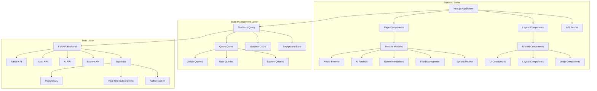
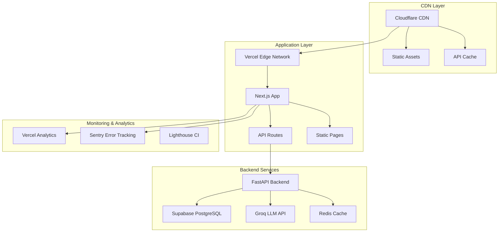

# Design Document: Frontend Feature Enhancement

## Overview

本設計文件詳細說明 Tech News Agent 前端功能增強專案的技術架構和實作策略。此專案旨在將 Discord Bot 的豐富功能完整移植到 Next.js Web 介面，建立功能對等但更適合桌面瀏覽的使用者體驗。

### 設計目標

1. **功能對等性**: 確保 Web 介面提供與 Discord Bot 相同的核心功能
2. **效能優化**: 實現快速載入、流暢互動和響應式體驗
3. **可擴展性**: 建立模組化架構，支援未來功能擴展
4. **使用者體驗**: 提供直觀、無障礙且跨裝置的使用體驗
5. **技術現代化**: 採用最新的 React 生態系統最佳實踐

### 核心技術棧

- **Frontend Framework**: Next.js 14 with App Router
- **UI Framework**: React 18 with TypeScript
- **Styling**: Tailwind CSS + shadcn/ui 元件系統
- **State Management**: TanStack Query (React Query) v5
- **Backend Integration**: FastAPI REST API
- **Database**: Supabase PostgreSQL
- **AI Integration**: Groq LLM (Llama 3.1 8B, Llama 3.3 70B)

## Architecture

### 系統架構概覽



### 模組化架構設計

專案採用功能導向的模組化架構，每個功能模組包含完整的 UI 元件、業務邏輯、API 整合和狀態管理：

```
src/
├── app/                          # Next.js App Router
│   ├── (dashboard)/             # Dashboard layout group
│   │   ├── articles/           # 文章瀏覽頁面
│   │   ├── recommendations/    # 推薦頁面
│   │   ├── subscriptions/      # 訂閱管理頁面
│   │   ├── analytics/          # 分析儀表板
│   │   └── settings/           # 設定頁面
│   ├── api/                    # API Routes (proxy/middleware)
│   ├── globals.css             # 全域樣式
│   ├── layout.tsx              # 根佈局
│   └── page.tsx                # 首頁
├── components/                  # 共享 UI 元件
│   ├── ui/                     # shadcn/ui 基礎元件
│   ├── layout/                 # 佈局元件
│   ├── forms/                  # 表單元件
│   └── feedback/               # 回饋元件
├── features/                   # 功能模組
│   ├── articles/               # 文章相關功能
│   │   ├── components/         # 文章專用元件
│   │   ├── hooks/              # 文章相關 hooks
│   │   ├── services/           # API 服務
│   │   ├── types/              # 型別定義
│   │   └── utils/              # 工具函數
│   ├── ai-analysis/            # AI 分析功能
│   ├── recommendations/        # 推薦系統
│   ├── subscriptions/          # 訂閱管理
│   ├── notifications/          # 通知系統
│   └── analytics/              # 分析功能
├── lib/                        # 共享工具庫
│   ├── api/                    # API 客戶端
│   ├── auth/                   # 認證相關
│   ├── cache/                  # 快取策略
│   ├── utils/                  # 通用工具
│   └── constants/              # 常數定義
├── hooks/                      # 共享 React hooks
├── providers/                  # Context providers
├── styles/                     # 樣式檔案
└── types/                      # 全域型別定義
```

## Components and Interfaces

### 核心元件架構

#### 1. 佈局元件系統

**主要佈局元件**:

```typescript
// components/layout/AppLayout.tsx
interface AppLayoutProps {
  children: React.ReactNode;
  sidebar?: React.ReactNode;
  header?: React.ReactNode;
  footer?: React.ReactNode;
}

// components/layout/DashboardLayout.tsx
interface DashboardLayoutProps {
  children: React.ReactNode;
  title: string;
  description?: string;
  actions?: React.ReactNode;
}

// components/layout/Sidebar.tsx
interface SidebarProps {
  navigation: NavigationItem[];
  user: User;
  collapsed?: boolean;
  onToggle?: () => void;
}
```

**響應式導航系統**:

- 桌面版: 固定側邊欄 + 頂部導航
- 平板版: 可收合側邊欄 + 頂部導航
- 手機版: 底部標籤欄 + 漢堡選單

#### 2. 文章瀏覽元件

**ArticleBrowser 元件架構**:

```typescript
// features/articles/components/ArticleBrowser.tsx
interface ArticleBrowserProps {
  initialFilters?: ArticleFilters;
  pageSize?: number;
  enableVirtualization?: boolean;
}

interface ArticleFilters {
  categories?: string[];
  tinkeringIndex?: [number, number];
  dateRange?: [Date, Date];
  sources?: string[];
  sortBy?: 'date' | 'tinkering_index' | 'category';
  sortOrder?: 'asc' | 'desc';
}

// features/articles/components/ArticleCard.tsx
interface ArticleCardProps {
  article: Article;
  showAnalysisButton?: boolean;
  showReadingListButton?: boolean;
  onAnalyze?: (articleId: string) => void;
  onAddToReadingList?: (articleId: string) => void;
}
```

**虛擬滾動實作**:
使用 `react-window` 實現大型列表的效能優化，支援動態高度和無限滾動。

#### 3. AI 分析元件

**深度分析模態視窗**:

```typescript
// features/ai-analysis/components/AnalysisModal.tsx
interface AnalysisModalProps {
  articleId: string;
  isOpen: boolean;
  onClose: () => void;
}

interface AnalysisResult {
  coreConcepts: string[];
  applicationScenarios: string[];
  potentialRisks: string[];
  recommendedSteps: string[];
  generatedAt: Date;
  model: 'llama-3.1-8b' | 'llama-3.3-70b';
}
```

**分析快取策略**:

- 使用 TanStack Query 實現智慧快取
- 分析結果快取 24 小時
- 支援背景重新驗證

#### 4. 推薦系統元件

**推薦卡片元件**:

```typescript
// features/recommendations/components/RecommendationCard.tsx
interface RecommendationCardProps {
  recommendation: Recommendation;
  onDismiss?: (id: string) => void;
  onInteract?: (id: string, action: InteractionType) => void;
}

interface Recommendation {
  id: string;
  article: Article;
  reason: string;
  confidence: number;
  generatedAt: Date;
  dismissed?: boolean;
}
```

#### 5. 互動式 UI 元件

**多選篩選選單**:

```typescript
// components/ui/MultiSelectFilter.tsx
interface MultiSelectFilterProps<T> {
  options: FilterOption<T>[];
  selected: T[];
  onSelectionChange: (selected: T[]) => void;
  placeholder?: string;
  searchable?: boolean;
  maxDisplayed?: number;
}
```

**評分下拉選單**:

```typescript
// components/ui/RatingDropdown.tsx
interface RatingDropdownProps {
  value?: number;
  onChange: (rating: number) => void;
  disabled?: boolean;
  size?: 'sm' | 'md' | 'lg';
}
```

### 元件設計原則

1. **組合優於繼承**: 使用 compound components 模式
2. **型別安全**: 完整的 TypeScript 型別定義
3. **可訪問性**: 遵循 WCAG 2.1 AA 標準
4. **效能優化**: 使用 React.memo 和 useMemo 適當優化
5. **測試友好**: 提供 data-testid 和清晰的 API

## Data Models

### 核心資料模型

#### 1. 文章相關模型

```typescript
// types/article.ts
interface Article {
  id: string;
  title: string;
  url: string;
  summary: string;
  content?: string;
  publishedAt: Date;
  createdAt: Date;
  updatedAt: Date;

  // 分類和標籤
  category: string;
  tags: string[];

  // AI 評分
  tinkeringIndex: number; // 1-5

  // 來源資訊
  source: ArticleSource;

  // 使用者互動
  userRating?: number;
  isInReadingList: boolean;
  readingProgress?: ReadingProgress;

  // 統計資料
  viewCount: number;
  shareCount: number;
}

interface ArticleSource {
  id: string;
  name: string;
  url: string;
  favicon?: string;
  category: string;
  isActive: boolean;
}

interface ReadingProgress {
  userId: string;
  articleId: string;
  progress: number; // 0-100
  timeSpent: number; // seconds
  lastReadAt: Date;
  completed: boolean;
}
```

#### 2. 使用者相關模型

```typescript
// types/user.ts
interface User {
  id: string;
  email: string;
  name: string;
  avatar?: string;
  createdAt: Date;

  // 偏好設定
  preferences: UserPreferences;

  // 訂閱資訊
  subscriptions: Subscription[];

  // 統計資料
  stats: UserStats;
}

interface UserPreferences {
  // 通知設定
  notifications: NotificationSettings;

  // 介面設定
  theme: 'light' | 'dark' | 'system';
  language: 'zh-TW' | 'en-US';

  // 內容偏好
  preferredCategories: string[];
  minTinkeringIndex: number;

  // 隱私設定
  shareReadingActivity: boolean;
  allowRecommendations: boolean;
}

interface NotificationSettings {
  enabled: boolean;
  frequency: 'immediate' | 'daily' | 'weekly';
  channels: ('email' | 'push' | 'in-app')[];
  quietHours: {
    start: string; // HH:mm
    end: string; // HH:mm
  };
}
```

#### 3. 推薦系統模型

```typescript
// types/recommendation.ts
interface RecommendationEngine {
  generateRecommendations(userId: string): Promise<Recommendation[]>;
  updateUserProfile(userId: string, interactions: UserInteraction[]): Promise<void>;
  getRecommendationMetrics(userId: string): Promise<RecommendationMetrics>;
}

interface UserInteraction {
  userId: string;
  articleId: string;
  type: 'view' | 'rate' | 'share' | 'save' | 'dismiss';
  value?: number; // for ratings
  timestamp: Date;
  context?: Record<string, any>;
}

interface RecommendationMetrics {
  totalRecommendations: number;
  clickThroughRate: number;
  averageRating: number;
  categoryDistribution: Record<string, number>;
}
```

#### 4. 系統監控模型

```typescript
// types/system.ts
interface SystemStatus {
  scheduler: SchedulerStatus;
  database: DatabaseStatus;
  api: ApiStatus;
  feeds: FeedStatus[];
  lastUpdated: Date;
}

interface SchedulerStatus {
  isRunning: boolean;
  lastExecution: Date;
  nextExecution: Date;
  executionHistory: ExecutionRecord[];
}

interface FeedStatus {
  sourceId: string;
  sourceName: string;
  lastFetch: Date;
  nextFetch: Date;
  status: 'healthy' | 'warning' | 'error';
  errorMessage?: string;
  articlesProcessed: number;
  processingTime: number;
}
```

### 資料流設計

#### 1. TanStack Query 整合

```typescript
// lib/api/queries.ts
export const articleQueries = {
  all: ['articles'] as const,
  lists: () => [...articleQueries.all, 'list'] as const,
  list: (filters: ArticleFilters) => [...articleQueries.lists(), filters] as const,
  details: () => [...articleQueries.all, 'detail'] as const,
  detail: (id: string) => [...articleQueries.details(), id] as const,
  analysis: (id: string) => [...articleQueries.detail(id), 'analysis'] as const,
};

// features/articles/hooks/useArticles.ts
export function useArticles(filters: ArticleFilters) {
  return useQuery({
    queryKey: articleQueries.list(filters),
    queryFn: () => articlesApi.getArticles(filters),
    staleTime: 5 * 60 * 1000, // 5 minutes
    gcTime: 10 * 60 * 1000, // 10 minutes
  });
}
```

#### 2. 快取策略

**分層快取架構**:

1. **瀏覽器快取**: Service Worker + Cache API
2. **記憶體快取**: TanStack Query cache
3. **本地儲存**: IndexedDB for offline data
4. **CDN 快取**: 靜態資源和 API 回應

**快取失效策略**:

- 文章列表: 5 分鐘 stale time
- 文章詳情: 15 分鐘 stale time
- AI 分析: 24 小時 stale time
- 使用者設定: 即時更新
- 系統狀態: 30 秒 stale time

## Correctness Properties

_A property is a characteristic or behavior that should hold true across all valid executions of a system-essentially, a formal statement about what the system should do. Properties serve as the bridge between human-readable specifications and machine-verifiable correctness guarantees._

基於需求分析，以下是系統的核心正確性屬性：

### Property 1: 文章瀏覽器響應式渲染

_For any_ set of articles, the Advanced_Article_Browser should render the correct number of article cards in a responsive grid layout that adapts to different screen sizes.

**Validates: Requirements 1.1**

### Property 2: 分類篩選選單正確性

_For any_ category distribution dataset, the Category_Filter_Menu should display the top 24 most common categories plus a "顯示全部" option.

**Validates: Requirements 1.2**

### Property 3: 即時篩選功能

_For any_ combination of filter parameters, applying filters should update the article display without causing a page refresh or navigation event.

**Validates: Requirements 1.5**

### Property 4: 統計資料準確性

_For any_ article dataset and filter combination, the displayed statistics (total count, filtered count) should accurately reflect the actual number of articles.

**Validates: Requirements 1.6**

### Property 5: 按鈕顯示限制

_For any_ page of articles, the system should display "Deep Dive Analysis" buttons for up to 5 articles and "Add to Reading List" buttons for up to 10 articles per page.

**Validates: Requirements 1.7, 1.8**

### Property 6: URL 狀態同步

_For any_ filter state applied by the user, the URL should be updated to reflect the current filters and maintain state consistency on page refresh.

**Validates: Requirements 1.9**

### Property 7: 鍵盤導航可訪問性

_For any_ interactive element in the Advanced_Article_Browser, keyboard navigation should provide access to all functionality without requiring mouse interaction.

**Validates: Requirements 1.10**

### Property 8: AI 分析模態視窗觸發

_For any_ article with analysis capability, clicking the "Deep Dive Analysis" button should open the AI_Analysis_Panel in a modal dialog.

**Validates: Requirements 2.1**

### Property 9: 分析面板資訊完整性

_For any_ article being analyzed, the AI_Analysis_Panel should display the article title, source, and published date correctly.

**Validates: Requirements 2.2**

### Property 10: API 呼叫正確性

_For any_ article analysis request, the system should make the correct API call to the backend with proper parameters for Llama 3.3 70B analysis.

**Validates: Requirements 2.3**

### Property 11: 分析結果結構完整性

_For any_ successful analysis response, the displayed result should contain all required sections: core technical concepts, application scenarios, potential risks, and recommended next steps.

**Validates: Requirements 2.4**

### Property 12: 載入狀態管理

_For any_ analysis request, the system should display a loading indicator during processing and hide it when the analysis completes or fails.

**Validates: Requirements 2.5**

### Property 13: 分析結果快取

_For any_ article that has been analyzed, subsequent analysis requests for the same article should use cached results instead of making new API calls.

**Validates: Requirements 2.6**

### Property 14: 剪貼簿功能

_For any_ completed analysis, the "Copy Analysis" button should successfully copy the analysis text to the user's clipboard.

**Validates: Requirements 2.7**

### Property 15: 分享連結生成

_For any_ article analysis, the "Share Analysis" button should generate a valid shareable link that provides access to the analysis.

**Validates: Requirements 2.8**

### Property 16: 錯誤處理與重試

_For any_ failed analysis request, the system should display an appropriate error message with a retry option.

**Validates: Requirements 2.9**

### Property 17: 推薦演算法基礎

_For any_ user with rating history, recommendations should be generated based only on articles that the user has rated 4 stars or higher.

**Validates: Requirements 3.2**

### Property 18: 推薦卡片渲染

_For any_ set of recommendations, each should be displayed as a Recommendation_Card component with proper formatting and information.

**Validates: Requirements 3.3**

### Property 19: 推薦卡片資訊完整性

_For any_ recommendation card, it should display the article title, source, category, AI summary, and recommendation reason.

**Validates: Requirements 3.4**

### Property 20: 推薦刷新功能

_For any_ recommendation state, clicking "Refresh Recommendations" should generate and display new recommendation suggestions.

**Validates: Requirements 3.5**

### Property 21: 資料不足提示

_For any_ user with fewer than 3 rated articles, the recommendation system should display a message indicating insufficient rating data.

**Validates: Requirements 3.6**

### Property 22: 推薦忽略功能

_For any_ displayed recommendation, users should be able to dismiss it, and it should no longer appear in their recommendation list.

**Validates: Requirements 3.7**

### Property 23: 點擊率追蹤

_For any_ recommendation interaction (click, dismiss, etc.), the system should track the interaction for click-through rate analysis.

**Validates: Requirements 3.8**

### Property 24: 空推薦狀態處理

_For any_ scenario where no recommendations are available, the system should suggest that the user rate more articles to improve recommendations.

**Validates: Requirements 3.9**

## Error Handling

### 錯誤處理策略

#### 1. 分層錯誤處理架構

```typescript
// lib/errors/ErrorBoundary.tsx
interface ErrorInfo {
  componentStack: string;
  errorBoundary?: string;
}

class GlobalErrorBoundary extends React.Component<Props, State> {
  static getDerivedStateFromError(error: Error): State {
    return { hasError: true, error };
  }

  componentDidCatch(error: Error, errorInfo: ErrorInfo) {
    // 記錄錯誤到監控系統
    errorReporting.captureException(error, {
      tags: { boundary: 'global' },
      extra: errorInfo,
    });
  }
}
```

#### 2. API 錯誤處理

**統一錯誤回應格式**:

```typescript
interface ApiError {
  code: string;
  message: string;
  details?: Record<string, any>;
  timestamp: string;
  requestId: string;
}

// lib/api/errorHandler.ts
export class ApiErrorHandler {
  static handle(error: AxiosError): ApiError {
    if (error.response?.status === 401) {
      // 處理認證錯誤
      authService.logout();
      router.push('/login');
    }

    return this.normalizeError(error);
  }
}
```

**重試機制**:

- 網路錯誤: 指數退避重試 (最多 3 次)
- 5xx 錯誤: 立即重試 1 次，然後指數退避
- 4xx 錯誤: 不重試，直接顯示錯誤訊息

#### 3. 使用者友善錯誤訊息

```typescript
// components/feedback/ErrorMessage.tsx
interface ErrorMessageProps {
  error: ApiError | Error;
  onRetry?: () => void;
  fallback?: React.ReactNode;
}

const ERROR_MESSAGES = {
  NETWORK_ERROR: '網路連線異常，請檢查您的網路設定',
  ANALYSIS_TIMEOUT: 'AI 分析處理時間過長，請稍後再試',
  INSUFFICIENT_PERMISSIONS: '您沒有執行此操作的權限',
  RATE_LIMIT_EXCEEDED: '請求過於頻繁，請稍後再試',
} as const;
```

#### 4. 離線狀態處理

```typescript
// hooks/useOfflineStatus.ts
export function useOfflineStatus() {
  const [isOffline, setIsOffline] = useState(!navigator.onLine);

  useEffect(() => {
    const handleOnline = () => setIsOffline(false);
    const handleOffline = () => setIsOffline(true);

    window.addEventListener('online', handleOnline);
    window.addEventListener('offline', handleOffline);

    return () => {
      window.removeEventListener('online', handleOnline);
      window.removeEventListener('offline', handleOffline);
    };
  }, []);

  return isOffline;
}
```

## Testing Strategy

### 測試架構概覽

本專案採用多層次測試策略，結合單元測試、整合測試和屬性測試，確保系統的正確性和可靠性。

#### 1. 測試技術棧

- **測試框架**: Vitest (快速、現代的測試執行器)
- **React 測試**: React Testing Library + Jest DOM
- **屬性測試**: fast-check (JavaScript 屬性測試庫)
- **E2E 測試**: Playwright (跨瀏覽器端到端測試)
- **視覺回歸**: Chromatic (Storybook 視覺測試)
- **效能測試**: Lighthouse CI

#### 2. 單元測試策略

**元件測試**:

```typescript
// features/articles/components/__tests__/ArticleCard.test.tsx
describe('ArticleCard', () => {
  it('should display article information correctly', () => {
    const mockArticle = createMockArticle();
    render(<ArticleCard article={mockArticle} />);

    expect(screen.getByText(mockArticle.title)).toBeInTheDocument();
    expect(screen.getByText(mockArticle.source.name)).toBeInTheDocument();
  });

  it('should handle analysis button click', async () => {
    const onAnalyze = vi.fn();
    const mockArticle = createMockArticle();

    render(<ArticleCard article={mockArticle} onAnalyze={onAnalyze} />);

    await user.click(screen.getByRole('button', { name: /deep dive analysis/i }));
    expect(onAnalyze).toHaveBeenCalledWith(mockArticle.id);
  });
});
```

**Hook 測試**:

```typescript
// features/articles/hooks/__tests__/useArticles.test.ts
describe('useArticles', () => {
  it('should fetch articles with correct filters', async () => {
    const filters = { categories: ['tech'], tinkeringIndex: [3, 5] };

    const { result } = renderHook(() => useArticles(filters), {
      wrapper: createQueryWrapper(),
    });

    await waitFor(() => {
      expect(result.current.isSuccess).toBe(true);
    });

    expect(mockApiCall).toHaveBeenCalledWith(expect.objectContaining(filters));
  });
});
```

#### 3. 屬性測試實作

**TanStack Query 配置**:

- 每個屬性測試執行最少 100 次迭代
- 使用 fast-check 生成隨機測試資料
- 每個測試標記對應的設計屬性

```typescript
// features/articles/components/__tests__/ArticleBrowser.property.test.tsx
import fc from 'fast-check';

describe('ArticleBrowser Properties', () => {
  /**
   * Feature: frontend-feature-enhancement, Property 1: 文章瀏覽器響應式渲染
   * For any set of articles, the Advanced_Article_Browser should render
   * the correct number of article cards in a responsive grid layout
   */
  it('should render correct number of article cards', () => {
    fc.assert(fc.property(
      fc.array(articleArbitrary, { minLength: 0, maxLength: 100 }),
      (articles) => {
        render(<ArticleBrowser articles={articles} />);

        const cards = screen.getAllByTestId('article-card');
        expect(cards).toHaveLength(articles.length);
      }
    ), { numRuns: 100 });
  });

  /**
   * Feature: frontend-feature-enhancement, Property 4: 統計資料準確性
   * For any article dataset and filter combination, the displayed statistics
   * should accurately reflect the actual number of articles
   */
  it('should display accurate article statistics', () => {
    fc.assert(fc.property(
      fc.array(articleArbitrary, { minLength: 0, maxLength: 50 }),
      fc.record({
        categories: fc.array(fc.string(), { maxLength: 5 }),
        tinkeringIndex: fc.tuple(fc.integer(1, 5), fc.integer(1, 5))
          .map(([min, max]) => [Math.min(min, max), Math.max(min, max)]),
      }),
      (articles, filters) => {
        const filteredArticles = applyFilters(articles, filters);

        render(<ArticleBrowser articles={articles} initialFilters={filters} />);

        expect(screen.getByText(`Total: ${articles.length}`)).toBeInTheDocument();
        expect(screen.getByText(`Filtered: ${filteredArticles.length}`)).toBeInTheDocument();
      }
    ), { numRuns: 100 });
  });
});
```

**測試資料生成器**:

```typescript
// test/arbitraries/article.ts
export const articleArbitrary = fc.record({
  id: fc.uuid(),
  title: fc.string({ minLength: 10, maxLength: 100 }),
  url: fc.webUrl(),
  summary: fc.string({ minLength: 50, maxLength: 300 }),
  category: fc.constantFrom('tech', 'ai', 'web', 'mobile', 'devops'),
  tinkeringIndex: fc.integer({ min: 1, max: 5 }),
  publishedAt: fc.date({ min: new Date('2020-01-01'), max: new Date() }),
  source: sourceArbitrary,
});

export const sourceArbitrary = fc.record({
  id: fc.uuid(),
  name: fc.string({ minLength: 5, maxLength: 30 }),
  url: fc.webUrl(),
  category: fc.constantFrom('blog', 'news', 'documentation'),
});
```

#### 4. 整合測試

**API 整合測試**:

```typescript
// features/ai-analysis/__tests__/analysis.integration.test.ts
describe('AI Analysis Integration', () => {
  it('should complete full analysis workflow', async () => {
    const mockArticle = createMockArticle();

    // Mock API responses
    mockApiServer.use(
      rest.post('/api/analysis', (req, res, ctx) => {
        return res(ctx.json(createMockAnalysis()));
      })
    );

    render(<AnalysisModal articleId={mockArticle.id} isOpen={true} />);

    // Verify loading state
    expect(screen.getByText(/generating analysis/i)).toBeInTheDocument();

    // Wait for analysis to complete
    await waitFor(() => {
      expect(screen.getByText(/core technical concepts/i)).toBeInTheDocument();
    });

    // Verify all sections are present
    expect(screen.getByText(/application scenarios/i)).toBeInTheDocument();
    expect(screen.getByText(/potential risks/i)).toBeInTheDocument();
    expect(screen.getByText(/recommended steps/i)).toBeInTheDocument();
  });
});
```

#### 5. E2E 測試

**關鍵使用者流程**:

```typescript
// e2e/article-browsing.spec.ts
import { test, expect } from '@playwright/test';

test('complete article browsing workflow', async ({ page }) => {
  await page.goto('/articles');

  // Test filtering
  await page.click('[data-testid="category-filter"]');
  await page.click('text=Tech');

  // Verify filtered results
  await expect(page.locator('[data-testid="article-card"]')).toHaveCount(5);

  // Test analysis modal
  await page.click('[data-testid="analysis-button"]:first-child');
  await expect(page.locator('[data-testid="analysis-modal"]')).toBeVisible();

  // Test copy functionality
  await page.click('[data-testid="copy-analysis"]');
  // Verify clipboard content (requires clipboard permissions)
});
```

#### 6. 效能測試

**Core Web Vitals 監控**:

```typescript
// test/performance/vitals.test.ts
describe('Performance Metrics', () => {
  it('should meet Core Web Vitals thresholds', async () => {
    const metrics = await measurePagePerformance('/articles');

    expect(metrics.LCP).toBeLessThan(2500); // Largest Contentful Paint
    expect(metrics.FID).toBeLessThan(100);  // First Input Delay
    expect(metrics.CLS).toBeLessThan(0.1);  // Cumulative Layout Shift
  });

  it('should handle large article lists efficiently', async () => {
    const startTime = performance.now();

    render(<ArticleBrowser articles={generateLargeArticleList(1000)} />);

    const renderTime = performance.now() - startTime;
    expect(renderTime).toBeLessThan(100); // Should render in under 100ms
  });
});
```

#### 7. 測試覆蓋率目標

- **單元測試覆蓋率**: 最少 80%
- **整合測試覆蓋率**: 主要功能流程 100%
- **E2E 測試覆蓋率**: 關鍵使用者路徑 100%
- **屬性測試**: 所有正確性屬性 100%

#### 8. CI/CD 測試流程

```yaml
# .github/workflows/test.yml
name: Test Suite
on: [push, pull_request]

jobs:
  unit-tests:
    runs-on: ubuntu-latest
    steps:
      - uses: actions/checkout@v3
      - name: Run unit tests
        run: npm run test:unit

  property-tests:
    runs-on: ubuntu-latest
    steps:
      - uses: actions/checkout@v3
      - name: Run property tests
        run: npm run test:property

  e2e-tests:
    runs-on: ubuntu-latest
    steps:
      - uses: actions/checkout@v3
      - name: Run E2E tests
        run: npm run test:e2e

  performance-tests:
    runs-on: ubuntu-latest
    steps:
      - uses: actions/checkout@v3
      - name: Run Lighthouse CI
        run: npm run test:lighthouse
```

### 測試最佳實踐

1. **測試隔離**: 每個測試獨立運行，不依賴其他測試
2. **資料清理**: 使用 beforeEach/afterEach 確保測試環境乾淨
3. **Mock 策略**: 適當使用 mock，但避免過度 mock
4. **可讀性**: 測試名稱清楚描述測試意圖
5. **維護性**: 定期重構測試程式碼，保持與產品程式碼同步

這個全面的測試策略確保系統的正確性、效能和使用者體驗品質，同時支援持續整合和部署流程。

## Performance Optimization

### 效能優化策略

#### 1. 載入效能優化

**程式碼分割策略**:

```typescript
// app/layout.tsx - 路由層級分割
const ArticlesPage = lazy(() => import('./articles/page'));
const RecommendationsPage = lazy(() => import('./recommendations/page'));
const AnalyticsPage = lazy(() => import('./analytics/page'));

// 元件層級分割
const AnalysisModal = lazy(() => import('@/features/ai-analysis/components/AnalysisModal'));
const ChartComponents = lazy(() => import('@/components/charts'));
```

**資源預載策略**:

```typescript
// lib/prefetch/strategy.ts
export class PrefetchStrategy {
  // 預載可能的下一頁內容
  static prefetchNextPage(currentFilters: ArticleFilters) {
    const nextPageFilters = { ...currentFilters, page: currentFilters.page + 1 };
    queryClient.prefetchQuery({
      queryKey: articleQueries.list(nextPageFilters),
      queryFn: () => articlesApi.getArticles(nextPageFilters),
    });
  }

  // 預載熱門分析
  static prefetchPopularAnalyses() {
    const popularArticleIds = getPopularArticleIds();
    popularArticleIds.forEach((id) => {
      queryClient.prefetchQuery({
        queryKey: articleQueries.analysis(id),
        queryFn: () => analysisApi.getAnalysis(id),
      });
    });
  }
}
```

#### 2. 渲染效能優化

**虛擬滾動實作**:

```typescript
// components/ui/VirtualizedList.tsx
import { FixedSizeList as List } from 'react-window';

interface VirtualizedListProps<T> {
  items: T[];
  itemHeight: number;
  renderItem: (props: { index: number; style: React.CSSProperties }) => React.ReactNode;
  overscan?: number;
}

export function VirtualizedList<T>({
  items,
  itemHeight,
  renderItem,
  overscan = 5
}: VirtualizedListProps<T>) {
  const Row = ({ index, style }: { index: number; style: React.CSSProperties }) => (
    <div style={style}>
      {renderItem({ index, style })}
    </div>
  );

  return (
    <List
      height={600}
      itemCount={items.length}
      itemSize={itemHeight}
      overscanCount={overscan}
    >
      {Row}
    </List>
  );
}
```

**React 效能優化**:

```typescript
// features/articles/components/ArticleCard.tsx
export const ArticleCard = React.memo(({ article, onAnalyze, onAddToReadingList }: ArticleCardProps) => {
  const handleAnalyze = useCallback(() => {
    onAnalyze?.(article.id);
  }, [article.id, onAnalyze]);

  const handleAddToReadingList = useCallback(() => {
    onAddToReadingList?.(article.id);
  }, [article.id, onAddToReadingList]);

  const formattedDate = useMemo(() =>
    formatDistanceToNow(article.publishedAt, { addSuffix: true })
  , [article.publishedAt]);

  return (
    <Card className="article-card">
      {/* 元件內容 */}
    </Card>
  );
});
```

#### 3. 網路效能優化

**智慧快取策略**:

```typescript
// lib/cache/strategies.ts
export const cacheStrategies = {
  // 文章列表 - 短期快取，頻繁更新
  articleList: {
    staleTime: 5 * 60 * 1000, // 5 分鐘
    gcTime: 10 * 60 * 1000, // 10 分鐘
    refetchOnWindowFocus: true,
  },

  // AI 分析 - 長期快取，很少變更
  aiAnalysis: {
    staleTime: 24 * 60 * 60 * 1000, // 24 小時
    gcTime: 7 * 24 * 60 * 60 * 1000, // 7 天
    refetchOnWindowFocus: false,
  },

  // 使用者設定 - 即時更新
  userSettings: {
    staleTime: 0,
    gcTime: 5 * 60 * 1000, // 5 分鐘
    refetchOnWindowFocus: true,
  },
};
```

**請求優化**:

```typescript
// lib/api/optimizations.ts
export class RequestOptimizer {
  // 請求去重
  private static pendingRequests = new Map<string, Promise<any>>();

  static async dedupedRequest<T>(key: string, requestFn: () => Promise<T>): Promise<T> {
    if (this.pendingRequests.has(key)) {
      return this.pendingRequests.get(key)!;
    }

    const promise = requestFn().finally(() => {
      this.pendingRequests.delete(key);
    });

    this.pendingRequests.set(key, promise);
    return promise;
  }

  // 批次請求
  static batchAnalysisRequests(articleIds: string[]) {
    return analysisApi.getBatchAnalysis(articleIds);
  }
}
```

#### 4. 圖片優化

```typescript
// components/ui/OptimizedImage.tsx
import Image from 'next/image';

interface OptimizedImageProps {
  src: string;
  alt: string;
  width?: number;
  height?: number;
  priority?: boolean;
}

export function OptimizedImage({ src, alt, width, height, priority }: OptimizedImageProps) {
  return (
    <Image
      src={src}
      alt={alt}
      width={width}
      height={height}
      priority={priority}
      placeholder="blur"
      blurDataURL="data:image/jpeg;base64,/9j/4AAQSkZJRgABAQAAAQABAAD/2wBDAAYEBQYFBAYGBQYHBwYIChAKCgkJChQODwwQFxQYGBcUFhYaHSUfGhsjHBYWICwgIyYnKSopGR8tMC0oMCUoKSj/2wBDAQcHBwoIChMKChMoGhYaKCgoKCgoKCgoKCgoKCgoKCgoKCgoKCgoKCgoKCgoKCgoKCgoKCgoKCgoKCgoKCgoKCj/wAARCAABAAEDASIAAhEBAxEB/8QAFQABAQAAAAAAAAAAAAAAAAAAAAv/xAAUEAEAAAAAAAAAAAAAAAAAAAAA/8QAFQEBAQAAAAAAAAAAAAAAAAAAAAX/xAAUEQEAAAAAAAAAAAAAAAAAAAAA/9oADAMBAAIRAxEAPwCdABmX/9k="
      sizes="(max-width: 768px) 100vw, (max-width: 1200px) 50vw, 33vw"
      className="rounded-lg object-cover"
    />
  );
}
```

#### 5. Service Worker 快取

```typescript
// public/sw.js
const CACHE_NAME = 'tech-news-v1';
const STATIC_ASSETS = ['/', '/articles', '/recommendations', '/manifest.json'];

self.addEventListener('install', (event) => {
  event.waitUntil(caches.open(CACHE_NAME).then((cache) => cache.addAll(STATIC_ASSETS)));
});

self.addEventListener('fetch', (event) => {
  if (event.request.url.includes('/api/')) {
    // API 請求使用網路優先策略
    event.respondWith(networkFirst(event.request));
  } else {
    // 靜態資源使用快取優先策略
    event.respondWith(cacheFirst(event.request));
  }
});
```

## Deployment Architecture

### 部署架構設計

#### 1. 基礎設施架構



#### 2. 環境配置

**開發環境**:

```typescript
// next.config.js
/** @type {import('next').NextConfig} */
const nextConfig = {
  experimental: {
    appDir: true,
  },
  images: {
    domains: ['images.unsplash.com', 'avatars.githubusercontent.com'],
    formats: ['image/webp', 'image/avif'],
  },
  env: {
    NEXT_PUBLIC_API_URL: process.env.NEXT_PUBLIC_API_URL,
    NEXT_PUBLIC_SUPABASE_URL: process.env.NEXT_PUBLIC_SUPABASE_URL,
    NEXT_PUBLIC_SUPABASE_ANON_KEY: process.env.NEXT_PUBLIC_SUPABASE_ANON_KEY,
  },
};

module.exports = nextConfig;
```

**生產環境優化**:

```typescript
// next.config.prod.js
const withBundleAnalyzer = require('@next/bundle-analyzer')({
  enabled: process.env.ANALYZE === 'true',
});

module.exports = withBundleAnalyzer({
  ...nextConfig,
  compress: true,
  poweredByHeader: false,
  generateEtags: false,

  // 安全標頭
  async headers() {
    return [
      {
        source: '/(.*)',
        headers: [
          {
            key: 'X-Frame-Options',
            value: 'DENY',
          },
          {
            key: 'X-Content-Type-Options',
            value: 'nosniff',
          },
          {
            key: 'Referrer-Policy',
            value: 'origin-when-cross-origin',
          },
        ],
      },
    ];
  },
});
```

#### 3. CI/CD 流程

```yaml
# .github/workflows/deploy.yml
name: Deploy to Production

on:
  push:
    branches: [main]

jobs:
  test:
    runs-on: ubuntu-latest
    steps:
      - uses: actions/checkout@v3
      - name: Setup Node.js
        uses: actions/setup-node@v3
        with:
          node-version: '18'
          cache: 'npm'

      - name: Install dependencies
        run: npm ci

      - name: Run tests
        run: npm run test:ci

      - name: Run type check
        run: npm run type-check

      - name: Run linting
        run: npm run lint

  build:
    needs: test
    runs-on: ubuntu-latest
    steps:
      - uses: actions/checkout@v3
      - name: Build application
        run: npm run build

      - name: Run Lighthouse CI
        run: npm run lighthouse:ci

  deploy:
    needs: [test, build]
    runs-on: ubuntu-latest
    steps:
      - uses: actions/checkout@v3
      - name: Deploy to Vercel
        uses: amondnet/vercel-action@v20
        with:
          vercel-token: ${{ secrets.VERCEL_TOKEN }}
          vercel-org-id: ${{ secrets.ORG_ID }}
          vercel-project-id: ${{ secrets.PROJECT_ID }}
          vercel-args: '--prod'
```

#### 4. 監控與分析

**效能監控**:

```typescript
// lib/monitoring/performance.ts
export class PerformanceMonitor {
  static trackPageLoad(pageName: string) {
    if (typeof window !== 'undefined') {
      const navigation = performance.getEntriesByType(
        'navigation'
      )[0] as PerformanceNavigationTiming;

      const metrics = {
        page: pageName,
        loadTime: navigation.loadEventEnd - navigation.loadEventStart,
        domContentLoaded:
          navigation.domContentLoadedEventEnd - navigation.domContentLoadedEventStart,
        firstPaint: performance.getEntriesByName('first-paint')[0]?.startTime,
        firstContentfulPaint: performance.getEntriesByName('first-contentful-paint')[0]?.startTime,
      };

      // 發送到分析服務
      analytics.track('page_performance', metrics);
    }
  }

  static trackUserInteraction(action: string, duration: number) {
    analytics.track('user_interaction', {
      action,
      duration,
      timestamp: Date.now(),
    });
  }
}
```

**錯誤追蹤**:

```typescript
// lib/monitoring/sentry.ts
import * as Sentry from '@sentry/nextjs';

Sentry.init({
  dsn: process.env.NEXT_PUBLIC_SENTRY_DSN,
  environment: process.env.NODE_ENV,

  // 效能監控
  tracesSampleRate: 0.1,

  // 錯誤過濾
  beforeSend(event) {
    // 過濾掉開發環境的錯誤
    if (process.env.NODE_ENV === 'development') {
      return null;
    }
    return event;
  },
});
```

## Technical Decisions

### 關鍵技術決策記錄

#### 1. 狀態管理：選擇 TanStack Query

**決策**: 使用 TanStack Query 作為主要狀態管理解決方案

**理由**:

- **伺服器狀態專精**: 專門處理伺服器狀態，比通用狀態管理庫更適合
- **智慧快取**: 自動快取、背景更新、重複請求去除
- **開發體驗**: 優秀的 DevTools，簡化除錯過程
- **效能優化**: 內建的樂觀更新、預載、分頁支援
- **生態系統**: 與 React 18 和 Next.js 13+ 完美整合

**替代方案考慮**:

- Redux Toolkit: 過於複雜，需要大量樣板程式碼
- Zustand: 適合客戶端狀態，但缺乏伺服器狀態管理功能
- SWR: 功能相似但生態系統較小

#### 2. UI 框架：選擇 shadcn/ui

**決策**: 採用 shadcn/ui 作為 UI 元件系統

**理由**:

- **完全控制**: 元件程式碼直接複製到專案中，完全可客製化
- **無依賴風險**: 不依賴外部套件，避免版本衝突
- **設計系統**: 基於 Radix UI，提供優秀的可訪問性
- **TypeScript 支援**: 完整的型別定義和 IntelliSense
- **Tailwind 整合**: 與 Tailwind CSS 完美配合

**替代方案考慮**:

- Material-UI: 過於厚重，客製化困難
- Ant Design: 設計風格固定，不符合專案需求
- Chakra UI: 效能較差，bundle size 較大

#### 3. 虛擬滾動：選擇 react-window

**決策**: 使用 react-window 實現大型列表虛擬滾動

**理由**:

- **效能優異**: 只渲染可見元素，記憶體使用量低
- **輕量級**: 相比 react-virtualized 更小的 bundle size
- **API 簡潔**: 易於整合和客製化
- **維護活躍**: React 核心團隊成員維護

**實作考量**:

- 動態高度支援使用 react-window-infinite-loader
- 與 TanStack Query 的無限滾動整合
- 響應式設計適配

#### 4. 測試策略：屬性測試 + 傳統測試

**決策**: 結合屬性測試和傳統單元測試

**理由**:

- **更高覆蓋率**: 屬性測試能發現邊緣案例
- **規格驗證**: 直接測試需求規格的正確性
- **回歸預防**: 自動生成大量測試案例
- **文件價值**: 屬性測試作為可執行的規格文件

**工具選擇**:

- fast-check: JavaScript 生態系統最成熟的屬性測試庫
- Vitest: 現代、快速的測試執行器
- React Testing Library: 專注於使用者行為的測試

#### 5. 部署平台：選擇 Vercel

**決策**: 使用 Vercel 作為部署平台

**理由**:

- **Next.js 原生支援**: 由 Next.js 團隊開發，整合度最高
- **邊緣運算**: 全球 CDN 和邊緣函數支援
- **自動優化**: 自動程式碼分割、圖片優化、快取策略
- **開發體驗**: 預覽部署、即時協作、內建分析

**成本考量**:

- 免費額度足夠開發和小規模使用
- 按需付費模式，成本可控
- 相比自建基礎設施，總體成本更低

### 架構權衡

#### 1. 客戶端 vs 伺服器端渲染

**選擇**: 混合渲染策略

- 靜態頁面: SSG (Static Site Generation)
- 動態內容: ISR (Incremental Static Regeneration)
- 即時資料: CSR (Client-Side Rendering)

#### 2. 單體 vs 微前端

**選擇**: 單體架構

- 專案規模適中，微前端複雜度過高
- 團隊規模小，單體架構更易維護
- 效能考量，避免微前端的額外開銷

#### 3. 型別安全 vs 開發速度

**選擇**: 嚴格型別安全

- 使用 TypeScript strict mode
- 完整的 API 型別定義
- 執行時型別驗證 (zod)

這些技術決策確保專案具有良好的可維護性、擴展性和效能表現，同時提供優秀的開發體驗。

## Conclusion

本設計文件詳細規劃了 Tech News Agent 前端功能增強專案的完整技術架構。通過採用現代化的技術棧、模組化的架構設計、全面的測試策略和優化的效能方案，我們將建立一個功能豐富、效能優異且使用者體驗卓越的 Web 應用程式。

### 關鍵成果

1. **功能完整性**: 實現與 Discord Bot 功能對等的 Web 介面
2. **技術現代化**: 採用 Next.js 14、React 18、TypeScript 等最新技術
3. **效能優化**: 通過虛擬滾動、智慧快取、程式碼分割等技術確保優異效能
4. **可訪問性**: 遵循 WCAG 2.1 AA 標準，提供無障礙使用體驗
5. **可維護性**: 模組化架構和完整測試覆蓋確保長期可維護性

### 下一步行動

1. **開發環境設置**: 建立開發環境和 CI/CD 流程
2. **核心元件開發**: 優先開發文章瀏覽和 AI 分析功能
3. **測試實作**: 建立屬性測試和單元測試框架
4. **效能基準**: 建立效能監控和優化基準
5. **使用者測試**: 進行可用性測試和回饋收集

這個設計為專案的成功實施提供了堅實的技術基礎和清晰的實作路徑。
