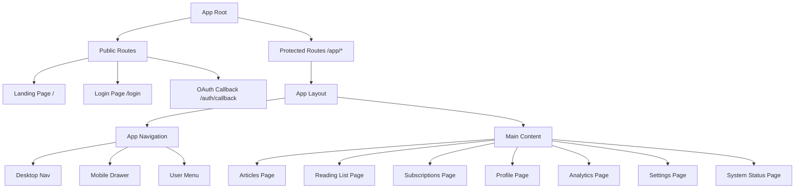

# Design Document: Frontend UI/UX Redesign V2

## Overview

This document provides the technical design for a comprehensive UI/UX redesign of the Tech News Agent web dashboard, focusing on simplified navigation, improved routing architecture, and enhanced user experience.

**Design Approach:** Design-First Workflow
**Tech Stack:** Next.js 14, React 18, TypeScript, Tailwind CSS, shadcn/ui
**Target Breakpoints:** 375px (mobile), 768px (tablet), 1024px (desktop), 1440px (wide)

---

## Part 1: High-Level Design

### 1.1 Routing Architecture

#### Current Problems

1. Homepage is the login page (`/`)
2. Forced redirect for authenticated users
3. Unclear path semantics (`/dashboard`)
4. Nested route confusion

#### New Routing Structure

**Public Routes (No Authentication Required)**

```
/                          → Landing Page (Homepage)
/login                     → Login Page
/auth/callback             → OAuth Callback (unchanged)
```

**Application Routes (Authentication Required)**

```
/app                       → App Home (redirects to /app/articles)
/app/articles              → Article Browse (main feature)
/app/articles/:id          → Article Detail
/app/reading-list          → Reading List
/app/subscriptions         → Subscription Management
/app/subscriptions/explore → Explore New Subscriptions
/app/profile               → User Profile
/app/analytics             → Analytics
/app/settings              → Settings
/app/settings/notifications → Notification Settings
/app/system-status         → System Status
```

#### Route Mapping

| Old Path           | New Path                        | Description            |
| ------------------ | ------------------------------- | ---------------------- |
| `/`                | `/`                             | Landing Page (new)     |
| N/A                | `/login`                        | Login Page (separated) |
| `/dashboard`       | `/app/articles`                 | Article Browse         |
| `/articles`        | `/app/articles`                 | Merged with dashboard  |
| `/recommendations` | `/app/articles?tab=recommended` | Integrated as tab      |
| `/reading-list`    | `/app/reading-list`             | Reading List           |
| `/subscriptions`   | `/app/subscriptions`            | Subscriptions          |
| `/analytics`       | `/app/analytics`                | Analytics              |
| `/settings`        | `/app/settings`                 | Settings               |
| `/system-status`   | `/app/system-status`            | System Status          |

### 1.2 Navigation Architecture

#### Simplified Navigation Structure

**Core Features (Main Navigation)**

- 📰 Articles (`/app/articles`)
- 📚 Reading List (`/app/reading-list`)
- ⚙️ Subscriptions (`/app/subscriptions`)

**Secondary Features (User Menu)**

- 📊 Analytics
- 🔔 Notification Settings
- ⚙️ Settings
- 🖥️ System Status
- 👤 Profile
- 🚪 Logout

**Removed from Main Navigation**

- Dashboard (merged with Articles)
- Recommendations (integrated as tab in Articles)

### 1.3 Page Architecture

#### Landing Page (`/`)

**Purpose:**

- Introduce product features
- Attract new users
- Provide login entry point
- Showcase product value

**Structure:**

```
┌─────────────────────────────────────────────┐
│  [Logo]              [Features] [About] [Login]  │  ← Top Nav
├─────────────────────────────────────────────┤
│         Tech News Agent                     │
│    Your Personalized Tech News Platform     │
│    [Get Started] [Learn More]               │  ← Hero Section
├─────────────────────────────────────────────┤
│  ✨ Key Features                             │
│  📰 Smart Subscribe  📚 Reading List  💡 AI  │  ← Features
├─────────────────────────────────────────────┤
│  🎯 Why Choose Tech News Agent?              │
│  • Aggregate multiple tech news sources     │
│  • AI-driven personalized recommendations   │  ← Benefits
│  • Technical depth indicator                │
├─────────────────────────────────────────────┤
│  Ready to start?                            │
│  [Login with Discord]                       │  ← CTA
└─────────────────────────────────────────────┘
```

#### Login Page (`/login`)

**Structure:**

```
┌─────────────────────────────────────────────┐
│  [Logo]                    [← Back to Home] │
├─────────────────────────────────────────────┤
│         Login to Tech News Agent            │
│    Quick login with your Discord account    │
│         [Login with Discord]                │
│    Don't have an account? Sign up instantly │
└─────────────────────────────────────────────┘
```

#### Articles Page (`/app/articles`)

**Structure:**

```
┌─────────────────────────────────────────────┐
│  Top Navigation Bar                         │
├─────────────────────────────────────────────┤
│  [All] [Recommended] [Subscribed] [Saved]   │  ← Tabs
├─────────────────────────────────────────────┤
│  [Category Filter]  [Sort: Latest▾]  [View] │  ← Filters
├─────────────────────────────────────────────┤
│  ┌──────┐  ┌──────┐  ┌──────┐             │
│  │Card 1│  │Card 2│  │Card 3│             │
│  └──────┘  └──────┘  └──────┘             │
│  [Load More...]                             │
└─────────────────────────────────────────────┘
```

**Tab Functionality:**

- **All**: All articles
- **Recommended**: AI-recommended articles (integrates old Recommendations page)
- **Subscribed**: Articles from subscribed feeds
- **Saved**: Quick access to reading list

### 1.4 Component Architecture



---

## Part 2: Low-Level Design

### 2.1 Route Protection Implementation

```typescript
// app/app/layout.tsx
'use client';

import { useEffect } from 'react';
import { useRouter, usePathname } from 'next/navigation';
import { useAuth } from '@/contexts/AuthContext';
import { AppNavigation } from '@/components/AppNavigation';
import { LoadingScreen } from '@/components/LoadingScreen';

export default function AppLayout({
  children,
}: {
  children: React.ReactNode;
}) {
  const { isAuthenticated, loading } = useAuth();
  const router = useRouter();
  const pathname = usePathname();

  useEffect(() => {
    if (!loading && !isAuthenticated) {
      // Redirect to login with return URL
      router.push(`/login?redirect=${encodeURIComponent(pathname)}`);
    }
  }, [isAuthenticated, loading, pathname, router]);

  // Show loading screen while checking auth
  if (loading) {
    return <LoadingScreen />;
  }

  // Don't render if not authenticated (will redirect)
  if (!isAuthenticated) {
    return null;
  }

  return (
    <div className="min-h-screen bg-background">
      <AppNavigation />
      <main id="main-content" className="container mx-auto px-4 py-6">
        {children}
      </main>
    </div>
  );
}
```

### 2.2 Landing Page Implementation

```typescript
// app/page.tsx
'use client';

import { useAuth } from '@/contexts/AuthContext';
import { LandingNav } from '@/components/landing/LandingNav';
import { HeroSection } from '@/components/landing/HeroSection';
import { FeaturesSection } from '@/components/landing/FeaturesSection';
import { BenefitsSection } from '@/components/landing/BenefitsSection';
import { CTASection } from '@/components/landing/CTASection';
import { Footer } from '@/components/landing/Footer';

export default function HomePage() {
  const { isAuthenticated } = useAuth();

  return (
    <div className="min-h-screen">
      <LandingNav isAuthenticated={isAuthenticated} />
      <HeroSection />
      <FeaturesSection />
      <BenefitsSection />
      <CTASection />
      <Footer />
    </div>
  );
}
```

### 2.3 Login Page Implementation

```typescript
// app/login/page.tsx
'use client';

import { useEffect } from 'react';
import { useRouter, useSearchParams } from 'next/navigation';
import { useAuth } from '@/contexts/AuthContext';
import { LoginForm } from '@/components/auth/LoginForm';
import { Logo } from '@/components/Logo';
import { Button } from '@/components/ui/button';
import { ArrowLeft } from 'lucide-react';
import Link from 'next/link';

export default function LoginPage() {
  const { isAuthenticated, loading } = useAuth();
  const router = useRouter();
  const searchParams = useSearchParams();
  const redirect = searchParams.get('redirect') || '/app/articles';

  useEffect(() => {
    if (!loading && isAuthenticated) {
      router.push(redirect);
    }
  }, [isAuthenticated, loading, redirect, router]);

  if (loading) {
    return (
      <div className="flex min-h-screen items-center justify-center">
        <div className="animate-spin rounded-full h-12 w-12 border-b-2 border-primary" />
      </div>
    );
  }

  if (isAuthenticated) {
    return null;
  }

  return (
    <div className="min-h-screen flex flex-col">
      <header className="border-b">
        <div className="container mx-auto px-4 py-4 flex items-center justify-between">
          <Logo size={32} showText />
          <Link href="/">
            <Button variant="ghost" size="sm">
              <ArrowLeft className="h-4 w-4 mr-2" />
              Back to Home
            </Button>
          </Link>
        </div>
      </header>

      <main className="flex-1 flex items-center justify-center p-4">
        <LoginForm />
      </main>
    </div>
  );
}
```

### 2.4 App Navigation Implementation

```typescript
// components/AppNavigation.tsx
'use client';

import { useState } from 'react';
import Link from 'next/link';
import { usePathname } from 'next/navigation';
import { Newspaper, BookMarked, Rss, Menu, X, Search } from 'lucide-react';
import { Logo } from '@/components/Logo';
import { UserMenu } from '@/components/UserMenu';
import { ThemeToggle } from '@/components/ThemeToggle';
import { Button } from '@/components/ui/button';
import { cn } from '@/lib/utils';

export function AppNavigation() {
  const pathname = usePathname();
  const [isDrawerOpen, setIsDrawerOpen] = useState(false);

  const navItems = [
    { href: '/app/articles', label: 'Articles', icon: Newspaper },
    { href: '/app/reading-list', label: 'Reading List', icon: BookMarked },
    { href: '/app/subscriptions', label: 'Subscriptions', icon: Rss },
  ];

  return (
    <header className="sticky top-0 z-50 w-full border-b bg-background/95 backdrop-blur">
      <nav className="container mx-auto px-4">
        <div className="flex h-16 items-center justify-between">
          {/* Left: Logo + Nav Items */}
          <div className="flex items-center gap-6">
            <Link href="/app/articles" className="flex-shrink-0">
              <Logo size={28} showText textClassName="hidden sm:inline" />
            </Link>

            {/* Desktop Navigation */}
            <div className="hidden md:flex gap-2">
              {navItems.map((item) => {
                const Icon = item.icon;
                const isActive = pathname === item.href;
                return (
                  <Link
                    key={item.href}
                    href={item.href}
                    className={cn(
                      'flex items-center gap-2 px-3 py-2 rounded-md transition-colors',
                      'hover:bg-accent hover:text-accent-foreground',
                      isActive && 'bg-primary/10 text-primary font-medium'
                    )}
                  >
                    <Icon className="h-4 w-4" />
                    <span className="text-sm">{item.label}</span>
                  </Link>
                );
              })}
            </div>
          </div>

          {/* Right: Search + Theme + User Menu + Mobile Menu */}
          <div className="flex items-center gap-2">
            <Button variant="ghost" size="icon" className="hidden md:flex">
              <Search className="h-5 w-5" />
            </Button>

            <ThemeToggle />

            <UserMenu />

            {/* Mobile Menu Button */}
            <Button
              variant="ghost"
              size="icon"
              className="md:hidden"
              onClick={() => setIsDrawerOpen(!isDrawerOpen)}
            >
              {isDrawerOpen ? <X className="h-5 w-5" /> : <Menu className="h-5 w-5" />}
            </Button>
          </div>
        </div>
      </nav>

      {/* Mobile Drawer */}
      {isDrawerOpen && (
        <div className="fixed inset-0 z-50 md:hidden">
          <div
            className="absolute inset-0 bg-black/50"
            onClick={() => setIsDrawerOpen(false)}
          />
          <nav className="absolute left-0 top-0 bottom-0 w-64 bg-card border-r p-4">
            {/* Mobile nav items */}
            <div className="space-y-1">
              {navItems.map((item) => {
                const Icon = item.icon;
                const isActive = pathname === item.href;
                return (
                  <Link
                    key={item.href}
                    href={item.href}
                    className={cn(
                      'flex items-center gap-3 px-4 py-3 rounded-md',
                      isActive && 'bg-primary text-primary-foreground'
                    )}
                    onClick={() => setIsDrawerOpen(false)}
                  >
                    <Icon className="h-5 w-5" />
                    <span>{item.label}</span>
                  </Link>
                );
              })}
            </div>
          </nav>
        </div>
      )}
    </header>
  );
}
```

### 2.5 User Menu Implementation

```typescript
// components/UserMenu.tsx
'use client';

import {
  DropdownMenu,
  DropdownMenuContent,
  DropdownMenuItem,
  DropdownMenuLabel,
  DropdownMenuSeparator,
  DropdownMenuTrigger,
} from '@/components/ui/dropdown-menu';
import { Avatar, AvatarFallback, AvatarImage } from '@/components/ui/avatar';
import { useUser } from '@/contexts/UserContext';
import { useAuth } from '@/contexts/AuthContext';
import { BarChart3, Settings, Bell, Monitor, LogOut } from 'lucide-react';
import Link from 'next/link';

export function UserMenu() {
  const { user } = useUser();
  const { logout } = useAuth();

  if (!user) return null;

  return (
    <DropdownMenu>
      <DropdownMenuTrigger className="focus:outline-none">
        <Avatar className="h-8 w-8 cursor-pointer">
          {user.avatar && <AvatarImage src={user.avatar} alt={user.username} />}
          <AvatarFallback>{user.username?.[0]?.toUpperCase()}</AvatarFallback>
        </Avatar>
      </DropdownMenuTrigger>

      <DropdownMenuContent align="end" className="w-56">
        <DropdownMenuLabel>
          <div className="flex flex-col space-y-1">
            <p className="text-sm font-medium">{user.username}</p>
            <p className="text-xs text-muted-foreground">{user.email}</p>
          </div>
        </DropdownMenuLabel>

        <DropdownMenuSeparator />

        <DropdownMenuItem asChild>
          <Link href="/app/analytics" className="cursor-pointer">
            <BarChart3 className="mr-2 h-4 w-4" />
            Analytics
          </Link>
        </DropdownMenuItem>

        <DropdownMenuItem asChild>
          <Link href="/app/settings" className="cursor-pointer">
            <Settings className="mr-2 h-4 w-4" />
            Settings
          </Link>
        </DropdownMenuItem>

        <DropdownMenuItem asChild>
          <Link href="/app/settings/notifications" className="cursor-pointer">
            <Bell className="mr-2 h-4 w-4" />
            Notifications
          </Link>
        </DropdownMenuItem>

        <DropdownMenuItem asChild>
          <Link href="/app/system-status" className="cursor-pointer">
            <Monitor className="mr-2 h-4 w-4" />
            System Status
          </Link>
        </DropdownMenuItem>

        <DropdownMenuSeparator />

        <DropdownMenuItem onClick={logout} className="cursor-pointer text-destructive">
          <LogOut className="mr-2 h-4 w-4" />
          Logout
        </DropdownMenuItem>
      </DropdownMenuContent>
    </DropdownMenu>
  );
}
```

### 2.6 Articles Page with Tabs

```typescript
// app/app/articles/page.tsx
'use client';

import { useState } from 'react';
import { useSearchParams, useRouter } from 'next/navigation';
import { Tabs, TabsList, TabsTrigger, TabsContent } from '@/components/ui/tabs';
import { ArticleGrid } from '@/components/articles/ArticleGrid';
import { CategoryFilter } from '@/components/articles/CategoryFilter';
import { SortSelect } from '@/components/articles/SortSelect';
import { ViewModeSelect } from '@/components/articles/ViewModeSelect';

export default function ArticlesPage() {
  const searchParams = useSearchParams();
  const router = useRouter();
  const tab = searchParams.get('tab') || 'all';

  const handleTabChange = (value: string) => {
    const params = new URLSearchParams(searchParams);
    params.set('tab', value);
    router.push(`/app/articles?${params.toString()}`);
  };

  return (
    <div className="space-y-6">
      <div>
        <h1 className="text-3xl font-bold">Articles</h1>
        <p className="text-muted-foreground">
          Discover and read tech articles from your subscriptions
        </p>
      </div>

      <Tabs value={tab} onValueChange={handleTabChange}>
        <TabsList>
          <TabsTrigger value="all">All</TabsTrigger>
          <TabsTrigger value="recommended">Recommended</TabsTrigger>
          <TabsTrigger value="subscribed">Subscribed</TabsTrigger>
          <TabsTrigger value="saved">Saved</TabsTrigger>
        </TabsList>

        <div className="flex flex-wrap gap-4 mt-4">
          <CategoryFilter />
          <SortSelect />
          <ViewModeSelect />
        </div>

        <TabsContent value="all" className="mt-6">
          <ArticleGrid filter="all" />
        </TabsContent>

        <TabsContent value="recommended" className="mt-6">
          <ArticleGrid filter="recommended" />
        </TabsContent>

        <TabsContent value="subscribed" className="mt-6">
          <ArticleGrid filter="subscribed" />
        </TabsContent>

        <TabsContent value="saved" className="mt-6">
          <ArticleGrid filter="saved" />
        </TabsContent>
      </Tabs>
    </div>
  );
}
```

---

## Part 3: Design Decisions & Rationale

### 3.1 Key Design Decisions

**1. Separate Landing Page and Login Page**

- **Rationale**: Allows marketing content and product showcase without forcing login
- **Benefit**: Better user onboarding, SEO optimization, clearer user journey
- **Implementation**: `/` for landing, `/login` for authentication

**2. `/app/*` Prefix for Application Routes**

- **Rationale**: Clear separation between public and authenticated areas
- **Benefit**: Easier route protection, predictable URL structure, better organization
- **Implementation**: All authenticated features under `/app/` namespace

**3. Merge Dashboard and Articles**

- **Rationale**: Functionality overlap, reduces navigation complexity
- **Benefit**: Simpler mental model, fewer clicks, unified article browsing experience
- **Implementation**: Single `/app/articles` page with tabs

**4. Integrate Recommendations as Tab**

- **Rationale**: Recommendations are just a filtered view of articles
- **Benefit**: Reduces main navigation items, maintains feature visibility
- **Implementation**: `/app/articles?tab=recommended`

**5. Simplified Main Navigation (3 items)**

- **Rationale**: Focus on core user tasks, reduce cognitive load
- **Benefit**: Clearer hierarchy, easier to learn, better mobile experience
- **Implementation**: Articles, Reading List, Subscriptions in main nav; others in user menu

### 3.2 User Flow Improvements

**Before:**

```
/ (login) → /dashboard → /articles → /recommendations → ...
```

**After:**

```
/ (landing) → /login → /app/articles (with tabs) → ...
```

**Benefits:**

- Clearer entry point
- No forced redirects
- Logical progression
- Fewer navigation levels

### 3.3 Mobile Optimization

**Improvements:**

- Hamburger menu with 3 core items (not 8)
- Touch-friendly targets (44x44px minimum)
- Simplified drawer navigation
- Gesture support for article cards

---

## Part 4: Implementation Roadmap

### Phase 1: Routing & Navigation (Week 1-2)

1. Create new route structure (`/`, `/login`, `/app/*`)
2. Implement route protection
3. Build simplified navigation component
4. Create user menu component

### Phase 2: Landing & Login Pages (Week 2-3)

1. Design and implement landing page
2. Create login page with redirect logic
3. Update OAuth callback handling
4. Test authentication flows

### Phase 3: Articles Page Integration (Week 3-4)

1. Merge dashboard and articles functionality
2. Implement tab system
3. Integrate recommendations as tab
4. Add filters and sorting

### Phase 4: Other Pages (Week 4-5)

1. Update reading list page
2. Update subscriptions page
3. Update settings pages
4. Update analytics and system status

### Phase 5: Testing & Polish (Week 5-6)

1. Cross-browser testing
2. Mobile responsiveness testing
3. Accessibility audit
4. Performance optimization
5. User acceptance testing

---

## Conclusion

This design provides a cleaner, more intuitive user experience through:

- Simplified navigation (8 → 3 main items)
- Clear routing structure (`/app/*` for authenticated areas)
- Integrated functionality (dashboard + articles + recommendations)
- Dedicated landing page for marketing and onboarding
- Mobile-first responsive design

The implementation follows Next.js 14 best practices and maintains backward compatibility where possible while significantly improving the overall user experience.
