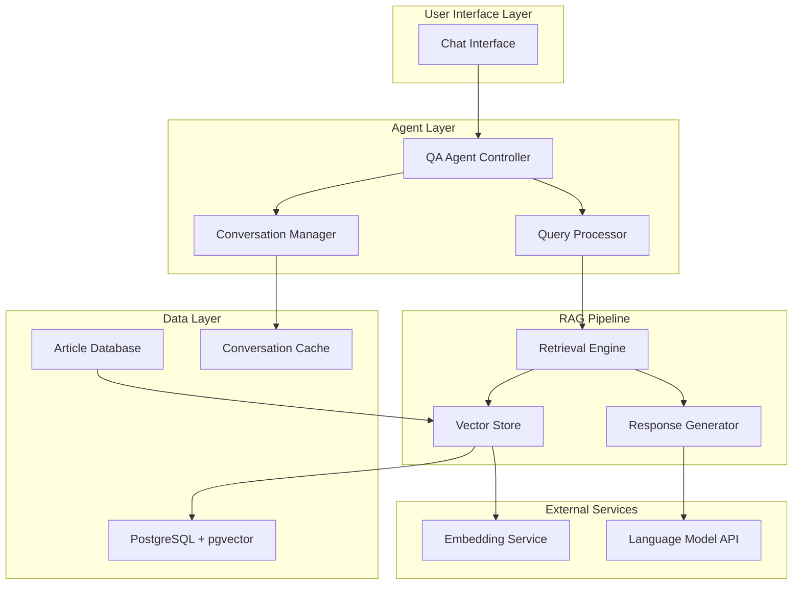

# Design Document: Intelligent Q&A Agent

## Overview

The Intelligent Q&A Agent transforms the existing article push system into an interactive intelligent assistant that enables users to explore their subscribed article content through natural language queries. The system implements a Retrieval-Augmented Generation (RAG) architecture using pgvector for semantic search and LangChain as the agent framework.

### Key Capabilities

- **Natural Language Processing**: Supports Chinese and English queries with intent parsing and keyword extraction
- **Semantic Search**: Uses pgvector for high-performance vector similarity search across article embeddings
- **Structured Response Generation**: Provides comprehensive answers with article summaries, links, and personalized insights
- **Multi-turn Conversations**: Maintains conversation context for follow-up questions and deeper exploration
- **Personalization**: Adapts responses based on user reading history and preferences
- **High Performance**: Sub-500ms search with 3-second response generation supporting 50+ concurrent users

### Architecture Principles

1. **Separation of Concerns**: Clear boundaries between query processing, retrieval, generation, and conversation management
2. **Scalability**: Designed to handle 100,000+ articles with efficient vector operations
3. **Extensibility**: Modular design allows for easy integration of new language models and search strategies
4. **Reliability**: Comprehensive error handling with graceful fallback mechanisms

## Architecture

The system follows a layered RAG architecture with clear separation between the retrieval and generation components:



### Core Components

1. **QA Agent Controller**: Orchestrates the entire query-response cycle
2. **Query Processor**: Handles natural language understanding and query optimization
3. **Retrieval Engine**: Manages semantic search and result ranking
4. **Response Generator**: Creates structured responses using retrieved context
5. **Conversation Manager**: Maintains multi-turn conversation state
6. **Vector Store**: Manages article embeddings and similarity search

## Components and Interfaces

### QA Agent Controller

**Purpose**: Central orchestrator that coordinates all system components to process user queries and generate responses.

**Key Responsibilities**:

- Route incoming queries to appropriate processors
- Coordinate retrieval and generation phases
- Handle error scenarios and fallback mechanisms
- Manage response formatting and delivery

**Interface**:

```python
class QAAgentController:
    async def process_query(
        self,
        user_id: str,
        query: str,
        conversation_id: Optional[str] = None
    ) -> StructuredResponse

    async def continue_conversation(
        self,
        user_id: str,
        query: str,
        conversation_id: str
    ) -> StructuredResponse
```

### Query Processor

**Purpose**: Processes natural language queries to extract intent, keywords, and search parameters.

**Key Responsibilities**:

- Parse Chinese and English natural language queries
- Extract search intent and key concepts
- Handle query clarification and expansion
- Optimize queries for semantic search

**Interface**:

```python
class QueryProcessor:
    async def parse_query(self, query: str, language: str) -> ParsedQuery
    async def extract_keywords(self, query: str) -> List[str]
    async def expand_query(self, query: str, context: ConversationContext) -> str
    async def validate_query(self, query: str) -> QueryValidationResult
```

### Retrieval Engine

**Purpose**: Performs semantic search across the article vector store and ranks results by relevance.

**Key Responsibilities**:

- Execute vector similarity search using pgvector
- Implement hybrid search combining semantic and keyword matching
- Rank and filter results based on relevance and user preferences
- Handle search result expansion when insufficient matches found

**Interface**:

```python
class RetrievalEngine:
    async def semantic_search(
        self,
        query_vector: List[float],
        user_id: str,
        limit: int = 10
    ) -> List[ArticleMatch]

    async def hybrid_search(
        self,
        query: str,
        query_vector: List[float],
        user_id: str
    ) -> List[ArticleMatch]

    async def expand_search(
        self,
        original_results: List[ArticleMatch],
        user_id: str
    ) -> List[ArticleMatch]
```

### Response Generator

**Purpose**: Creates structured responses using retrieved articles and conversation context.

**Key Responsibilities**:

- Generate article summaries and insights
- Create personalized recommendations
- Format responses with proper structure and links
- Handle response generation failures gracefully

**Interface**:

```python
class ResponseGenerator:
    async def generate_response(
        self,
        query: str,
        articles: List[ArticleMatch],
        context: ConversationContext,
        user_profile: UserProfile
    ) -> StructuredResponse

    async def generate_summary(self, article: Article) -> str
    async def generate_insights(
        self,
        articles: List[Article],
        user_profile: UserProfile
    ) -> List[str]
```

### Conversation Manager

**Purpose**: Maintains conversation state and context across multiple turns.

**Key Responsibilities**:

- Store and retrieve conversation history
- Maintain context for follow-up questions
- Detect topic changes and context resets
- Implement conversation data retention policies

**Interface**:

```python
class ConversationManager:
    async def create_conversation(self, user_id: str) -> str
    async def add_turn(
        self,
        conversation_id: str,
        query: str,
        response: StructuredResponse
    ) -> None
    async def get_context(self, conversation_id: str) -> ConversationContext
    async def should_reset_context(
        self,
        conversation_id: str,
        new_query: str
    ) -> bool
```

### Vector Store

**Purpose**: Manages article embeddings and provides high-performance vector similarity search.

**Key Responsibilities**:

- Store and index article vector embeddings
- Perform efficient similarity search using pgvector
- Handle incremental updates for new articles
- Manage vector quality and optimization

**Interface**:

```python
class VectorStore:
    async def store_embedding(
        self,
        article_id: str,
        embedding: List[float],
        metadata: Dict[str, Any]
    ) -> None

    async def search_similar(
        self,
        query_vector: List[float],
        user_id: str,
        limit: int,
        threshold: float = 0.7
    ) -> List[VectorMatch]

    async def update_embedding(self, article_id: str, embedding: List[float]) -> None
    async def delete_embedding(self, article_id: str) -> None
```

## Data Models

### Core Data Structures

```python
@dataclass
class ParsedQuery:
    original_query: str
    language: str
    intent: QueryIntent
    keywords: List[str]
    filters: Dict[str, Any]
    confidence: float

@dataclass
class ArticleMatch:
    article_id: str
    title: str
    content_preview: str
    similarity_score: float
    metadata: Dict[str, Any]
    url: str

@dataclass
class StructuredResponse:
    query: str
    articles: List[ArticleSummary]
    insights: List[str]
    recommendations: List[str]
    conversation_id: str
    response_time: float

@dataclass
class ArticleSummary:
    article_id: str
    title: str
    summary: str
    url: str
    relevance_score: float
    reading_time: int

@dataclass
class ConversationContext:
    conversation_id: str
    user_id: str
    turns: List[ConversationTurn]
    current_topic: Optional[str]
    created_at: datetime
    last_updated: datetime

@dataclass
class ConversationTurn:
    query: str
    response: StructuredResponse
    timestamp: datetime
    turn_number: int

@dataclass
class UserProfile:
    user_id: str
    reading_history: List[str]  # article_ids
    preferred_topics: List[str]
    language_preference: str
    interaction_patterns: Dict[str, Any]
```

### Database Schema

**Articles Table** (existing):

```sql
CREATE TABLE articles (
    id UUID PRIMARY KEY,
    title TEXT NOT NULL,
    content TEXT NOT NULL,
    url TEXT UNIQUE NOT NULL,
    published_at TIMESTAMP,
    metadata JSONB,
    created_at TIMESTAMP DEFAULT NOW()
);
```

**Article Embeddings Table**:

```sql
CREATE TABLE article_embeddings (
    article_id UUID REFERENCES articles(id) ON DELETE CASCADE,
    embedding vector(1536),  -- OpenAI embedding dimension
    chunk_index INTEGER DEFAULT 0,
    metadata JSONB,
    created_at TIMESTAMP DEFAULT NOW(),
    PRIMARY KEY (article_id, chunk_index)
);

-- Create vector similarity index
CREATE INDEX ON article_embeddings USING ivfflat (embedding vector_cosine_ops);
```

**Conversations Table**:

```sql
CREATE TABLE conversations (
    id UUID PRIMARY KEY DEFAULT gen_random_uuid(),
    user_id UUID NOT NULL,
    context JSONB NOT NULL,
    created_at TIMESTAMP DEFAULT NOW(),
    last_updated TIMESTAMP DEFAULT NOW(),
    expires_at TIMESTAMP DEFAULT NOW() + INTERVAL '7 days'
);

CREATE INDEX idx_conversations_user_id ON conversations(user_id);
CREATE INDEX idx_conversations_expires_at ON conversations(expires_at);
```

**User Profiles Table**:

```sql
CREATE TABLE user_profiles (
    user_id UUID PRIMARY KEY,
    reading_history JSONB DEFAULT '[]',
    preferred_topics JSONB DEFAULT '[]',
    language_preference VARCHAR(10) DEFAULT 'zh',
    interaction_patterns JSONB DEFAULT '{}',
    updated_at TIMESTAMP DEFAULT NOW()
);
```

**Query Logs Table**:

```sql
CREATE TABLE query_logs (
    id UUID PRIMARY KEY DEFAULT gen_random_uuid(),
    user_id UUID NOT NULL,
    conversation_id UUID,
    query_text TEXT NOT NULL,
    query_vector vector(1536),
    response_data JSONB,
    response_time_ms INTEGER,
    created_at TIMESTAMP DEFAULT NOW()
);

-- Encrypted storage for sensitive data
CREATE INDEX idx_query_logs_user_id ON query_logs(user_id);
CREATE INDEX idx_query_logs_created_at ON query_logs(created_at);
```

## Correctness Properties

_A property is a characteristic or behavior that should hold true across all valid executions of a system-essentially, a formal statement about what the system should do. Properties serve as the bridge between human-readable specifications and machine-verifiable correctness guarantees._

### Property 1: Query Processing Completeness

_For any_ natural language query in Chinese or English, the query processor SHALL produce a valid ParsedQuery object containing non-empty keywords, a valid intent classification, and appropriate language detection.

**Validates: Requirements 1.1, 1.2**

### Property 2: Query Validation and Error Handling

_For any_ ambiguous, incomplete, or invalid query, the system SHALL provide appropriate clarification requests, error messages, or query suggestions rather than producing poor or incorrect results.

**Validates: Requirements 1.3, 1.5**

### Property 3: Complex Query Parsing

_For any_ complex query containing time ranges, topic classifications, or technical depth conditions, all specified filters SHALL be correctly extracted and applied to the search process.

**Validates: Requirements 1.4**

### Property 4: Vector Similarity Consistency

_For any_ pair of query and article vectors, similarity calculations SHALL be consistent, symmetric (when applicable), and produce scores within the valid range [0,1], with results always sorted in descending order of relevance.

**Validates: Requirements 2.2, 2.3**

### Property 5: Search Result Completeness

_For any_ user query, the search system SHALL return results from the user's accessible article database, support both semantic and keyword matching in hybrid search, and expand search scope when insufficient results are found.

**Validates: Requirements 2.1, 2.4, 2.5**

### Property 6: Structured Response Format

_For any_ query and retrieved articles, the generated response SHALL contain exactly the required elements (article summaries of 2-3 sentences, original links, personalized insights, and related reading suggestions) with a maximum of 5 articles sorted by relevance.

**Validates: Requirements 3.1, 3.2, 3.3, 3.5**

### Property 7: Response Personalization

_For any_ user profile and query, generated insights and article rankings SHALL reflect the user's reading history and preferences, producing different personalized responses for users with different profiles.

**Validates: Requirements 3.4, 8.2, 8.4**

### Property 8: Conversation Context Preservation

_For any_ multi-turn conversation, the system SHALL maintain exactly the most recent 10 turns in context, correctly resolve contextual references in follow-up queries, and appropriately reset context when topics change significantly.

**Validates: Requirements 4.1, 4.2, 4.3, 4.4, 4.5**

### Property 9: Vector Store Synchronization

_For any_ article addition, update, or deletion in the article database, the corresponding vector embeddings SHALL be automatically synchronized, with proper chunking strategy applied and incremental processing to avoid redundant work.

**Validates: Requirements 5.3, 5.4, 7.2, 7.5**

### Property 10: Embedding Quality and Structure

_For any_ article with title, content, and metadata, the vector store SHALL generate embeddings with correct dimensions, reasonable vector properties, and separate vectorization for different components (title, content, metadata).

**Validates: Requirements 7.1, 7.4**

### Property 11: Content Preprocessing Consistency

_For any_ article containing HTML tags, formatting, or special characters, the preprocessing system SHALL produce clean, properly formatted text suitable for vectorization while preserving semantic meaning.

**Validates: Requirements 7.3**

### Property 12: User Profile Learning

_For any_ user's reading history and query patterns, the system SHALL build accurate user profiles, provide increasingly relevant query suggestions over time, and adapt recommendations based on satisfaction feedback.

**Validates: Requirements 8.1, 8.3, 8.5**

### Property 13: Error Recovery and Fallback

_For any_ system failure (vector store unavailable, generation failure, timeout), the system SHALL gracefully fall back to alternative methods (keyword search, search results list, partial results) while providing meaningful error messages and implementing appropriate retry mechanisms for transient errors.

**Validates: Requirements 9.1, 9.2, 9.3, 9.4, 9.5**

### Property 14: Data Security and Isolation

_For any_ user query or conversation, the system SHALL encrypt stored data, enforce data retention policies, ensure complete data isolation between users, support complete data deletion on request, and never expose private information from other users.

**Validates: Requirements 10.1, 10.2, 10.3, 10.4, 10.5**

### Property 15: Response Grounding

_For any_ generated response, the content SHALL be grounded in and consistent with the retrieved article content, ensuring that insights and summaries accurately reflect the source material without hallucination.

**Validates: Requirements 5.5**

## Error Handling

The system implements comprehensive error handling across all components with graceful degradation and user-friendly messaging:

### Error Categories and Responses

**Query Processing Errors**:

- **Malformed queries**: Return clarification requests with suggested query formats
- **Language detection failures**: Default to user's preferred language setting
- **Intent parsing errors**: Request query refinement with examples

**Search and Retrieval Errors**:

- **Vector store unavailable**: Automatically fall back to keyword-based search
- **Embedding service failures**: Use cached embeddings or request retry
- **No search results**: Expand search scope or suggest related topics
- **Search timeout**: Return partial results with timeout notification

**Response Generation Errors**:

- **LLM API failures**: Fall back to template-based responses using search results
- **Content generation timeout**: Provide search results list with basic summaries
- **Personalization failures**: Generate generic responses without personalization

**Conversation Management Errors**:

- **Context retrieval failures**: Start fresh conversation with notification
- **Context corruption**: Reset conversation state and inform user
- **Storage failures**: Continue with in-memory context for current session

**Data and Security Errors**:

- **Encryption failures**: Log error and refuse to store sensitive data
- **Access control violations**: Return empty results and log security event
- **Data retention failures**: Alert administrators and continue operation

### Error Logging and Monitoring

All errors are logged with appropriate severity levels and include:

- User ID (hashed for privacy)
- Error type and component
- Timestamp and request context
- Recovery action taken
- Performance impact metrics

### Retry Mechanisms

**Exponential Backoff**: For transient failures (network, API rate limits)

- Initial delay: 100ms
- Maximum delay: 5 seconds
- Maximum retries: 3 attempts

**Circuit Breaker**: For external service failures

- Failure threshold: 5 consecutive failures
- Recovery timeout: 30 seconds
- Half-open state testing: Single request

## Testing Strategy

The testing strategy employs a dual approach combining property-based testing for universal correctness guarantees with unit testing for specific scenarios and edge cases.

### Property-Based Testing

**Framework**: Hypothesis (Python) for comprehensive property testing
**Configuration**: Minimum 100 iterations per property test
**Coverage**: All 15 correctness properties with dedicated test implementations

**Property Test Structure**:

```python
@given(strategies.natural_language_queries())
def test_query_processing_completeness(query):
    """Feature: intelligent-qa-agent, Property 1: Query processing completeness"""
    result = query_processor.parse_query(query.text, query.language)

    assert isinstance(result, ParsedQuery)
    assert len(result.keywords) > 0
    assert result.intent in valid_intents
    assert result.language in ['zh', 'en']
    assert 0.0 <= result.confidence <= 1.0
```

**Test Data Generation**:

- **Natural language queries**: Chinese and English text with varying complexity
- **Article content**: Diverse topics, lengths, and formats
- **User profiles**: Different reading histories and preferences
- **Vector embeddings**: Valid high-dimensional vectors with realistic properties
- **Conversation contexts**: Multi-turn dialogues with topic variations

### Unit Testing

**Framework**: pytest with comprehensive fixtures and mocks
**Focus Areas**:

- **Integration points**: Database connections, external API calls
- **Edge cases**: Empty inputs, malformed data, boundary conditions
- **Error scenarios**: Network failures, timeout conditions, invalid responses
- **Performance**: Response time validation, concurrent user handling

**Example Unit Tests**:

```python
def test_empty_search_results_handling():
    """Test system behavior when no articles match query"""
    # Specific scenario testing

def test_conversation_context_limit():
    """Test exactly 10 turns are maintained in context"""
    # Boundary condition testing

def test_multilingual_query_processing():
    """Test specific Chinese and English query examples"""
    # Language-specific scenario testing
```

### Integration Testing

**Database Integration**:

- pgvector operations and performance
- Transaction handling and data consistency
- Connection pooling and failover

**External Service Integration**:

- LLM API integration and error handling
- Embedding service reliability
- Rate limiting and quota management

**End-to-End Testing**:

- Complete user journey from query to response
- Multi-turn conversation flows
- Personalization accuracy over time

### Performance Testing

**Load Testing**:

- 50+ concurrent users with realistic query patterns
- Database performance under high vector search load
- Memory usage and garbage collection impact

**Response Time Validation**:

- Search operations: < 500ms (95th percentile)
- Complete response generation: < 3 seconds (95th percentile)
- Conversation context retrieval: < 100ms (95th percentile)

**Scalability Testing**:

- 100,000+ article vector storage and search
- Conversation context storage growth patterns
- Query log retention and cleanup performance

### Security Testing

**Data Protection**:

- Encryption at rest and in transit validation
- User data isolation verification
- Access control enforcement testing

**Privacy Compliance**:

- Data retention policy enforcement
- Complete data deletion verification
- Query log anonymization testing

### Monitoring and Observability

**Key Metrics**:

- Query processing success rate and latency
- Search result relevance scores
- User satisfaction feedback trends
- Error rates by component and type
- Resource utilization and performance trends

**Alerting Thresholds**:

- Response time > 5 seconds (95th percentile)
- Error rate > 5% over 5-minute window
- Vector store unavailability > 30 seconds
- User data access violations (any occurrence)
