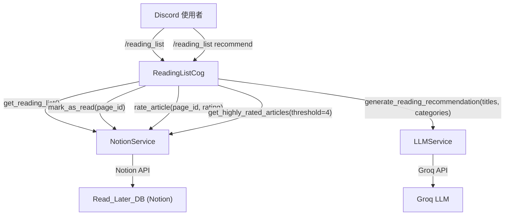
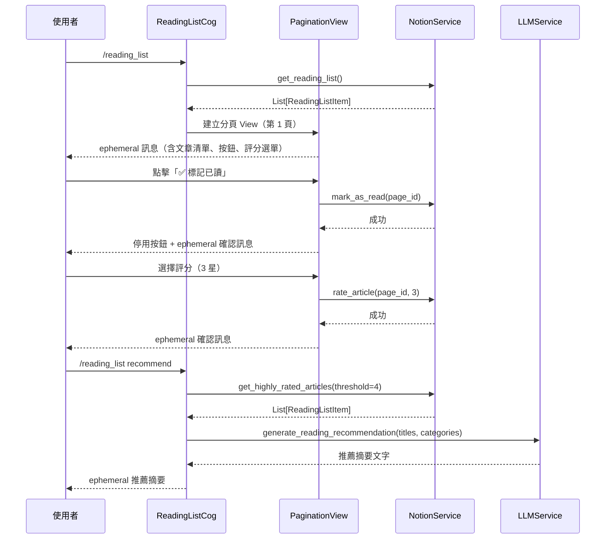

# 設計文件：互動式閱讀清單（Interactive Reading List）

## 概覽

本功能在現有 Tech News Agent Discord Bot 上新增 `/reading_list` 斜線指令，讓使用者能直接在 Discord 中管理 Notion 待讀清單，無需切換至 Notion 介面。

主要功能包含：

- 分頁查看 Unread 文章（每頁 5 筆）
- 每篇文章提供「✅ 標記已讀」按鈕
- 每篇文章提供 1–5 星評分下拉選單
- `/reading_list recommend` 子指令，根據 4 星以上文章用 LLM 生成推薦摘要

本設計遵循現有程式碼架構，沿用 `discord.ui.View`、`NotionService`、`LLMService` 等既有元件，並在 `app/bot/cogs/` 新增一個獨立的 cog 模組。

---

## 架構

### 整體架構圖



### 元件互動流程



---

## 元件與介面

### 1. `ReadingListCog`（新增）

**路徑：** `app/bot/cogs/reading_list.py`

負責處理 `/reading_list` 斜線指令及其子指令。

```python
class ReadingListCog(commands.Cog):
    @app_commands.command(name="reading_list", description="查看並管理 Notion 待讀清單")
    async def reading_list(self, interaction: discord.Interaction): ...

    @reading_list.command(name="recommend", description="根據高評分文章生成推薦摘要")
    async def recommend(self, interaction: discord.Interaction): ...
```

### 2. `PaginationView`（新增）

**路徑：** `app/bot/cogs/reading_list.py`（與 Cog 同檔）

繼承 `discord.ui.View`，管理分頁狀態與每頁的互動元件。

每頁最多包含：

- 5 個 `MarkAsReadButton`
- 5 個 `RatingSelect`
- 1 個「上一頁」按鈕（`PrevPageButton`）
- 1 個「下一頁」按鈕（`NextPageButton`）

Discord 元件限制：每個 View 最多 25 個元件（5 列 × 5 個）。本設計每頁使用：

- 列 0：`PrevPageButton` + `NextPageButton`（2 個按鈕）
- 列 1–5：每列 1 個 `MarkAsReadButton` + 1 個 `RatingSelect`（共 10 個元件）
- 合計：12 個元件，遠低於 25 的上限。

```python
class PaginationView(discord.ui.View):
    def __init__(self, items: List[ReadingListItem], page: int = 0): ...
    def build_page_content(self) -> str: ...
    async def update_message(self, interaction: discord.Interaction): ...
```

### 3. `MarkAsReadButton`（新增）

繼承 `discord.ui.Button`，點擊後呼叫 `NotionService.mark_as_read()`。

```python
class MarkAsReadButton(discord.ui.Button):
    def __init__(self, item: ReadingListItem): ...
    async def callback(self, interaction: discord.Interaction): ...
```

### 4. `RatingSelect`（新增）

繼承 `discord.ui.Select`，提供 1–5 星選項，選擇後呼叫 `NotionService.rate_article()`。

```python
class RatingSelect(discord.ui.Select):
    def __init__(self, item: ReadingListItem): ...
    async def callback(self, interaction: discord.Interaction): ...
```

### 5. `NotionService`（擴充）

新增以下四個方法：

| 方法                        | 簽名                                                                               | 說明                  |
| --------------------------- | ---------------------------------------------------------------------------------- | --------------------- |
| `get_reading_list`          | `async def get_reading_list() -> List[ReadingListItem]`                            | 查詢所有 Unread 文章  |
| `mark_as_read`              | `async def mark_as_read(page_id: str) -> None`                                     | 將文章狀態更新為 Read |
| `rate_article`              | `async def rate_article(page_id: str, rating: int) -> None`                        | 更新文章評分（1–5）   |
| `get_highly_rated_articles` | `async def get_highly_rated_articles(threshold: int = 4) -> List[ReadingListItem]` | 查詢高評分文章        |

### 6. `LLMService`（擴充）

新增一個方法：

```python
async def generate_reading_recommendation(
    self,
    titles: List[str],
    categories: List[str]
) -> str:
    """根據高評分文章的標題與分類，生成不超過 500 字的繁體中文推薦摘要。"""
```

---

## 資料模型

### `ReadingListItem`（新增 Schema）

**路徑：** `app/schemas/article.py`（新增至現有檔案）

```python
class ReadingListItem(BaseModel):
    page_id: str                          # Notion Page ID
    title: str                            # 文章標題
    url: HttpUrl                          # 文章 URL
    source_category: str                  # 分類（來自 Source_Category 欄位）
    added_at: Optional[datetime] = None   # 新增時間（來自 Added_At 欄位）
    rating: Optional[int] = None          # 評分（1–5，未評分為 None）
```

### Notion Read_Later_DB 欄位

| 欄位名稱          | Notion 類型 | 說明                     |
| ----------------- | ----------- | ------------------------ |
| `Title`           | Title       | 文章標題                 |
| `URL`             | URL         | 文章連結                 |
| `Status`          | Status      | `Unread` / `Read`        |
| `Source_Category` | Select      | 文章分類                 |
| `Added_At`        | Date        | 新增時間                 |
| `Rating`          | Number      | 評分 1–5（**新增欄位**） |

> **注意：** `Rating` 欄位需在 Notion 中手動新增為 Number 類型。未評分的文章此欄位為空值（null），系統不預設任何數值。

### 分頁狀態

`PaginationView` 在記憶體中維護以下狀態：

```python
items: List[ReadingListItem]  # 完整文章清單
page: int                     # 當前頁碼（0-indexed）
page_size: int = 5            # 每頁筆數（固定為 5）
```

---

## 正確性屬性（Correctness Properties）

_屬性（Property）是指在系統所有有效執行情境下都應成立的特性或行為，本質上是對系統應做什麼的形式化陳述。屬性作為人類可讀規格與機器可驗證正確性保證之間的橋樑。_

### 屬性 1：get_reading_list 只回傳 Unread 文章

_對於任意_ 包含 Unread 與 Read 文章的 Read_Later_DB 狀態，呼叫 `get_reading_list()` 所回傳的每一筆 `ReadingListItem`，其 Status 都應為 `Unread`，不應包含任何 Read 文章。

**驗證需求：1.1、5.3**

---

### 屬性 2：分頁大小不超過 5 筆

_對於任意_ 長度的文章清單，`PaginationView` 每一頁所顯示的文章數量都不應超過 5 筆。

**驗證需求：1.2**

---

### 屬性 3：每篇文章都有標記已讀按鈕

_對於任意_ 非空的文章清單，`PaginationView` 當前頁面中的每一筆 `ReadingListItem` 都應有對應的 `MarkAsReadButton`，且按鈕的 `page_id` 與文章的 `page_id` 相符。

**驗證需求：2.1**

---

### 屬性 4：mark_as_read 的 round-trip 正確性

_對於任意_ Unread 文章，呼叫 `mark_as_read(page_id)` 後，再次呼叫 `get_reading_list()` 所回傳的清單中，不應再包含該 `page_id` 的文章。

**驗證需求：2.2、2.5、5.4**

---

### 屬性 5：每篇文章都有包含 1–5 選項的評分選單

_對於任意_ 非空的文章清單，`PaginationView` 當前頁面中的每一筆 `ReadingListItem` 都應有對應的 `RatingSelect`，且選單選項恰好包含 1、2、3、4、5 這五個值。

**驗證需求：3.1**

---

### 屬性 6：rate_article 的 round-trip 正確性

_對於任意_ 文章與任意有效評分值（1–5 的整數），呼叫 `rate_article(page_id, rating)` 後，再次查詢該文章的 Rating 欄位，應回傳與輸入相同的評分值。

**驗證需求：3.2、3.5、5.5**

---

### 屬性 7：get_highly_rated_articles 只回傳高於閾值的文章

_對於任意_ 閾值 `threshold` 與任意資料庫狀態，呼叫 `get_highly_rated_articles(threshold)` 所回傳的每一筆文章，其 `rating` 都應大於等於 `threshold`，不應包含 Rating 低於閾值或為 None 的文章。

**驗證需求：4.1、5.6**

---

### 屬性 8：未評分文章的 rating 為 None

_對於任意_ 在 Notion 中 Rating 欄位為空值的文章，`get_reading_list()` 回傳的對應 `ReadingListItem.rating` 應為 `None`，而非任何預設數值。

**驗證需求：5.2**

---

## 錯誤處理

### NotionService 錯誤

| 情境                               | 處理方式                                                           |
| ---------------------------------- | ------------------------------------------------------------------ |
| `get_reading_list()` 失敗          | 捕捉 `NotionServiceError`，回覆 ephemeral 錯誤訊息，不顯示部分資料 |
| `mark_as_read()` 失敗              | 捕捉例外，回覆 ephemeral 錯誤訊息，按鈕狀態不變                    |
| `rate_article()` 失敗              | 捕捉例外，回覆 ephemeral 錯誤訊息                                  |
| `get_highly_rated_articles()` 失敗 | 捕捉 `NotionServiceError`，回覆 ephemeral 錯誤訊息                 |

### LLMService 錯誤

| 情境                                     | 處理方式                                                              |
| ---------------------------------------- | --------------------------------------------------------------------- |
| `generate_reading_recommendation()` 失敗 | 捕捉 `LLMServiceError`，回覆「推薦功能暫時無法使用」的 ephemeral 訊息 |

### 邊界條件

| 情境                           | 處理方式                                                         |
| ------------------------------ | ---------------------------------------------------------------- |
| Unread 清單為空                | 回覆「📭 目前待讀清單是空的！」                                  |
| 高評分文章數量為 0             | 回覆「尚無足夠的高評分文章，請先對文章評分（4 星以上）後再試。」 |
| Notion 頁面 Rating 欄位為 null | `ReadingListItem.rating` 設為 `None`                             |

---

## 測試策略

### 雙軌測試方法

本功能採用單元測試與屬性測試並行的策略，兩者互補：

- **單元測試**：驗證具體範例、邊界條件與錯誤處理
- **屬性測試**：驗證通用屬性在大量隨機輸入下的正確性

### 屬性測試設定

- **測試框架：** [Hypothesis](https://hypothesis.readthedocs.io/)（Python 屬性測試函式庫）
- **每個屬性測試最少執行 100 次迭代**（Hypothesis 預設即符合）
- 每個屬性測試必須以註解標記對應的設計屬性：
  ```python
  # Feature: interactive-reading-list, Property 1: get_reading_list 只回傳 Unread 文章
  ```

### 屬性測試清單

| 屬性                                   | 測試方法                                                          | 對應需求      |
| -------------------------------------- | ----------------------------------------------------------------- | ------------- |
| P1：get_reading_list 只回傳 Unread     | mock Notion 回傳混合狀態資料，驗證過濾結果                        | 1.1、5.3      |
| P2：分頁大小 ≤ 5                       | 生成隨機長度清單，驗證每頁 len ≤ 5                                | 1.2           |
| P3：每篇文章有標記已讀按鈕             | 生成隨機文章清單，驗證 View 中按鈕數量與 page_id 對應             | 2.1           |
| P4：mark_as_read round-trip            | mock Notion，標記後再查詢，驗證不在 Unread 清單                   | 2.2、2.5、5.4 |
| P5：評分選單有 1–5 選項                | 生成隨機文章清單，驗證每個 RatingSelect 的選項集合                | 3.1           |
| P6：rate_article round-trip            | mock Notion，評分後再查詢，驗證 rating 值相符                     | 3.2、3.5、5.5 |
| P7：get_highly_rated_articles 過濾正確 | 生成隨機評分資料，驗證所有回傳文章 rating >= threshold            | 4.1、5.6      |
| P8：未評分文章 rating 為 None          | mock Notion 回傳 null Rating，驗證 ReadingListItem.rating 為 None | 5.2           |

### 單元測試清單

| 測試情境                          | 類型     |
| --------------------------------- | -------- |
| Unread 清單為空時回覆正確訊息     | 邊界條件 |
| Notion 錯誤時不顯示部分資料       | 錯誤處理 |
| 標記已讀失敗時按鈕狀態不變        | 錯誤處理 |
| 高評分文章為 0 時回覆正確訊息     | 邊界條件 |
| LLM 錯誤時回覆正確訊息            | 錯誤處理 |
| 多頁清單時顯示分頁按鈕            | 具體範例 |
| 評分成功時 ephemeral 訊息包含星數 | 具體範例 |
| `/reading_list` 回覆為 ephemeral  | 具體範例 |
