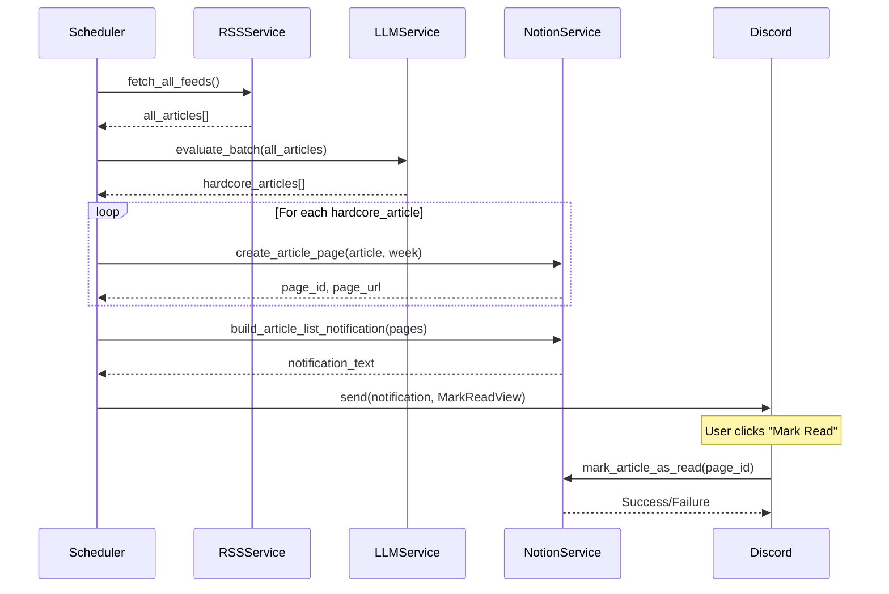

# 技術設計文件：Notion Article Pages 重構

## 概覽

將 Weekly Digests DB 從「週報容器」重構為「文章管理中心」，每篇精選文章建立獨立 Page，並支援閱讀狀態追蹤與 Discord 互動。

---

## 架構變更

### 資料流時序圖（新版）



---

## 元件與介面

### 1. NotionService 新增方法

#### `create_article_page`

```python
async def create_article_page(
    self,
    article: ArticleSchema,
    published_week: str,  # 格式 "YYYY-WW"
) -> tuple[str, str]:  # (page_id, page_url)
    """
    在 Weekly Digests DB 建立單篇文章 Page。

    設定屬性：
    - Title: article.title
    - URL: article.url
    - Source_Category: article.source_category
    - Published_Week: published_week
    - Tinkering_Index: article.ai_analysis.tinkering_index
    - Status: "Unread"
    - Added_At: 當前日期（UTC+8）

    Page Body 插入 Block：
    - Callout: 推薦原因
    - Callout: 行動價值（若非空）
    - Bookmark: 文章連結

    失敗時拋出 NotionServiceError。
    """
```

#### `mark_article_as_read`

```python
async def mark_article_as_read(self, page_id: str) -> None:
    """
    更新指定 Page 的 Status 屬性為 "Read"。

    失敗時拋出 NotionServiceError。
    """
```

#### `build_article_list_notification`

```python
def build_article_list_notification(
    article_pages: List[ArticlePageResult],
    stats: dict,
) -> str:
    """
    建立 Discord 通知訊息（≤ 2000 chars）。

    格式：
    本週技術週報已發布

    本週統計：抓取 {total} 篇，精選 {hardcore} 篇

    精選文章：
    1. [{category}] {title}
       {notion_page_url}
    2. ...

    若超過 2000 字元，截斷並加上「...（共 N 篇）」。
    """
```

---

### 2. Schema 新增

#### `ArticlePageResult`

```python
class ArticlePageResult(BaseModel):
    page_id: str
    page_url: str
    title: str
    category: str
    tinkering_index: int
```

---

### 3. Discord View 新增

#### `MarkReadView`

```python
class MarkReadView(discord.ui.View):
    def __init__(self, article_pages: List[ArticlePageResult]):
        """
        為每篇文章建立「✅ 標記已讀」按鈕。

        限制：最多 25 個按鈕（Discord 限制）。
        """

    @discord.ui.button(label="✅ 標記已讀", style=discord.ButtonStyle.success)
    async def mark_read_button(self, interaction: discord.Interaction, button: discord.ui.Button):
        """
        點擊後呼叫 notion.mark_article_as_read(page_id)。
        """
```

---

### 4. Scheduler 修改

#### `weekly_news_job` 流程調整

```python
async def weekly_news_job():
    # 1-3. 抓取、評估（不變）
    feeds = await notion.get_active_feeds()
    all_articles = await rss.fetch_all_feeds(feeds)
    hardcore_articles = await llm.evaluate_batch(all_articles)

    # 4. 計算當週週次
    dt = datetime.now(tz=timezone(timedelta(hours=8)))
    published_week = build_week_string(dt)  # "YYYY-WW"

    # 5. 批次建立文章 Page（並行，限制 5 個）
    article_pages = []
    semaphore = asyncio.Semaphore(5)

    async def create_with_semaphore(article):
        async with semaphore:
            try:
                page_id, page_url = await notion.create_article_page(article, published_week)
                return ArticlePageResult(
                    page_id=page_id,
                    page_url=page_url,
                    title=article.title,
                    category=article.source_category,
                    tinkering_index=article.ai_analysis.tinkering_index,
                )
            except NotionServiceError as e:
                logger.error(f"Failed to create page for '{article.title}': {e}")
                return None

    results = await asyncio.gather(*(create_with_semaphore(a) for a in hardcore_articles))
    article_pages = [r for r in results if r is not None]

    # 6. 建立 Discord 通知
    stats = {
        "total_fetched": len(all_articles),
        "hardcore_count": len(hardcore_articles),
    }
    notification = notion.build_article_list_notification(article_pages, stats)

    # 7. 發送 Discord 通知 + MarkReadView
    view = MarkReadView(article_pages[:25])  # 限制 25 個按鈕
    await channel.send(content=notification, view=view)
```

---

## 資料模型

### Weekly Digests DB Schema（新版）

| 屬性名稱          | Notion 類型 | 說明                                 |
| ----------------- | ----------- | ------------------------------------ |
| `Title`           | Title       | 文章標題                             |
| `URL`             | URL         | 文章原始連結                         |
| `Source_Category` | Select      | 文章分類（AI, DevOps, Security 等）  |
| `Published_Week`  | Text        | 發布週次（格式：`YYYY-WW`）          |
| `Tinkering_Index` | Number      | 折騰指數（1-5）                      |
| `Status`          | Status      | 閱讀狀態（Unread / Read / Archived） |
| `Added_At`        | Date        | 加入日期                             |

### Article Page Body 結構

```
[callout] 💡 推薦原因：{reason}
[callout] 🎯 行動價值：{actionable_takeaway}（若非空）
[bookmark] {article_url}
```

---

## Discord 通知格式

### 正常模式

```
本週技術週報已發布

本週統計：抓取 42 篇，精選 7 篇

精選文章：
1. [AI] Building a RAG System with Rust
   https://notion.so/abc123
2. [DevOps] Kubernetes 1.30 新功能解析
   https://notion.so/def456
3. [Security] OAuth 2.1 安全最佳實踐
   https://notion.so/ghi789
...
```

### 截斷模式（超過 2000 字元）

```
本週技術週報已發布

本週統計：抓取 42 篇，精選 15 篇

精選文章：
1. [AI] Building a RAG System with Rust
   https://notion.so/abc123
2. [DevOps] Kubernetes 1.30 新功能解析
   https://notion.so/def456
...

...（共 15 篇，查看 Notion 資料庫以瀏覽完整列表）
```

---

## 錯誤處理

### 單篇文章建立失敗

```python
try:
    page_id, page_url = await notion.create_article_page(article, week)
except NotionServiceError as e:
    logger.error(f"Failed to create page for '{article.title}': {e}")
    # 繼續處理下一篇，不中斷
```

### 所有文章建立失敗

```python
if not article_pages:
    logger.error("All article pages failed to create, skipping Discord notification")
    return
```

### Discord 按鈕互動失敗

```python
try:
    await notion.mark_article_as_read(page_id)
    await interaction.response.send_message(f"✅ 已標記「{title}」為已讀", ephemeral=True)
except NotionServiceError as e:
    await interaction.response.send_message("❌ 標記失敗，請稍後再試", ephemeral=True)
```

---

## 效能考量

### 並行建立 Page

使用 `asyncio.Semaphore(5)` 限制並行數量，避免觸發 Notion API rate limit（3 requests/second）。

### Discord 按鈕數量限制

Discord 單一 View 最多 25 個元件。若文章超過 25 篇，只顯示前 25 篇的按鈕，其餘文章仍在通知訊息中顯示連結。

---

## 測試策略

### 單元測試

- `create_article_page`：驗證屬性設定與 Block 結構
- `build_article_list_notification`：驗證訊息格式與截斷邏輯
- `mark_article_as_read`：驗證 Notion API 呼叫

### 屬性測試

- 屬性 11：Discord 通知長度 ≤ 2000 字元（任意文章數量）
- 屬性 12：Page 數量 = 成功建立的文章數量
- 屬性 13：Published_Week 格式符合 `^\\d{4}-\\d{2}$` 且週次 1-53

### 整合測試

- Mock 所有外部服務，驗證完整流程
- 驗證單篇文章失敗不影響其他文章
- 驗證 Discord 按鈕互動正確更新 Notion Status

---

## 遷移步驟

### 階段 1：DB Schema 調整

1. 在 Notion 建立新的 Weekly Digests DB（或調整現有 DB）
2. 新增 `URL`, `Source_Category`, `Published_Week`, `Tinkering_Index`, `Status`, `Added_At` 屬性
3. 移除 `Published_Date`, `Article_Count` 屬性（若存在）

### 階段 2：程式碼實作

1. 實作 `create_article_page`, `mark_article_as_read`, `build_article_list_notification`
2. 修改 `weekly_news_job` 與 `/news_now` 指令
3. 實作 `MarkReadView`

### 階段 3：測試與部署

1. 執行單元測試與屬性測試
2. 手動測試 `/news_now` 指令
3. 部署至生產環境

---

## 向後相容性

### 保留功能

- Feeds DB 與 Read Later DB 維持不變
- `/news_now` 指令與 `weekly_news_job` 排程任務保留
- 現有的 `FilterView`, `DeepDiveView` 保留（可選）

### 移除功能

- `generate_digest_intro`（不再需要週報前言）
- `build_digest_blocks`（不再建立週報 Page）
- `append_digest_blocks`（不再建立週報 Page）
- `WeeklyDigestResult` Schema（改用 `ArticlePageResult`）

---

## 未來擴充方向

### 評分功能

在 Weekly Digests DB 新增 `Rating` 屬性（Number 1-5），並在 Discord 新增評分按鈕。

### 筆記功能

在 Article Page Body 預留空白區域，使用者可在 Notion 手動新增筆記。

### 標籤功能

新增 `Tags` 屬性（Multi-select），支援自訂標籤分類。

### 統計儀表板

在 Notion 建立 Dashboard Page，使用 Linked Database 顯示閱讀統計（已讀/未讀比例、分類分布等）。
