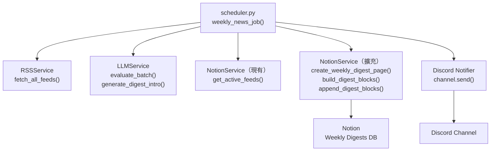
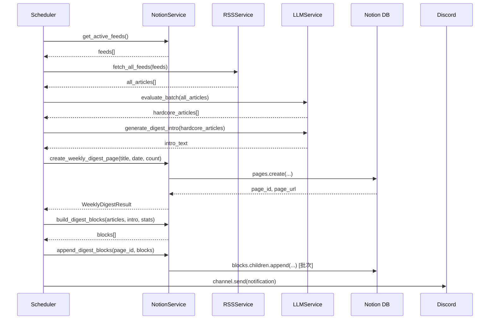

# 技術設計文件：Notion Weekly Digest

## 概覽

本功能將現有的每週技術週報廣播機制升級為雙層輸出架構：

1. **Notion 主要呈現層**：每週五排程任務執行後，自動在 Notion "Weekly Digests" 資料庫建立一篇結構完整、排版精美的週報頁面，充分運用 Notion Block 的豐富呈現能力（Toggle、Callout、Bookmark 等）。
2. **Discord 輕量通知層**：取代原有的完整 Markdown 廣播，改為發送統計摘要 + Top 5 文章列表 + Notion 頁面連結的精簡通知。

### 核心設計原則

- **優雅降級**：Notion 頁面建立失敗不中斷 Discord 通知；Discord 通知失敗不影響已建立的 Notion 頁面。
- **最小侵入**：在現有 `NotionService` 擴充新方法，不重構現有邏輯。
- **批次安全**：自動處理 Notion API 的 100 個子 Block 限制，透明地分批寫入。

---

## 架構

### 系統元件關係圖



### 資料流時序圖



---

## 元件與介面

### 1. `NotionService` 擴充方法

在現有 `app/services/notion_service.py` 的 `NotionService` 類別中新增以下三個方法：

#### `create_weekly_digest_page`

```python
async def create_weekly_digest_page(
    self,
    title: str,           # 例如 "週報 2025-28"
    published_date: date, # UTC+8 當日日期
    article_count: int    # Hardcore 文章總數
) -> tuple[str, str]:     # (page_id, page_url)
```

- 在 `notion_weekly_digests_db_id` 資料庫建立新頁面。
- 設定 `Title`（title 屬性）、`Published_Date`（date 屬性）、`Article_Count`（number 屬性）。
- 回傳 `(page_id, page_url)`；失敗時拋出 `NotionServiceError`。

#### `build_digest_blocks`

```python
@staticmethod
def build_digest_blocks(
    articles: List[ArticleSchema],
    intro_text: str,
    stats: dict           # {"total_fetched": int, "hardcore_count": int, "run_date": str}
) -> List[dict]:          # Notion Block 列表
```

- 純函式（無副作用），將資料轉換為 Notion Block 結構。
- 回傳符合 Notion API 格式的 `List[dict]`。

#### `append_digest_blocks`

```python
async def append_digest_blocks(
    self,
    page_id: str,
    blocks: List[dict]
) -> None:
```

- 將 Block 列表寫入指定頁面。
- 自動以每批 100 個 Block 分批呼叫 `blocks.children.append`。

### 2. `LLMService` 新增方法

在 `app/services/llm_service.py` 的 `LLMService` 類別中新增：

#### `generate_digest_intro`

```python
async def generate_digest_intro(
    self,
    hardcore_articles: List[ArticleSchema]
) -> str:  # 繁體中文，不超過 300 字
```

- 使用 `SUMMARIZE_MODEL`（llama-3.3-70b-versatile）生成本週技術趨勢前言。
- 失敗時回傳預設文字，不拋出例外。

### 3. `Settings` 設定擴充

在 `app/core/config.py` 的 `Settings` 類別新增：

```python
notion_weekly_digests_db_id: str = ""
```

### 4. `WeeklyDigestResult` Schema

在 `app/schemas/article.py` 新增：

```python
class WeeklyDigestResult(BaseModel):
    page_id: str
    page_url: str
    article_count: int
    top_articles: List[ArticleSchema]
```

### 5. `weekly_news_job` 排程任務修改

修改 `app/tasks/scheduler.py` 的 `weekly_news_job`：

- 移除 2000 字元截斷邏輯。
- 新增步驟 4：呼叫 Digest_Builder 建立 Notion 頁面。
- 修改步驟 5：改為發送輕量 Discord 通知。
- 實作優雅降級：Notion 失敗時 `digest_result = None`，Discord 通知標示降級狀態。

---

## 資料模型

### Notion Weekly Digests 資料庫 Schema

| 屬性名稱         | Notion 類型 | 說明                          |
| ---------------- | ----------- | ----------------------------- |
| `Title`          | title       | 週報標題，格式 `週報 YYYY-WW` |
| `Published_Date` | date        | 發布日期（UTC+8）             |
| `Article_Count`  | number      | 本週 Hardcore 文章數量        |

### Notion Block 結構設計

週報頁面的 Block 結構如下：

```
[paragraph]     AI 生成前言（intro_text）
[callout]       統計摘要（總抓取數、Hardcore 數、執行日期）
─── 分類 A ───
[heading_2]     分類名稱
  [toggle]      [折騰指數 N/5] 文章標題
    [bookmark]  文章 URL
    [callout]   推薦原因：{reason}
    [callout]   行動價值：{actionable_takeaway}（若非空字串）
  [toggle]      ...（同分類其他文章）
─── 分類 B ───
[heading_2]     分類名稱
  [toggle]      ...
[divider]       分隔線（所有分類結尾）
```

### Block 數量估算與批次策略

每篇文章最多產生 4 個 Block（bookmark + 2 callout + toggle 本身計為 1）。
假設 Top 7 文章分屬 3 個分類：

- 1 paragraph + 1 callout（統計）= 2
- 3 heading_2 = 3
- 7 toggle × 4 子 Block = 28（子 Block 不計入頂層）
- 1 divider = 1
- 頂層合計 ≈ 13 個，遠低於 100 限制

但子 Block（toggle 內容）需透過 `append_digest_blocks` 分批處理。實作上，`build_digest_blocks` 回傳扁平化的頂層 Block 列表（toggle 的子 Block 內嵌於 `children` 欄位），`append_digest_blocks` 以 100 為批次上限分批呼叫 API。

### `WeeklyDigestResult` Pydantic 模型

```python
class WeeklyDigestResult(BaseModel):
    page_id: str
    page_url: str
    article_count: int
    top_articles: List[ArticleSchema]
```

### Discord 輕量通知格式

```
本週技術週報已發布

本週統計：抓取 {total} 篇，精選 {hardcore} 篇

Top {n} 精選：
1. [文章標題](文章URL)
2. ...

完整週報：{notion_page_url}
```

降級格式（Notion 失敗時）：

```
本週技術週報

本週統計：抓取 {total} 篇，精選 {hardcore} 篇

Top {n} 精選：
1. [文章標題](文章URL)
2. ...

（Notion 頁面建立失敗，請查看日誌）
```

---

## 正確性屬性

_屬性（Property）是在系統所有有效執行中都應成立的特性或行為，本質上是對系統應做什麼的形式化陳述。屬性作為人類可讀規格與機器可驗證正確性保證之間的橋樑。_

### 屬性 1：週報標題格式符合 ISO 週次規範

_對任意_ 有效的 `datetime` 物件，`build_digest_title(dt)` 生成的標題字串應符合正規表達式 `^週報 \d{4}-\d{2}$`，且週次數字在 1–53 範圍內。

**驗證：需求 2.2**

---

### 屬性 2：Article_Count 與 Hardcore 文章列表長度一致

_對任意_ `hardcore_articles` 列表（包含空列表），`create_weekly_digest_page` 傳入的 `article_count` 參數應等於 `len(hardcore_articles)`。

**驗證：需求 2.4**

---

### 屬性 3：統計摘要 Callout 存在且包含正確資料

_對任意_ `stats` 字典（含 `total_fetched`、`hardcore_count`、`run_date`），`build_digest_blocks` 輸出的 Block 列表中應存在至少一個 `type == "callout"` 的 Block，且其文字內容包含 `stats["total_fetched"]` 與 `stats["hardcore_count"]` 的字串表示。

**驗證：需求 3.1**

---

### 屬性 4：每個 source_category 對應一個 heading_2 Block

_對任意_ 非空的 `ArticleSchema` 列表，`build_digest_blocks` 輸出中每個唯一的 `source_category` 值都應對應恰好一個 `type == "heading_2"` 的 Block，且其文字內容包含該分類名稱。

**驗證：需求 3.2**

---

### 屬性 5：每篇文章對應一個含折騰指數的 toggle Block

_對任意_ `ArticleSchema` 列表，`build_digest_blocks` 輸出中每篇文章都應有一個 `type == "toggle"` 的 Block，且其標題文字包含折騰指數數字與文章標題。

**驗證：需求 3.3**

---

### 屬性 6：toggle 子 Block 結構由文章資料決定

_對任意_ `ArticleSchema`，其對應 toggle Block 的 `children` 列表應滿足：

- 包含一個 `type == "bookmark"` 的 Block，URL 等於文章的 `url`。
- 包含一個 `callout` Block，內容為 `ai_analysis.reason`（推薦原因）。
- 若 `ai_analysis.actionable_takeaway` 非空字串，則包含一個 `callout` Block，內容為行動價值；若為空字串，則不包含該 Block。

**驗證：需求 3.4、3.6**

---

### 屬性 7：intro_text 為 Block 列表的第一個 paragraph

_對任意_ `intro_text` 字串（包含空字串），`build_digest_blocks` 輸出的第一個 Block 應為 `type == "paragraph"`，且其文字內容等於 `intro_text`。

**驗證：需求 4.3**

---

### 屬性 8：append_digest_blocks 自動分批，每批不超過 100 個

_對任意_ 長度為 N 的 `blocks` 列表，`append_digest_blocks` 呼叫 `blocks.children.append` API 的次數應為 `ceil(N / 100)`，且每次呼叫傳入的 Block 數量不超過 100。

**驗證：需求 3.7、6.3**

---

### 屬性 9：Discord 通知訊息長度不超過 2000 字元

_對任意_ `WeeklyDigestResult`（包含任意數量的 `top_articles` 與任意長度的 `page_url`），`build_discord_notification` 生成的訊息字串長度應不超過 2000 字元。

**驗證：需求 5.2**

---

### 屬性 10：Discord 通知包含統計數字與 Notion 連結

_對任意_ 有效的 `WeeklyDigestResult`（`page_url` 非空），`build_discord_notification` 生成的訊息應同時包含 `article_count` 的字串表示與 `page_url`。

**驗證：需求 5.1**

---

## 錯誤處理

### 錯誤分類與處理策略

| 錯誤情境                             | 處理方式                                                    | 影響範圍         |
| ------------------------------------ | ----------------------------------------------------------- | ---------------- |
| `notion_weekly_digests_db_id` 未設定 | 記錄 ERROR 日誌，跳過 Notion 建立，`digest_result = None`   | 僅 Notion 步驟   |
| Notion API 建立頁面失敗              | 捕捉 `NotionServiceError`，`digest_result = None`，繼續執行 | 僅 Notion 步驟   |
| Notion API append blocks 失敗        | 捕捉例外，記錄 ERROR，頁面已建立但內容不完整                | 僅 Block 寫入    |
| `generate_digest_intro` LLM 失敗     | 使用預設文字，不拋出例外                                    | 無（降級處理）   |
| Discord 通知發送失敗                 | 記錄 ERROR 日誌，不影響已建立的 Notion 頁面                 | 僅 Discord 步驟  |
| 文章列表為空                         | 跳過 Notion 建立與 Discord 通知，記錄 INFO                  | 整個任務提前結束 |

### 優雅降級流程

```
weekly_news_job()
├── [成功] Notion 頁面建立 → digest_result = WeeklyDigestResult(...)
│   └── Discord 通知含 Notion 連結
└── [失敗] Notion 頁面建立 → digest_result = None
    └── Discord 通知含降級警告，不含 Notion 連結
```

---

## 測試策略

### 雙層測試方法

本功能採用單元測試與屬性測試並行的策略，兩者互補：

- **單元測試**：驗證具體範例、邊界條件與錯誤處理路徑。
- **屬性測試**：驗證對所有有效輸入都成立的普遍性規則。

### 屬性測試配置

使用 Python 的 **Hypothesis** 函式庫進行屬性測試（專案已有 `.hypothesis/` 目錄，確認已使用）。

每個屬性測試最少執行 **100 次迭代**（`@settings(max_examples=100)`）。

每個屬性測試需以註解標記對應的設計屬性：

```python
# Feature: notion-weekly-digest, Property N: <property_text>
```

### 屬性測試清單

| 屬性                              | 測試函式                            | Hypothesis 策略                              |
| --------------------------------- | ----------------------------------- | -------------------------------------------- |
| 屬性 1：標題格式                  | `test_digest_title_format`          | `st.datetimes()`                             |
| 屬性 2：Article_Count 一致性      | `test_article_count_matches_list`   | `st.lists(article_strategy)`                 |
| 屬性 3：統計 Callout 存在         | `test_stats_callout_present`        | `st.fixed_dictionaries(stats_strategy)`      |
| 屬性 4：分類 heading_2 對應       | `test_category_headings`            | `st.lists(article_strategy, min_size=1)`     |
| 屬性 5：文章 toggle Block         | `test_article_toggle_blocks`        | `st.lists(article_strategy, min_size=1)`     |
| 屬性 6：toggle 子 Block 結構      | `test_toggle_children_structure`    | `article_strategy`                           |
| 屬性 7：intro_text 為第一個 Block | `test_intro_paragraph_first`        | `st.text()`                                  |
| 屬性 8：分批呼叫 API              | `test_append_blocks_batching`       | `st.lists(st.dictionaries(...), min_size=1)` |
| 屬性 9：Discord 訊息長度限制      | `test_discord_notification_length`  | `digest_result_strategy`                     |
| 屬性 10：Discord 訊息包含必要內容 | `test_discord_notification_content` | `digest_result_strategy`                     |

### 單元測試清單

| 測試情境                                         | 測試函式                                    |
| ------------------------------------------------ | ------------------------------------------- |
| Settings 包含 `notion_weekly_digests_db_id` 欄位 | `test_settings_has_digest_db_id`            |
| `notion_weekly_digests_db_id` 為空時跳過建立     | `test_skip_notion_when_db_id_empty`         |
| Notion API 失敗時拋出 `NotionServiceError`       | `test_notion_api_failure_raises`            |
| `generate_digest_intro` 失敗時使用預設文字       | `test_intro_fallback_on_llm_failure`        |
| Notion 失敗時 Discord 發送降級通知               | `test_discord_degraded_notification`        |
| Notion 失敗時 Discord 通知含警告標示             | `test_discord_degraded_contains_warning`    |
| `WeeklyDigestResult` 模型欄位完整性              | `test_weekly_digest_result_schema`          |
| Top_Articles 少於 5 篇時顯示實際數量             | `test_discord_top_articles_less_than_5`     |
| `actionable_takeaway` 為空時省略 🎯 callout      | `test_empty_takeaway_omits_callout`         |
| 優雅降級：Notion 失敗不中斷 Discord              | `test_graceful_degradation_notion_failure`  |
| 優雅降級：Discord 失敗不影響 Notion 頁面         | `test_graceful_degradation_discord_failure` |

### 測試檔案結構

```
tests/
├── test_notion_digest_builder.py   # build_digest_blocks 屬性測試與單元測試
├── test_notion_service_digest.py   # create_weekly_digest_page、append_digest_blocks
├── test_discord_notifier.py        # Discord 通知格式屬性測試
├── test_llm_digest_intro.py        # generate_digest_intro 單元測試
└── test_scheduler_integration.py  # weekly_news_job 整合測試（mock 外部服務）
```
