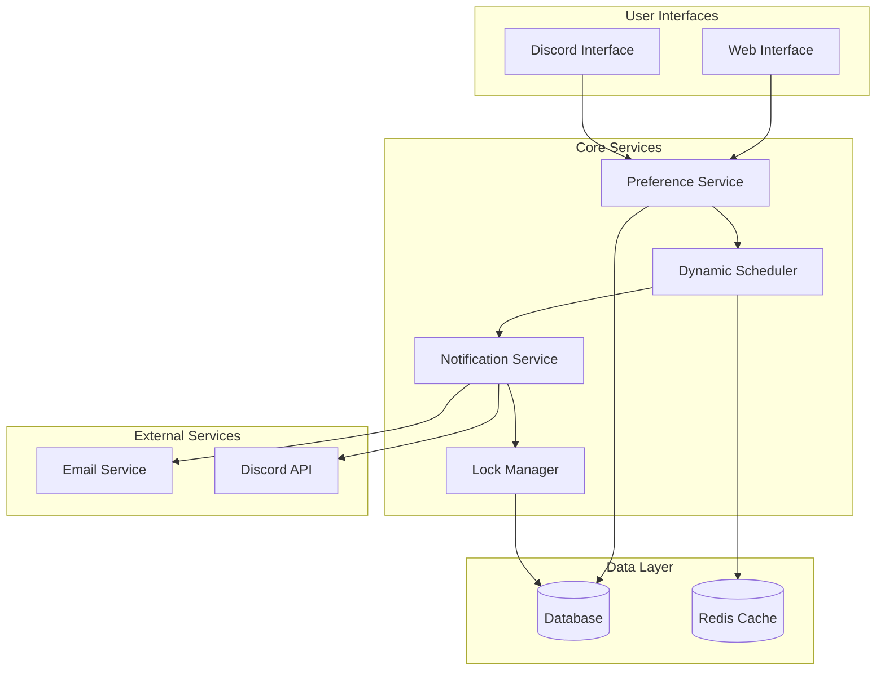

# Design Document: Personalized Notification Frequency

## Overview

The Personalized Notification Frequency feature transforms the notification system from a rigid, system-wide CRON-based approach to a flexible, user-centric dynamic scheduling system. This design enables each user to customize their notification preferences including frequency, timing, and timezone while ensuring reliable delivery across multiple backend instances.

### Key Design Goals

1. **User Autonomy**: Replace system-level DM_NOTIFICATION_CRON with individual user preferences
2. **Reliability**: Prevent duplicate notifications in multi-instance deployments through atomic locking
3. **Flexibility**: Support multiple notification channels (Discord DM, Email) with unified preferences
4. **Consistency**: Synchronize settings across Discord and Web interfaces
5. **Scalability**: Handle dynamic scheduling for thousands of users efficiently

### System Context

The current system uses a single DM_NOTIFICATION_CRON environment variable that triggers notifications for all users simultaneously. This approach lacks personalization and creates user experience issues. The new design introduces:

- Individual user notification preferences stored in the database
- Dynamic scheduling based on user-specific settings
- Atomic notification locking to prevent duplicates
- Multi-channel notification support (Discord DM + Email)
- Real-time synchronization between interfaces

## Architecture

### High-Level Architecture



### Component Responsibilities

**Preference Service**: Manages CRUD operations for user notification preferences, validates settings, and triggers scheduler updates.

**Dynamic Scheduler**: Creates and manages individual notification jobs based on user preferences, handles timezone conversions, and maintains job lifecycle.

**Notification Service**: Orchestrates notification delivery across multiple channels, implements retry logic, and manages notification status.

**Lock Manager**: Provides atomic locking mechanism to prevent duplicate notifications in multi-instance environments using database-based distributed locks.

### Multi-Instance Coordination

The system handles multiple backend instances through:

1. **Database-based Locking**: Uses `notification_locks` table with atomic operations
2. **Optimistic Concurrency**: Attempts to acquire locks before processing notifications
3. **Timeout Mechanisms**: Prevents deadlocks through lock expiration
4. **Status Tracking**: Maintains notification state for debugging and monitoring

## Components and Interfaces

### Database Schema

#### user_notification_preferences Table

```sql
CREATE TABLE user_notification_preferences (
    id BIGSERIAL PRIMARY KEY,
    user_id BIGINT NOT NULL REFERENCES users(id) ON DELETE CASCADE,
    frequency VARCHAR(20) NOT NULL DEFAULT 'weekly' CHECK (frequency IN ('daily', 'weekly', 'monthly', 'disabled')),
    notification_time TIME NOT NULL DEFAULT '18:00:00',
    timezone VARCHAR(50) NOT NULL DEFAULT 'Asia/Taipei',
    dm_enabled BOOLEAN NOT NULL DEFAULT true,
    email_enabled BOOLEAN NOT NULL DEFAULT false,
    created_at TIMESTAMP WITH TIME ZONE NOT NULL DEFAULT NOW(),
    updated_at TIMESTAMP WITH TIME ZONE NOT NULL DEFAULT NOW(),

    UNIQUE(user_id)
);

CREATE INDEX idx_user_notification_preferences_user_id ON user_notification_preferences(user_id);
CREATE INDEX idx_user_notification_preferences_frequency ON user_notification_preferences(frequency);
```

#### notification_locks Table

```sql
CREATE TABLE notification_locks (
    id BIGSERIAL PRIMARY KEY,
    user_id BIGINT NOT NULL REFERENCES users(id) ON DELETE CASCADE,
    notification_type VARCHAR(50) NOT NULL,
    scheduled_time TIMESTAMP WITH TIME ZONE NOT NULL,
    status VARCHAR(20) NOT NULL DEFAULT 'pending' CHECK (status IN ('pending', 'processing', 'completed', 'failed')),
    instance_id VARCHAR(100),
    created_at TIMESTAMP WITH TIME ZONE NOT NULL DEFAULT NOW(),
    expires_at TIMESTAMP WITH TIME ZONE NOT NULL,

    UNIQUE(user_id, notification_type, scheduled_time)
);

CREATE INDEX idx_notification_locks_user_scheduled ON notification_locks(user_id, scheduled_time);
CREATE INDEX idx_notification_locks_status_expires ON notification_locks(status, expires_at);
```

### Core Interfaces

#### PreferenceService Interface

```typescript
interface PreferenceService {
  getUserPreferences(userId: string): Promise<UserNotificationPreferences>;
  updatePreferences(
    userId: string,
    preferences: Partial<UserNotificationPreferences>
  ): Promise<void>;
  createDefaultPreferences(userId: string): Promise<UserNotificationPreferences>;
  validatePreferences(preferences: Partial<UserNotificationPreferences>): ValidationResult;
}

interface UserNotificationPreferences {
  userId: string;
  frequency: 'daily' | 'weekly' | 'monthly' | 'disabled';
  notificationTime: string; // HH:MM format
  timezone: string; // IANA timezone identifier
  dmEnabled: boolean;
  emailEnabled: boolean;
  createdAt: Date;
  updatedAt: Date;
}
```

#### DynamicScheduler Interface

```typescript
interface DynamicScheduler {
  scheduleUserNotification(userId: string, preferences: UserNotificationPreferences): Promise<void>;
  cancelUserNotification(userId: string): Promise<void>;
  rescheduleUserNotification(
    userId: string,
    preferences: UserNotificationPreferences
  ): Promise<void>;
  getNextNotificationTime(preferences: UserNotificationPreferences): Date;
}
```

#### NotificationService Interface

```typescript
interface NotificationService {
  sendNotification(userId: string, channels: NotificationChannel[]): Promise<NotificationResult>;
  sendDiscordDM(userId: string, message: string): Promise<boolean>;
  sendEmail(userId: string, subject: string, content: EmailContent): Promise<boolean>;
}

interface NotificationChannel {
  type: 'discord_dm' | 'email';
  enabled: boolean;
}

interface EmailContent {
  html: string;
  text: string;
}
```

#### LockManager Interface

```typescript
interface LockManager {
  acquireNotificationLock(
    userId: string,
    notificationType: string,
    scheduledTime: Date
  ): Promise<NotificationLock | null>;
  releaseLock(lockId: string, status: 'completed' | 'failed'): Promise<void>;
  cleanupExpiredLocks(): Promise<number>;
}

interface NotificationLock {
  id: string;
  userId: string;
  notificationType: string;
  scheduledTime: Date;
  instanceId: string;
  expiresAt: Date;
}
```

### API Endpoints

#### Web Interface APIs

```typescript
// GET /api/user/notification-preferences
interface GetPreferencesResponse {
  preferences: UserNotificationPreferences;
  nextNotificationTime: string | null;
}

// PUT /api/user/notification-preferences
interface UpdatePreferencesRequest {
  frequency?: 'daily' | 'weekly' | 'monthly' | 'disabled';
  notificationTime?: string;
  timezone?: string;
  dmEnabled?: boolean;
  emailEnabled?: boolean;
}

// GET /api/user/notification-preview
interface PreviewRequest {
  frequency: string;
  notificationTime: string;
  timezone: string;
}

interface PreviewResponse {
  nextNotificationTime: string;
  localTime: string;
  utcTime: string;
}
```

#### Discord Commands

```typescript
interface DiscordCommand {
  name: string;
  description: string;
  options?: CommandOption[];
}

const discordCommands: DiscordCommand[] = [
  {
    name: 'notification-settings',
    description: 'View your current notification preferences',
  },
  {
    name: 'set-notification-frequency',
    description: 'Set notification frequency',
    options: [
      { name: 'frequency', type: 'string', choices: ['daily', 'weekly', 'monthly', 'disabled'] },
    ],
  },
  {
    name: 'set-notification-time',
    description: 'Set notification time',
    options: [{ name: 'time', type: 'string', description: 'Time in HH:MM format' }],
  },
  {
    name: 'set-timezone',
    description: 'Set your timezone',
    options: [{ name: 'timezone', type: 'string', description: 'IANA timezone identifier' }],
  },
  {
    name: 'toggle-notifications',
    description: 'Enable or disable notifications',
    options: [{ name: 'enabled', type: 'boolean' }],
  },
];
```

## Data Models

### Core Data Structures

#### UserNotificationPreferences Model

```typescript
class UserNotificationPreferences {
  constructor(
    public userId: string,
    public frequency: NotificationFrequency = 'weekly',
    public notificationTime: string = '18:00',
    public timezone: string = 'Asia/Taipei',
    public dmEnabled: boolean = true,
    public emailEnabled: boolean = false,
    public createdAt: Date = new Date(),
    public updatedAt: Date = new Date()
  ) {}

  static createDefault(userId: string): UserNotificationPreferences {
    return new UserNotificationPreferences(userId);
  }

  updateTime(time: string): void {
    if (!this.isValidTime(time)) {
      throw new Error('Invalid time format. Use HH:MM');
    }
    this.notificationTime = time;
    this.updatedAt = new Date();
  }

  updateTimezone(timezone: string): void {
    if (!this.isValidTimezone(timezone)) {
      throw new Error('Invalid timezone identifier');
    }
    this.timezone = timezone;
    this.updatedAt = new Date();
  }

  private isValidTime(time: string): boolean {
    const timeRegex = /^([01]?[0-9]|2[0-3]):[0-5][0-9]$/;
    return timeRegex.test(time);
  }

  private isValidTimezone(timezone: string): boolean {
    try {
      Intl.DateTimeFormat(undefined, { timeZone: timezone });
      return true;
    } catch {
      return false;
    }
  }
}

type NotificationFrequency = 'daily' | 'weekly' | 'monthly' | 'disabled';
```

#### NotificationLock Model

```typescript
class NotificationLock {
  constructor(
    public id: string,
    public userId: string,
    public notificationType: string,
    public scheduledTime: Date,
    public status: LockStatus = 'pending',
    public instanceId: string,
    public createdAt: Date = new Date(),
    public expiresAt: Date
  ) {}

  static create(
    userId: string,
    notificationType: string,
    scheduledTime: Date,
    instanceId: string,
    ttlMinutes: number = 30
  ): NotificationLock {
    const id = generateUUID();
    const expiresAt = new Date(Date.now() + ttlMinutes * 60 * 1000);

    return new NotificationLock(
      id,
      userId,
      notificationType,
      scheduledTime,
      'pending',
      instanceId,
      new Date(),
      expiresAt
    );
  }

  isExpired(): boolean {
    return new Date() > this.expiresAt;
  }

  canProcess(instanceId: string): boolean {
    return this.status === 'pending' && this.instanceId === instanceId && !this.isExpired();
  }
}

type LockStatus = 'pending' | 'processing' | 'completed' | 'failed';
```

### Timezone Handling

```typescript
class TimezoneConverter {
  static convertToUserTime(utcTime: Date, userTimezone: string): Date {
    return new Date(utcTime.toLocaleString('en-US', { timeZone: userTimezone }));
  }

  static convertToUTC(localTime: Date, userTimezone: string): Date {
    const localString = localTime.toISOString().slice(0, -1); // Remove Z
    return new Date(localString + ' ' + userTimezone);
  }

  static getNextNotificationTime(
    frequency: NotificationFrequency,
    notificationTime: string,
    timezone: string,
    fromDate: Date = new Date()
  ): Date | null {
    if (frequency === 'disabled') return null;

    const [hours, minutes] = notificationTime.split(':').map(Number);
    const userNow = this.convertToUserTime(fromDate, timezone);

    let nextNotification = new Date(userNow);
    nextNotification.setHours(hours, minutes, 0, 0);

    // If time has passed today, move to next occurrence
    if (nextNotification <= userNow) {
      switch (frequency) {
        case 'daily':
          nextNotification.setDate(nextNotification.getDate() + 1);
          break;
        case 'weekly':
          // Default to Friday (5 = Friday in getDay())
          const daysUntilFriday = (5 - nextNotification.getDay() + 7) % 7 || 7;
          nextNotification.setDate(nextNotification.getDate() + daysUntilFriday);
          break;
        case 'monthly':
          nextNotification.setMonth(nextNotification.getMonth() + 1, 1);
          break;
      }
    }

    return this.convertToUTC(nextNotification, timezone);
  }
}
```

## Correctness Properties

_A property is a characteristic or behavior that should hold true across all valid executions of a system-essentially, a formal statement about what the system should do. Properties serve as the bridge between human-readable specifications and machine-verifiable correctness guarantees._

### Property 1: Default Preference Creation

_For any_ new user registration, the system SHALL create notification preferences with default values: weekly frequency, 18:00 notification time, Asia/Taipei timezone, DM enabled, and email disabled.

**Validates: Requirements 2.1, 2.2, 2.3, 2.4**

### Property 2: Preference Validation Consistency

_For any_ user preference input, the system SHALL accept valid values (frequencies: daily/weekly/monthly/disabled, times: 00:00-23:59, valid IANA timezones) and reject invalid values with appropriate error messages.

**Validates: Requirements 3.1, 3.2, 3.3, 3.4, 3.5**

### Property 3: Dynamic Scheduling Correctness

_For any_ user preference configuration, the dynamic scheduler SHALL create appropriate notification jobs with correct timing based on frequency, handle preference updates by rescheduling, and cancel all jobs when notifications are disabled.

**Validates: Requirements 5.1, 5.2, 5.4, 5.5**

### Property 4: Timezone Conversion Accuracy

_For any_ valid timezone and notification time combination, the system SHALL correctly convert between user local time and UTC, ensuring notifications are scheduled and delivered at the user's intended local time.

**Validates: Requirements 5.3**

### Property 5: Cross-Interface Synchronization

_For any_ preference change made through either Discord or Web interface, the system SHALL immediately synchronize the change to all interfaces, ensuring consistent display of settings and triggering scheduler updates.

**Validates: Requirements 6.2, 6.6, 7.1, 7.6, 8.1, 8.2, 8.3, 8.4, 11.1, 11.2, 11.3**

### Property 6: Atomic Notification Locking

_For any_ notification attempt across multiple backend instances, the system SHALL use atomic database operations to create locks, prevent duplicate notifications, update completion status, and handle lock expiration to prevent deadlocks.

**Validates: Requirements 10.1, 10.2, 10.3, 10.4, 10.5**

### Property 7: Multi-Channel Notification Delivery

_For any_ enabled notification channel (Discord DM or Email), the system SHALL deliver notifications to the correct recipient address, provide both HTML and text formats for emails, implement retry logic for failures, and maintain delivery logs.

**Validates: Requirements 9.1, 9.2, 9.3, 9.4, 9.5, 10.6**

### Property 8: Interface Input Validation and Feedback

_For any_ user input through Web or Discord interfaces, the system SHALL validate the input, provide immediate feedback for validation results, display confirmation messages for successful updates, and show real-time previews of notification timing.

**Validates: Requirements 6.3, 6.4, 6.5, 7.2, 7.3, 7.4, 7.5**

## Error Handling

### Input Validation Errors

**Invalid Time Format**: When users provide time in incorrect format (e.g., "25:00", "12:70"), the system returns a structured error with the expected format (HH:MM) and valid range (00:00-23:59).

**Invalid Timezone**: When users provide invalid timezone identifiers, the system validates against IANA timezone database and returns suggestions for similar valid timezones.

**Invalid Frequency**: When users provide unsupported frequency values, the system returns the list of valid options (daily, weekly, monthly, disabled).

### Database Operation Errors

**Constraint Violations**: Foreign key violations when referencing non-existent users are caught and return user-friendly error messages.

**Concurrent Modification**: Optimistic locking prevents lost updates when multiple interfaces modify preferences simultaneously.

**Connection Failures**: Database connection issues trigger retry logic with exponential backoff and circuit breaker patterns.

### Notification Delivery Errors

**Discord API Failures**: Rate limiting, user blocking, or API downtime triggers retry queues with exponential backoff and dead letter handling.

**Email Delivery Failures**: SMTP errors, invalid email addresses, or service outages are logged and retried with configurable retry policies.

**Lock Acquisition Failures**: When notification locks cannot be acquired due to concurrent processing, the system logs the attempt and gracefully skips duplicate processing.

### Scheduling Errors

**Timezone Conversion Failures**: Invalid timezone data or system clock issues are logged with fallback to UTC scheduling and user notification of the issue.

**Job Creation Failures**: Scheduler service unavailability triggers fallback to database-based job queuing with background retry processing.

### Recovery Mechanisms

**Lock Cleanup**: Automated cleanup processes remove expired locks and reset stuck notifications for reprocessing.

**Preference Repair**: Background jobs detect and repair inconsistent preference states between interfaces.

**Notification Retry**: Failed notifications are queued for retry with exponential backoff and maximum retry limits.

## Testing Strategy

### Dual Testing Approach

The testing strategy combines unit tests for specific scenarios with property-based tests for comprehensive input coverage:

**Unit Tests** focus on:

- Specific examples of preference configurations
- Integration points between components
- Edge cases like timezone boundaries and leap years
- Error conditions and recovery scenarios
- Database migration and schema validation

**Property-Based Tests** focus on:

- Universal properties across all valid inputs
- Comprehensive input coverage through randomization
- Timezone conversion accuracy across all timezones
- Preference validation across all possible inputs
- Scheduling correctness across all frequency/time combinations

### Property-Based Testing Configuration

**Testing Library**: Use Hypothesis for Python components and fast-check for TypeScript/JavaScript components

**Test Configuration**:

- Minimum 100 iterations per property test
- Each property test references its design document property
- Tag format: **Feature: personalized-notification-frequency, Property {number}: {property_text}**

**Property Test Implementation**:

- Property 1: Generate random user IDs, verify default preferences creation
- Property 2: Generate random preference inputs (valid/invalid), verify validation behavior
- Property 3: Generate random preference configurations, verify scheduling behavior
- Property 4: Generate random timezone/time combinations, verify conversion accuracy
- Property 5: Generate random preference changes across interfaces, verify synchronization
- Property 6: Generate random concurrent notification attempts, verify atomic locking
- Property 7: Generate random notification scenarios, verify multi-channel delivery
- Property 8: Generate random interface inputs, verify validation and feedback

### Integration Testing

**Database Integration**:

- Test schema migrations with existing data
- Verify foreign key constraints and cascading deletes
- Test concurrent access patterns and locking behavior

**External Service Integration**:

- Mock Discord API for testing command handling and DM delivery
- Mock email service for testing delivery and retry logic
- Test timezone data service integration

**Multi-Instance Testing**:

- Deploy multiple backend instances in test environment
- Verify notification deduplication under concurrent load
- Test lock cleanup and recovery mechanisms

### Performance Testing

**Scheduling Performance**:

- Test dynamic scheduling with thousands of users
- Verify scheduler performance under high preference update frequency
- Test timezone conversion performance across all supported timezones

**Database Performance**:

- Test query performance with large user preference datasets
- Verify index effectiveness for notification lock queries
- Test concurrent lock acquisition performance

### Monitoring and Observability

**Metrics Collection**:

- Notification delivery success/failure rates by channel
- Lock acquisition success rates and contention metrics
- Preference update frequency and validation error rates
- Scheduler job creation and execution metrics

**Logging Strategy**:

- Structured logging for all preference changes with user context
- Notification delivery attempts with correlation IDs
- Lock acquisition and release events with timing data
- Error logging with sufficient context for debugging

**Alerting**:

- High notification failure rates across channels
- Lock contention or deadlock detection
- Scheduler job backlog or processing delays
- Database connection or performance issues
