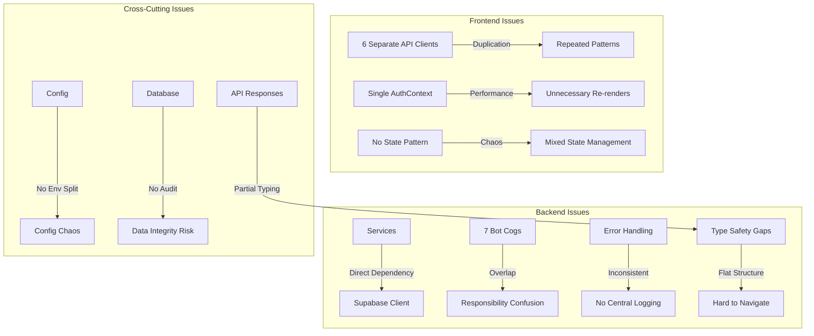

# Design Document: Tech News Agent 專案架構重構

## Overview

本設計文件針對 Tech News Agent 全端專案進行全面的架構重構規劃。專案目前存在多個維護性問題，包括 API 客戶端重複、服務層緊耦合、錯誤處理不一致、測試組織混亂等。本重構將建立清晰的模組邊界、統一的錯誤處理機制、可擴展的架構模式，並提供從現有架構到新架構的漸進式遷移策略。

重構範圍涵蓋：

- **Backend**: FastAPI + Discord.py + Supabase (PostgreSQL + pgvector)
- **Frontend**: Next.js 14 + React 18 + TypeScript
- **Infrastructure**: Docker Compose, GitHub Actions CI

## Architecture

### Current Architecture Issues



````

### Target Architecture

```mermaid
graph TB
    subgraph "Frontend - Layered Architecture"
        UI[UI Components] --> Hooks[Custom Hooks]
        Hooks --> API[Unified API Layer]
        API --> Client[HTTP Client]

        State[State Management] --> Context[Split Contexts]
        State --> Query[React Query Cache]
    end

    subgraph "Backend - Clean Architecture"
        Routes[API Routes] --> Controllers[Controllers]
        Controllers --> Services[Service Layer]
        Services --> Repos[Repository Layer]
        Repos --> DB[(Database)]

        Bot[Discord Bot] --> BotServices[Bot Services]
        BotServices --> Services
    end

    subgraph "Cross-Cutting Concerns"
        Error[Error Handler] -.-> Routes
        Error -.-> Controllers
        Logger[Centralized Logger] -.-> Services
        Logger -.-> BotServices
        Config[Config Manager] -.-> Services
        Config -.-> BotServices
    end
````

## Correctness Properties

_A property is a characteristic or behavior that should hold true across all valid executions of a system-essentially, a formal statement about what the system should do. Properties serve as the bridge between human-readable specifications and machine-verifiable correctness guarantees._

### Property 1: API Client Singleton

_For any_ sequence of API client instantiation calls, all instances SHALL reference the same underlying HTTP client object.

**Validates: Requirements 1.1**

### Property 2: Error Response Consistency

_For any_ API request that fails (frontend or backend), the error response SHALL contain the same standardized structure with error code, message, and optional details fields.

**Validates: Requirements 1.2, 1.4, 4.2, 15.3**

### Property 3: Context Isolation

_For any_ context value change in a split context, only components that consume that specific context SHALL re-render, and components consuming other contexts SHALL not re-render.

**Validates: Requirements 2.2**

### Property 4: Structured Logging with Context

_For any_ log entry created in backend services, the log SHALL include structured fields (timestamp, level, message) and request context (user_id, request_id) when available.

**Validates: Requirements 5.1, 5.3**

### Property 5: Configuration Validation

_For any_ required configuration value that is missing or invalid at startup, the Config Manager SHALL fail immediately with a clear error message identifying the missing/invalid configuration.

**Validates: Requirements 6.3, 6.4**

### Property 6: Configuration Loading

_For any_ environment variable set in the system, the Config Manager SHALL correctly load and provide type-safe access to that configuration value.

**Validates: Requirements 6.1**

### Property 7: Audit Trail Completeness

_For any_ critical data modification operation (create, update, delete), the system SHALL populate audit fields (created_at, updated_at, modified_by) with accurate timestamp and user information.

**Validates: Requirements 14.1**

### Property 8: Business Rule Validation

_For any_ data modification attempt that violates business rules, the system SHALL reject the modification and return a validation error before persisting to the database.

**Validates: Requirements 14.3**

### Property 9: Soft Delete Preservation

_For any_ delete operation on critical entities, the system SHALL mark the entity as deleted without removing it from the database, preserving the record for audit history.

**Validates: Requirements 14.5**

### Property 10: API Response Structure Consistency

_For any_ API endpoint response (success or failure), the response SHALL follow the standardized structure with data/error field and metadata field.

**Validates: Requirements 15.1, 15.2, 15.3**

### Property 11: Pagination Metadata Presence

_For any_ list endpoint response, the response SHALL include pagination metadata (total count, page number, page size, has_next, has_previous).

**Validates: Requirements 15.4**

### Property 12: Migration Backward Compatibility

_For any_ module being migrated, both the old and new implementations SHALL produce equivalent results for the same inputs during the migration period.

**Validates: Requirements 10.2**

### Property 13: Error Recovery Execution

_For any_ error that supports recovery strategies (retry, fallback), the error handler SHALL execute the appropriate recovery strategy and return the recovery result or final error.

**Validates: Requirements 4.5**

### Property 14: Frontend Log Batching

_For any_ sequence of frontend log calls, the logger SHALL batch logs and send them to the backend in groups rather than sending each log individually.

**Validates: Requirements 5.4**

### Property 15: Request Interceptor Execution

_For any_ API request made through the unified client, all registered request interceptors SHALL execute in order before the request is sent.

**Validates: Requirements 1.3**

### Property 16: Error Message Clarity

_For any_ error that occurs in the system, the error message SHALL include actionable information (what went wrong, why, and suggested next steps).

**Validates: Requirements 13.1**
