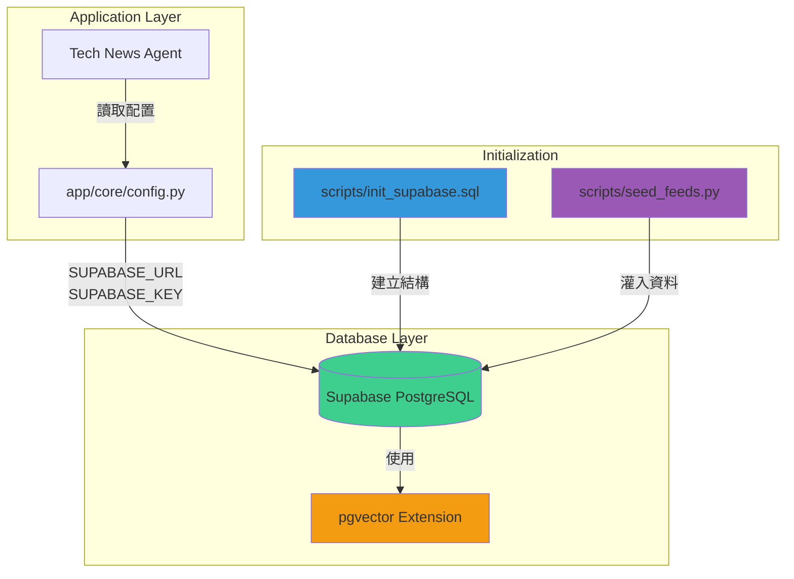
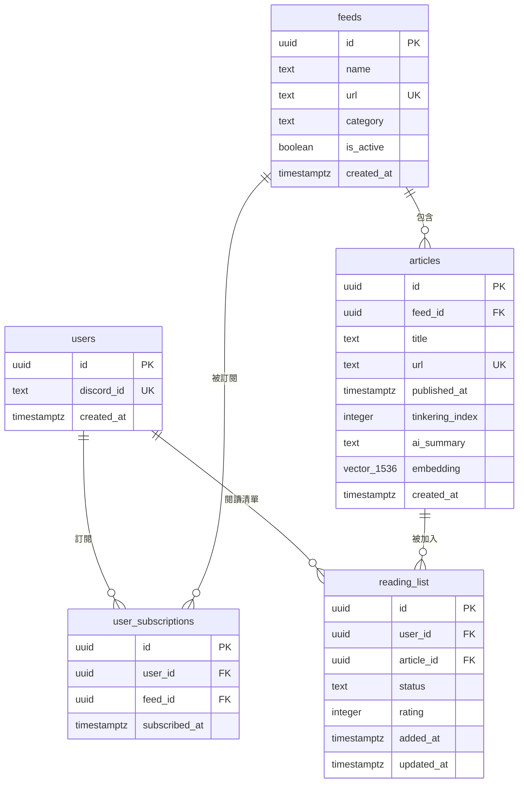
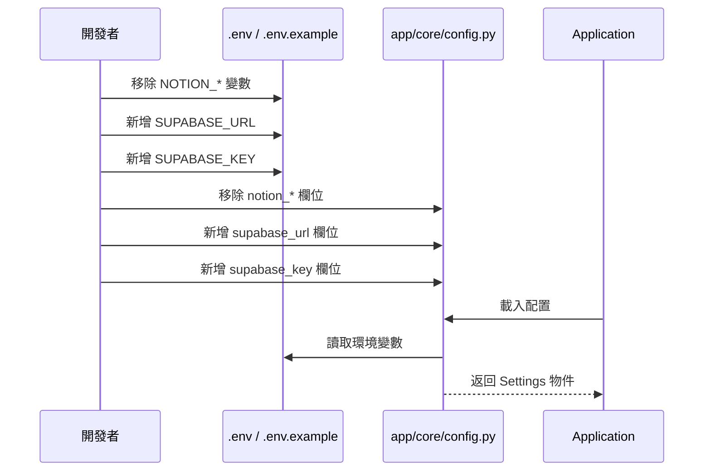

# Design Document: Supabase Migration Phase 1

## Overview

本設計文件描述 Tech News Agent 從 Notion 遷移至 Supabase 的第一階段實作細節。此階段建立完整的 PostgreSQL 資料庫基礎建設，支援多租戶架構、向量搜尋能力，以及共用資源池設計。

### 目標

1. 移除所有 Notion 相關依賴與配置
2. 建立支援 pgvector 的 PostgreSQL 資料庫結構
3. 實作多租戶資料隔離機制
4. 提供初始化腳本與種子資料

### 非目標

- 遷移現有應用程式邏輯（將在後續階段處理）
- 實作資料遷移工具（目前為全新安裝）
- 建立 API 端點（保留給應用層遷移階段）

### 設計原則

1. **資料完整性優先**：使用 PostgreSQL 約束確保資料一致性
2. **可擴展性**：支援未來的向量搜尋與 AI 功能
3. **多租戶隔離**：使用者資料透過外鍵關聯隔離
4. **資源共享**：全域管理 RSS 來源與文章，避免重複抓取

## Architecture

### 系統架構圖



### 資料庫架構



### 配置變更流程



## Components and Interfaces

### 1. 配置模組 (app/core/config.py)

**職責**：管理應用程式配置，提供型別安全的環境變數存取

**變更內容**：

- 移除：`notion_token`, `notion_feeds_db_id`, `notion_read_later_db_id`, `notion_weekly_digests_db_id`
- 新增：`supabase_url: str`, `supabase_key: str`

**介面**：

```python
class Settings(BaseSettings):
    # Supabase Configuration
    supabase_url: str
    supabase_key: str

    # Discord Configuration (保持不變)
    discord_token: str
    discord_channel_id: int

    # LLM Configuration (保持不變)
    groq_api_key: str

    # Timezone Configuration (保持不變)
    timezone: str = "Asia/Taipei"
```

### 2. 環境變數檔案 (.env.example)

**職責**：提供環境變數範本

**變更內容**：

```bash
# 移除
# NOTION_TOKEN=...
# NOTION_FEEDS_DB_ID=...
# NOTION_READ_LATER_DB_ID=...
# NOTION_WEEKLY_DIGESTS_DB_ID=...

# 新增
SUPABASE_URL=https://your-project.supabase.co
SUPABASE_KEY=your-anon-or-service-role-key
```

### 3. 套件依賴 (requirements.txt)

**職責**：定義 Python 套件依賴

**變更內容**：

- 移除：`notion-client==2.2.1`
- 新增：`supabase>=2.0.0`

### 4. SQL 初始化腳本 (scripts/init_supabase.sql)

**職責**：建立完整的資料庫結構

**主要功能**：

- 啟用 pgvector 擴充功能
- 建立 5 個資料表
- 設定外鍵約束與 CASCADE 行為
- 建立索引優化查詢效能

**執行方式**：在 Supabase Dashboard 的 SQL Editor 中執行

### 5. Python 種子資料腳本 (scripts/seed_feeds.py)

**職責**：初始化預設 RSS 訂閱源

**主要功能**：

- 連接 Supabase
- 插入 14 個預設 RSS 來源
- 處理重複 URL（跳過）
- 提供執行回饋

**執行方式**：

```bash
python scripts/seed_feeds.py
```

**依賴**：

- `supabase` 套件
- `python-dotenv` 套件
- `.env` 檔案中的 `SUPABASE_URL` 和 `SUPABASE_KEY`

## Data Models

### users 表

**用途**：儲存系統使用者（透過 Discord 識別）

| 欄位名稱   | 資料型別    | 約束條件                  | 說明              |
| ---------- | ----------- | ------------------------- | ----------------- |
| id         | UUID        | PRIMARY KEY, DEFAULT uuid | 使用者唯一識別碼  |
| discord_id | TEXT        | UNIQUE, NOT NULL          | Discord 使用者 ID |
| created_at | TIMESTAMPTZ | DEFAULT now()             | 帳號建立時間      |

**索引**：

- PRIMARY KEY on `id`
- UNIQUE INDEX on `discord_id`

**關聯**：

- 一對多：`user_subscriptions` (CASCADE DELETE)
- 一對多：`reading_list` (CASCADE DELETE)

### feeds 表

**用途**：全域 RSS 訂閱源池

| 欄位名稱   | 資料型別    | 約束條件                  | 說明                     |
| ---------- | ----------- | ------------------------- | ------------------------ |
| id         | UUID        | PRIMARY KEY, DEFAULT uuid | 訂閱源唯一識別碼         |
| name       | TEXT        | NOT NULL                  | 訂閱源名稱               |
| url        | TEXT        | UNIQUE, NOT NULL          | RSS/Atom Feed URL        |
| category   | TEXT        | NOT NULL                  | 分類標籤                 |
| is_active  | BOOLEAN     | DEFAULT true              | 是否啟用（用於抓取控制） |
| created_at | TIMESTAMPTZ | DEFAULT now()             | 訂閱源建立時間           |

**索引**：

- PRIMARY KEY on `id`
- UNIQUE INDEX on `url`
- INDEX on `is_active` (用於篩選啟用的訂閱源)
- INDEX on `category` (用於分類查詢)

**關聯**：

- 一對多：`user_subscriptions`
- 一對多：`articles` (CASCADE DELETE)

### user_subscriptions 表

**用途**：使用者與訂閱源的多對多關聯

| 欄位名稱      | 資料型別    | 約束條件                  | 說明               |
| ------------- | ----------- | ------------------------- | ------------------ |
| id            | UUID        | PRIMARY KEY, DEFAULT uuid | 訂閱記錄唯一識別碼 |
| user_id       | UUID        | FOREIGN KEY → users(id)   | 使用者 ID          |
| feed_id       | UUID        | FOREIGN KEY → feeds(id)   | 訂閱源 ID          |
| subscribed_at | TIMESTAMPTZ | DEFAULT now()             | 訂閱時間           |

**約束**：

- UNIQUE constraint on `(user_id, feed_id)` - 防止重複訂閱
- ON DELETE CASCADE for `user_id` - 使用者刪除時移除訂閱
- ON DELETE CASCADE for `feed_id` - 訂閱源刪除時移除訂閱

**索引**：

- PRIMARY KEY on `id`
- UNIQUE INDEX on `(user_id, feed_id)`
- INDEX on `user_id` (用於查詢使用者的所有訂閱)
- INDEX on `feed_id` (用於查詢訂閱源的訂閱者數量)

### articles 表

**用途**：全域文章池（從 RSS 抓取）

| 欄位名稱        | 資料型別     | 約束條件                  | 說明                         |
| --------------- | ------------ | ------------------------- | ---------------------------- |
| id              | UUID         | PRIMARY KEY, DEFAULT uuid | 文章唯一識別碼               |
| feed_id         | UUID         | FOREIGN KEY → feeds(id)   | 來源訂閱源 ID                |
| title           | TEXT         | NOT NULL                  | 文章標題                     |
| url             | TEXT         | UNIQUE, NOT NULL          | 文章原始連結                 |
| published_at    | TIMESTAMPTZ  | NULL                      | 文章發布時間（來自 RSS）     |
| tinkering_index | INTEGER      | NULL                      | 折騰指數 (1-5)               |
| ai_summary      | TEXT         | NULL                      | AI 生成的摘要                |
| embedding       | VECTOR(1536) | NULL                      | 文章向量表示（用於語義搜尋） |
| created_at      | TIMESTAMPTZ  | DEFAULT now()             | 文章加入系統時間             |

**約束**：

- ON DELETE CASCADE for `feed_id` - 訂閱源刪除時移除相關文章

**索引**：

- PRIMARY KEY on `id`
- UNIQUE INDEX on `url`
- INDEX on `feed_id` (用於查詢特定訂閱源的文章)
- INDEX on `published_at` (用於時間範圍查詢)
- HNSW INDEX on `embedding` (用於向量相似度搜尋)

**向量搜尋配置**：

```sql
CREATE INDEX ON articles USING hnsw (embedding vector_cosine_ops);
```

- 使用 HNSW (Hierarchical Navigable Small World) 演算法
- 支援 cosine distance 相似度計算
- 適合高維度向量的近似最近鄰搜尋

### reading_list 表

**用途**：使用者的個人閱讀清單與互動記錄

| 欄位名稱   | 資料型別    | 約束條件                   | 說明                   |
| ---------- | ----------- | -------------------------- | ---------------------- |
| id         | UUID        | PRIMARY KEY, DEFAULT uuid  | 閱讀清單記錄唯一識別碼 |
| user_id    | UUID        | FOREIGN KEY → users(id)    | 使用者 ID              |
| article_id | UUID        | FOREIGN KEY → articles(id) | 文章 ID                |
| status     | TEXT        | CHECK IN (...)             | 閱讀狀態               |
| rating     | INTEGER     | CHECK (1 <= rating <= 5)   | 使用者評分 (1-5 星)    |
| added_at   | TIMESTAMPTZ | DEFAULT now()              | 加入閱讀清單時間       |
| updated_at | TIMESTAMPTZ | DEFAULT now()              | 最後更新時間           |

**約束**：

- UNIQUE constraint on `(user_id, article_id)` - 防止重複加入
- CHECK constraint on `status` - 只允許 'Unread', 'Read', 'Archived'
- CHECK constraint on `rating` - 只允許 1-5 的整數值
- ON DELETE CASCADE for `user_id` - 使用者刪除時移除閱讀清單
- ON DELETE CASCADE for `article_id` - 文章刪除時移除閱讀清單記錄

**索引**：

- PRIMARY KEY on `id`
- UNIQUE INDEX on `(user_id, article_id)`
- INDEX on `user_id` (用於查詢使用者的閱讀清單)
- INDEX on `status` (用於篩選特定狀態的文章)
- INDEX on `rating` (用於推薦系統查詢高評分文章)

**觸發器**（可選，未來增強）：

```sql
-- 自動更新 updated_at 欄位
CREATE OR REPLACE FUNCTION update_updated_at_column()
RETURNS TRIGGER AS $$
BEGIN
    NEW.updated_at = now();
    RETURN NEW;
END;
$$ language 'plpgsql';

CREATE TRIGGER update_reading_list_updated_at
    BEFORE UPDATE ON reading_list
    FOR EACH ROW
    EXECUTE FUNCTION update_updated_at_column();
```

## Correctness Properties

_A property is a characteristic or behavior that should hold true across all valid executions of a system-essentially, a formal statement about what the system should do. Properties serve as the bridge between human-readable specifications and machine-verifiable correctness guarantees._

### Property 1: User Deletion Cascades

_For any_ user record with related subscriptions and reading list entries, when the user is deleted, all related records in user_subscriptions and reading_list tables should be automatically deleted.

**Validates: Requirements 3.9**

### Property 2: Feed Deletion Cascades

_For any_ feed record with related articles, when the feed is deleted, all related records in the articles table should be automatically deleted.

**Validates: Requirements 3.10**

### Property 3: Article Deletion Cascades

_For any_ article record with related reading list entries, when the article is deleted, all related records in the reading_list table should be automatically deleted.

**Validates: Requirements 3.11**

### Property 4: Discord ID Uniqueness

_For any_ two user records with the same discord_id value, the database should reject the second insertion with a unique constraint violation.

**Validates: Requirements 6.1**

### Property 5: Subscription Uniqueness

_For any_ user and feed combination, attempting to create duplicate subscriptions (same user_id and feed_id) should be rejected by the database with a unique constraint violation.

**Validates: Requirements 6.4**

### Property 6: Reading List Entry Uniqueness

_For any_ user and article combination, attempting to create duplicate reading list entries (same user_id and article_id) should be rejected by the database with a unique constraint violation.

**Validates: Requirements 6.5**

### Property 7: Feed URL Uniqueness

_For any_ two feed records with the same URL value, the database should reject the second insertion with a unique constraint violation.

**Validates: Requirements 7.3**

### Property 8: Article URL Uniqueness

_For any_ two article records with the same URL value, the database should reject the second insertion with a unique constraint violation.

**Validates: Requirements 7.4**

### Property 9: Shared Feed References

_For any_ feed that multiple users subscribe to, all subscription records should reference the same feed_id in the feeds table, ensuring no duplicate feed records exist.

**Validates: Requirements 7.5**

### Property 10: Required Field Validation

_For any_ insertion attempt where a NOT NULL field (discord_id, feed name, feed url, feed category, article title, article url) is provided as NULL, the database should reject the insertion with a NOT NULL constraint violation.

**Validates: Requirements 9.3, 9.4, 9.5, 9.6, 9.7, 9.8**

### Property 11: Timestamp Auto-Population

_For any_ record inserted into users, feeds, user_subscriptions, articles, or reading_list tables without explicitly providing timestamp values, the database should automatically populate created_at (or subscribed_at/added_at/updated_at) with the current timestamp.

**Validates: Requirements 8.1, 8.2, 8.3, 8.4, 8.6, 8.7**

### Property 12: Reading List Status Validation

_For any_ reading list entry with a status value not in the set {'Unread', 'Read', 'Archived'}, the database should reject the insertion or update with a CHECK constraint violation.

**Validates: Requirements 9.1**

### Property 13: Rating Range Validation

_For any_ reading list entry with a rating value outside the range [1, 5], the database should reject the insertion or update with a CHECK constraint violation.

**Validates: Requirements 9.2**

### Property 14: Embedding NULL Tolerance

_For any_ article inserted without an embedding value (NULL), the insertion should succeed, allowing articles to exist before embeddings are generated.

**Validates: Requirements 5.4**

### Property 15: Seed Script Active Flag

_For any_ feed inserted by the seed script, the is_active field should be set to true.

**Validates: Requirements 4.7**

### Property 16: Seed Script Duplicate Handling

_For any_ feed URL that already exists in the database, when the seed script attempts to insert it, the script should skip that feed and continue processing remaining feeds without crashing.

**Validates: Requirements 4.8**

### Property 17: Updated Timestamp Trigger

_For any_ reading_list record that is modified (UPDATE operation), the updated_at timestamp should be automatically updated to the current time.

**Validates: Requirements 8.8**

## Error Handling

### Database Connection Errors

**Scenario**: Supabase 連線失敗（無效的 URL 或 Key）

**處理策略**:

- Seed script 應在嘗試任何資料庫操作前驗證連線
- 提供清晰的錯誤訊息，指出是 URL 還是 Key 的問題
- 建議使用者檢查 `.env` 檔案與 Supabase Dashboard

**範例錯誤訊息**:

```
Error: Failed to connect to Supabase
Please check:
1. SUPABASE_URL is correct (format: https://xxx.supabase.co)
2. SUPABASE_KEY is valid (check Supabase Dashboard > Settings > API)
3. Network connection is available
```

### Missing Environment Variables

**Scenario**: 必要的環境變數未設定

**處理策略**:

- 在應用程式啟動時驗證所有必要變數
- 使用 Pydantic 的 `ValidationError` 提供清晰的錯誤訊息
- Seed script 應在載入 dotenv 後立即檢查變數

**範例錯誤訊息**:

```
Error: Missing required environment variables
Required: SUPABASE_URL, SUPABASE_KEY
Please copy .env.example to .env and fill in the values
```

### Constraint Violations

**Scenario**: 違反資料庫約束（UNIQUE, NOT NULL, CHECK, FOREIGN KEY）

**處理策略**:

- 讓 PostgreSQL 的約束錯誤自然傳播
- 在應用層捕獲並轉換為使用者友善的訊息
- Seed script 使用 try-except 處理重複 URL

**範例處理**:

```python
try:
    supabase.table('feeds').insert(feed_data).execute()
except Exception as e:
    if 'duplicate key value' in str(e):
        print(f"Skipping duplicate feed: {feed_data['url']}")
    else:
        raise
```

### SQL Script Execution Errors

**Scenario**: SQL 初始化腳本執行失敗

**處理策略**:

- 使用交易確保全有或全無
- 在腳本開頭檢查 pgvector 擴充功能是否可用
- 提供清晰的錯誤訊息指出失敗的步驟

**建議**:

- 在 Supabase Dashboard 執行腳本時，逐段執行以識別問題
- 檢查 Supabase 專案是否啟用了 pgvector 擴充功能

### Network Errors

**Scenario**: 網路連線問題導致 API 請求失敗

**處理策略**:

- Seed script 應捕獲網路錯誤並提供重試建議
- 使用 timeout 避免無限等待
- 記錄失敗的請求以便除錯

**範例錯誤訊息**:

```
Error: Network timeout while connecting to Supabase
Please check your internet connection and try again
If the problem persists, check Supabase status at status.supabase.com
```

## Testing Strategy

### 測試方法概述

本專案採用雙重測試策略，結合單元測試與屬性測試，確保資料庫結構與腳本的正確性。

### 單元測試 (Unit Tests)

**測試範圍**:

- 配置模組載入環境變數
- SQL 腳本語法正確性（靜態分析）
- Seed script 的基本功能

**測試工具**: pytest

**範例測試**:

```python
def test_config_has_supabase_fields():
    """驗證 Settings 類別包含 Supabase 配置欄位"""
    from app.core.config import Settings
    assert hasattr(Settings, 'supabase_url')
    assert hasattr(Settings, 'supabase_key')

def test_config_no_notion_fields():
    """驗證 Settings 類別不包含 Notion 配置欄位"""
    from app.core.config import Settings
    assert not hasattr(Settings, 'notion_token')
    assert not hasattr(Settings, 'notion_feeds_db_id')

def test_seed_script_missing_env_vars(monkeypatch):
    """驗證 seed script 在缺少環境變數時拋出錯誤"""
    monkeypatch.delenv('SUPABASE_URL', raising=False)
    monkeypatch.delenv('SUPABASE_KEY', raising=False)

    with pytest.raises(ValueError, match="SUPABASE_URL"):
        # 執行 seed script 的主要邏輯
        pass
```

### 屬性測試 (Property-Based Tests)

**測試範圍**:

- 資料庫約束行為（CASCADE, UNIQUE, NOT NULL, CHECK）
- 時間戳記自動填入
- Seed script 的重複處理邏輯

**測試工具**: pytest + Hypothesis

**配置**: 每個屬性測試執行最少 100 次迭代

**測試標籤格式**: `# Feature: supabase-migration-phase1, Property {number}: {property_text}`

**範例測試**:

```python
from hypothesis import given, strategies as st
import pytest

# Feature: supabase-migration-phase1, Property 4: Discord ID Uniqueness
@given(discord_id=st.text(min_size=1))
def test_discord_id_uniqueness(supabase_client, discord_id):
    """
    For any discord_id, attempting to insert two users with the same
    discord_id should result in the second insertion failing.
    """
    # 插入第一個使用者
    user1 = supabase_client.table('users').insert({
        'discord_id': discord_id
    }).execute()

    # 嘗試插入第二個使用者（應該失敗）
    with pytest.raises(Exception, match="duplicate key"):
        supabase_client.table('users').insert({
            'discord_id': discord_id
        }).execute()

# Feature: supabase-migration-phase1, Property 9: User Deletion Cascades
@given(
    discord_id=st.text(min_size=1),
    feed_url=st.text(min_size=1)
)
def test_user_deletion_cascades(supabase_client, discord_id, feed_url):
    """
    For any user with subscriptions and reading list entries,
    deleting the user should cascade delete all related records.
    """
    # 建立使用者
    user = supabase_client.table('users').insert({
        'discord_id': discord_id
    }).execute().data[0]

    # 建立訂閱源
    feed = supabase_client.table('feeds').insert({
        'name': 'Test Feed',
        'url': feed_url,
        'category': 'Test'
    }).execute().data[0]

    # 建立訂閱
    subscription = supabase_client.table('user_subscriptions').insert({
        'user_id': user['id'],
        'feed_id': feed['id']
    }).execute()

    # 刪除使用者
    supabase_client.table('users').delete().eq('id', user['id']).execute()

    # 驗證訂閱已被刪除
    result = supabase_client.table('user_subscriptions')\
        .select('*')\
        .eq('user_id', user['id'])\
        .execute()

    assert len(result.data) == 0

# Feature: supabase-migration-phase1, Property 12: Reading List Status Validation
@given(status=st.text().filter(lambda s: s not in ['Unread', 'Read', 'Archived']))
def test_reading_list_status_validation(supabase_client, status, test_user, test_article):
    """
    For any status value not in {'Unread', 'Read', 'Archived'},
    insertion should fail with a CHECK constraint violation.
    """
    with pytest.raises(Exception, match="check constraint"):
        supabase_client.table('reading_list').insert({
            'user_id': test_user['id'],
            'article_id': test_article['id'],
            'status': status
        }).execute()

# Feature: supabase-migration-phase1, Property 13: Rating Range Validation
@given(rating=st.integers().filter(lambda r: r < 1 or r > 5))
def test_rating_range_validation(supabase_client, rating, test_user, test_article):
    """
    For any rating value outside [1, 5],
    insertion should fail with a CHECK constraint violation.
    """
    with pytest.raises(Exception, match="check constraint"):
        supabase_client.table('reading_list').insert({
            'user_id': test_user['id'],
            'article_id': test_article['id'],
            'status': 'Unread',
            'rating': rating
        }).execute()
```

### 整合測試

**測試範圍**:

- 完整的 SQL 腳本執行
- Seed script 端對端執行
- 資料庫結構驗證

**前置條件**:

- 測試用的 Supabase 專案
- 測試環境變數（`.env.test`）

**測試流程**:

1. 執行 `init_supabase.sql` 建立結構
2. 驗證所有表格、索引、約束都已建立
3. 執行 `seed_feeds.py` 灌入資料
4. 驗證資料正確插入
5. 清理測試資料

**範例測試**:

```python
def test_full_initialization_workflow(test_supabase_project):
    """測試完整的初始化流程"""
    # 1. 執行 SQL 腳本
    execute_sql_script('scripts/init_supabase.sql')

    # 2. 驗證表格存在
    tables = get_tables(test_supabase_project)
    assert 'users' in tables
    assert 'feeds' in tables
    assert 'user_subscriptions' in tables
    assert 'articles' in tables
    assert 'reading_list' in tables

    # 3. 驗證 pgvector 擴充功能
    extensions = get_extensions(test_supabase_project)
    assert 'vector' in extensions

    # 4. 執行 seed script
    result = subprocess.run(['python', 'scripts/seed_feeds.py'],
                          capture_output=True, text=True)
    assert result.returncode == 0
    assert '14 feeds inserted' in result.stdout

    # 5. 驗證資料
    feeds = test_supabase_project.table('feeds').select('*').execute()
    assert len(feeds.data) == 14
    assert all(feed['is_active'] for feed in feeds.data)
```

### 測試執行指令

```bash
# 執行所有測試
pytest tests/ -v

# 只執行單元測試
pytest tests/unit/ -v

# 只執行屬性測試
pytest tests/property/ -v -m property

# 執行整合測試（需要測試資料庫）
pytest tests/integration/ -v --db-url=$TEST_SUPABASE_URL

# 產生測試覆蓋率報告
pytest tests/ --cov=app --cov=scripts --cov-report=html
```

### 測試最佳實踐

1. **隔離測試環境**: 使用獨立的測試 Supabase 專案，避免影響開發或生產環境
2. **清理測試資料**: 每個測試後清理建立的資料，確保測試獨立性
3. **使用 Fixtures**: 建立可重用的測試資料 fixtures（test_user, test_feed, test_article）
4. **模擬外部依賴**: 對於網路請求，使用 mock 避免實際 API 呼叫
5. **測試邊界條件**: 特別測試 NULL 值、空字串、極大/極小值
6. **驗證錯誤訊息**: 確保錯誤訊息清晰且可操作
