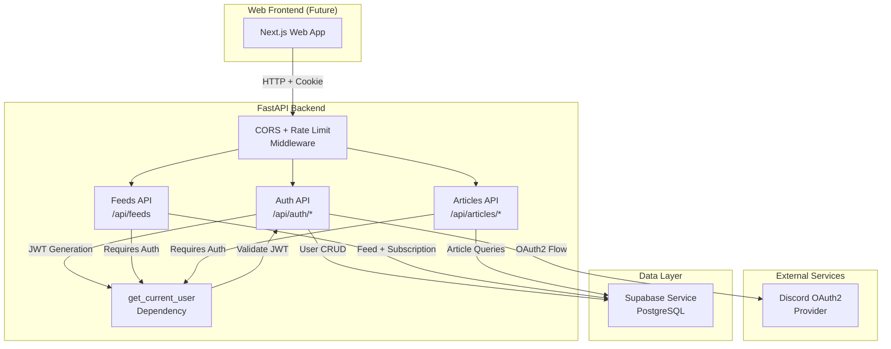
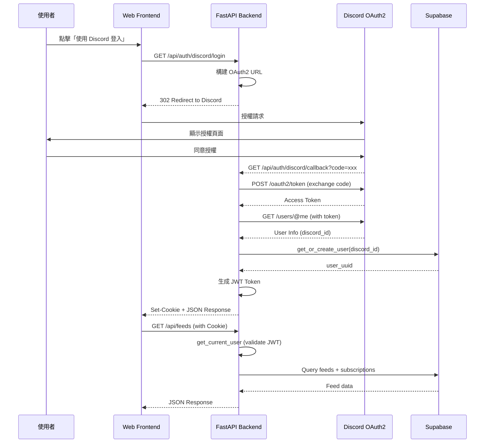

# Design Document: Web API OAuth Authentication

## Overview

本設計文件定義 Tech News Agent Phase 5 的技術架構：Web API OAuth Authentication。此階段將在現有的 FastAPI 後端建立完整的 Discord OAuth2 登入流程、JWT 認證機制，以及個人化的 Web API 端點，為未來的 Next.js Web 前端提供認證和資料存取能力。

### 設計目標

1. **安全認證**：實作 Discord OAuth2 授權流程，讓使用者透過 Discord 帳號登入
2. **無狀態認證**：使用 JWT Token 實現無狀態的 API 認證機制
3. **個人化 API**：提供基於使用者身份的訂閱管理和文章動態 API
4. **跨域支援**：配置 CORS 以支援 Web 前端呼叫
5. **安全性優先**：遵循安全最佳實踐，包括 HttpOnly Cookie、CSRF 防護、速率限制

### 核心功能模組

1. **認證模組 (app/api/auth.py)**
   - Discord OAuth2 登入流程
   - JWT Token 生成與驗證
   - Token 刷新與登出機制
   - `get_current_user` Dependency

2. **訂閱管理模組 (app/api/feeds.py)**
   - 查詢所有 feeds 與訂閱狀態
   - 訂閱切換功能

3. **文章動態模組 (app/api/articles.py)**
   - 個人化文章列表
   - 分頁支援

### 技術棧

- **Web 框架**：FastAPI 0.111.0+
- **認證協議**：OAuth2 (Discord Provider)
- **Token 格式**：JWT (HS256)
- **HTTP 客戶端**：httpx (async)
- **資料驗證**：Pydantic v2
- **CORS 中介軟體**：FastAPI CORSMiddleware
- **速率限制**：slowapi (基於 Flask-Limiter)

## Architecture

### 系統架構圖



### 認證流程



### 資料流程

1. **OAuth2 登入流程**
   - 使用者點擊登入 → 重導向至 Discord
   - Discord 授權 → Callback 帶 code
   - 交換 code 取得 Access Token
   - 使用 Access Token 取得使用者資訊
   - 註冊/查詢使用者 → 生成 JWT
   - 設置 HttpOnly Cookie + 返回 JSON

2. **API 請求流程**
   - 請求帶 JWT (Cookie 或 Header)
   - `get_current_user` Dependency 驗證 JWT
   - 提取 user_id 和 discord_id
   - 執行業務邏輯
   - 返回 JSON 回應

3. **Token 刷新流程**
   - 使用舊 Token 請求刷新
   - 驗證舊 Token 有效性
   - 生成新 Token
   - 將舊 Token 加入黑名單
   - 返回新 Token

4. **登出流程**
   - 驗證當前 Token
   - 將 Token 加入黑名單
   - 清除 Cookie
   - 返回成功訊息

## Components and Interfaces

### 1. 認證模組 (app/api/auth.py)

#### 1.1 Discord OAuth2 登入端點

```python
@router.get("/discord/login")
async def discord_login():
    """
    重導向至 Discord OAuth2 授權頁面

    Returns:
        RedirectResponse: 302 重導向至 Discord

    Raises:
        HTTPException: 500 當環境變數缺失時
    """
```

**實作細節**：

- 從環境變數讀取 `DISCORD_CLIENT_ID`, `DISCORD_REDIRECT_URI`
- 構建 Discord OAuth2 URL: `https://discord.com/api/oauth2/authorize`
- 查詢參數：
  - `client_id`: Discord 應用 ID
  - `redirect_uri`: Callback URL
  - `response_type`: "code"
  - `scope`: "identify"
- 返回 `RedirectResponse(url=auth_url, status_code=302)`

#### 1.2 Discord OAuth2 Callback 端點

```python
@router.get("/discord/callback")
async def discord_callback(
    code: str = Query(...),
    error: Optional[str] = Query(None),
    error_description: Optional[str] = Query(None)
):
    """
    處理 Discord OAuth2 授權回調

    Args:
        code: 授權碼
        error: 錯誤代碼（使用者拒絕授權時）
        error_description: 錯誤描述

    Returns:
        JSONResponse: 包含 access_token 和 Set-Cookie header

    Raises:
        HTTPException: 400 當使用者拒絕授權
        HTTPException: 401 當 token 交換失敗
        HTTPException: 500 當 Discord API 失敗
    """
```

**實作細節**：

1. **錯誤處理**：檢查 `error` 參數，若存在則返回 400
2. **Token 交換**：
   - POST `https://discord.com/api/oauth2/token`
   - Body (form-urlencoded):
     - `client_id`: 從環境變數
     - `client_secret`: 從環境變數
     - `grant_type`: "authorization_code"
     - `code`: 從查詢參數
     - `redirect_uri`: 從環境變數
   - 使用 `httpx.AsyncClient` 發送請求
   - 處理錯誤：401 當交換失敗
3. **取得使用者資訊**：
   - GET `https://discord.com/api/users/@me`
   - Header: `Authorization: Bearer {access_token}`
   - 提取 `id` 欄位作為 `discord_id`
4. **使用者註冊**：
   - 呼叫 `supabase_service.get_or_create_user(discord_id)`
   - 取得 `user_uuid`
5. **生成 JWT**：
   - 呼叫 `create_access_token(user_id=user_uuid, discord_id=discord_id)`
6. **設置 Cookie**：
   - 建立 `Response` 物件
   - 設置 `access_token` Cookie（詳見 1.4）
7. **返回 JSON**：
   - `{"access_token": token, "token_type": "Bearer"}`

#### 1.3 JWT Token 生成

```python
def create_access_token(
    user_id: UUID,
    discord_id: str,
    expires_delta: Optional[timedelta] = None
) -> str:
    """
    生成 JWT Access Token

    Args:
        user_id: 使用者 UUID
        discord_id: Discord 使用者 ID
        expires_delta: 過期時間（預設 7 天）

    Returns:
        JWT Token 字串

    Raises:
        ConfigurationError: 當 JWT_SECRET 未設定時
    """
```

**實作細節**：

- 使用 `python-jose[cryptography]` 套件
- Payload 結構：
  ```python
  {
      "sub": str(user_id),  # Subject: user UUID
      "discord_id": discord_id,
      "exp": datetime.utcnow() + timedelta(days=7),  # Expiration
      "iat": datetime.utcnow()  # Issued At
  }
  ```
- 簽名演算法：HS256
- Secret Key：從環境變數 `JWT_SECRET` 讀取
- 預設過期時間：7 天（604800 秒）

#### 1.4 JWT Token Cookie 設置

```python
def set_token_cookie(response: Response, token: str) -> None:
    """
    設置 JWT Token 為 HttpOnly Cookie

    Args:
        response: FastAPI Response 物件
        token: JWT Token 字串
    """
```

**Cookie 配置**：

- `key`: "access_token"
- `value`: JWT Token
- `httponly`: True（防止 JavaScript 存取）
- `secure`: True（生產環境，要求 HTTPS）
- `samesite`: "lax"（CSRF 防護）
- `max_age`: 604800（7 天，秒）
- `path`: "/"（全站可用）

#### 1.5 JWT Token 驗證 Dependency

```python
async def get_current_user(
    authorization: Optional[str] = Header(None),
    access_token: Optional[str] = Cookie(None)
) -> Dict[str, Any]:
    """
    驗證 JWT Token 並返回當前使用者資訊

    Args:
        authorization: Authorization Header (格式: "Bearer {token}")
        access_token: Cookie 中的 Token

    Returns:
        Dict: {"user_id": UUID, "discord_id": str}

    Raises:
        HTTPException: 401 當 Token 缺失、過期或無效時
    """
```

**實作細節**：

1. **Token 提取**：
   - 優先從 `Authorization` Header 提取（格式：`Bearer {token}`）
   - 若 Header 不存在，從 `access_token` Cookie 提取
   - 若兩者都不存在，拋出 401 "Not authenticated"
2. **Token 驗證**：
   - 使用 `jose.jwt.decode(token, JWT_SECRET, algorithms=["HS256"])`
   - 捕捉例外：
     - `JWTError`: 拋出 401 "Invalid token"
     - `ExpiredSignatureError`: 拋出 401 "Token expired"
3. **黑名單檢查**：
   - 檢查 Token 是否在黑名單中（已登出或已刷新）
   - 若在黑名單，拋出 401 "Token has been revoked"
4. **提取使用者資訊**：
   - 從 Payload 提取 `sub` (user_id) 和 `discord_id`
   - 轉換 `user_id` 為 UUID 物件
5. **返回使用者資訊**：
   - `{"user_id": UUID(payload["sub"]), "discord_id": payload["discord_id"]}`

#### 1.6 Token 刷新端點

```python
@router.post("/refresh")
async def refresh_token(current_user: dict = Depends(get_current_user)):
    """
    刷新 JWT Token

    Args:
        current_user: 當前使用者資訊（從 Dependency 注入）

    Returns:
        JSONResponse: 新的 access_token 和 Set-Cookie header
    """
```

**實作細節**：

1. 驗證當前 Token（透過 `get_current_user` Dependency）
2. 生成新 Token（使用相同的 user_id 和 discord_id）
3. 將舊 Token 加入黑名單
4. 設置新 Token 為 Cookie
5. 返回新 Token JSON

#### 1.7 登出端點

```python
@router.post("/logout")
async def logout(
    current_user: dict = Depends(get_current_user),
    access_token: Optional[str] = Cookie(None)
):
    """
    登出並撤銷 Token

    Args:
        current_user: 當前使用者資訊
        access_token: 當前 Token（用於加入黑名單）

    Returns:
        JSONResponse: {"message": "Logged out successfully"}
    """
```

**實作細節**：

1. 驗證當前 Token（透過 `get_current_user` Dependency）
2. 將 Token 加入黑名單
3. 清除 Cookie（設置 `max_age=0`）
4. 返回成功訊息

#### 1.8 Token 黑名單管理

```python
class TokenBlacklist:
    """
    Token 黑名單管理（記憶體實作）

    使用 set 儲存已撤銷的 Token。
    未來可擴展為 Redis 實作以支援分散式部署。
    """

    def __init__(self):
        self._blacklist: Set[str] = set()
        self._lock = asyncio.Lock()

    async def add(self, token: str) -> None:
        """將 Token 加入黑名單"""
        async with self._lock:
            self._blacklist.add(token)

    async def is_blacklisted(self, token: str) -> bool:
        """檢查 Token 是否在黑名單中"""
        async with self._lock:
            return token in self._blacklist

    async def cleanup_expired(self) -> None:
        """清理過期的 Token（定期執行）"""
        # 解碼所有 Token，移除已過期的
        # 避免記憶體無限增長
```

**實作細節**：

- 使用 Python `set` 儲存 Token 字串
- 使用 `asyncio.Lock` 確保執行緒安全
- 定期清理過期 Token（透過背景任務）
- 未來可替換為 Redis 實作

### 2. 訂閱管理模組 (app/api/feeds.py)

#### 2.1 查詢所有 Feeds 與訂閱狀態

```python
@router.get("/", response_model=List[FeedResponse])
async def list_feeds(current_user: dict = Depends(get_current_user)):
    """
    查詢所有可用的 RSS 來源，並標記使用者訂閱狀態

    Args:
        current_user: 當前使用者資訊（從 Dependency 注入）

    Returns:
        List[FeedResponse]: Feed 列表，包含訂閱狀態

    Raises:
        HTTPException: 500 當資料庫查詢失敗時
    """
```

**實作細節**：

1. **查詢所有 Feeds**：
   - 呼叫 Supabase: `SELECT * FROM feeds WHERE is_active = true ORDER BY category, name`
2. **查詢使用者訂閱**：
   - 呼叫 Supabase: `SELECT feed_id FROM user_subscriptions WHERE user_id = {user_uuid}`
   - 建立訂閱 feed_id 的 Set 以快速查找
3. **組合回應**：
   - 遍歷所有 Feeds
   - 檢查 feed_id 是否在訂閱 Set 中
   - 設置 `is_subscribed` 欄位
4. **返回結果**：
   - 使用 `FeedResponse` Pydantic 模型驗證
   - 按 category 和 name 排序

#### 2.2 訂閱切換端點

```python
@router.post("/subscriptions/toggle", response_model=SubscriptionToggleResponse)
async def toggle_subscription(
    request: SubscriptionToggleRequest,
    current_user: dict = Depends(get_current_user)
):
    """
    切換訂閱狀態（訂閱 ↔ 取消訂閱）

    Args:
        request: 包含 feed_id 的請求體
        current_user: 當前使用者資訊

    Returns:
        SubscriptionToggleResponse: 新的訂閱狀態

    Raises:
        HTTPException: 404 當 feed_id 不存在時
        HTTPException: 422 當請求體無效時
        HTTPException: 500 當資料庫操作失敗時
    """
```

**實作細節**：

1. **驗證 Feed 存在**：
   - 查詢 `feeds` 表確認 feed_id 存在
   - 若不存在，返回 404 "Feed not found"
2. **檢查訂閱狀態**：
   - 查詢 `user_subscriptions` 表
   - 判斷使用者是否已訂閱
3. **切換訂閱**：
   - 若已訂閱：呼叫 `supabase_service.unsubscribe_from_feed(discord_id, feed_id)`
   - 若未訂閱：呼叫 `supabase_service.subscribe_to_feed(discord_id, feed_id)`
4. **返回結果**：
   - `{"feed_id": feed_id, "is_subscribed": new_status}`

### 3. 文章動態模組 (app/api/articles.py)

#### 3.1 個人專屬文章動態端點

```python
@router.get("/me", response_model=ArticleListResponse)
async def get_my_articles(
    page: int = Query(1, ge=1),
    page_size: int = Query(20, ge=1, le=100),
    current_user: dict = Depends(get_current_user)
):
    """
    查詢使用者的個人化文章動態（基於訂閱源）

    Args:
        page: 頁碼（從 1 開始）
        page_size: 每頁文章數（1-100）
        current_user: 當前使用者資訊

    Returns:
        ArticleListResponse: 包含文章列表和分頁資訊

    Raises:
        HTTPException: 422 當分頁參數無效時
        HTTPException: 500 當資料庫查詢失敗時
    """
```

**實作細節**：

1. **查詢使用者訂閱**：
   - 呼叫 `supabase_service.get_user_subscriptions(discord_id)`
   - 提取 feed_id 列表
   - 若無訂閱，返回空列表
2. **查詢文章**：
   - SQL 查詢：
     ```sql
     SELECT
       a.id, a.title, a.url, a.published_at,
       a.tinkering_index, a.ai_summary,
       f.name as feed_name, f.category
     FROM articles a
     JOIN feeds f ON a.feed_id = f.id
     WHERE a.feed_id IN ({feed_ids})
       AND a.published_at >= NOW() - INTERVAL '7 days'
       AND a.tinkering_index IS NOT NULL
     ORDER BY a.tinkering_index DESC, a.published_at DESC
     ```
3. **計算分頁**：
   - `offset = (page - 1) * page_size`
   - `LIMIT page_size OFFSET offset`
4. **計算總數**：
   - 執行 COUNT 查詢取得 `total_count`
   - `has_next_page = (page * page_size) < total_count`
5. **組合回應**：
   - 使用 `ArticleResponse` 模型驗證每篇文章
   - 使用 `ArticleListResponse` 包裝結果
6. **返回結果**：
   ```python
   {
       "articles": [...],
       "page": 1,
       "page_size": 20,
       "total_count": 150,
       "has_next_page": true
   }
   ```

## Data Models

### Pydantic Schema 定義

#### 認證相關 Schema

```python
# app/schemas/auth.py

from pydantic import BaseModel, Field
from uuid import UUID
from typing import Optional

class TokenResponse(BaseModel):
    """JWT Token 回應"""
    access_token: str = Field(..., description="JWT Access Token")
    token_type: str = Field(default="Bearer", description="Token 類型")

class TokenPayload(BaseModel):
    """JWT Token Payload"""
    sub: str = Field(..., description="Subject: User UUID")
    discord_id: str = Field(..., description="Discord 使用者 ID")
    exp: int = Field(..., description="過期時間（Unix timestamp）")
    iat: int = Field(..., description="簽發時間（Unix timestamp）")

class CurrentUser(BaseModel):
    """當前使用者資訊"""
    user_id: UUID = Field(..., description="使用者 UUID")
    discord_id: str = Field(..., description="Discord 使用者 ID")

class ErrorResponse(BaseModel):
    """錯誤回應"""
    error: str = Field(..., description="錯誤代碼或訊息")
    description: Optional[str] = Field(None, description="詳細錯誤描述")
```

#### 訂閱管理相關 Schema

```python
# app/schemas/feed.py

from pydantic import BaseModel, Field, HttpUrl
from uuid import UUID

class FeedResponse(BaseModel):
    """Feed 回應（包含訂閱狀態）"""
    id: UUID = Field(..., description="Feed UUID")
    name: str = Field(..., description="Feed 名稱")
    url: HttpUrl = Field(..., description="RSS/Atom URL")
    category: str = Field(..., description="分類")
    is_subscribed: bool = Field(..., description="使用者是否已訂閱")

class SubscriptionToggleRequest(BaseModel):
    """訂閱切換請求"""
    feed_id: UUID = Field(..., description="Feed UUID")

class SubscriptionToggleResponse(BaseModel):
    """訂閱切換回應"""
    feed_id: UUID = Field(..., description="Feed UUID")
    is_subscribed: bool = Field(..., description="新的訂閱狀態")
```

#### 文章動態相關 Schema

```python
# app/schemas/article.py (擴展現有)

from pydantic import BaseModel, Field, HttpUrl
from uuid import UUID
from datetime import datetime
from typing import List, Optional

class ArticleResponse(BaseModel):
    """文章回應"""
    id: UUID = Field(..., description="文章 UUID")
    title: str = Field(..., description="文章標題")
    url: HttpUrl = Field(..., description="文章 URL")
    published_at: Optional[datetime] = Field(None, description="發布時間")
    tinkering_index: int = Field(..., ge=1, le=5, description="技術複雜度（1-5）")
    ai_summary: Optional[str] = Field(None, description="AI 摘要")
    feed_name: str = Field(..., description="來源名稱")
    category: str = Field(..., description="分類")

class ArticleListResponse(BaseModel):
    """文章列表回應（含分頁）"""
    articles: List[ArticleResponse] = Field(..., description="文章列表")
    page: int = Field(..., ge=1, description="當前頁碼")
    page_size: int = Field(..., ge=1, le=100, description="每頁文章數")
    total_count: int = Field(..., ge=0, description="總文章數")
    has_next_page: bool = Field(..., description="是否有下一頁")
```

### 環境變數配置

```python
# app/core/config.py (擴展現有)

from pydantic_settings import BaseSettings, SettingsConfigDict

class Settings(BaseSettings):
    # ... 現有配置 ...

    # Discord OAuth2 Configuration
    discord_client_id: str
    discord_client_secret: str
    discord_redirect_uri: str

    # JWT Configuration
    jwt_secret: str
    jwt_algorithm: str = "HS256"
    jwt_expiration_days: int = 7

    # CORS Configuration
    cors_origins: str = "http://localhost:3000"  # 逗號分隔

    # Rate Limiting Configuration
    rate_limit_per_minute_unauth: int = 100
    rate_limit_per_minute_auth: int = 300

    # Security Configuration
    cookie_secure: bool = True  # 生產環境使用 HTTPS

    model_config = SettingsConfigDict(
        env_file=".env",
        env_file_encoding="utf-8",
        extra="ignore"
    )

    def validate_jwt_secret(self) -> None:
        """驗證 JWT Secret 長度"""
        if len(self.jwt_secret) < 32:
            raise ValueError("JWT_SECRET must be at least 32 characters")

settings = Settings()
settings.validate_jwt_secret()
```

## Correctness Properties

_A property is a characteristic or behavior that should hold true across all valid executions of a system-essentially, a formal statement about what the system should do. Properties serve as the bridge between human-readable specifications and machine-verifiable correctness guarantees._

### Property 1: OAuth2 URL Construction

_For any_ valid Discord OAuth2 configuration (client_id, redirect_uri), the constructed authorization URL should contain all required parameters (client_id, redirect_uri, response_type=code, scope=identify).

**Validates: Requirements 1.2, 1.3, 1.4, 1.5**

### Property 2: JWT Token Structure

_For any_ user data (user_id, discord_id), the generated JWT Token should decode to a payload containing the correct sub, discord_id, exp, and iat claims, and the signature should be valid when verified with the same secret.

**Validates: Requirements 3.1, 3.2, 3.3, 3.4, 3.5**

### Property 3: JWT Token Round Trip

_For any_ valid JWT Token, decoding and then encoding with the same secret should produce an equivalent token that validates successfully.

**Validates: Requirements 3.1, 3.2, 3.5**

### Property 4: Cookie Security Attributes

_For any_ JWT Token set as a cookie, the cookie should have httponly=True, secure=True (in production), samesite="lax", and max_age=604800.

**Validates: Requirements 4.1, 4.2, 4.3, 4.4, 4.5, 4.6**

### Property 5: Token Validation Consistency

_For any_ valid JWT Token, the get_current_user dependency should extract the same user_id and discord_id that were used to create the token.

**Validates: Requirements 5.1, 5.2, 5.3, 5.8, 5.9**

### Property 6: Token Expiration Enforcement

_For any_ expired JWT Token, the get_current_user dependency should raise HTTPException with status 401 and detail "Token expired".

**Validates: Requirements 5.6**

### Property 7: Invalid Token Rejection

_For any_ JWT Token with invalid signature or malformed structure, the get_current_user dependency should raise HTTPException with status 401.

**Validates: Requirements 5.7**

### Property 8: Feed Subscription Status Accuracy

_For any_ user and set of feeds, the list_feeds endpoint should correctly mark is_subscribed=True for feeds in the user's subscriptions and is_subscribed=False for all others.

**Validates: Requirements 6.1, 6.2, 6.3, 6.4, 6.5**

### Property 9: Subscription Toggle Idempotence

_For any_ user and feed, toggling subscription twice should return to the original state (subscribed → unsubscribed → subscribed, or unsubscribed → subscribed → unsubscribed).

**Validates: Requirements 7.1, 7.2, 7.3, 7.5, 7.6, 7.7**

### Property 10: Article Filtering by Subscription

_For any_ user with subscriptions, the /api/articles/me endpoint should return only articles where feed_id is in the user's subscribed feeds.

**Validates: Requirements 8.1, 8.2, 8.3, 8.4, 8.5**

### Property 11: Article Time Window Filter

_For any_ query to /api/articles/me, all returned articles should have published_at >= 7 days ago.

**Validates: Requirements 8.6**

### Property 12: Pagination Calculation Correctness

_For any_ valid page and page*size parameters, the pagination calculation should satisfy: offset = (page - 1) * page*size, and has_next_page = (page * page_size) < total_count.

**Validates: Requirements 9.1, 9.2, 9.3, 9.5, 9.6, 9.7, 9.9**

### Property 13: CORS Headers Presence

_For any_ API request from an allowed origin, the response should include appropriate CORS headers (Access-Control-Allow-Origin, Access-Control-Allow-Credentials).

**Validates: Requirements 10.1, 10.2, 10.3, 10.4**

### Property 14: Token Refresh Invalidates Old Token

_For any_ valid token, after calling /api/auth/refresh, the old token should be blacklisted and subsequent requests with the old token should return 401.

**Validates: Requirements 13.1, 13.2, 13.3, 13.4, 13.6, 13.7**

### Property 15: Logout Revokes Token

_For any_ authenticated user, after calling /api/auth/logout, the token should be blacklisted and subsequent requests with that token should return 401.

**Validates: Requirements 14.1, 14.2, 14.3, 14.5, 14.6**

### Property 16: Rate Limit Enforcement

_For any_ IP address or authenticated user, when the request count exceeds the configured rate limit within a minute, subsequent requests should return HTTP 429 with appropriate headers.

**Validates: Requirements 15.1, 15.2, 15.3, 15.4, 15.5**

### Property 17: Pydantic Schema Validation

_For any_ API request with invalid data (missing required fields, wrong types, out-of-range values), the system should return HTTP 422 with detailed validation errors.

**Validates: Requirements 17.1, 17.2, 17.3, 17.4, 17.5, 17.6, 17.7, 17.8**

### Property 18: Security Headers Presence

_For any_ API response, the response should include security headers: X-Content-Type-Options, X-Frame-Options, X-XSS-Protection.

**Validates: Requirements 18.5**

### Property 19: Input Validation Prevents Injection

_For any_ user input (feed_id, page, page_size), the system should validate and sanitize inputs using Pydantic models before database queries.

**Validates: Requirements 18.2, 18.3**

### Property 20: Health Check Configuration Validation

_For any_ health check request to /health, the response should include status checks for oauth (client_id, client_secret, redirect_uri present), jwt (JWT_SECRET present and >= 32 chars), and database connectivity.

**Validates: Requirements 20.1, 20.2, 20.3, 20.4**

## Error Handling

### 錯誤處理策略

#### 1. OAuth2 錯誤處理

**使用者拒絕授權**：

- 檢測：`error` 查詢參數存在
- 回應：HTTP 400
- Body: `{"error": "access_denied", "description": "User denied authorization"}`

**Token 交換失敗**：

- 檢測：Discord token endpoint 返回錯誤
- 回應：HTTP 401
- Body: `{"error": "authentication_failed", "description": "Failed to authenticate with Discord"}`
- 日誌：記錄完整錯誤回應（不包含敏感資訊）

**Discord API 失敗**：

- 檢測：Discord /users/@me endpoint 失敗
- 回應：HTTP 500
- Body: `{"error": "internal_error", "description": "Failed to retrieve user information"}`
- 日誌：記錄錯誤和 stack trace

#### 2. JWT 認證錯誤處理

**Token 缺失**：

- 檢測：Authorization Header 和 Cookie 都不存在
- 回應：HTTP 401
- Body: `{"detail": "Not authenticated"}`

**Token 過期**：

- 檢測：`jose.jwt.decode` 拋出 `ExpiredSignatureError`
- 回應：HTTP 401
- Body: `{"detail": "Token expired"}`

**Token 無效**：

- 檢測：`jose.jwt.decode` 拋出 `JWTError`
- 回應：HTTP 401
- Body: `{"detail": "Invalid token"}`

**Token 已撤銷**：

- 檢測：Token 在黑名單中
- 回應：HTTP 401
- Body: `{"detail": "Token has been revoked"}`

#### 3. 資料驗證錯誤處理

**請求體驗證失敗**：

- 檢測：Pydantic 驗證失敗
- 回應：HTTP 422
- Body: FastAPI 自動生成的驗證錯誤詳情
- 範例：
  ```json
  {
    "detail": [
      {
        "loc": ["body", "feed_id"],
        "msg": "field required",
        "type": "value_error.missing"
      }
    ]
  }
  ```

**分頁參數無效**：

- 檢測：page < 1 或 page_size < 1 或 page_size > 100
- 回應：HTTP 422
- Body: Pydantic 驗證錯誤

#### 4. 資料庫錯誤處理

**Feed 不存在**：

- 檢測：查詢 feeds 表返回空結果
- 回應：HTTP 404
- Body: `{"detail": "Feed not found"}`

**資料庫連線失敗**：

- 檢測：Supabase 操作拋出例外
- 回應：HTTP 500
- Body: `{"detail": "Database operation failed"}`
- 日誌：記錄完整錯誤和上下文

**使用者無訂閱**：

- 檢測：user_subscriptions 查詢返回空列表
- 回應：HTTP 200（正常情況）
- Body: `{"articles": [], "page": 1, "page_size": 20, "total_count": 0, "has_next_page": false}`

#### 5. 速率限制錯誤處理

**超過速率限制**：

- 檢測：請求數超過配置的限制
- 回應：HTTP 429
- Headers:
  - `X-RateLimit-Limit`: 限制數量
  - `X-RateLimit-Remaining`: 剩餘數量
  - `X-RateLimit-Reset`: 重置時間（Unix timestamp）
  - `Retry-After`: 重試等待秒數
- Body: `{"error": "Rate limit exceeded", "retry_after": 60}`

#### 6. 配置錯誤處理

**環境變數缺失**：

- 檢測：啟動時 Settings 驗證失敗
- 行為：應用啟動失敗
- 日誌：記錄缺失的環境變數名稱
- 範例：`ConfigurationError: DISCORD_CLIENT_ID is required`

**JWT Secret 過短**：

- 檢測：`len(jwt_secret) < 32`
- 行為：應用啟動失敗
- 日誌：`ConfigurationError: JWT_SECRET must be at least 32 characters`

### 錯誤日誌記錄

所有錯誤都應記錄到日誌系統，包含以下資訊：

**必要欄位**：

- 時間戳
- 日誌等級（ERROR, WARNING, INFO）
- 錯誤訊息
- 錯誤類型（Exception class name）

**上下文資訊**：

- 請求路徑和方法
- 使用者 ID（若已認證）
- Discord ID（若已認證）
- 請求 ID（用於追蹤）

**敏感資訊過濾**：

- 不記錄 JWT Token 完整內容
- 不記錄密碼或 API Keys
- 不記錄完整的 Authorization Header

**範例日誌**：

```
2026-04-04 10:30:15 - ERROR - Token validation failed
{
  "request_id": "abc123",
  "path": "/api/feeds",
  "method": "GET",
  "error_type": "JWTError",
  "error_message": "Signature verification failed",
  "user_id": null,
  "discord_id": null
}
```

## Testing Strategy

### 測試方法

本專案採用**雙重測試策略**：單元測試（Unit Tests）和屬性測試（Property-Based Tests）。

#### 單元測試（Unit Tests）

使用 pytest 撰寫單元測試，專注於：

1. **具體範例測試**：
   - OAuth2 登入流程的成功案例
   - JWT Token 生成和驗證的正常流程
   - API 端點的基本功能

2. **邊界條件測試**：
   - 空訂閱列表
   - 分頁邊界（page=1, 最後一頁）
   - Token 即將過期的情況

3. **錯誤情境測試**：
   - 使用者拒絕 OAuth2 授權
   - Token 過期
   - Feed 不存在
   - 資料庫連線失敗

4. **整合點測試**：
   - FastAPI 路由註冊
   - Dependency 注入
   - Middleware 配置
   - Supabase Service 整合

**範例單元測試**：

```python
def test_discord_login_redirects_to_discord(client):
    """測試 /api/auth/discord/login 重導向至 Discord"""
    response = client.get("/api/auth/discord/login")
    assert response.status_code == 302
    assert "discord.com/api/oauth2/authorize" in response.headers["location"]

def test_get_current_user_with_expired_token(client):
    """測試過期 Token 被拒絕"""
    expired_token = create_expired_token()
    response = client.get(
        "/api/feeds",
        headers={"Authorization": f"Bearer {expired_token}"}
    )
    assert response.status_code == 401
    assert response.json()["detail"] == "Token expired"
```

#### 屬性測試（Property-Based Tests）

使用 Hypothesis 撰寫屬性測試，驗證通用屬性：

**配置**：

- 每個屬性測試最少執行 100 次迭代
- 使用隨機生成的測試資料
- 標記測試以追溯設計文件中的屬性

**測試標記格式**：

```python
# Feature: web-api-oauth-authentication, Property 2: JWT Token Structure
@given(user_id=st.uuids(), discord_id=st.text(min_size=1))
@settings(max_examples=100)
def test_jwt_token_structure(user_id, discord_id):
    """
    Property 2: For any user data, the generated JWT Token should
    decode to a payload containing the correct claims.
    """
    token = create_access_token(user_id, discord_id)
    payload = decode_token(token)

    assert payload["sub"] == str(user_id)
    assert payload["discord_id"] == discord_id
    assert "exp" in payload
    assert "iat" in payload
```

**屬性測試範例**：

```python
# Feature: web-api-oauth-authentication, Property 3: JWT Token Round Trip
@given(user_id=st.uuids(), discord_id=st.text(min_size=1))
@settings(max_examples=100)
def test_jwt_round_trip(user_id, discord_id):
    """
    Property 3: For any valid JWT Token, decoding and encoding
    should produce an equivalent token.
    """
    original_token = create_access_token(user_id, discord_id)
    payload = decode_token(original_token)

    # Remove exp and iat for comparison (they change on re-encoding)
    user_data = {
        "user_id": UUID(payload["sub"]),
        "discord_id": payload["discord_id"]
    }

    new_token = create_access_token(
        user_data["user_id"],
        user_data["discord_id"]
    )
    new_payload = decode_token(new_token)

    assert new_payload["sub"] == payload["sub"]
    assert new_payload["discord_id"] == payload["discord_id"]

# Feature: web-api-oauth-authentication, Property 9: Subscription Toggle Idempotence
@given(
    user_id=st.uuids(),
    feed_id=st.uuids(),
    initial_state=st.booleans()
)
@settings(max_examples=100)
def test_subscription_toggle_idempotence(user_id, feed_id, initial_state):
    """
    Property 9: Toggling subscription twice should return to original state.
    """
    # Setup initial state
    if initial_state:
        subscribe_to_feed(user_id, feed_id)
    else:
        unsubscribe_from_feed(user_id, feed_id)

    # Toggle twice
    toggle_subscription(user_id, feed_id)
    toggle_subscription(user_id, feed_id)

    # Verify back to original state
    is_subscribed = check_subscription(user_id, feed_id)
    assert is_subscribed == initial_state
```

```python
# Feature: web-api-oauth-authentication, Property 12: Pagination Calculation Correctness
@given(
    page=st.integers(min_value=1, max_value=100),
    page_size=st.integers(min_value=1, max_value=100),
    total_count=st.integers(min_value=0, max_value=10000)
)
@settings(max_examples=100)
def test_pagination_calculation(page, page_size, total_count):
    """
    Property 12: Pagination calculations should be mathematically correct.
    """
    offset = (page - 1) * page_size
    has_next_page = (page * page_size) < total_count

    # Verify offset is non-negative
    assert offset >= 0

    # Verify has_next_page logic
    if page * page_size >= total_count:
        assert has_next_page is False
    else:
        assert has_next_page is True

    # Verify offset doesn't exceed total_count unnecessarily
    if offset >= total_count and total_count > 0:
        # This is the last page or beyond
        assert page > (total_count // page_size)
```

### 測試覆蓋目標

- **單元測試覆蓋率**：> 80%
- **屬性測試數量**：至少 20 個屬性（對應設計文件中的 20 個屬性）
- **整合測試**：覆蓋所有 API 端點的完整流程

### 測試環境

**測試資料庫**：

- 使用 Supabase 測試專案或本地 PostgreSQL
- 每個測試前清理資料
- 使用 pytest fixtures 管理測試資料

**Mock 外部服務**：

- Mock Discord OAuth2 API（使用 `responses` 或 `httpx_mock`）
- Mock Supabase Service（使用 dependency override）

**測試配置**：

```python
# conftest.py
@pytest.fixture
def test_settings():
    return Settings(
        discord_client_id="test_client_id",
        discord_client_secret="test_secret",
        discord_redirect_uri="http://localhost:8000/callback",
        jwt_secret="test_secret_at_least_32_characters_long",
        supabase_url="http://localhost:54321",
        supabase_key="test_key"
    )
```

## Security Considerations

### 1. OAuth2 安全性

**State Parameter（未來擴展）**：

- 目前實作使用基本的 OAuth2 流程
- 未來可加入 `state` 參數防止 CSRF 攻擊
- State 應為隨機生成的字串，儲存在 session 中

**Redirect URI 驗證**：

- Discord 會驗證 redirect_uri 是否在應用設定的白名單中
- 確保 DISCORD_REDIRECT_URI 環境變數與 Discord 應用設定一致

**Client Secret 保護**：

- Client Secret 只在後端使用，不暴露給前端
- 儲存在環境變數中，不提交到版本控制

### 2. JWT 安全性

**Secret Key 強度**：

- JWT_SECRET 必須至少 32 字元
- 建議使用 `openssl rand -hex 32` 生成
- 定期輪換（建議每 90 天）

**Token 過期時間**：

- Access Token 有效期：7 天
- 平衡安全性和使用者體驗
- 提供 refresh 機制延長 session

**Token 撤銷**：

- 使用黑名單機制撤銷 Token
- 登出和刷新時將舊 Token 加入黑名單
- 定期清理過期的黑名單項目

**演算法限制**：

- 只使用 HS256 演算法
- 解碼時明確指定 `algorithms=["HS256"]`
- 防止演算法混淆攻擊

### 3. Cookie 安全性

**HttpOnly Flag**：

- 防止 JavaScript 存取 Cookie
- 降低 XSS 攻擊風險

**Secure Flag**：

- 生產環境強制使用 HTTPS
- 開發環境可設為 False

**SameSite Attribute**：

- 設為 "lax" 平衡安全性和可用性
- 防止大部分 CSRF 攻擊
- 允許從外部連結導航時帶 Cookie

**Domain 和 Path**：

- Path 設為 "/" 讓所有 API 端點可用
- 不設定 Domain（預設為當前域名）

### 4. CORS 安全性

**Origin 白名單**：

- 只允許配置的 origins
- 生產環境：`https://yourdomain.com`
- 開發環境：`http://localhost:3000`

**Credentials 支援**：

- 允許發送 Cookie（`allow_credentials=True`）
- 必須明確指定 origins，不能使用 `*`

**預檢請求**：

- 自動處理 OPTIONS 請求
- 快取預檢結果（`max_age`）

### 5. 輸入驗證

**Pydantic 驗證**：

- 所有請求體使用 Pydantic 模型驗證
- 自動拒絕無效資料（HTTP 422）
- 防止類型混淆攻擊

**查詢參數驗證**：

- 使用 FastAPI Query 驗證器
- 設定範圍限制（ge, le）
- 防止整數溢位和負數攻擊

**UUID 驗證**：

- 使用 Pydantic UUID 類型
- 自動驗證格式
- 防止 SQL 注入

### 6. 速率限制

**防止暴力破解**：

- 限制登入端點的請求頻率
- 防止 Token 暴力猜測

**防止 DoS 攻擊**：

- 限制每個 IP 的請求數
- 認證使用者有更高的限制

**限制配置**：

- 未認證端點：100 requests/minute/IP
- 認證端點：300 requests/minute/user
- 可透過環境變數調整

### 7. 安全 Headers

**X-Content-Type-Options**：

- 設為 "nosniff"
- 防止 MIME 類型嗅探攻擊

**X-Frame-Options**：

- 設為 "DENY"
- 防止 Clickjacking 攻擊

**X-XSS-Protection**：

- 設為 "1; mode=block"
- 啟用瀏覽器 XSS 過濾器

**實作方式**：

```python
@app.middleware("http")
async def add_security_headers(request: Request, call_next):
    response = await call_next(request)
    response.headers["X-Content-Type-Options"] = "nosniff"
    response.headers["X-Frame-Options"] = "DENY"
    response.headers["X-XSS-Protection"] = "1; mode=block"
    return response
```

### 8. 敏感資訊保護

**日誌過濾**：

- 不記錄完整 Token
- 不記錄密碼或 API Keys
- 不記錄 Authorization Header

**錯誤訊息**：

- 不暴露內部實作細節
- 不暴露 Stack Trace 給使用者
- 使用通用錯誤訊息

**環境變數**：

- 敏感配置儲存在環境變數
- 不提交 .env 到版本控制
- 使用 .env.example 作為範本

## Integration with Existing Services

### 與 Supabase Service 整合

**使用現有方法**：

- `get_or_create_user(discord_id)`: OAuth2 callback 中註冊使用者
- `get_user_subscriptions(discord_id)`: 查詢使用者訂閱
- `subscribe_to_feed(discord_id, feed_id)`: 訂閱 feed
- `unsubscribe_from_feed(discord_id, feed_id)`: 取消訂閱

**資料庫查詢**：

- 直接使用 `supabase_service.client` 執行複雜查詢
- 例如：JOIN feeds 和 articles 表
- 利用現有的錯誤處理機制

**範例整合**：

```python
# app/api/articles.py
from app.services.supabase_service import SupabaseService

@router.get("/me")
async def get_my_articles(
    page: int = Query(1, ge=1),
    page_size: int = Query(20, ge=1, le=100),
    current_user: dict = Depends(get_current_user)
):
    supabase = SupabaseService()

    # 使用現有方法查詢訂閱
    subscriptions = await supabase.get_user_subscriptions(
        current_user["discord_id"]
    )

    if not subscriptions:
        return ArticleListResponse(
            articles=[],
            page=page,
            page_size=page_size,
            total_count=0,
            has_next_page=False
        )

    # 提取 feed_ids
    feed_ids = [str(sub.feed_id) for sub in subscriptions]

    # 直接使用 client 執行複雜查詢
    # ... (查詢邏輯)
```

### 與 FastAPI 主應用整合

**路由註冊**：

```python
# app/main.py
from app.api import auth, feeds, articles

app.include_router(auth.router, prefix="/api/auth", tags=["auth"])
app.include_router(feeds.router, prefix="/api", tags=["feeds"])
app.include_router(articles.router, prefix="/api/articles", tags=["articles"])
```

**Middleware 配置**：

```python
# app/main.py
from fastapi.middleware.cors import CORSMiddleware
from slowapi import Limiter, _rate_limit_exceeded_handler
from slowapi.util import get_remote_address
from slowapi.errors import RateLimitExceeded

# CORS Middleware
app.add_middleware(
    CORSMiddleware,
    allow_origins=settings.cors_origins.split(","),
    allow_credentials=True,
    allow_methods=["GET", "POST", "PUT", "DELETE", "OPTIONS"],
    allow_headers=["Content-Type", "Authorization"],
    expose_headers=["Set-Cookie"]
)

# Rate Limiting
limiter = Limiter(key_func=get_remote_address)
app.state.limiter = limiter
app.add_exception_handler(RateLimitExceeded, _rate_limit_exceeded_handler)

# Security Headers Middleware
@app.middleware("http")
async def add_security_headers(request: Request, call_next):
    response = await call_next(request)
    response.headers["X-Content-Type-Options"] = "nosniff"
    response.headers["X-Frame-Options"] = "DENY"
    response.headers["X-XSS-Protection"] = "1; mode=block"
    return response
```

**健康檢查擴展**：

```python
# app/main.py
@app.get("/health")
async def health_check():
    """擴展健康檢查以包含 OAuth2 和 JWT 配置驗證"""
    health_status = {
        "status": "healthy",
        "services": {
            "database": "healthy",
            "oauth": "healthy",
            "jwt": "healthy"
        }
    }

    # 檢查 OAuth2 配置
    if not all([
        settings.discord_client_id,
        settings.discord_client_secret,
        settings.discord_redirect_uri
    ]):
        health_status["services"]["oauth"] = "unhealthy"
        health_status["status"] = "degraded"

    # 檢查 JWT 配置
    if not settings.jwt_secret or len(settings.jwt_secret) < 32:
        health_status["services"]["jwt"] = "unhealthy"
        health_status["status"] = "degraded"

    # 檢查資料庫連線（使用現有邏輯）
    try:
        supabase = SupabaseService()
        # 連線驗證在 __init__ 中自動執行
    except Exception:
        health_status["services"]["database"] = "unhealthy"
        health_status["status"] = "degraded"

    status_code = 200 if health_status["status"] != "unhealthy" else 503
    return JSONResponse(content=health_status, status_code=status_code)
```

### 與 Discord Bot 共存

**獨立運作**：

- Web API 和 Discord Bot 共用相同的資料庫
- 兩者可獨立啟動和運行
- 使用相同的 Supabase Service 層

**資料一致性**：

- 使用者透過 Web 或 Discord 訂閱的 feeds 會同步
- 閱讀清單在兩個介面間共享
- 使用 discord_id 作為使用者識別

**未來擴展**：

- 可在 Web 介面顯示 Discord 使用者頭像
- 可在 Discord Bot 中提供 Web 連結
- 統一的使用者體驗

## API Endpoints Summary

### 認證端點

| Method | Path                         | Auth Required | Description             |
| ------ | ---------------------------- | ------------- | ----------------------- |
| GET    | `/api/auth/discord/login`    | No            | 重導向至 Discord OAuth2 |
| GET    | `/api/auth/discord/callback` | No            | 處理 OAuth2 callback    |
| POST   | `/api/auth/refresh`          | Yes           | 刷新 JWT Token          |
| POST   | `/api/auth/logout`           | Yes           | 登出並撤銷 Token        |

### 訂閱管理端點

| Method | Path                        | Auth Required | Description               |
| ------ | --------------------------- | ------------- | ------------------------- |
| GET    | `/api/feeds`                | Yes           | 查詢所有 feeds 與訂閱狀態 |
| POST   | `/api/subscriptions/toggle` | Yes           | 切換訂閱狀態              |

### 文章動態端點

| Method | Path               | Auth Required | Description                  |
| ------ | ------------------ | ------------- | ---------------------------- |
| GET    | `/api/articles/me` | Yes           | 查詢個人化文章動態（含分頁） |

### 系統端點

| Method | Path      | Auth Required | Description                    |
| ------ | --------- | ------------- | ------------------------------ |
| GET    | `/health` | No            | 健康檢查（含 OAuth2/JWT 驗證） |
| GET    | `/docs`   | No            | OpenAPI 文件（Swagger UI）     |
| GET    | `/redoc`  | No            | OpenAPI 文件（ReDoc）          |

## Implementation Roadmap

### Phase 1: 基礎認證（優先）

1. **環境配置**
   - 擴展 `app/core/config.py` 加入 OAuth2 和 JWT 配置
   - 驗證環境變數
   - 建立 `.env.example` 範本

2. **JWT 工具函數**
   - 實作 `create_access_token()`
   - 實作 `decode_token()`
   - 實作 Token 黑名單管理

3. **OAuth2 登入流程**
   - 實作 `/api/auth/discord/login` 端點
   - 實作 `/api/auth/discord/callback` 端點
   - 整合 Discord API 呼叫

4. **認證 Dependency**
   - 實作 `get_current_user()` Dependency
   - 支援 Header 和 Cookie 兩種方式
   - 實作 Token 驗證邏輯

### Phase 2: 訂閱管理 API

1. **Pydantic Schema**
   - 定義 `FeedResponse`
   - 定義 `SubscriptionToggleRequest/Response`

2. **Feeds 端點**
   - 實作 `/api/feeds` 端點
   - 整合 Supabase Service
   - 實作訂閱狀態標記邏輯

3. **訂閱切換端點**
   - 實作 `/api/subscriptions/toggle` 端點
   - 整合現有的 subscribe/unsubscribe 方法

### Phase 3: 文章動態 API

1. **Pydantic Schema**
   - 定義 `ArticleResponse`
   - 定義 `ArticleListResponse`

2. **文章動態端點**
   - 實作 `/api/articles/me` 端點
   - 實作分頁邏輯
   - 實作文章過濾和排序

### Phase 4: 安全性強化

1. **CORS 配置**
   - 配置 CORSMiddleware
   - 設定允許的 origins

2. **速率限制**
   - 整合 slowapi
   - 配置不同端點的限制

3. **安全 Headers**
   - 實作 Security Headers Middleware
   - 配置 Cookie 安全屬性

### Phase 5: Token 管理

1. **Token 刷新**
   - 實作 `/api/auth/refresh` 端點
   - 實作黑名單機制

2. **登出功能**
   - 實作 `/api/auth/logout` 端點
   - 清除 Cookie

3. **黑名單清理**
   - 實作定期清理過期 Token 的背景任務

### Phase 6: 測試與文件

1. **單元測試**
   - 撰寫認證流程測試
   - 撰寫 API 端點測試
   - 撰寫錯誤處理測試

2. **屬性測試**
   - 撰寫 20 個屬性測試
   - 對應設計文件中的屬性

3. **API 文件**
   - 完善 OpenAPI 描述
   - 加入範例請求和回應
   - 測試 Swagger UI 和 ReDoc

### Phase 7: 健康檢查與監控

1. **健康檢查擴展**
   - 擴展 `/health` 端點
   - 加入 OAuth2 和 JWT 配置檢查

2. **日誌記錄**
   - 實作結構化日誌
   - 過濾敏感資訊
   - 加入請求 ID 追蹤

## Dependencies

### 新增 Python 套件

```txt
# requirements.txt 新增項目

# JWT 認證
python-jose[cryptography]==3.3.0

# HTTP 客戶端（用於 Discord API）
httpx==0.27.0

# 速率限制
slowapi==0.1.9

# 已有的套件（確認版本）
fastapi==0.111.0
pydantic==2.7.0
pydantic-settings==2.2.1
```

### Discord 應用設定

在 Discord Developer Portal 設定：

1. **OAuth2 Redirect URIs**：
   - 開發環境：`http://localhost:8000/api/auth/discord/callback`
   - 生產環境：`https://yourdomain.com/api/auth/discord/callback`

2. **OAuth2 Scopes**：
   - `identify`：取得使用者基本資訊

3. **Bot Permissions**（已有）：
   - 保持現有的 Discord Bot 權限不變

## Performance Considerations

### 回應時間目標

| 端點                         | 目標時間 | 說明                  |
| ---------------------------- | -------- | --------------------- |
| `/api/auth/discord/login`    | < 100ms  | 簡單重導向            |
| `/api/auth/discord/callback` | < 2s     | 包含 Discord API 呼叫 |
| `/api/auth/refresh`          | < 200ms  | JWT 生成              |
| `/api/auth/logout`           | < 100ms  | 黑名單操作            |
| `/api/feeds`                 | < 500ms  | 資料庫查詢 + JOIN     |
| `/api/subscriptions/toggle`  | < 300ms  | 單筆資料庫操作        |
| `/api/articles/me`           | < 1s     | 複雜查詢 + 分頁       |

### 優化策略

**資料庫查詢優化**：

- 使用索引加速查詢（feeds, user_subscriptions, articles 表已有索引）
- 限制 JOIN 深度
- 使用分頁減少資料傳輸

**HTTP 客戶端優化**：

- 使用 `httpx.AsyncClient` 非同步呼叫 Discord API
- 設定合理的 timeout（30 秒）
- 重用 HTTP 連線池

**Token 驗證優化**：

- JWT 驗證是 CPU 密集型操作
- 考慮快取驗證結果（短時間內）
- 使用高效的 jose 庫

**黑名單優化**：

- 使用 Set 資料結構（O(1) 查找）
- 定期清理過期項目
- 未來可遷移至 Redis

### 擴展性考量

**水平擴展**：

- FastAPI 應用是無狀態的（除了黑名單）
- 可部署多個實例
- 使用 Load Balancer 分散流量

**黑名單分散式方案**：

- 當前實作：記憶體 Set（單機）
- 未來方案：Redis（分散式）
- 遷移路徑：抽象 TokenBlacklist 介面

**資料庫連線池**：

- Supabase Client 內建連線池管理
- 監控連線數使用情況
- 必要時調整連線池大小

## Deployment Considerations

### 環境變數配置

**開發環境 (.env.development)**：

```bash
# Discord OAuth2
DISCORD_CLIENT_ID=your_dev_client_id
DISCORD_CLIENT_SECRET=your_dev_client_secret
DISCORD_REDIRECT_URI=http://localhost:8000/api/auth/discord/callback

# JWT
JWT_SECRET=your_dev_secret_at_least_32_characters_long
JWT_ALGORITHM=HS256
JWT_EXPIRATION_DAYS=7

# CORS
CORS_ORIGINS=http://localhost:3000,http://localhost:8000

# Security
COOKIE_SECURE=false

# Rate Limiting
RATE_LIMIT_PER_MINUTE_UNAUTH=100
RATE_LIMIT_PER_MINUTE_AUTH=300

# Supabase (已有)
SUPABASE_URL=your_supabase_url
SUPABASE_KEY=your_supabase_key
```

**生產環境 (.env.production)**：

```bash
# Discord OAuth2
DISCORD_CLIENT_ID=your_prod_client_id
DISCORD_CLIENT_SECRET=your_prod_client_secret
DISCORD_REDIRECT_URI=https://yourdomain.com/api/auth/discord/callback

# JWT
JWT_SECRET=your_prod_secret_generated_with_openssl_rand
JWT_ALGORITHM=HS256
JWT_EXPIRATION_DAYS=7

# CORS
CORS_ORIGINS=https://yourdomain.com

# Security
COOKIE_SECURE=true

# Rate Limiting
RATE_LIMIT_PER_MINUTE_UNAUTH=100
RATE_LIMIT_PER_MINUTE_AUTH=300

# Supabase (已有)
SUPABASE_URL=your_prod_supabase_url
SUPABASE_KEY=your_prod_supabase_key
```

### Docker 部署

**Dockerfile 更新**（無需修改，已支援）：

```dockerfile
# 現有 Dockerfile 已包含所有依賴
# 只需更新 requirements.txt
```

**docker-compose.yml 更新**：

```yaml
version: '3.8'

services:
  app:
    build: .
    ports:
      - '8000:8000'
    environment:
      # 從 .env 檔案載入
      - DISCORD_CLIENT_ID=${DISCORD_CLIENT_ID}
      - DISCORD_CLIENT_SECRET=${DISCORD_CLIENT_SECRET}
      - DISCORD_REDIRECT_URI=${DISCORD_REDIRECT_URI}
      - JWT_SECRET=${JWT_SECRET}
      - CORS_ORIGINS=${CORS_ORIGINS}
      - COOKIE_SECURE=${COOKIE_SECURE}
      # ... 其他環境變數
    env_file:
      - .env
```

### 健康檢查與監控

**Kubernetes Liveness Probe**：

```yaml
livenessProbe:
  httpGet:
    path: /health
    port: 8000
  initialDelaySeconds: 30
  periodSeconds: 10
```

**Kubernetes Readiness Probe**：

```yaml
readinessProbe:
  httpGet:
    path: /health
    port: 8000
  initialDelaySeconds: 5
  periodSeconds: 5
```

**監控指標**：

- API 請求數和回應時間
- 認證成功/失敗率
- Token 刷新頻率
- 速率限制觸發次數
- 資料庫查詢時間

### 安全性檢查清單

部署前確認：

- [ ] JWT_SECRET 已設定且 >= 32 字元
- [ ] COOKIE_SECURE 在生產環境設為 true
- [ ] CORS_ORIGINS 只包含信任的域名
- [ ] Discord Redirect URI 與環境變數一致
- [ ] 敏感資訊不在日誌中
- [ ] 速率限制已啟用
- [ ] 安全 Headers 已配置
- [ ] HTTPS 已啟用（生產環境）
- [ ] 資料庫連線使用 SSL
- [ ] 環境變數不在版本控制中

## Future Enhancements

### 短期改進（Phase 6）

1. **OAuth2 State Parameter**
   - 加入 state 參數防止 CSRF
   - 使用 session 或 Redis 儲存 state

2. **Remember Me 功能**
   - 提供更長的 Token 有效期選項
   - 使用 Refresh Token 機制

3. **多因素認證（MFA）**
   - 整合 TOTP（Time-based One-Time Password）
   - 要求高權限操作時驗證

### 中期改進（Phase 7-8）

1. **Redis 黑名單**
   - 遷移至 Redis 實作
   - 支援分散式部署
   - 自動過期機制

2. **OAuth2 Provider 擴展**
   - 支援 Google OAuth2
   - 支援 GitHub OAuth2
   - 統一的認證介面

3. **API 版本控制**
   - 引入 `/api/v1/` 路徑
   - 支援多版本並存
   - 平滑升級路徑

4. **WebSocket 支援**
   - 即時通知新文章
   - 即時訂閱狀態更新
   - 使用 JWT 認證 WebSocket

### 長期改進（Phase 9+）

1. **GraphQL API**
   - 提供 GraphQL 端點
   - 更靈活的資料查詢
   - 減少 over-fetching

2. **API Gateway**
   - 統一的 API 入口
   - 進階速率限制
   - API 分析和監控

3. **微服務架構**
   - 拆分認證服務
   - 拆分訂閱服務
   - 拆分文章服務

## Conclusion

本設計文件定義了 Tech News Agent Phase 5 的完整技術架構，包含：

1. **認證系統**：基於 Discord OAuth2 和 JWT 的安全認證機制
2. **API 端點**：訂閱管理和文章動態的 RESTful API
3. **安全性**：多層次的安全防護措施
4. **測試策略**：單元測試和屬性測試的雙重保障
5. **整合方案**：與現有 Supabase Service 和 Discord Bot 的無縫整合

此設計為未來的 Next.js Web 前端提供了堅實的後端基礎，同時保持了系統的可擴展性和安全性。

---

**文件版本**：1.0.0
**最後更新**：2026-04-04
**作者**：Kiro AI Assistant
