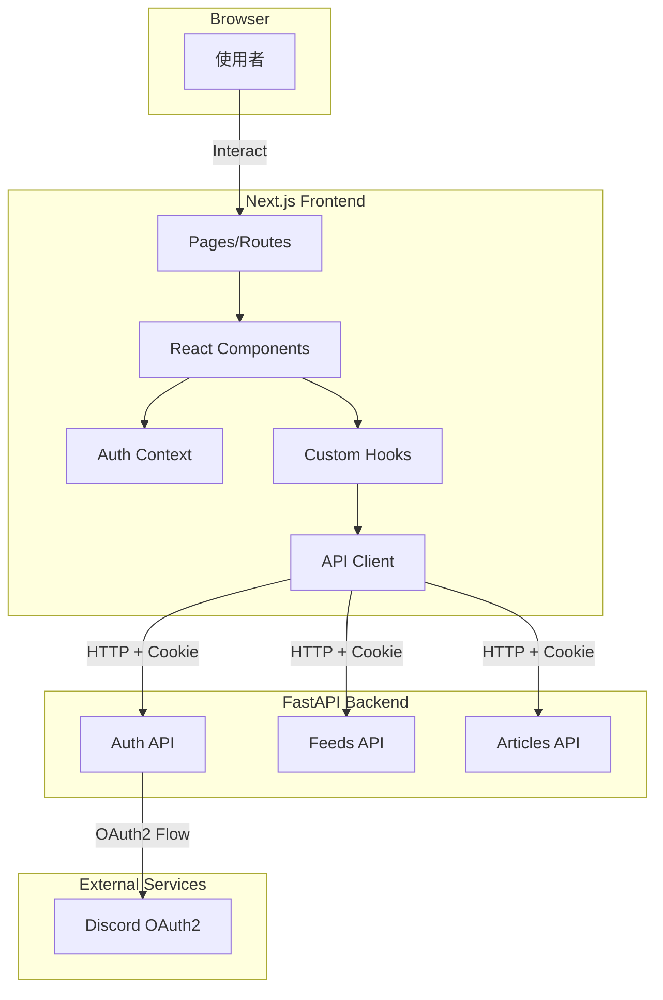
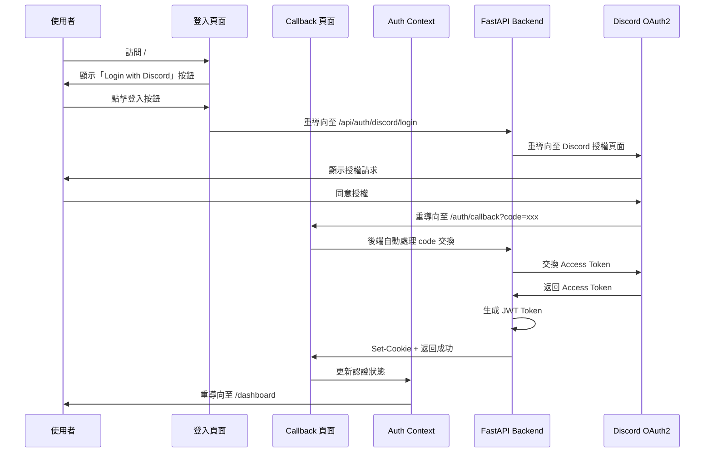
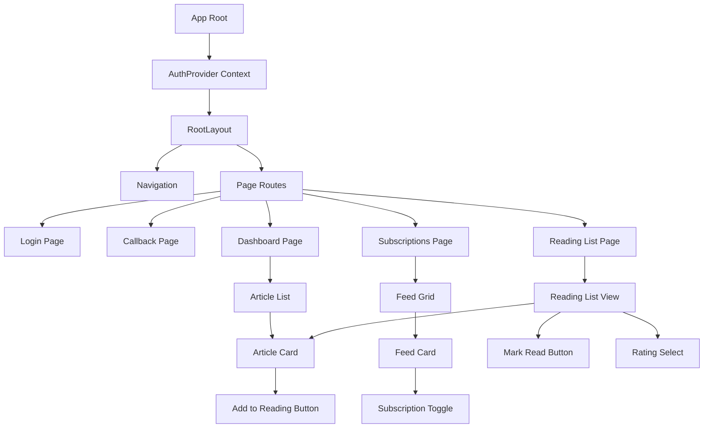
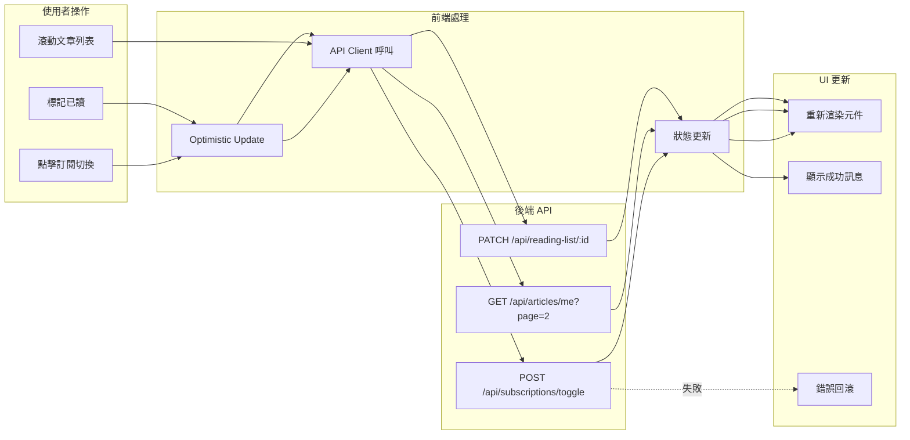

# Design Document: Web Dashboard Frontend

## Overview

本設計文件定義 Tech News Agent Phase 6 的技術架構：Web Dashboard Frontend（網頁控制台前端）。此階段將建立一個基於 Next.js 14+ 的現代化 Web 前端應用，提供與 Discord Bot 功能對等但更適合桌面瀏覽的使用者體驗。

### 設計目標

1. **現代化前端架構**：使用 Next.js 14+ App Router、TypeScript、TailwindCSS 建立可維護的前端應用
2. **無縫認證整合**：整合 Phase 5 的 Discord OAuth2 和 JWT 認證機制
3. **直覺的使用者介面**：提供清晰的訂閱管理、文章瀏覽和閱讀清單功能
4. **響應式設計**：支援桌面、平板和行動裝置
5. **效能優化**：實作 Code Splitting、Lazy Loading、無限滾動和快取策略
6. **可訪問性**：符合 WCAG AA 標準，支援鍵盤導航和螢幕閱讀器

### 核心功能模組

1. **認證模組 (app/auth/)**
   - Discord OAuth2 登入頁面
   - OAuth Callback 處理
   - 全域認證狀態管理（React Context）
   - Protected Route 機制

2. **訂閱管理模組 (app/subscriptions/)**
   - Feed 列表顯示
   - 訂閱切換功能
   - 搜尋與分類篩選

3. **文章動態模組 (app/articles/ 或 app/dashboard/)**
   - 個人化文章列表
   - 無限滾動載入
   - 分類與評分篩選

4. **閱讀清單模組 (app/reading-list/)**
   - 閱讀清單顯示
   - 標記已讀功能
   - 文章評分功能

5. **共用元件模組 (components/)**
   - FeedCard 元件
   - ArticleCard 元件
   - Navigation 元件
   - Loading Skeleton 元件
   - Error Boundary 元件

6. **API 客戶端模組 (lib/api/)**
   - API Client 封裝
   - 錯誤處理
   - 請求攔截器

### 技術棧

- **前端框架**：Next.js 14+（App Router）
- **程式語言**：TypeScript 5+
- **樣式框架**：TailwindCSS 3+
- **UI 元件庫**：shadcn/ui（基於 Radix UI）
- **狀態管理**：React Context API
- **HTTP 客戶端**：fetch API（Next.js 內建）
- **表單處理**：React Hook Form + Zod
- **日期處理**：date-fns
- **圖示**：Lucide React

## Architecture

### 系統架構圖



### 認證流程圖



### 元件樹狀圖



### 資料流程圖



### 目錄結構

```
tech-news-agent/
├── backend/                       # FastAPI 後端
│   ├── app/                       # 應用程式碼
│   ├── requirements.txt           # Python 依賴
│   ├── Dockerfile                 # 後端 Docker 配置
│   └── .env                       # 後端環境變數
├── frontend/                      # Next.js 前端
│   ├── app/
│   │   ├── layout.tsx             # Root Layout（包含 AuthProvider）
│   │   ├── page.tsx               # 登入頁面（/）
│   │   ├── auth/
│   │   │   └── callback/
│   │   │       └── page.tsx       # OAuth Callback 頁面
│   │   ├── dashboard/
│   │   │   └── page.tsx           # 文章動態頁面
│   │   ├── subscriptions/
│   │   │   └── page.tsx           # 訂閱管理頁面
│   │   └── reading-list/
│   │       └── page.tsx           # 閱讀清單頁面
│   ├── components/
│   │   ├── ui/                    # shadcn/ui 元件
│   │   │   ├── button.tsx
│   │   │   ├── card.tsx
│   │   │   ├── skeleton.tsx
│   │   │   └── ...
│   │   ├── FeedCard.tsx           # Feed 卡片元件
│   │   ├── ArticleCard.tsx        # Article 卡片元件
│   │   ├── Navigation.tsx         # 導航列元件
│   │   ├── ProtectedRoute.tsx     # 受保護路由元件
│   │   └── ErrorBoundary.tsx      # 錯誤邊界元件
│   ├── lib/
│   │   ├── api/
│   │   │   ├── client.ts          # API Client 基礎配置
│   │   │   ├── auth.ts            # 認證相關 API
│   │   │   ├── feeds.ts           # 訂閱相關 API
│   │   │   └── articles.ts        # 文章相關 API
│   │   ├── hooks/
│   │   │   ├── useAuth.ts         # 認證 Hook
│   │   │   ├── useFeeds.ts        # Feeds Hook
│   │   │   └── useInfiniteScroll.ts # 無限滾動 Hook
│   │   └── utils/
│   │       ├── formatDate.ts      # 日期格式化
│   │       └── cn.ts              # className 合併工具
│   ├── contexts/
│   │   └── AuthContext.tsx        # 認證 Context
│   ├── types/
│   │   ├── auth.ts                # 認證相關型別
│   │   ├── feed.ts                # Feed 相關型別
│   │   └── article.ts             # Article 相關型別
│   ├── public/
│   │   └── discord-logo.svg       # Discord Logo
│   ├── .env.example               # 環境變數範例
│   ├── .env.local                 # 本地環境變數
│   ├── next.config.js             # Next.js 配置
│   ├── tailwind.config.ts         # TailwindCSS 配置
│   ├── tsconfig.json              # TypeScript 配置
│   ├── Dockerfile                 # 前端 Docker 配置
│   └── package.json               # 專案依賴
└── docker-compose.yml             # Docker Compose 配置
```

## Components and Interfaces

### 1. 認證模組

#### 1.1 Auth Context (contexts/AuthContext.tsx)

```typescript
interface AuthContextType {
  isAuthenticated: boolean;
  user: User | null;
  loading: boolean;
  login: () => void;
  logout: () => Promise<void>;
  checkAuth: () => Promise<void>;
}

interface User {
  id: string;
  discordId: string;
  username?: string;
  avatar?: string;
}
```

**實作細節**：

- 使用 React Context API 建立全域認證狀態
- `isAuthenticated`: 使用者是否已登入
- `user`: 使用者資訊（從 JWT payload 或 API 取得）
- `loading`: 認證檢查進行中
- `login()`: 重導向至 FastAPI 登入端點
- `logout()`: 呼叫登出 API 並清除狀態
- `checkAuth()`: 驗證 JWT Token 有效性

**初始化流程**：

1. 元件掛載時呼叫 `checkAuth()`
2. 檢查 HttpOnly Cookie 是否存在（透過 API 呼叫）
3. 若 Token 有效，設置 `isAuthenticated = true` 並載入使用者資訊
4. 若 Token 無效或不存在，設置 `isAuthenticated = false`

#### 1.2 useAuth Hook (lib/hooks/useAuth.ts)

```typescript
export function useAuth(): AuthContextType {
  const context = useContext(AuthContext);
  if (!context) {
    throw new Error('useAuth must be used within AuthProvider');
  }
  return context;
}
```

**使用範例**：

```typescript
function MyComponent() {
  const { isAuthenticated, user, logout } = useAuth();

  if (!isAuthenticated) {
    return <div>Please login</div>;
  }

  return <div>Welcome, {user?.username}</div>;
}
```

#### 1.3 登入頁面 (app/page.tsx)

```typescript
export default function LoginPage() {
  const { isAuthenticated } = useAuth();
  const router = useRouter();

  useEffect(() => {
    if (isAuthenticated) {
      router.push('/dashboard');
    }
  }, [isAuthenticated]);

  const handleLogin = () => {
    window.location.href = `${process.env.NEXT_PUBLIC_API_BASE_URL}/api/auth/discord/login`;
  };

  return (
    <div className="flex min-h-screen items-center justify-center">
      <Card>
        <CardHeader>
          <CardTitle>Tech News Agent</CardTitle>
          <CardDescription>
            使用 Discord 帳號登入以管理您的技術資訊訂閱
          </CardDescription>
        </CardHeader>
        <CardContent>
          <Button onClick={handleLogin} className="w-full">
            <DiscordIcon className="mr-2" />
            Login with Discord
          </Button>
        </CardContent>
      </Card>
    </div>
  );
}
```

#### 1.4 OAuth Callback 頁面 (app/auth/callback/page.tsx)

```typescript
export default function CallbackPage() {
  const { checkAuth } = useAuth();
  const router = useRouter();
  const searchParams = useSearchParams();
  const [error, setError] = useState<string | null>(null);

  useEffect(() => {
    const handleCallback = async () => {
      const errorParam = searchParams.get('error');

      if (errorParam) {
        setError('Authentication failed. Please try again.');
        return;
      }

      // FastAPI 已經處理 code 交換並設置 Cookie
      // 我們只需要更新前端狀態
      try {
        await checkAuth();
        router.push('/dashboard');
      } catch (err) {
        setError('Failed to authenticate. Please try again.');
      }
    };

    handleCallback();
  }, []);

  if (error) {
    return (
      <div className="flex min-h-screen items-center justify-center">
        <Card>
          <CardHeader>
            <CardTitle>Authentication Error</CardTitle>
          </CardHeader>
          <CardContent>
            <p>{error}</p>
            <Button onClick={() => router.push('/')}>
              Back to Login
            </Button>
          </CardContent>
        </Card>
      </div>
    );
  }

  return (
    <div className="flex min-h-screen items-center justify-center">
      <Spinner />
      <p>Authenticating...</p>
    </div>
  );
}
```

#### 1.5 Protected Route 元件 (components/ProtectedRoute.tsx)

```typescript
export function ProtectedRoute({ children }: { children: React.ReactNode }) {
  const { isAuthenticated, loading } = useAuth();
  const router = useRouter();
  const pathname = usePathname();

  useEffect(() => {
    if (!loading && !isAuthenticated) {
      // 儲存目標路徑以便登入後重導向
      sessionStorage.setItem('redirectAfterLogin', pathname);
      router.push('/');
    }
  }, [isAuthenticated, loading, pathname]);

  if (loading) {
    return <LoadingScreen />;
  }

  if (!isAuthenticated) {
    return null;
  }

  return <>{children}</>;
}
```

### 2. API 客戶端模組

#### 2.1 API Client 基礎配置 (lib/api/client.ts)

```typescript
const API_BASE_URL = process.env.NEXT_PUBLIC_API_BASE_URL;

interface ApiError {
  error: string;
  description?: string;
  detail?: string;
}

export class ApiClient {
  private baseURL: string;

  constructor(baseURL: string = API_BASE_URL!) {
    this.baseURL = baseURL;
  }

  private async request<T>(
    endpoint: string,
    options: RequestInit = {},
  ): Promise<T> {
    const url = `${this.baseURL}${endpoint}`;

    const config: RequestInit = {
      ...options,
      credentials: 'include', // 包含 Cookie
      headers: {
        'Content-Type': 'application/json',
        ...options.headers,
      },
    };

    try {
      const response = await fetch(url, config);

      if (response.status === 401) {
        // Token 過期或無效，觸發登出
        window.dispatchEvent(new Event('unauthorized'));
        throw new Error('Unauthorized');
      }

      if (!response.ok) {
        const error: ApiError = await response.json();
        throw new Error(error.detail || error.error || 'API request failed');
      }

      return await response.json();
    } catch (error) {
      console.error('API request failed:', error);
      throw error;
    }
  }

  async get<T>(endpoint: string): Promise<T> {
    return this.request<T>(endpoint, { method: 'GET' });
  }

  async post<T>(endpoint: string, data?: any): Promise<T> {
    return this.request<T>(endpoint, {
      method: 'POST',
      body: data ? JSON.stringify(data) : undefined,
    });
  }

  async patch<T>(endpoint: string, data?: any): Promise<T> {
    return this.request<T>(endpoint, {
      method: 'PATCH',
      body: data ? JSON.stringify(data) : undefined,
    });
  }

  async delete<T>(endpoint: string): Promise<T> {
    return this.request<T>(endpoint, { method: 'DELETE' });
  }
}

export const apiClient = new ApiClient();
```

#### 2.2 認證 API (lib/api/auth.ts)

```typescript
export async function checkAuthStatus(): Promise<User> {
  return apiClient.get<User>('/api/auth/me');
}

export async function logout(): Promise<void> {
  return apiClient.post<void>('/api/auth/logout');
}

export async function refreshToken(): Promise<void> {
  return apiClient.post<void>('/api/auth/refresh');
}
```

#### 2.3 訂閱 API (lib/api/feeds.ts)

```typescript
export interface Feed {
  id: string;
  name: string;
  url: string;
  category: string;
  isSubscribed: boolean;
}

export async function fetchFeeds(): Promise<Feed[]> {
  return apiClient.get<Feed[]>('/api/feeds');
}

export async function toggleSubscription(feedId: string): Promise<{
  feedId: string;
  isSubscribed: boolean;
}> {
  return apiClient.post(`/api/subscriptions/toggle`, { feed_id: feedId });
}
```

#### 2.4 文章 API (lib/api/articles.ts)

```typescript
export interface Article {
  id: string;
  title: string;
  url: string;
  feedName: string;
  category: string;
  publishedAt: string | null;
  tinkeringIndex: number;
  aiSummary: string | null;
}

export interface ArticleListResponse {
  articles: Article[];
  page: number;
  pageSize: number;
  totalCount: number;
  hasNextPage: boolean;
}

export async function fetchMyArticles(
  page: number = 1,
  pageSize: number = 20,
): Promise<ArticleListResponse> {
  return apiClient.get<ArticleListResponse>(
    `/api/articles/me?page=${page}&page_size=${pageSize}`,
  );
}
```

### 3. 訂閱管理模組

#### 3.1 訂閱管理頁面 (app/subscriptions/page.tsx)

```typescript
export default function SubscriptionsPage() {
  const [feeds, setFeeds] = useState<Feed[]>([]);
  const [loading, setLoading] = useState(true);
  const [searchQuery, setSearchQuery] = useState('');
  const [selectedCategory, setSelectedCategory] = useState<string | null>(null);

  useEffect(() => {
    loadFeeds();
  }, []);

  const loadFeeds = async () => {
    try {
      setLoading(true);
      const data = await fetchFeeds();
      setFeeds(data);
    } catch (error) {
      toast.error('Failed to load feeds');
    } finally {
      setLoading(false);
    }
  };

  const handleToggleSubscription = async (feedId: string) => {
    // Optimistic update
    setFeeds(prev => prev.map(feed =>
      feed.id === feedId
        ? { ...feed, isSubscribed: !feed.isSubscribed }
        : feed
    ));

    try {
      await toggleSubscription(feedId);
      toast.success('Subscription updated');
    } catch (error) {
      // Revert on error
      setFeeds(prev => prev.map(feed =>
        feed.id === feedId
          ? { ...feed, isSubscribed: !feed.isSubscribed }
          : feed
      ));
      toast.error('Failed to update subscription');
    }
  };

  const filteredFeeds = feeds.filter(feed => {
    const matchesSearch = feed.name.toLowerCase().includes(searchQuery.toLowerCase());
    const matchesCategory = !selectedCategory || feed.category === selectedCategory;
    return matchesSearch && matchesCategory;
  });

  const categories = Array.from(new Set(feeds.map(f => f.category)));

  if (loading) {
    return <FeedGridSkeleton />;
  }

  return (
    <ProtectedRoute>
      <div className="container mx-auto py-8">
        <h1 className="text-3xl font-bold mb-6">Manage Subscriptions</h1>

        <div className="mb-6 flex gap-4">
          <Input
            placeholder="Search feeds..."
            value={searchQuery}
            onChange={(e) => setSearchQuery(e.target.value)}
            className="max-w-md"
          />

          <div className="flex gap-2">
            <Button
              variant={selectedCategory === null ? 'default' : 'outline'}
              onClick={() => setSelectedCategory(null)}
            >
              All
            </Button>
            {categories.map(category => (
              <Button
                key={category}
                variant={selectedCategory === category ? 'default' : 'outline'}
                onClick={() => setSelectedCategory(category)}
              >
                {category}
              </Button>
            ))}
          </div>
        </div>

        <div className="grid grid-cols-1 md:grid-cols-2 lg:grid-cols-3 gap-4">
          {filteredFeeds.map(feed => (
            <FeedCard
              key={feed.id}
              feed={feed}
              onToggle={handleToggleSubscription}
            />
          ))}
        </div>

        {filteredFeeds.length === 0 && (
          <div className="text-center py-12">
            <p className="text-muted-foreground">No feeds found</p>
          </div>
        )}
      </div>
    </ProtectedRoute>
  );
}
```

#### 3.2 Feed Card 元件 (components/FeedCard.tsx)

```typescript
interface FeedCardProps {
  feed: Feed;
  onToggle: (feedId: string) => void;
}

export function FeedCard({ feed, onToggle }: FeedCardProps) {
  const [isToggling, setIsToggling] = useState(false);

  const handleToggle = async () => {
    setIsToggling(true);
    await onToggle(feed.id);
    setIsToggling(false);
  };

  return (
    <Card className={cn(
      "transition-all",
      feed.isSubscribed && "border-primary"
    )}>
      <CardHeader>
        <div className="flex items-start justify-between">
          <div className="flex-1">
            <CardTitle className="text-lg">{feed.name}</CardTitle>
            <Badge variant="secondary" className="mt-2">
              {feed.category}
            </Badge>
          </div>
          <Switch
            checked={feed.isSubscribed}
            onCheckedChange={handleToggle}
            disabled={isToggling}
          />
        </div>
      </CardHeader>
      <CardContent>
        <a
          href={feed.url}
          target="_blank"
          rel="noopener noreferrer"
          className="text-sm text-muted-foreground hover:underline flex items-center gap-1"
        >
          <ExternalLink className="h-3 w-3" />
          {feed.url}
        </a>
      </CardContent>
    </Card>
  );
}
```

### 4. 文章動態模組

#### 4.1 文章動態頁面 (app/dashboard/page.tsx)

```typescript
export default function DashboardPage() {
  const [articles, setArticles] = useState<Article[]>([]);
  const [page, setPage] = useState(1);
  const [hasNextPage, setHasNextPage] = useState(false);
  const [loading, setLoading] = useState(true);
  const [loadingMore, setLoadingMore] = useState(false);

  const loadArticles = async (pageNum: number, append: boolean = false) => {
    try {
      if (append) {
        setLoadingMore(true);
      } else {
        setLoading(true);
      }

      const data = await fetchMyArticles(pageNum, 20);

      if (append) {
        setArticles(prev => [...prev, ...data.articles]);
      } else {
        setArticles(data.articles);
      }

      setHasNextPage(data.hasNextPage);
      setPage(pageNum);
    } catch (error) {
      toast.error('Failed to load articles');
    } finally {
      setLoading(false);
      setLoadingMore(false);
    }
  };

  useEffect(() => {
    loadArticles(1);
  }, []);

  const handleLoadMore = () => {
    if (!loadingMore && hasNextPage) {
      loadArticles(page + 1, true);
    }
  };

  // Infinite scroll
  useInfiniteScroll({
    onLoadMore: handleLoadMore,
    hasMore: hasNextPage,
    loading: loadingMore,
  });

  if (loading) {
    return <ArticleListSkeleton />;
  }

  if (articles.length === 0) {
    return (
      <ProtectedRoute>
        <div className="container mx-auto py-8">
          <EmptyState
            title="No articles yet"
            description="Subscribe to some feeds to see articles here"
            action={
              <Button onClick={() => router.push('/subscriptions')}>
                Manage Subscriptions
              </Button>
            }
          />
        </div>
      </ProtectedRoute>
    );
  }

  return (
    <ProtectedRoute>
      <div className="container mx-auto py-8">
        <h1 className="text-3xl font-bold mb-6">Your Articles</h1>

        <div className="space-y-4">
          {articles.map(article => (
            <ArticleCard key={article.id} article={article} />
          ))}
        </div>

        {loadingMore && (
          <div className="flex justify-center py-8">
            <Spinner />
          </div>
        )}

        {!hasNextPage && articles.length > 0 && (
          <div className="text-center py-8 text-muted-foreground">
            No more articles
          </div>
        )}
      </div>
    </ProtectedRoute>
  );
}
```

#### 4.2 Article Card 元件 (components/ArticleCard.tsx)

```typescript
interface ArticleCardProps {
  article: Article;
}

export function ArticleCard({ article }: ArticleCardProps) {
  const [isExpanded, setIsExpanded] = useState(false);
  const [isAdding, setIsAdding] = useState(false);

  const handleAddToReadingList = async () => {
    setIsAdding(true);
    try {
      // TODO: Implement API call
      toast.success('Added to reading list');
    } catch (error) {
      toast.error('Failed to add to reading list');
    } finally {
      setIsAdding(false);
    }
  };

  const formattedDate = article.publishedAt
    ? formatDistanceToNow(new Date(article.publishedAt), { addSuffix: true })
    : 'Unknown date';

  return (
    <Card>
      <CardHeader>
        <div className="flex items-start justify-between">
          <div className="flex-1">
            <a
              href={article.url}
              target="_blank"
              rel="noopener noreferrer"
              className="hover:underline"
            >
              <CardTitle className="text-xl">{article.title}</CardTitle>
            </a>
            <div className="flex items-center gap-2 mt-2 text-sm text-muted-foreground">
              <Badge variant="secondary">{article.category}</Badge>
              <span>•</span>
              <span>{article.feedName}</span>
              <span>•</span>
              <span>{formattedDate}</span>
            </div>
          </div>
          <div className="flex items-center gap-2">
            <TinkeringIndexBadge index={article.tinkeringIndex} />
            <Button
              size="sm"
              variant="outline"
              onClick={handleAddToReadingList}
              disabled={isAdding}
            >
              <BookmarkPlus className="h-4 w-4" />
            </Button>
          </div>
        </div>
      </CardHeader>
      {article.aiSummary && (
        <CardContent>
          <div className={cn(
            "text-sm text-muted-foreground",
            !isExpanded && "line-clamp-3"
          )}>
            {article.aiSummary}
          </div>
          {article.aiSummary.length > 200 && (
            <Button
              variant="link"
              size="sm"
              onClick={() => setIsExpanded(!isExpanded)}
              className="mt-2 p-0"
            >
              {isExpanded ? 'Show less' : 'Read more'}
            </Button>
          )}
        </CardContent>
      )}
    </Card>
  );
}

function TinkeringIndexBadge({ index }: { index: number }) {
  return (
    <div className="flex items-center gap-1">
      {Array.from({ length: 5 }).map((_, i) => (
        <Star
          key={i}
          className={cn(
            "h-4 w-4",
            i < index ? "fill-yellow-400 text-yellow-400" : "text-gray-300"
          )}
        />
      ))}
    </div>
  );
}
```

#### 4.3 無限滾動 Hook (lib/hooks/useInfiniteScroll.ts)

```typescript
interface UseInfiniteScrollOptions {
  onLoadMore: () => void;
  hasMore: boolean;
  loading: boolean;
  threshold?: number;
}

export function useInfiniteScroll({
  onLoadMore,
  hasMore,
  loading,
  threshold = 200,
}: UseInfiniteScrollOptions) {
  useEffect(() => {
    const handleScroll = () => {
      if (loading || !hasMore) return;

      const scrollTop =
        window.pageYOffset || document.documentElement.scrollTop;
      const scrollHeight = document.documentElement.scrollHeight;
      const clientHeight = document.documentElement.clientHeight;

      if (scrollTop + clientHeight >= scrollHeight - threshold) {
        onLoadMore();
      }
    };

    const throttledHandleScroll = throttle(handleScroll, 100);
    window.addEventListener('scroll', throttledHandleScroll);

    return () => {
      window.removeEventListener('scroll', throttledHandleScroll);
    };
  }, [onLoadMore, hasMore, loading, threshold]);
}

function throttle<T extends (...args: any[]) => any>(
  func: T,
  delay: number,
): (...args: Parameters<T>) => void {
  let lastCall = 0;
  return (...args: Parameters<T>) => {
    const now = Date.now();
    if (now - lastCall >= delay) {
      lastCall = now;
      func(...args);
    }
  };
}
```

### 5. 共用元件

#### 5.1 Navigation 元件 (components/Navigation.tsx)

```typescript
export function Navigation() {
  const { user, logout } = useAuth();
  const pathname = usePathname();
  const [isMenuOpen, setIsMenuOpen] = useState(false);

  const navItems = [
    { href: '/dashboard', label: 'Dashboard', icon: Home },
    { href: '/subscriptions', label: 'Subscriptions', icon: Rss },
    { href: '/reading-list', label: 'Reading List', icon: BookMarked },
  ];

  const handleLogout = async () => {
    try {
      await logout();
      toast.success('Logged out successfully');
    } catch (error) {
      toast.error('Failed to logout');
    }
  };

  return (
    <nav className="border-b">
      <div className="container mx-auto px-4">
        <div className="flex h-16 items-center justify-between">
          <div className="flex items-center gap-8">
            <Link href="/dashboard" className="text-xl font-bold">
              Tech News Agent
            </Link>

            <div className="hidden md:flex gap-4">
              {navItems.map(item => (
                <Link
                  key={item.href}
                  href={item.href}
                  className={cn(
                    "flex items-center gap-2 px-3 py-2 rounded-md transition-colors",
                    pathname === item.href
                      ? "bg-primary text-primary-foreground"
                      : "hover:bg-muted"
                  )}
                >
                  <item.icon className="h-4 w-4" />
                  {item.label}
                </Link>
              ))}
            </div>
          </div>

          <div className="flex items-center gap-4">
            {user && (
              <div className="hidden md:flex items-center gap-2">
                {user.avatar && (
                  <Avatar>
                    <AvatarImage src={user.avatar} alt={user.username} />
                    <AvatarFallback>{user.username?.[0]}</AvatarFallback>
                  </Avatar>
                )}
                <span className="text-sm">{user.username}</span>
              </div>
            )}

            <Button variant="outline" size="sm" onClick={handleLogout}>
              <LogOut className="h-4 w-4 mr-2" />
              Logout
            </Button>

            <Button
              variant="ghost"
              size="sm"
              className="md:hidden"
              onClick={() => setIsMenuOpen(!isMenuOpen)}
            >
              <Menu className="h-5 w-5" />
            </Button>
          </div>
        </div>

        {/* Mobile menu */}
        {isMenuOpen && (
          <div className="md:hidden py-4 space-y-2">
            {navItems.map(item => (
              <Link
                key={item.href}
                href={item.href}
                className={cn(
                  "flex items-center gap-2 px-3 py-2 rounded-md",
                  pathname === item.href
                    ? "bg-primary text-primary-foreground"
                    : "hover:bg-muted"
                )}
                onClick={() => setIsMenuOpen(false)}
              >
                <item.icon className="h-4 w-4" />
                {item.label}
              </Link>
            ))}
          </div>
        )}
      </div>
    </nav>
  );
}
```

#### 5.2 Error Boundary 元件 (components/ErrorBoundary.tsx)

```typescript
interface ErrorBoundaryProps {
  children: React.ReactNode;
  fallback?: React.ReactNode;
}

interface ErrorBoundaryState {
  hasError: boolean;
  error: Error | null;
}

export class ErrorBoundary extends React.Component<
  ErrorBoundaryProps,
  ErrorBoundaryState
> {
  constructor(props: ErrorBoundaryProps) {
    super(props);
    this.state = { hasError: false, error: null };
  }

  static getDerivedStateFromError(error: Error): ErrorBoundaryState {
    return { hasError: true, error };
  }

  componentDidCatch(error: Error, errorInfo: React.ErrorInfo) {
    console.error('Error caught by boundary:', error, errorInfo);
  }

  render() {
    if (this.state.hasError) {
      if (this.props.fallback) {
        return this.props.fallback;
      }

      return (
        <div className="flex min-h-screen items-center justify-center">
          <Card className="max-w-md">
            <CardHeader>
              <CardTitle>Something went wrong</CardTitle>
            </CardHeader>
            <CardContent>
              <p className="text-muted-foreground mb-4">
                {this.state.error?.message || 'An unexpected error occurred'}
              </p>
              <Button onClick={() => window.location.reload()}>
                Reload Page
              </Button>
            </CardContent>
          </Card>
        </div>
      );
    }

    return this.props.children;
  }
}
```

#### 5.3 Loading Skeleton 元件

```typescript
export function FeedGridSkeleton() {
  return (
    <div className="grid grid-cols-1 md:grid-cols-2 lg:grid-cols-3 gap-4">
      {Array.from({ length: 6 }).map((_, i) => (
        <Card key={i}>
          <CardHeader>
            <Skeleton className="h-6 w-3/4" />
            <Skeleton className="h-4 w-1/4 mt-2" />
          </CardHeader>
          <CardContent>
            <Skeleton className="h-4 w-full" />
          </CardContent>
        </Card>
      ))}
    </div>
  );
}

export function ArticleListSkeleton() {
  return (
    <div className="space-y-4">
      {Array.from({ length: 5 }).map((_, i) => (
        <Card key={i}>
          <CardHeader>
            <Skeleton className="h-6 w-3/4" />
            <div className="flex gap-2 mt-2">
              <Skeleton className="h-4 w-20" />
              <Skeleton className="h-4 w-20" />
              <Skeleton className="h-4 w-20" />
            </div>
          </CardHeader>
          <CardContent>
            <Skeleton className="h-4 w-full" />
            <Skeleton className="h-4 w-full mt-2" />
            <Skeleton className="h-4 w-2/3 mt-2" />
          </CardContent>
        </Card>
      ))}
    </div>
  );
}
```

## Data Models

### TypeScript 型別定義

#### 認證相關型別 (types/auth.ts)

```typescript
export interface User {
  id: string;
  discordId: string;
  username?: string;
  avatar?: string;
}

export interface AuthContextType {
  isAuthenticated: boolean;
  user: User | null;
  loading: boolean;
  login: () => void;
  logout: () => Promise<void>;
  checkAuth: () => Promise<void>;
}

export interface AuthError {
  error: string;
  description?: string;
}
```

#### Feed 相關型別 (types/feed.ts)

```typescript
export interface Feed {
  id: string;
  name: string;
  url: string;
  category: string;
  isSubscribed: boolean;
}

export interface SubscriptionToggleRequest {
  feed_id: string;
}

export interface SubscriptionToggleResponse {
  feedId: string;
  isSubscribed: boolean;
}
```

#### Article 相關型別 (types/article.ts)

```typescript
export interface Article {
  id: string;
  title: string;
  url: string;
  feedName: string;
  category: string;
  publishedAt: string | null;
  tinkeringIndex: number; // 1-5
  aiSummary: string | null;
}

export interface ArticleListResponse {
  articles: Article[];
  page: number;
  pageSize: number;
  totalCount: number;
  hasNextPage: boolean;
}

export interface ArticleFilters {
  category?: string;
  minTinkeringIndex?: number;
  maxTinkeringIndex?: number;
}
```

#### Reading List 相關型別 (types/readingList.ts)

```typescript
export interface ReadingListItem {
  id: string;
  article: Article;
  status: 'Unread' | 'Read' | 'Archived';
  rating: number | null; // 1-5
  addedAt: string;
  updatedAt: string;
}

export interface ReadingListResponse {
  items: ReadingListItem[];
  page: number;
  pageSize: number;
  totalCount: number;
  hasNextPage: boolean;
}

export interface UpdateReadingListRequest {
  status?: 'Unread' | 'Read' | 'Archived';
  rating?: number;
}
```

### 環境變數配置

#### .env.example

```bash
# API Configuration
NEXT_PUBLIC_API_BASE_URL=http://localhost:8000
NEXT_PUBLIC_APP_URL=http://localhost:3000

# Feature Flags (optional)
NEXT_PUBLIC_ENABLE_PWA=false
NEXT_PUBLIC_ENABLE_ANALYTICS=false
```

#### 環境變數驗證 (lib/env.ts)

```typescript
function validateEnv() {
  const requiredEnvVars = ['NEXT_PUBLIC_API_BASE_URL', 'NEXT_PUBLIC_APP_URL'];

  const missingVars = requiredEnvVars.filter(
    (varName) => !process.env[varName],
  );

  if (missingVars.length > 0) {
    throw new Error(
      `Missing required environment variables: ${missingVars.join(', ')}`,
    );
  }
}

// 在應用啟動時驗證
if (typeof window === 'undefined') {
  validateEnv();
}

export const env = {
  apiBaseUrl: process.env.NEXT_PUBLIC_API_BASE_URL!,
  appUrl: process.env.NEXT_PUBLIC_APP_URL!,
  enablePWA: process.env.NEXT_PUBLIC_ENABLE_PWA === 'true',
  enableAnalytics: process.env.NEXT_PUBLIC_ENABLE_ANALYTICS === 'true',
};
```

### Next.js 配置

#### next.config.js

```javascript
/** @type {import('next').NextConfig} */
const nextConfig = {
  reactStrictMode: true,

  // 圖片優化配置
  images: {
    domains: ['cdn.discordapp.com'], // Discord 頭像
    formats: ['image/avif', 'image/webp'],
  },

  // 環境變數驗證
  env: {
    NEXT_PUBLIC_API_BASE_URL: process.env.NEXT_PUBLIC_API_BASE_URL,
    NEXT_PUBLIC_APP_URL: process.env.NEXT_PUBLIC_APP_URL,
  },

  // 編譯優化
  compiler: {
    removeConsole: process.env.NODE_ENV === 'production',
  },

  // 實驗性功能
  experimental: {
    optimizeCss: true,
  },
};

module.exports = nextConfig;
```

### TailwindCSS 配置

#### tailwind.config.ts

```typescript
import type { Config } from 'tailwindcss';

const config: Config = {
  darkMode: ['class'],
  content: [
    './pages/**/*.{ts,tsx}',
    './components/**/*.{ts,tsx}',
    './app/**/*.{ts,tsx}',
    './src/**/*.{ts,tsx}',
  ],
  theme: {
    container: {
      center: true,
      padding: '2rem',
      screens: {
        '2xl': '1400px',
      },
    },
    extend: {
      colors: {
        border: 'hsl(var(--border))',
        input: 'hsl(var(--input))',
        ring: 'hsl(var(--ring))',
        background: 'hsl(var(--background))',
        foreground: 'hsl(var(--foreground))',
        primary: {
          DEFAULT: 'hsl(var(--primary))',
          foreground: 'hsl(var(--primary-foreground))',
        },
        secondary: {
          DEFAULT: 'hsl(var(--secondary))',
          foreground: 'hsl(var(--secondary-foreground))',
        },
        destructive: {
          DEFAULT: 'hsl(var(--destructive))',
          foreground: 'hsl(var(--destructive-foreground))',
        },
        muted: {
          DEFAULT: 'hsl(var(--muted))',
          foreground: 'hsl(var(--muted-foreground))',
        },
        accent: {
          DEFAULT: 'hsl(var(--accent))',
          foreground: 'hsl(var(--accent-foreground))',
        },
        popover: {
          DEFAULT: 'hsl(var(--popover))',
          foreground: 'hsl(var(--popover-foreground))',
        },
        card: {
          DEFAULT: 'hsl(var(--card))',
          foreground: 'hsl(var(--card-foreground))',
        },
      },
      borderRadius: {
        lg: 'var(--radius)',
        md: 'calc(var(--radius) - 2px)',
        sm: 'calc(var(--radius) - 4px)',
      },
      keyframes: {
        'accordion-down': {
          from: { height: '0' },
          to: { height: 'var(--radix-accordion-content-height)' },
        },
        'accordion-up': {
          from: { height: 'var(--radix-accordion-content-height)' },
          to: { height: '0' },
        },
      },
      animation: {
        'accordion-down': 'accordion-down 0.2s ease-out',
        'accordion-up': 'accordion-up 0.2s ease-out',
      },
    },
  },
  plugins: [require('tailwindcss-animate')],
};

export default config;
```

### TypeScript 配置

#### tsconfig.json

```json
{
  "compilerOptions": {
    "target": "ES2020",
    "lib": ["dom", "dom.iterable", "esnext"],
    "allowJs": true,
    "skipLibCheck": true,
    "strict": true,
    "noEmit": true,
    "esModuleInterop": true,
    "module": "esnext",
    "moduleResolution": "bundler",
    "resolveJsonModule": true,
    "isolatedModules": true,
    "jsx": "preserve",
    "incremental": true,
    "plugins": [
      {
        "name": "next"
      }
    ],
    "paths": {
      "@/*": ["./*"],
      "@/components/*": ["./components/*"],
      "@/lib/*": ["./lib/*"],
      "@/types/*": ["./types/*"],
      "@/contexts/*": ["./contexts/*"]
    }
  },
  "include": ["next-env.d.ts", "**/*.ts", "**/*.tsx", ".next/types/**/*.ts"],
  "exclude": ["node_modules"]
}
```

### Package.json 依賴

```json
{
  "name": "tech-news-agent-web",
  "version": "0.1.0",
  "private": true,
  "scripts": {
    "dev": "next dev",
    "build": "next build",
    "start": "next start",
    "lint": "next lint",
    "type-check": "tsc --noEmit"
  },
  "dependencies": {
    "next": "^14.2.0",
    "react": "^18.3.0",
    "react-dom": "^18.3.0",
    "@radix-ui/react-avatar": "^1.0.4",
    "@radix-ui/react-dialog": "^1.0.5",
    "@radix-ui/react-dropdown-menu": "^2.0.6",
    "@radix-ui/react-label": "^2.0.2",
    "@radix-ui/react-select": "^2.0.0",
    "@radix-ui/react-slot": "^1.0.2",
    "@radix-ui/react-switch": "^1.0.3",
    "@radix-ui/react-toast": "^1.1.5",
    "class-variance-authority": "^0.7.0",
    "clsx": "^2.1.0",
    "date-fns": "^3.3.1",
    "lucide-react": "^0.344.0",
    "tailwind-merge": "^2.2.1",
    "tailwindcss-animate": "^1.0.7",
    "zod": "^3.22.4"
  },
  "devDependencies": {
    "@types/node": "^20",
    "@types/react": "^18",
    "@types/react-dom": "^18",
    "autoprefixer": "^10.0.1",
    "eslint": "^8",
    "eslint-config-next": "14.2.0",
    "postcss": "^8",
    "tailwindcss": "^3.4.1",
    "typescript": "^5"
  }
}
```

## Correctness Properties

_A property is a characteristic or behavior that should hold true across all valid executions of a system-essentially, a formal statement about what the system should do. Properties serve as the bridge between human-readable specifications and machine-verifiable correctness guarantees._

### Property 1: Login Button Redirect

_For any_ login button click on the login page, the system should redirect to the FastAPI login endpoint at `${API_BASE_URL}/api/auth/discord/login`.

**Validates: Requirements 3.4**

### Property 2: Authenticated User Redirect from Login

_For any_ authenticated user visiting the login page, the system should automatically redirect to the dashboard page.

**Validates: Requirements 3.7**

### Property 3: OAuth Callback Token Extraction

_For any_ valid OAuth callback with authorization code, the system should successfully extract and store the JWT Token and user information in global state.

**Validates: Requirements 4.2, 4.3**

### Property 4: Post-Authentication Navigation

_For any_ successful authentication in the callback page, the system should redirect the user to the dashboard page.

**Validates: Requirements 4.4**

### Property 5: Authentication Failure Handling

_For any_ authentication failure (including user denial), the system should display an error message and provide a retry button.

**Validates: Requirements 4.5, 4.6**

### Property 6: Callback Loading State

_For any_ OAuth callback processing, the system should display a loading indicator until authentication completes or fails.

**Validates: Requirements 4.7**

### Property 7: Auth Context State Persistence

_For any_ page refresh with a valid HttpOnly Cookie, the authentication state should be restored by calling checkAuth and updating the context.

**Validates: Requirements 5.5, 5.7**

### Property 8: Invalid Token Handling

_For any_ invalid or expired JWT Token, the checkAuth function should set isAuthenticated to false.

**Validates: Requirements 5.6**

### Property 9: Auth Check Loading State

_For any_ authentication check operation, the loading state should be true during the check and false after completion.

**Validates: Requirements 5.8**

### Property 10: Protected Route Access Control

_For any_ unauthenticated user attempting to access a protected route (/dashboard, /subscriptions, /articles, /reading-list), the system should redirect to the login page.

**Validates: Requirements 6.2, 6.3**

### Property 11: Destination URL Preservation

_For any_ protected route access by an unauthenticated user, the system should save the intended destination URL and redirect back after successful login.

**Validates: Requirements 6.4**

### Property 12: Protected Route Loading State

_For any_ protected route access, the system should display a loading indicator while checking authentication status.

**Validates: Requirements 6.5**

### Property 13: API Client Credentials Inclusion

_For any_ API request made through the API client, the request should automatically include credentials (cookies) with `credentials: 'include'`.

**Validates: Requirements 7.2**

### Property 14: API Client Error Handling

_For any_ API request that fails with a network error or HTTP error, the API client should throw an error with an appropriate error message.

**Validates: Requirements 7.4**

### Property 15: Unauthorized Request Handling

_For any_ API request that returns 401 Unauthorized, the API client should dispatch an 'unauthorized' event to trigger logout.

**Validates: Requirements 7.6**

### Property 16: API Client Request Headers

_For any_ API request made through the API client, the request should include the Content-Type: application/json header.

**Validates: Requirements 7.8**

### Property 17: Feed Card Content Display

_For any_ feed, the FeedCard component should display the feed name, category, URL, and subscription toggle switch.

**Validates: Requirements 8.4, 8.5, 9.3, 9.4, 9.5**

### Property 18: Subscription Toggle API Call

_For any_ subscription toggle action, the system should call POST /api/subscriptions/toggle with the feed ID.

**Validates: Requirements 8.6, 9.7**

### Property 19: Optimistic Update and Rollback

_For any_ subscription toggle, the UI should update immediately (optimistic update), and if the API call fails, the UI should revert to the previous state and display an error message.

**Validates: Requirements 8.7, 8.8**

### Property 20: Feed Card Subscription State Styling

_For any_ feed, the FeedCard component should use different visual styles based on the subscription state (subscribed vs unsubscribed).

**Validates: Requirements 9.9**

### Property 21: Article Card Content Display

_For any_ article, the ArticleCard component should display the title (as a clickable link), feed name, category, published date, tinkering index, and AI summary.

**Validates: Requirements 10.4, 10.5, 10.6, 11.3, 11.4, 11.5, 11.6**

### Property 22: Article Title Link

_For any_ article, the title should be rendered as a clickable link that opens the article URL in a new tab.

**Validates: Requirements 10.5, 11.3**

### Property 23: Tinkering Index Visual Representation

_For any_ article, the tinkering index (1-5) should be displayed as a visual rating indicator (e.g., stars).

**Validates: Requirements 10.6, 11.6**

### Property 24: AI Summary Expansion

_For any_ article with an AI summary longer than 200 characters, the ArticleCard should provide a "Read More" button to expand the full summary.

**Validates: Requirements 11.7**

### Property 25: Add to Reading List Action

_For any_ "Add to Reading List" button click, the system should call the appropriate API endpoint and provide visual feedback upon success.

**Validates: Requirements 11.9, 11.10**

### Property 26: Infinite Scroll Trigger

_For any_ scroll event where the user is within 200px of the bottom of the page, the system should fetch the next page of articles if more articles are available and no fetch is currently in progress.

**Validates: Requirements 12.2, 12.3**

### Property 27: Article List Accumulation

_For any_ new page of articles loaded via infinite scroll, the new articles should be appended to the existing list without replacing previous articles.

**Validates: Requirements 12.4**

### Property 28: Duplicate Request Prevention

_For any_ concurrent scroll events that trigger loading, only one API request should be made at a time.

**Validates: Requirements 12.5**

### Property 29: Navigation Active State

_For any_ page, the navigation bar should highlight the link corresponding to the current active page.

**Validates: Requirements 14.6**

### Property 30: Logout Flow

_For any_ logout button click, the system should call the logout API endpoint, clear the authentication state, and display a success message.

**Validates: Requirements 14.5**

### Property 31: Responsive Navigation Collapse

_For any_ viewport width less than 768px (mobile), the navigation bar should collapse to a hamburger menu.

**Validates: Requirements 14.7, 17.5**

### Property 32: Loading Skeleton Layout Matching

_For any_ loading state, the skeleton components should match the layout and structure of the actual content they represent.

**Validates: Requirements 15.5**

### Property 33: Loading State Accessibility

_For any_ loading state, the system should announce the loading status to screen readers using appropriate ARIA attributes.

**Validates: Requirements 15.7**

### Property 34: API Error Message Display

_For any_ API failure, the system should display a user-friendly error message using toast notifications or inline alerts.

**Validates: Requirements 16.1, 16.8**

### Property 35: Error Recovery UI

_For any_ failed operation, the system should provide a retry button or mechanism to allow the user to retry the operation.

**Validates: Requirements 16.2**

### Property 36: Network Error Handling

_For any_ network error, the system should display a message indicating connection issues.

**Validates: Requirements 16.4**

### Property 37: Unauthorized Error Redirect

_For any_ API response with 401 status, the system should redirect the user to the login page.

**Validates: Requirements 16.5**

### Property 38: Form Validation Error Display

_For any_ invalid form input, the system should display validation errors inline or near the input field.

**Validates: Requirements 16.7**

### Property 39: Error Logging

_For any_ error (API, network, or component error), the system should log the error to the console with relevant context.

**Validates: Requirements 16.9**

### Property 40: Responsive Grid Layout

_For any_ screen size, the feed cards should display in 1 column on mobile (<640px), 2 columns on tablet (640px-1024px), and 3-4 columns on desktop (>1024px).

**Validates: Requirements 17.2, 17.3**

### Property 41: Responsive Article Layout

_For any_ screen size, the article cards should display in 1 column on mobile and 2 columns on desktop.

**Validates: Requirements 17.4**

### Property 42: Responsive Typography

_For any_ screen size, text sizes and spacing should scale appropriately to maintain readability.

**Validates: Requirements 17.6**

### Property 43: Case-Insensitive Search

_For any_ search query on the subscriptions page, the search should match feeds case-insensitively and match partial strings.

**Validates: Requirements 18.2**

### Property 44: Debounced Search Updates

_For any_ search input change, the results should update in real-time with a debounce delay (e.g., 300ms).

**Validates: Requirements 18.3**

### Property 45: Category Filter Behavior

_For any_ category filter selection, the system should display only feeds or articles from the selected category.

**Validates: Requirements 18.5**

### Property 46: Combinable Filters

_For any_ combination of filters (category, tinkering index, search), the results should match all active filter criteria.

**Validates: Requirements 18.8**

### Property 47: Filtered Results Count

_For any_ filter state, the system should display the count of filtered results.

**Validates: Requirements 18.9**

### Property 48: Semantic HTML Usage

_For any_ page, the system should use proper semantic HTML elements (header, nav, main, article, section) for structure.

**Validates: Requirements 20.1**

### Property 49: Image Alt Text

_For any_ image element, the system should provide descriptive alt text.

**Validates: Requirements 20.2**

### Property 50: ARIA Labels for Icon Buttons

_For any_ interactive element without visible text (e.g., icon-only buttons), the system should provide ARIA labels.

**Validates: Requirements 20.3**

### Property 51: Keyboard Navigation Support

_For any_ interactive element, the system should be accessible via keyboard navigation (Tab, Enter, Space).

**Validates: Requirements 20.4**

### Property 52: Visible Focus Indicators

_For any_ focused interactive element, the system should display a visible focus indicator.

**Validates: Requirements 20.5**

### Property 53: Color Contrast Compliance

_For any_ text element, the color contrast ratio should meet WCAG AA standards (4.5:1 for normal text, 3:1 for large text).

**Validates: Requirements 20.6**

### Property 54: Dynamic Content Announcements

_For any_ dynamic content change (e.g., new articles loaded, subscription updated), the system should announce the change to screen readers using ARIA live regions.

**Validates: Requirements 20.7**

## Error Handling

### 錯誤處理策略

#### 1. 認證錯誤處理

**OAuth 授權失敗**：

- 檢測：URL 查詢參數包含 `error`
- 顯示：錯誤卡片顯示「Authentication failed. Please try again.」
- 行為：提供「Back to Login」按鈕返回登入頁
- 日誌：記錄錯誤參數到 console

**Token 過期或無效**：

- 檢測：API 返回 401 Unauthorized
- 行為：
  1. 觸發 'unauthorized' 事件
  2. 清除認證狀態（設置 `isAuthenticated = false`, `user = null`）
  3. 重導向至登入頁
  4. 保存當前路徑以便登入後返回
- 顯示：Toast 通知「Session expired. Please login again.」

**認證檢查失敗**：

- 檢測：`checkAuth()` 拋出例外
- 行為：設置 `isAuthenticated = false`
- 顯示：不顯示錯誤訊息（靜默失敗，視為未登入）
- 日誌：記錄錯誤到 console

#### 2. API 請求錯誤處理

**網路錯誤**：

- 檢測：fetch 拋出 TypeError 或 NetworkError
- 顯示：Toast 通知「Network error. Please check your connection.」
- 行為：保持當前狀態，提供重試按鈕
- 日誌：記錄完整錯誤堆疊

**HTTP 錯誤回應**：

- **400 Bad Request**：
  - 顯示：Toast 通知「Invalid request. Please try again.」
  - 行為：不改變狀態
- **401 Unauthorized**：
  - 顯示：Toast 通知「Session expired. Please login again.」
  - 行為：觸發登出流程，重導向至登入頁
- **404 Not Found**：
  - 顯示：Toast 通知「Resource not found.」
  - 行為：不改變狀態
- **422 Unprocessable Entity**：
  - 顯示：顯示驗證錯誤詳情（從 API 回應提取）
  - 行為：不改變狀態，允許使用者修正輸入
- **429 Too Many Requests**：
  - 顯示：Toast 通知「Too many requests. Please try again later.」
  - 行為：禁用相關操作按鈕，顯示重試倒數計時
- **500 Internal Server Error**：
  - 顯示：Toast 通知「Server error. Please try again later.」
  - 行為：不改變狀態，提供重試按鈕
  - 日誌：記錄錯誤回應

**超時錯誤**：

- 檢測：fetch 超過 30 秒未回應
- 顯示：Toast 通知「Request timeout. Please try again.」
- 行為：取消請求，提供重試按鈕

#### 3. 資料驗證錯誤處理

**空資料回應**：

- 檢測：API 返回空陣列或 null
- 顯示：Empty State 元件顯示適當訊息
  - 無訂閱：「You haven't subscribed to any feeds yet. Visit the Subscriptions page to get started.」
  - 無文章：「No articles available. Subscribe to more feeds or check back later.」
  - 空閱讀清單：「Your reading list is empty. Add articles from the dashboard.」
- 行為：不視為錯誤，正常顯示空狀態

**資料格式錯誤**：

- 檢測：API 回應不符合預期的 TypeScript 型別
- 顯示：Toast 通知「Data format error. Please refresh the page.」
- 行為：不渲染錯誤資料，顯示 fallback UI
- 日誌：記錄完整回應資料

#### 4. UI 互動錯誤處理

**訂閱切換失敗**：

- 檢測：`toggleSubscription` API 呼叫失敗
- 顯示：Toast 通知「Failed to update subscription. Please try again.」
- 行為：
  1. 回滾 UI 狀態（恢復原始訂閱狀態）
  2. 保持按鈕可用，允許重試
- 日誌：記錄錯誤和 feed ID

**加入閱讀清單失敗**：

- 檢測：Add to Reading List API 呼叫失敗
- 顯示：Toast 通知「Failed to add to reading list. Please try again.」
- 行為：
  1. 不改變按鈕狀態
  2. 允許使用者重試
- 日誌：記錄錯誤和 article ID

**無限滾動載入失敗**：

- 檢測：`fetchMyArticles` 在滾動觸發時失敗
- 顯示：在列表底部顯示錯誤訊息和「Retry」按鈕
- 行為：
  1. 不清除已載入的文章
  2. 允許使用者手動重試
  3. 不自動重試（避免無限循環）
- 日誌：記錄錯誤和頁碼

#### 5. React 元件錯誤處理

**元件渲染錯誤**：

- 檢測：Error Boundary 捕捉到錯誤
- 顯示：錯誤卡片顯示「Something went wrong」和錯誤訊息
- 行為：
  1. 顯示 fallback UI
  2. 提供「Reload Page」按鈕
  3. 不影響其他元件
- 日誌：記錄錯誤堆疊和 componentStack

**圖片載入失敗**：

- 檢測：`` 元素觸發 onError 事件
- 顯示：顯示 fallback 圖片或使用者頭像首字母
- 行為：不顯示錯誤訊息（靜默處理）
- 日誌：記錄失敗的圖片 URL

#### 6. 環境配置錯誤處理

**環境變數缺失**：

- 檢測：啟動時 `validateEnv()` 檢查失敗
- 顯示：全頁錯誤畫面顯示「Configuration error. Please contact support.」
- 行為：應用無法啟動
- 日誌：記錄缺失的環境變數名稱

**API Base URL 無效**：

- 檢測：API 請求失敗且 URL 格式錯誤
- 顯示：Toast 通知「Configuration error. Please contact support.」
- 行為：禁用所有 API 相關功能
- 日誌：記錄配置錯誤

### 錯誤訊息設計原則

1. **使用者友善**：使用簡單明瞭的語言，避免技術術語
2. **可操作性**：提供明確的下一步行動（重試、返回、聯絡支援）
3. **一致性**：使用統一的錯誤訊息格式和樣式
4. **上下文相關**：根據錯誤發生的位置提供相關資訊
5. **不洩漏敏感資訊**：不顯示堆疊追蹤或內部錯誤代碼給使用者

### Toast 通知配置

```typescript
// lib/toast.ts
import { toast as sonnerToast } from 'sonner';

export const toast = {
  success: (message: string) => {
    sonnerToast.success(message, {
      duration: 3000,
      position: 'top-right',
    });
  },

  error: (message: string) => {
    sonnerToast.error(message, {
      duration: 5000,
      position: 'top-right',
      action: {
        label: 'Dismiss',
        onClick: () => {},
      },
    });
  },

  loading: (message: string) => {
    return sonnerToast.loading(message, {
      position: 'top-right',
    });
  },

  promise: <T>(
    promise: Promise<T>,
    messages: {
      loading: string;
      success: string;
      error: string;
    },
  ) => {
    return sonnerToast.promise(promise, messages);
  },
};
```

### 錯誤日誌格式

所有錯誤都應記錄到 console，包含以下資訊：

```typescript
interface ErrorLog {
  timestamp: string;
  level: 'error' | 'warning';
  message: string;
  context: {
    component?: string;
    action?: string;
    userId?: string;
    url?: string;
  };
  error?: {
    name: string;
    message: string;
    stack?: string;
  };
}

// 範例
console.error({
  timestamp: new Date().toISOString(),
  level: 'error',
  message: 'Failed to toggle subscription',
  context: {
    component: 'FeedCard',
    action: 'toggleSubscription',
    userId: user?.id,
    url: window.location.href,
  },
  error: {
    name: error.name,
    message: error.message,
    stack: error.stack,
  },
});
```

## Testing Strategy

### 測試方法

本專案採用**雙重測試策略**：單元測試（Unit Tests）和屬性測試（Property-Based Tests）。

#### 單元測試（Unit Tests）

使用 Jest 和 React Testing Library 撰寫單元測試，專注於：

1. **具體範例測試**：
   - 登入頁面顯示「Login with Discord」按鈕
   - Feed 卡片顯示正確的資訊
   - Article 卡片渲染所有必要欄位
   - Navigation 顯示當前使用者資訊

2. **邊界條件測試**：
   - 空訂閱列表顯示 Empty State
   - 無文章時顯示提示訊息
   - 最後一頁文章顯示「No more articles」
   - 搜尋無結果時的處理

3. **錯誤情境測試**：
   - OAuth 授權失敗顯示錯誤訊息
   - API 請求失敗顯示 Toast 通知
   - 訂閱切換失敗回滾 UI 狀態
   - 401 錯誤觸發登出流程

4. **整合點測試**：
   - Auth Context 提供正確的狀態和方法
   - Protected Route 正確處理認證檢查
   - API Client 正確設置請求配置
   - 無限滾動正確觸發載入

**範例單元測試**：

```typescript
// components/__tests__/FeedCard.test.tsx
import { render, screen, fireEvent, waitFor } from '@testing-library/react';
import { FeedCard } from '../FeedCard';

describe('FeedCard', () => {
  const mockFeed = {
    id: '123',
    name: 'Tech Blog',
    url: 'https://example.com/feed',
    category: 'Technology',
    isSubscribed: false,
  };

  it('should display feed information', () => {
    render(<FeedCard feed={mockFeed} onToggle={jest.fn()} />);

    expect(screen.getByText('Tech Blog')).toBeInTheDocument();
    expect(screen.getByText('Technology')).toBeInTheDocument();
    expect(screen.getByText('https://example.com/feed')).toBeInTheDocument();
  });

  it('should call onToggle when switch is clicked', async () => {
    const onToggle = jest.fn();
    render(<FeedCard feed={mockFeed} onToggle={onToggle} />);

    const toggle = screen.getByRole('switch');
    fireEvent.click(toggle);

    await waitFor(() => {
      expect(onToggle).toHaveBeenCalledWith('123');
    });
  });

  it('should apply different styles for subscribed feeds', () => {
    const subscribedFeed = { ...mockFeed, isSubscribed: true };
    const { container } = render(
      <FeedCard feed={subscribedFeed} onToggle={jest.fn()} />
    );

    const card = container.firstChild;
    expect(card).toHaveClass('border-primary');
  });
});
```

```typescript
// lib/hooks/__tests__/useAuth.test.tsx
import { renderHook, act, waitFor } from '@testing-library/react';
import { useAuth } from '../useAuth';
import { AuthProvider } from '@/contexts/AuthContext';
import * as authApi from '@/lib/api/auth';

jest.mock('@/lib/api/auth');

describe('useAuth', () => {
  const wrapper = ({ children }: { children: React.ReactNode }) => (
    <AuthProvider>{children}</AuthProvider>
  );

  it('should initialize with unauthenticated state', () => {
    const { result } = renderHook(() => useAuth(), { wrapper });

    expect(result.current.isAuthenticated).toBe(false);
    expect(result.current.user).toBeNull();
  });

  it('should set authenticated state after successful checkAuth', async () => {
    const mockUser = { id: '123', discordId: '456', username: 'testuser' };
    (authApi.checkAuthStatus as jest.Mock).mockResolvedValue(mockUser);

    const { result } = renderHook(() => useAuth(), { wrapper });

    await act(async () => {
      await result.current.checkAuth();
    });

    await waitFor(() => {
      expect(result.current.isAuthenticated).toBe(true);
      expect(result.current.user).toEqual(mockUser);
    });
  });

  it('should clear state on logout', async () => {
    (authApi.logout as jest.Mock).mockResolvedValue(undefined);

    const { result } = renderHook(() => useAuth(), { wrapper });

    // Set initial authenticated state
    act(() => {
      result.current.checkAuth();
    });

    await act(async () => {
      await result.current.logout();
    });

    expect(result.current.isAuthenticated).toBe(false);
    expect(result.current.user).toBeNull();
  });
});
```

#### 屬性測試（Property-Based Tests）

使用 fast-check 撰寫屬性測試，驗證通用屬性：

**配置**：

- 每個屬性測試最少執行 100 次迭代
- 使用隨機生成的測試資料
- 標記測試以追溯設計文件中的屬性

**測試標記格式**：

```typescript
// Feature: web-dashboard-frontend, Property 17: Feed Card Content Display
```

**屬性測試範例**：

```typescript
// components/__tests__/FeedCard.property.test.tsx
import { render, screen } from '@testing-library/react';
import { FeedCard } from '../FeedCard';
import fc from 'fast-check';

// Feature: web-dashboard-frontend, Property 17: Feed Card Content Display
describe('FeedCard Property Tests', () => {
  it('should display all feed information for any feed', () => {
    fc.assert(
      fc.property(
        fc.record({
          id: fc.uuid(),
          name: fc.string({ minLength: 1, maxLength: 100 }),
          url: fc.webUrl(),
          category: fc.constantFrom('Technology', 'Science', 'Business'),
          isSubscribed: fc.boolean(),
        }),
        (feed) => {
          const { container } = render(
            <FeedCard feed={feed} onToggle={jest.fn()} />
          );

          // All required fields should be present
          expect(screen.getByText(feed.name)).toBeInTheDocument();
          expect(screen.getByText(feed.category)).toBeInTheDocument();
          expect(screen.getByText(feed.url)).toBeInTheDocument();
          expect(screen.getByRole('switch')).toBeInTheDocument();

          // Cleanup
          container.remove();
        }
      ),
      { numRuns: 100 }
    );
  });
});

// Feature: web-dashboard-frontend, Property 20: Feed Card Subscription State Styling
describe('FeedCard Styling Property Tests', () => {
  it('should apply correct styling based on subscription state', () => {
    fc.assert(
      fc.property(
        fc.record({
          id: fc.uuid(),
          name: fc.string({ minLength: 1 }),
          url: fc.webUrl(),
          category: fc.string({ minLength: 1 }),
          isSubscribed: fc.boolean(),
        }),
        (feed) => {
          const { container } = render(
            <FeedCard feed={feed} onToggle={jest.fn()} />
          );

          const card = container.firstChild as HTMLElement;

          if (feed.isSubscribed) {
            expect(card.className).toContain('border-primary');
          } else {
            expect(card.className).not.toContain('border-primary');
          }

          container.remove();
        }
      ),
      { numRuns: 100 }
    );
  });
});
```

```typescript
// lib/api/__tests__/client.property.test.ts
import { ApiClient } from '../client';
import fc from 'fast-check';

// Feature: web-dashboard-frontend, Property 13: API Client Credentials Inclusion
describe('API Client Property Tests', () => {
  it('should include credentials in all requests', () => {
    fc.assert(
      fc.property(
        fc.constantFrom('GET', 'POST', 'PATCH', 'DELETE'),
        fc.string({ minLength: 1 }),
        fc.option(fc.object(), { nil: undefined }),
        async (method, endpoint, data) => {
          const mockFetch = jest.fn().mockResolvedValue({
            ok: true,
            json: async () => ({}),
          });
          global.fetch = mockFetch;

          const client = new ApiClient('http://test.com');

          try {
            if (method === 'GET') {
              await client.get(endpoint);
            } else if (method === 'POST') {
              await client.post(endpoint, data);
            } else if (method === 'PATCH') {
              await client.patch(endpoint, data);
            } else {
              await client.delete(endpoint);
            }
          } catch (e) {
            // Ignore errors for this test
          }

          expect(mockFetch).toHaveBeenCalled();
          const callArgs = mockFetch.mock.calls[0];
          const config = callArgs[1];

          expect(config.credentials).toBe('include');
        },
      ),
      { numRuns: 100 },
    );
  });
});

// Feature: web-dashboard-frontend, Property 16: API Client Request Headers
describe('API Client Headers Property Tests', () => {
  it('should set Content-Type header for all requests', () => {
    fc.assert(
      fc.property(
        fc.constantFrom('GET', 'POST', 'PATCH', 'DELETE'),
        fc.string({ minLength: 1 }),
        async (method, endpoint) => {
          const mockFetch = jest.fn().mockResolvedValue({
            ok: true,
            json: async () => ({}),
          });
          global.fetch = mockFetch;

          const client = new ApiClient('http://test.com');

          try {
            if (method === 'GET') await client.get(endpoint);
            else if (method === 'POST') await client.post(endpoint);
            else if (method === 'PATCH') await client.patch(endpoint);
            else await client.delete(endpoint);
          } catch (e) {}

          const config = mockFetch.mock.calls[0][1];
          expect(config.headers['Content-Type']).toBe('application/json');
        },
      ),
      { numRuns: 100 },
    );
  });
});
```

```typescript
// lib/hooks/__tests__/useInfiniteScroll.property.test.ts
import { renderHook } from '@testing-library/react';
import { useInfiniteScroll } from '../useInfiniteScroll';
import fc from 'fast-check';

// Feature: web-dashboard-frontend, Property 28: Duplicate Request Prevention
describe('useInfiniteScroll Property Tests', () => {
  it('should prevent duplicate requests when loading is true', () => {
    fc.assert(
      fc.property(fc.integer({ min: 1, max: 10 }), (scrollEventCount) => {
        const onLoadMore = jest.fn();

        renderHook(() =>
          useInfiniteScroll({
            onLoadMore,
            hasMore: true,
            loading: true, // Already loading
            threshold: 200,
          }),
        );

        // Simulate multiple scroll events
        for (let i = 0; i < scrollEventCount; i++) {
          window.dispatchEvent(new Event('scroll'));
        }

        // Should not call onLoadMore when loading is true
        expect(onLoadMore).not.toHaveBeenCalled();
      }),
      { numRuns: 100 },
    );
  });
});
```

### 測試覆蓋目標

- **單元測試覆蓋率**：> 70%
- **屬性測試數量**：至少 54 個屬性（對應設計文件中的 54 個屬性）
- **整合測試**：覆蓋所有主要使用者流程（登入、訂閱管理、文章瀏覽）

### 測試環境

**測試框架**：

- Jest 29+（測試執行器）
- React Testing Library（元件測試）
- fast-check（屬性測試）
- MSW (Mock Service Worker)（API mocking）

**Mock 策略**：

- Mock API 呼叫使用 MSW
- Mock Next.js Router 使用 `next-router-mock`
- Mock 環境變數使用 Jest 配置

**測試配置**：

```javascript
// jest.config.js
const nextJest = require('next/jest');

const createJestConfig = nextJest({
  dir: './',
});

const customJestConfig = {
  setupFilesAfterEnv: ['<rootDir>/jest.setup.js'],
  testEnvironment: 'jest-environment-jsdom',
  moduleNameMapper: {
    '^@/(.*)$': '<rootDir>/$1',
  },
  collectCoverageFrom: [
    'app/**/*.{js,jsx,ts,tsx}',
    'components/**/*.{js,jsx,ts,tsx}',
    'lib/**/*.{js,jsx,ts,tsx}',
    'contexts/**/*.{js,jsx,ts,tsx}',
    '!**/*.d.ts',
    '!**/node_modules/**',
    '!**/.next/**',
  ],
  coverageThreshold: {
    global: {
      branches: 70,
      functions: 70,
      lines: 70,
      statements: 70,
    },
  },
};

module.exports = createJestConfig(customJestConfig);
```

```javascript
// jest.setup.js
import '@testing-library/jest-dom';
import { server } from './mocks/server';

// Establish API mocking before all tests
beforeAll(() => server.listen());

// Reset any request handlers that we may add during the tests
afterEach(() => server.resetHandlers());

// Clean up after the tests are finished
afterAll(() => server.close());

// Mock Next.js router
jest.mock('next/navigation', () => ({
  useRouter: () => ({
    push: jest.fn(),
    replace: jest.fn(),
    prefetch: jest.fn(),
  }),
  usePathname: () => '/',
  useSearchParams: () => new URLSearchParams(),
}));

// Mock environment variables
process.env.NEXT_PUBLIC_API_BASE_URL = 'http://localhost:8000';
process.env.NEXT_PUBLIC_APP_URL = 'http://localhost:3000';
```

### E2E 測試（End-to-End Tests）

使用 Playwright 撰寫 E2E 測試，覆蓋關鍵使用者流程：

**測試場景**：

1. **完整登入流程**：
   - 訪問登入頁
   - 點擊「Login with Discord」
   - 模擬 Discord OAuth 授權
   - 驗證重導向至 Dashboard

2. **訂閱管理流程**：
   - 登入後訪問 Subscriptions 頁面
   - 搜尋特定 Feed
   - 切換訂閱狀態
   - 驗證 UI 更新

3. **文章瀏覽流程**：
   - 訪問 Dashboard
   - 滾動觸發無限載入
   - 點擊文章標題開啟新分頁
   - 加入文章到閱讀清單

4. **響應式測試**：
   - 在不同裝置尺寸下測試 UI
   - 驗證行動版導航選單
   - 驗證響應式網格佈局

**範例 E2E 測試**：

```typescript
// e2e/login.spec.ts
import { test, expect } from '@playwright/test';

test.describe('Login Flow', () => {
  test('should complete OAuth login flow', async ({ page }) => {
    // Navigate to login page
    await page.goto('http://localhost:3000');

    // Verify login button is visible
    const loginButton = page.getByRole('button', {
      name: /login with discord/i,
    });
    await expect(loginButton).toBeVisible();

    // Click login button
    await loginButton.click();

    // Should redirect to Discord OAuth (or mock endpoint)
    await expect(page).toHaveURL(/discord\.com\/api\/oauth2\/authorize/);

    // Mock OAuth callback
    await page.goto('http://localhost:3000/auth/callback?code=mock_code');

    // Should redirect to dashboard after successful auth
    await expect(page).toHaveURL('http://localhost:3000/dashboard');

    // Verify user is authenticated
    await expect(page.getByText(/welcome/i)).toBeVisible();
  });
});
```

### 可訪問性測試

使用 jest-axe 和 Playwright 測試可訪問性：

```typescript
// components/__tests__/FeedCard.a11y.test.tsx
import { render } from '@testing-library/react';
import { axe, toHaveNoViolations } from 'jest-axe';
import { FeedCard } from '../FeedCard';

expect.extend(toHaveNoViolations);

describe('FeedCard Accessibility', () => {
  it('should have no accessibility violations', async () => {
    const mockFeed = {
      id: '123',
      name: 'Tech Blog',
      url: 'https://example.com/feed',
      category: 'Technology',
      isSubscribed: false,
    };

    const { container } = render(
      <FeedCard feed={mockFeed} onToggle={jest.fn()} />
    );

    const results = await axe(container);
    expect(results).toHaveNoViolations();
  });
});
```

### 效能測試

使用 Lighthouse CI 監控效能指標：

```yaml
# lighthouserc.js
module.exports = {
  ci: {
    collect: {
      startServerCommand: 'npm run start',
      url: ['http://localhost:3000', 'http://localhost:3000/subscriptions'],
      numberOfRuns: 3,
    },
    assert: {
      assertions: {
        'categories:performance': ['error', { minScore: 0.8 }],
        'categories:accessibility': ['error', { minScore: 0.9 }],
        'categories:best-practices': ['error', { minScore: 0.9 }],
        'categories:seo': ['error', { minScore: 0.9 }],
      },
    },
    upload: {
      target: 'temporary-public-storage',
    },
  },
};
```

### 測試執行指令

```json
{
  "scripts": {
    "test": "jest",
    "test:watch": "jest --watch",
    "test:coverage": "jest --coverage",
    "test:e2e": "playwright test",
    "test:e2e:ui": "playwright test --ui",
    "test:a11y": "jest --testMatch='**/*.a11y.test.tsx'",
    "test:property": "jest --testMatch='**/*.property.test.ts*'",
    "lighthouse": "lhci autorun"
  }
}
```

### CI/CD 整合

在 GitHub Actions 中執行所有測試：

```yaml
# .github/workflows/test.yml
name: Test

on: [push, pull_request]

jobs:
  test:
    runs-on: ubuntu-latest
    steps:
      - uses: actions/checkout@v3
      - uses: actions/setup-node@v3
        with:
          node-version: '18'

      - name: Install dependencies
        run: npm ci

      - name: Run unit tests
        run: npm run test:coverage

      - name: Run E2E tests
        run: npm run test:e2e

      - name: Run Lighthouse CI
        run: npm run lighthouse

      - name: Upload coverage
        uses: codecov/codecov-action@v3
```
