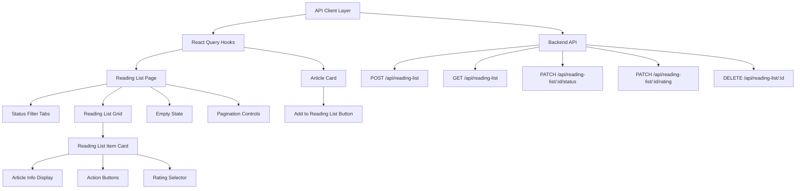
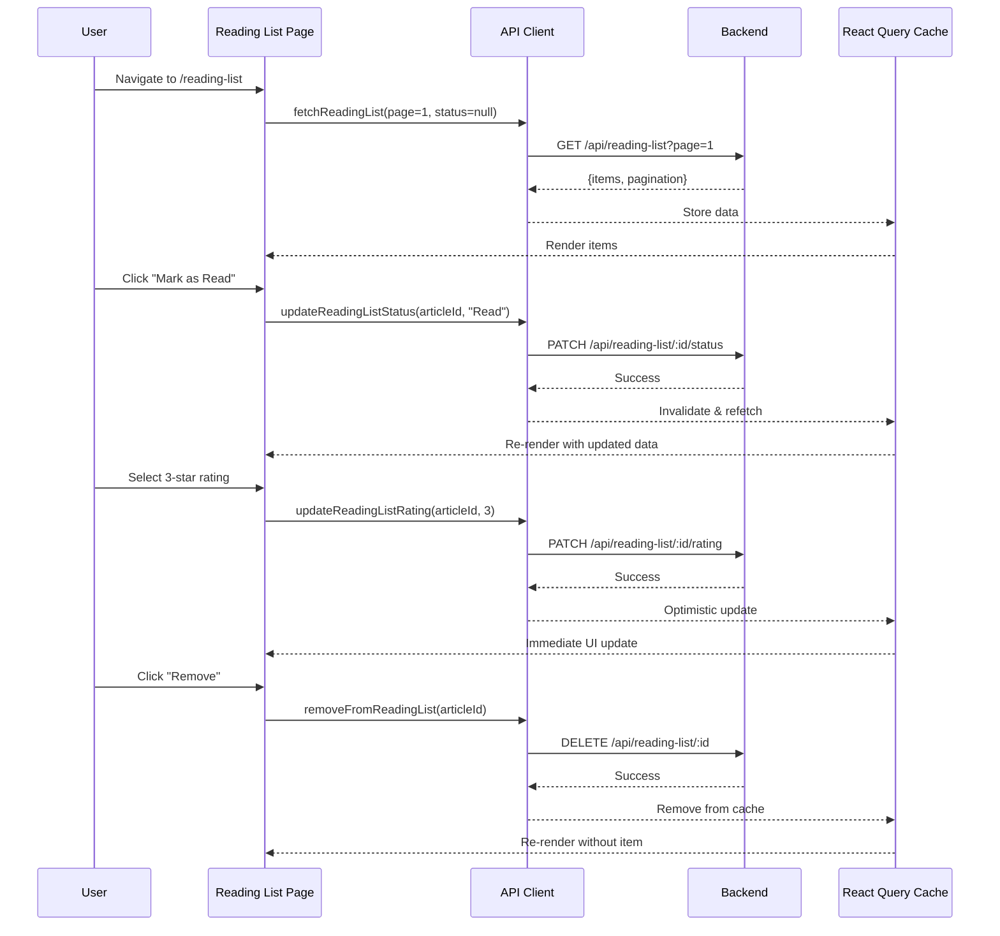

# Design Document: Web Reading List UI

## Overview

The Web Reading List UI feature provides a complete frontend interface for users to manage their saved articles. Users can view their reading list with pagination, filter by status (Unread/Read/Archived), update article status and ratings, and remove articles. The feature integrates with the existing backend API and follows the established design patterns from the dashboard and subscriptions pages.

This design covers the complete reading list page implementation, connection of the ArticleCard "Add to Reading List" button, API client functions, state management with React Query, and responsive UI components using shadcn/ui and Tailwind CSS.

## Architecture



## Main Workflow



## Components and Interfaces

### Component 1: ReadingListPage

**Purpose**: Main page component that orchestrates the reading list display, filtering, and pagination.

**Interface**:

```typescript
export default function ReadingListPage(): JSX.Element;
```

**Responsibilities**:

- Fetch reading list data with React Query
- Manage status filter state (All, Unread, Read, Archived)
- Handle pagination (page state)
- Render status tabs, reading list grid, and pagination controls
- Show loading skeleton during initial load
- Show empty state when no items
- Wrap in ProtectedRoute for authentication

**State**:

- `selectedStatus`: ReadingListStatus | null (filter state)
- `page`: number (current page, managed by React Query)

**Hooks**:

- `useReadingList(page, status)` - React Query hook for data fetching

### Component 2: StatusFilterTabs

**Purpose**: Tab navigation for filtering reading list by status.

**Interface**:

```typescript
interface StatusFilterTabsProps {
  selectedStatus: ReadingListStatus | null;
  onStatusChange: (status: ReadingListStatus | null) => void;
  counts?: {
    all: number;
    unread: number;
    read: number;
    archived: number;
  };
}

export function StatusFilterTabs(props: StatusFilterTabsProps): JSX.Element;
```

**Responsibilities**:

- Display tabs for All, Unread, Read, Archived
- Highlight active tab
- Show item counts per status (optional)
- Call onStatusChange when tab clicked
- Responsive design (horizontal scroll on mobile)

**Visual Design**:

- Use shadcn/ui Tabs component
- Active tab: primary color with underline
- Inactive tabs: muted color
- Badge with count next to each tab label

### Component 3: ReadingListItem

**Purpose**: Card component displaying a single reading list item with actions.

**Interface**:

```typescript
interface ReadingListItemProps {
  item: ReadingListItem;
  onStatusChange: (articleId: string, status: ReadingListStatus) => void;
  onRatingChange: (articleId: string, rating: number | null) => void;
  onRemove: (articleId: string) => void;
}

export function ReadingListItem(props: ReadingListItemProps): JSX.Element;
```

**Responsibilities**:

- Display article title (clickable link to original URL)
- Display category badge
- Display current status badge
- Display added date (relative format: "2 days ago")
- Show rating stars (interactive)
- Provide action buttons: Mark as Read, Mark as Archived, Remove
- Handle loading states for actions
- Responsive layout (stack on mobile, horizontal on desktop)

**Visual Design**:

- Card with hover shadow effect
- Title: text-xl, truncate after 2 lines
- Category badge: secondary variant
- Status badge: color-coded (Unread: blue, Read: green, Archived: gray)
- Rating: 5 star icons, filled based on rating value
- Action buttons: icon + text on desktop, icon only on mobile
- Smooth transitions for hover states

### Component 4: RatingSelector

**Purpose**: Interactive star rating component for article ratings.

**Interface**:

```typescript
interface RatingSelectorProps {
  rating: number | null;
  onChange: (rating: number | null) => void;
  disabled?: boolean;
  size?: 'sm' | 'md' | 'lg';
}

export function RatingSelector(props: RatingSelectorProps): JSX.Element;
```

**Responsibilities**:

- Display 5 star icons
- Fill stars based on current rating
- Allow clicking to set rating (1-5)
- Allow clicking current rating to clear (set to null)
- Show hover preview before clicking
- Disabled state when loading
- Accessible keyboard navigation

**Visual Design**:

- Stars: Lucide Star icon
- Filled: fill-yellow-400 text-yellow-400
- Empty: text-gray-300 dark:text-gray-600
- Hover: fill-yellow-300 (preview)
- Size variants: sm (h-4 w-4), md (h-5 w-5), lg (h-6 w-6)
- Cursor pointer on interactive stars
- Smooth fill transition

### Component 5: ArticleCard (Enhancement)

**Purpose**: Enhance existing ArticleCard to connect "Add to Reading List" button to API.

**Interface**:

```typescript
interface ArticleCardProps {
  article: Article;
}

export function ArticleCard(props: ArticleCardProps): JSX.Element;
```

**Enhancements**:

- Replace TODO comment with actual API call
- Use `useAddToReadingList` mutation hook
- Show loading state on button (spinner icon)
- Show success toast: "Added to reading list"
- Show error toast: "Failed to add to reading list" or "Already in reading list"
- Disable button after successful add
- Handle 409 Conflict (already added) gracefully

**Visual Changes**:

- Button disabled state: opacity-50 cursor-not-allowed
- Loading state: replace BookmarkPlus icon with Loader2 spinning icon
- Success state: replace BookmarkPlus with BookmarkCheck icon (brief flash)

## Data Models

### ReadingListItem (Frontend)

```typescript
interface ReadingListItem {
  articleId: string; // UUID
  title: string; // Article title
  url: string; // Article URL
  category: string; // Category name
  status: ReadingListStatus; // "Unread" | "Read" | "Archived"
  rating: number | null; // 1-5 or null
  addedAt: string; // ISO 8601 timestamp
  updatedAt: string; // ISO 8601 timestamp
}

type ReadingListStatus = 'Unread' | 'Read' | 'Archived';
```

### ReadingListResponse (API Response)

```typescript
interface ReadingListResponse {
  items: ReadingListItem[];
  page: number;
  pageSize: number;
  totalCount: number;
  hasNextPage: boolean;
}
```

### AddToReadingListRequest (API Request)

```typescript
interface AddToReadingListRequest {
  articleId: string; // UUID
}
```

### UpdateStatusRequest (API Request)

```typescript
interface UpdateStatusRequest {
  status: ReadingListStatus;
}
```

### UpdateRatingRequest (API Request)

```typescript
interface UpdateRatingRequest {
  rating: number | null; // 1-5 or null to clear
}
```

## API Client Structure

### File: `frontend/lib/api/readingList.ts`

```typescript
import { apiClient } from './client';
import type {
  ReadingListResponse,
  ReadingListItem,
  ReadingListStatus,
} from '@/types/readingList';

/**
 * Fetch reading list with pagination and optional status filter
 */
export async function fetchReadingList(
  page: number = 1,
  pageSize: number = 20,
  status?: ReadingListStatus,
): Promise<ReadingListResponse> {
  let url = `/api/reading-list?page=${page}&page_size=${pageSize}`;
  if (status) {
    url += `&status=${status}`;
  }
  return apiClient.get<ReadingListResponse>(url);
}

/**
 * Add article to reading list
 */
export async function addToReadingList(
  articleId: string,
): Promise<{ message: string; articleId: string }> {
  return apiClient.post('/api/reading-list', { article_id: articleId });
}

/**
 * Update reading list item status
 */
export async function updateReadingListStatus(
  articleId: string,
  status: ReadingListStatus,
): Promise<{ message: string; status: string }> {
  return apiClient.patch(`/api/reading-list/${articleId}/status`, { status });
}

/**
 * Update reading list item rating
 */
export async function updateReadingListRating(
  articleId: string,
  rating: number | null,
): Promise<{ message: string; rating: number | null }> {
  return apiClient.patch(`/api/reading-list/${articleId}/rating`, { rating });
}

/**
 * Remove article from reading list
 */
export async function removeFromReadingList(
  articleId: string,
): Promise<{ message: string }> {
  return apiClient.delete(`/api/reading-list/${articleId}`);
}
```

## React Query Hooks

### File: `frontend/lib/hooks/useReadingList.ts`

```typescript
import { useQuery, useMutation, useQueryClient } from '@tanstack/react-query';
import {
  fetchReadingList,
  addToReadingList,
  updateReadingListStatus,
  updateReadingListRating,
  removeFromReadingList,
} from '@/lib/api/readingList';
import type { ReadingListStatus } from '@/types/readingList';
import { toast } from '@/lib/toast';

/**
 * Hook to fetch reading list with pagination and filtering
 */
export function useReadingList(page: number = 1, status?: ReadingListStatus) {
  return useQuery({
    queryKey: ['readingList', page, status],
    queryFn: () => fetchReadingList(page, 20, status),
    staleTime: 30000, // 30 seconds
    retry: 2,
  });
}

/**
 * Hook to add article to reading list
 */
export function useAddToReadingList() {
  const queryClient = useQueryClient();

  return useMutation({
    mutationFn: (articleId: string) => addToReadingList(articleId),
    onSuccess: () => {
      queryClient.invalidateQueries({ queryKey: ['readingList'] });
      toast.success('Added to reading list');
    },
    onError: (error: Error) => {
      if (error.message.includes('already exists')) {
        toast.error('Article already in reading list');
      } else {
        toast.error('Failed to add to reading list');
      }
    },
  });
}
```

/\*\*

- Hook to update reading list item status
  \*/
  export function useUpdateReadingListStatus() {
  const queryClient = useQueryClient();

return useMutation({
mutationFn: ({ articleId, status }: { articleId: string; status: ReadingListStatus }) =>
updateReadingListStatus(articleId, status),
onSuccess: () => {
queryClient.invalidateQueries({ queryKey: ['readingList'] });
toast.success('Status updated');
},
onError: () => {
toast.error('Failed to update status');
}
});
}

/\*\*

- Hook to update reading list item rating
  \*/
  export function useUpdateReadingListRating() {
  const queryClient = useQueryClient();

return useMutation({
mutationFn: ({ articleId, rating }: { articleId: string; rating: number | null }) =>
updateReadingListRating(articleId, rating),
onMutate: async ({ articleId, rating }) => {
// Optimistic update
await queryClient.cancelQueries({ queryKey: ['readingList'] });
const previousData = queryClient.getQueryData(['readingList']);

      queryClient.setQueryData(['readingList'], (old: any) => {
        if (!old) return old;
        return {
          ...old,
          items: old.items.map((item: any) =>
            item.articleId === articleId ? { ...item, rating } : item
          )
        };
      });

      return { previousData };
    },
    onError: (err, variables, context) => {
      queryClient.setQueryData(['readingList'], context?.previousData);
      toast.error('Failed to update rating');
    },
    onSuccess: () => {
      toast.success('Rating updated');
    }

});
}

/\*\*

- Hook to remove article from reading list
  \*/
  export function useRemoveFromReadingList() {
  const queryClient = useQueryClient();

return useMutation({
mutationFn: (articleId: string) => removeFromReadingList(articleId),
onSuccess: () => {
queryClient.invalidateQueries({ queryKey: ['readingList'] });
toast.success('Removed from reading list');
},
onError: () => {
toast.error('Failed to remove from reading list');
}
});
}

```

```

## UI Wireframes (Text Description)

### Desktop Layout (1440px)

```
┌─────────────────────────────────────────────────────────────┐
│ Navigation Bar                                               │
├─────────────────────────────────────────────────────────────┤
│                                                              │
│  Reading List                                                │
│                                                              │
│  ┌──────┬──────┬──────┬──────────┐                         │
│  │ All  │Unread│ Read │ Archived │  [Status Filter Tabs]   │
│  │ (24) │ (12) │ (8)  │   (4)    │                         │
│  └──────┴──────┴──────┴──────────┘                         │
│                                                              │
│  ┌────────────────────────────────────────────────────────┐ │
│  │ Article Title Here                          [Category] │ │
│  │ https://example.com/article                            │ │
│  │                                                         │ │
│  │ Status: Unread    Added: 2 days ago                    │ │
│  │                                                         │ │
│  │ ★★★☆☆  [Mark as Read] [Archive] [Remove]              │ │
│  └────────────────────────────────────────────────────────┘ │
│                                                              │
│  ┌────────────────────────────────────────────────────────┐ │
│  │ Another Article Title                       [Category] │ │
│  │ https://example.com/another                            │ │
│  │                                                         │ │
│  │ Status: Read      Added: 5 days ago                    │ │
│  │                                                         │ │
│  │ ★★★★★  [Mark as Unread] [Archive] [Remove]            │ │
│  └────────────────────────────────────────────────────────┘ │
│                                                              │
│  [Load More]                                                 │
│                                                              │
└─────────────────────────────────────────────────────────────┘
```

### Mobile Layout (375px)

```
┌─────────────────────────┐
│ ☰  Reading List      🌙 │
├─────────────────────────┤
│                         │
│ ┌─┬─┬─┬─┐ [Tabs]       │
│ │A│U│R│A│ (scrollable) │
│ └─┴─┴─┴─┘               │
│                         │
│ ┌─────────────────────┐ │
│ │ Article Title       │ │
│ │ [Category Badge]    │ │
│ │                     │ │
│ │ Status: Unread      │ │
│ │ Added: 2 days ago   │ │
│ │                     │ │
│ │ ★★★☆☆              │ │
│ │                     │ │
│ │ [✓] [📦] [🗑]      │ │
│ └─────────────────────┘ │
│                         │
│ ┌─────────────────────┐ │
│ │ Another Article     │ │
│ │ [Category Badge]    │ │
│ │                     │ │
│ │ Status: Read        │ │
│ │ Added: 5 days ago   │ │
│ │                     │ │
│ │ ★★★★★              │ │
│ │                     │ │
│ │ [↩] [📦] [🗑]      │ │
│ └─────────────────────┘ │
│                         │
│ [Load More]             │
│                         │
└─────────────────────────┘
```

### Empty State

```
┌─────────────────────────────────────────────────────────────┐
│ Navigation Bar                                               │
├─────────────────────────────────────────────────────────────┤
│                                                              │
│  Reading List                                                │
│                                                              │
│  ┌──────┬──────┬──────┬──────────┐                         │
│  │ All  │Unread│ Read │ Archived │                         │
│  └──────┴──────┴──────┴──────────┘                         │
│                                                              │
│                                                              │
│                    📚                                        │
│                                                              │
│              Your reading list is empty                      │
│                                                              │
│     Start adding articles from your dashboard to            │
│              build your reading collection                   │
│                                                              │
│              [Browse Articles]                               │
│                                                              │
│                                                              │
└─────────────────────────────────────────────────────────────┘
```

## Error Handling Strategy

### Network Errors

**Scenario**: API request fails due to network issues
**Response**:

- Show error toast: "Failed to load reading list. Please try again."
- Display retry button in place of content
- Log error to console for debugging

**Recovery**:

- User clicks retry button
- React Query automatically retries (max 2 retries)
- If still fails, show persistent error state with manual retry option

### Authentication Errors (401)

**Scenario**: JWT token expired or invalid
**Response**:

- API client intercepts 401 response
- Removes token from localStorage
- Dispatches 'unauthorized' event
- AuthContext redirects to login page

**Recovery**:

- User logs in again
- Redirected back to reading list page
- Data fetches automatically

### Validation Errors (400)

**Scenario**: Invalid request data (e.g., invalid rating value)
**Response**:

- Show error toast with specific message
- Revert optimistic update if applicable
- Log error details

**Recovery**:

- User corrects input
- Retries action

### Conflict Errors (409)

**Scenario**: Article already in reading list
**Response**:

- Show info toast: "Article already in reading list"
- Disable "Add to Reading List" button
- Change button icon to BookmarkCheck

**Recovery**:

- No action needed (expected behavior)
- User can navigate to reading list to manage item

### Not Found Errors (404)

**Scenario**: Reading list item not found (race condition)
**Response**:

- Show error toast: "Item not found"
- Remove item from UI immediately
- Invalidate cache to refetch

**Recovery**:

- Automatic cache refresh
- UI updates to reflect current state

### Server Errors (500)

**Scenario**: Backend server error
**Response**:

- Show error toast: "Something went wrong. Please try again later."
- Log error with context
- Don't retry automatically (avoid hammering server)

**Recovery**:

- User manually retries after waiting
- Contact support if persistent

## Loading States Strategy

### Initial Page Load

**State**: First time loading reading list
**UI**:

- Show skeleton loaders for 3-4 reading list items
- Skeleton includes: title bar, metadata bar, action buttons
- Status tabs visible but disabled
- Use existing LoadingSkeleton pattern from dashboard

**Duration**: Until first data fetch completes

### Status Filter Change

**State**: User clicks different status tab
**UI**:

- Fade out current items (opacity-50)
- Show small spinner in tab content area
- Keep tabs interactive
- Smooth transition (200ms)

**Duration**: Until filtered data loads (typically <500ms due to cache)

### Pagination (Load More)

**State**: User clicks "Load More" button
**UI**:

- Show spinner below last item
- Keep existing items visible
- Disable "Load More" button
- Show loading text: "Loading more articles..."

**Duration**: Until next page data appends

### Action Button Loading

**State**: User clicks action button (Mark as Read, Rate, Remove)
**UI**:

- Replace button icon with Loader2 spinning icon
- Disable button (opacity-50, cursor-not-allowed)
- Keep button text visible
- Show spinner in rating stars if rating action

**Duration**: Until mutation completes (typically <300ms)

### Optimistic Updates

**State**: Rating change (optimistic update)
**UI**:

- Immediately update star display
- Show subtle loading indicator (pulsing opacity)
- If fails, revert with error toast
- Smooth transition back to previous state

**Duration**: Instant UI update, background API call

### Add to Reading List (from ArticleCard)

**State**: User clicks "Add to Reading List" on article card
**UI**:

- Replace BookmarkPlus icon with Loader2 spinning
- Disable button
- Show loading state for 200-500ms
- On success: briefly show BookmarkCheck icon, then disable
- On error: revert to BookmarkPlus, show error toast

**Duration**: Until API call completes

## Correctness Properties

_A property is a characteristic or behavior that should hold true across all valid executions of a system—essentially, a formal statement about what the system should do. Properties serve as the bridge between human-readable specifications and machine-verifiable correctness guarantees._

### Property 1: Data Consistency

For all reading list items displayed, the status and rating values SHALL match the backend database state within 30 seconds of any update.

**Validates: Requirements 9.1, 9.3**

### Property 2: Pagination Integrity

For all page transitions, the total count of unique items across all pages SHALL equal the totalCount value from the API response, and no duplicate items SHALL appear across pages.

**Validates: Requirements 3.1, 3.2**

### Property 3: Filter Correctness

For any status filter applied, all displayed items SHALL have the selected status value, and no items with different status values SHALL be displayed.

**Validates: Requirements 2.2**

### Property 4: Optimistic Update Rollback

For any rating update that fails, the UI SHALL revert to the previous rating value within 100ms and display an error toast.

**Validates: Requirements 6.6**

### Property 5: Authentication Enforcement

For all reading list API requests, the request SHALL include a valid JWT token in the Authorization header, and 401 responses SHALL trigger immediate logout and redirect to login page.

**Validates: Requirements 8.3, 8.4**

### Property 6: Idempotent Add Operation

For any article, adding it to the reading list multiple times SHALL result in exactly one reading list entry, with subsequent attempts showing "already in list" message.

**Validates: Requirements 4.5**

### Property 7: Rating Bounds

For all rating values, the value SHALL be an integer between 1 and 5 inclusive, or null.

**Validates: Requirements 13.1**

### Property 8: Status Transitions

For all status updates, the new status SHALL be one of the valid states: Unread, Read, or Archived.

**Validates: Requirements 13.2**

### Property 9: Display All Required Fields

For any reading list item displayed, the item SHALL include title, URL, category, status, added date, and rating fields.

**Validates: Requirements 1.4**

### Property 10: Responsive Layout Adaptation

For any viewport width, the layout SHALL adapt with appropriate spacing: compact on mobile (375px-767px), medium on tablet (768px-1023px), and generous on desktop (1024px+).

**Validates: Requirements 17.1, 17.3, 17.4**

### Property 11: Status Update Correctness

For any valid status value (Unread, Read, Archived), clicking the corresponding action button SHALL update the article status to that value.

**Validates: Requirements 5.1, 5.2**

### Property 12: Rating Selection

For any star clicked in the rating selector (1-5), the rating SHALL be set to that star's value, and clicking the currently selected star SHALL clear the rating.

**Validates: Requirements 6.1, 6.2**

### Property 13: Remove Item Effect

For any reading list item removed, the item SHALL disappear from the UI immediately and the total count SHALL decrease by 1.

**Validates: Requirements 7.3, 7.5**

### Property 14: Cache Invalidation After Mutations

For any mutation that succeeds (add, update status, update rating, remove), the React Query cache SHALL be invalidated and a refetch SHALL be triggered.

**Validates: Requirements 9.5**

### Property 15: Request Deduplication

For any simultaneous requests to the same endpoint, React Query SHALL deduplicate them and make only one API call.

**Validates: Requirements 9.4, 19.1**

### Property 16: Keyboard Navigation Order

For any Tab key press, focus SHALL move to the next interactive element in logical order, and Enter/Space on a focused button SHALL activate the button action.

**Validates: Requirements 10.1, 10.2**

### Property 17: Focus Indicators

For all focused interactive elements, a visible focus indicator (ring-2 ring-primary) SHALL be displayed.

**Validates: Requirements 10.5**

### Property 18: ARIA Labels on Icon Buttons

For all icon-only buttons, an ARIA label SHALL be present describing the button action.

**Validates: Requirements 11.2**

### Property 19: Semantic HTML Structure

For all reading list items, semantic HTML elements (article, button, nav) SHALL be used for proper structure.

**Validates: Requirements 11.1**

### Property 20: Color Contrast Compliance

For all text elements, the contrast ratio against the background SHALL be at least 4.5:1 (WCAG AA standard).

**Validates: Requirements 16.1, 16.2, 16.3, 16.4**

### Property 21: Status Information Redundancy

For all status displays, status information SHALL be conveyed through both color and text labels, not color alone.

**Validates: Requirements 16.5**

### Property 22: No Horizontal Scroll

For any screen size, the content width SHALL not exceed the viewport width, preventing horizontal scrolling.

**Validates: Requirements 17.5**

### Property 23: XSS Prevention

For all user-generated content, dangerouslySetInnerHTML SHALL not be used, and URLs SHALL be sanitized before rendering.

**Validates: Requirements 18.2, 18.3**

### Property 24: Input Validation

For all user input, invalid data SHALL be rejected and an error toast with a descriptive message SHALL be displayed.

**Validates: Requirements 13.3, 13.4**

### Property 25: Debounced Rating Updates

For any rapid successive rating clicks, updates SHALL be debounced by 300ms to prevent multiple API requests.

**Validates: Requirements 19.2**

### Property 26: Disabled Buttons During Requests

For all action buttons, the button SHALL be disabled during API requests to prevent duplicate submissions.

**Validates: Requirements 19.3**

### Property 27: API Response Parsing Round-Trip

For any valid reading list API response, parsing the JSON response into ReadingListResponse type and serializing it back SHALL produce equivalent data.

**Validates: Requirements 20.1**

### Property 28: Field Name Transformation Consistency

For all API responses, backend field names (snake_case) SHALL be consistently transformed to frontend field names (camelCase).

**Validates: Requirements 20.5**

### Property 29: Required Fields Validation

For all API responses, the API client SHALL validate that all required fields are present before passing data to components.

**Validates: Requirements 20.3**

### Property 30: Relative Timestamp Formatting

For any reading list item, the added date SHALL be formatted as relative time (e.g., "2 days ago") if less than 7 days old, otherwise as absolute date.

**Validates: Requirements 15.1**

### Property 31: Motion Preference Respect

For any user with prefers-reduced-motion enabled, all transition animations and hover scale effects SHALL be disabled, while color and opacity feedback SHALL remain.

**Validates: Requirements 14.1, 14.2, 14.3**

## Testing Strategy

### Unit Testing

**Components to Test**:

- StatusFilterTabs: tab selection, count display, accessibility
- ReadingListItem: action button clicks, status badge colors, date formatting
- RatingSelector: star clicks, hover states, keyboard navigation, clear rating

**Test Cases**:

- RatingSelector allows setting rating 1-5
- RatingSelector allows clearing rating by clicking current value
- RatingSelector shows correct number of filled stars
- ReadingListItem displays correct status badge color
- StatusFilterTabs highlights active tab
- StatusFilterTabs calls onStatusChange with correct value

**Tools**: Jest, React Testing Library

### Integration Testing

**Scenarios to Test**:

- Fetch reading list and display items
- Filter by status and verify correct items shown
- Add article to reading list from dashboard
- Update status and verify UI updates
- Update rating with optimistic update
- Remove item and verify it disappears
- Handle 401 error and redirect to login
- Handle network error and show retry option

**Tools**: Jest, MSW (Mock Service Worker), React Testing Library

### End-to-End Testing

**User Flows to Test**:

1. User logs in → navigates to reading list → sees empty state → clicks "Browse Articles" → adds article → returns to reading list → sees article
2. User views reading list → clicks "Mark as Read" → status updates → filters by "Read" → sees only read articles
3. User rates article 5 stars → rating displays → refreshes page → rating persists
4. User removes article → confirmation → article disappears → total count decreases
5. User adds article from dashboard → navigates to reading list → article appears at top

**Tools**: Playwright

### Property-Based Testing

**Properties to Test**:

- Rating value always between 1-5 or null (fast-check)
- Status always one of valid enum values (fast-check)
- Pagination never shows duplicate items (fast-check)
- Total count equals sum of items across all pages (fast-check)

**Tools**: fast-check (JavaScript property-based testing)

### Accessibility Testing

**Checks**:

- All interactive elements keyboard accessible
- Screen reader announces status changes
- Focus management on modal/toast
- Color contrast meets WCAG AA
- ARIA labels on icon buttons

**Tools**: jest-axe, manual testing with screen reader

## Performance Considerations

### Data Fetching Optimization

**Strategy**: Use React Query for intelligent caching and background refetching

- Cache reading list data for 30 seconds (staleTime)
- Automatic refetch on window focus
- Prefetch next page on "Load More" hover
- Deduplicate simultaneous requests

**Expected Impact**:

- Reduce API calls by 60-70%
- Instant navigation between status filters (cached data)
- Perceived load time <100ms for cached data

### Optimistic Updates

**Strategy**: Update UI immediately for rating changes, rollback on error

- Instant visual feedback (no waiting for API)
- Background API call
- Automatic rollback if fails

**Expected Impact**:

- Perceived response time: 0ms (instant)
- Actual API time: 200-300ms (background)
- User satisfaction: significantly improved

### Pagination Strategy

**Strategy**: Load 20 items per page, infinite scroll or "Load More" button

- Initial load: 20 items
- Subsequent loads: append 20 more
- Keep all loaded items in memory (until page refresh)
- Virtualization if list exceeds 100 items

**Expected Impact**:

- Initial page load: <1s
- Subsequent loads: <500ms
- Memory usage: ~50KB per 100 items

### Bundle Size Optimization

**Strategy**: Code splitting and lazy loading

- Lazy load reading list page (Next.js automatic)
- Lazy load RatingSelector component (only when needed)
- Tree-shake unused Lucide icons
- Use dynamic imports for heavy components

**Expected Impact**:

- Initial bundle: +15KB (reading list code)
- Lazy loaded: +5KB (rating selector)
- Total impact: ~20KB gzipped

### Image and Icon Optimization

**Strategy**: Use SVG icons, no images in reading list

- Lucide icons (tree-shakeable)
- No article thumbnails (text-only list)
- Status badges use CSS colors (no images)

**Expected Impact**:

- No image loading overhead
- Instant icon rendering
- Minimal bandwidth usage

### Rendering Performance

**Strategy**: Optimize React rendering with memoization

- Memoize ReadingListItem component (React.memo)
- Memoize callback functions (useCallback)
- Avoid unnecessary re-renders on parent state changes
- Use key prop correctly for list items

**Expected Impact**:

- 60fps scrolling on mobile
- <16ms render time per item
- Smooth animations and transitions

## Security Considerations

### Authentication & Authorization

**Threat**: Unauthorized access to reading list
**Mitigation**:

- ProtectedRoute wrapper requires authentication
- JWT token in Authorization header
- Backend validates token on every request
- 401 responses trigger immediate logout

**Threat**: Token theft via XSS
**Mitigation**:

- Store token in localStorage (acceptable for this use case)
- Sanitize all user input (article titles, URLs)
- Use React's built-in XSS protection
- Content Security Policy headers

### Input Validation

**Threat**: Malicious input in rating/status updates
**Mitigation**:

- Frontend validates rating (1-5 or null)
- Frontend validates status (enum values only)
- Backend validates all inputs with Pydantic schemas
- TypeScript types enforce correct types

**Threat**: SQL injection via article IDs
**Mitigation**:

- Use UUID type validation
- Parameterized queries in backend
- Supabase client handles escaping
- No raw SQL in API layer

### CSRF Protection

**Threat**: Cross-site request forgery
**Mitigation**:

- JWT token in Authorization header (not cookies)
- SameSite cookie policy (if using cookies)
- Origin validation on backend
- CORS configuration restricts origins

### Rate Limiting

**Threat**: API abuse via rapid requests
**Mitigation**:

- React Query deduplicates requests
- Debounce rating updates (300ms)
- Backend rate limiting (if implemented)
- Disable buttons during loading

### Data Privacy

**Threat**: Exposure of user reading habits
**Mitigation**:

- HTTPS only (enforce in production)
- No logging of article URLs in frontend
- Backend logs sanitized (no PII)
- User data isolated by user_id

### XSS Prevention

**Threat**: Malicious scripts in article titles
**Mitigation**:

- React escapes all text by default
- No dangerouslySetInnerHTML usage
- Sanitize URLs before rendering links
- Content Security Policy headers

## Dependencies

### Frontend Dependencies (Existing)

- **next**: ^14.x - React framework with App Router
- **react**: ^18.x - UI library
- **react-dom**: ^18.x - React DOM renderer
- **typescript**: ^5.x - Type safety
- **tailwindcss**: ^3.x - Utility-first CSS
- **@tanstack/react-query**: ^5.x - Data fetching and caching (NEEDS TO BE ADDED)
- **lucide-react**: ^0.x - Icon library
- **date-fns**: ^3.x - Date formatting
- **sonner**: ^1.x - Toast notifications
- **@radix-ui/react-tabs**: ^1.x - Accessible tabs component
- **@radix-ui/react-dropdown-menu**: ^2.x - Dropdown for rating selector

### Frontend Dependencies (To Add)

- **@tanstack/react-query**: ^5.28.0 - Required for data fetching hooks
- **@tanstack/react-query-devtools**: ^5.28.0 - Development tools (optional)

### Backend Dependencies (Existing)

- **fastapi**: ^0.x - Web framework
- **pydantic**: ^2.x - Data validation
- **supabase**: ^2.x - Database client
- **python-jose**: ^3.x - JWT handling

### Backend Dependencies (To Add)

None - all required endpoints can be implemented with existing dependencies. However, PATCH endpoints for status and rating updates need to be added to the API.

## Implementation Notes

### Backend API Gaps

The current backend implementation is missing PATCH endpoints for updating status and rating. These need to be added:

**Required Endpoints**:

1. `PATCH /api/reading-list/{article_id}/status` - Update reading list item status
2. `PATCH /api/reading-list/{article_id}/rating` - Update reading list item rating

**Implementation Location**: `backend/app/api/reading_list.py`

**Schemas**: Already defined in `backend/app/schemas/reading_list.py`:

- `UpdateStatusRequest`
- `UpdateRatingRequest`

### React Query Setup

React Query needs to be added to the project and configured in the root layout:

**File**: `frontend/app/layout.tsx`

```typescript
import { QueryClient, QueryClientProvider } from '@tanstack/react-query';

const queryClient = new QueryClient({
  defaultOptions: {
    queries: {
      staleTime: 30000,
      retry: 2,
    },
  },
});

// Wrap children with QueryClientProvider
```

### Type Definitions Update

The existing `frontend/types/readingList.ts` needs to be updated to match the backend API response format:

**Current Issue**: Frontend expects `article` object nested in `ReadingListItem`, but backend returns flat structure with `article_id`, `title`, `url`, `category`.

**Solution**: Update frontend types to match backend response, or create adapter function to transform API response to frontend format.

### Responsive Design Breakpoints

Follow existing dashboard patterns:

- **Mobile**: 375px - 767px
  - Single column layout
  - Stacked action buttons (icon only)
  - Horizontal scrolling tabs
  - Compact spacing (p-4)

- **Tablet**: 768px - 1023px
  - Single column layout
  - Action buttons with icons + text
  - Full-width tabs
  - Medium spacing (p-6)

- **Desktop**: 1024px+
  - Max-width container (max-w-6xl)
  - Horizontal action buttons
  - Full-width tabs
  - Generous spacing (p-8)

### Color Scheme

Follow existing theme from dashboard:

- **Status Badges**:
  - Unread: `bg-blue-100 text-blue-800 dark:bg-blue-900 dark:text-blue-200`
  - Read: `bg-green-100 text-green-800 dark:bg-green-900 dark:text-green-200`
  - Archived: `bg-gray-100 text-gray-800 dark:bg-gray-800 dark:text-gray-200`

- **Rating Stars**:
  - Filled: `fill-yellow-400 text-yellow-400`
  - Empty: `text-gray-300 dark:text-gray-600`
  - Hover: `fill-yellow-300 text-yellow-300`

- **Action Buttons**:
  - Primary: `bg-primary text-primary-foreground hover:bg-primary/90`
  - Secondary: `bg-secondary text-secondary-foreground hover:bg-secondary/80`
  - Destructive: `bg-destructive text-destructive-foreground hover:bg-destructive/90`

### Accessibility Requirements

**Keyboard Navigation**:

- Tab through all interactive elements
- Enter/Space to activate buttons
- Arrow keys to navigate tabs
- Arrow keys to change rating (when focused)
- Escape to close dropdowns/modals

**Screen Reader Support**:

- ARIA labels on icon-only buttons
- ARIA live regions for toast notifications
- ARIA expanded/selected on tabs
- ARIA label on rating selector: "Rate article X out of 5 stars"
- Semantic HTML (article, nav, button, etc.)

**Focus Management**:

- Visible focus indicators (ring-2 ring-primary)
- Focus trap in modals (if any)
- Focus restoration after actions
- Skip to content link

**Color Contrast**:

- All text meets WCAG AA (4.5:1 for normal text)
- Status badges have sufficient contrast
- Focus indicators visible in both themes
- Don't rely on color alone for status

**Motion Preferences**:

- Respect prefers-reduced-motion
- Disable transitions if user prefers reduced motion
- Provide alternative feedback (not just animation)
