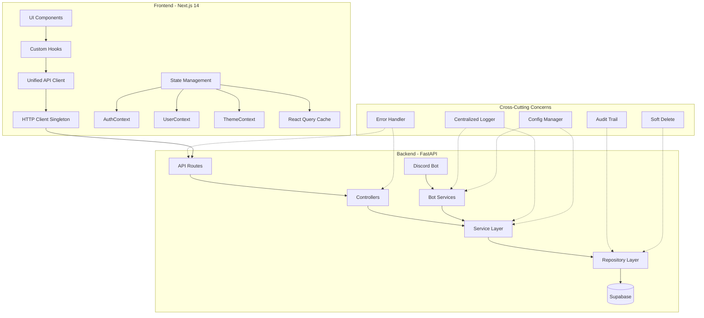
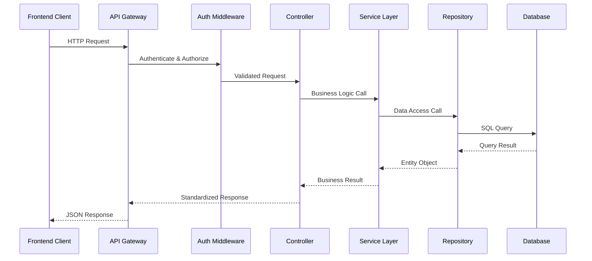
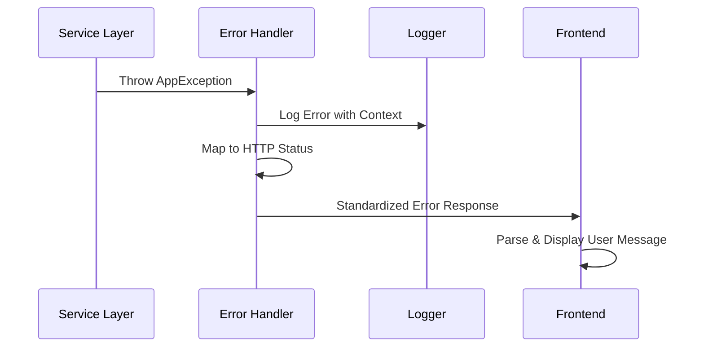
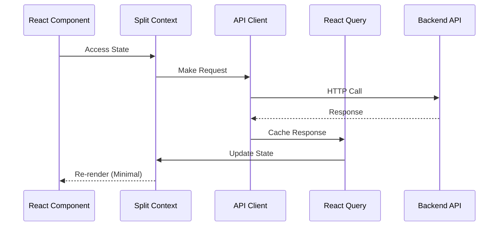

# Tech News Agent - Architecture Documentation

> **Post-Refactoring Architecture Guide**
> This document describes the new architecture patterns and layers implemented during the comprehensive refactoring.
> Last Updated: 2024-12-19

---

## 📋 Overview

The Tech News Agent has undergone a comprehensive architecture refactoring to improve maintainability, developer experience, code quality, and testing organization. This document outlines the new architecture patterns, layers, and migration strategies implemented.

### Refactoring Goals Achieved

✅ **Unified API Client Layer** - Single HTTP client with consistent error handling
✅ **Split Context State Management** - Optimized React contexts to prevent unnecessary re-renders
✅ **Decoupled Service Layer** - Clean separation between services and repositories
✅ **Centralized Error Handling** - Standardized error responses across frontend and backend
✅ **Structured Logging System** - Consistent logging with request context
✅ **Configuration Management** - Environment-based configuration with validation
✅ **Repository Pattern** - Database abstraction with audit trails and soft delete
✅ **Type Safety** - Comprehensive TypeScript/Python type definitions
✅ **Test Organization** - Hierarchical test structure with property-based testing
✅ **Migration Safety** - Gradual migration with backward compatibility

---

## 🏗️ New Architecture Overview

### High-Level Architecture



### Technology Stack

| Layer                | Technology                           | Purpose                                  |
| -------------------- | ------------------------------------ | ---------------------------------------- |
| **Frontend**         | Next.js 14, React 18, TypeScript     | User interface and client-side logic     |
| **API Client**       | Axios with interceptors              | Unified HTTP communication               |
| **State Management** | React Context + React Query          | Split contexts with server state caching |
| **Backend**          | FastAPI, Python 3.11+                | API server and business logic            |
| **Service Layer**    | Dependency injection pattern         | Business logic orchestration             |
| **Repository Layer** | Abstract interfaces                  | Data access abstraction                  |
| **Database**         | Supabase (PostgreSQL + pgvector)     | Data persistence with vector search      |
| **Discord Bot**      | discord.py 2.4+                      | User interaction interface               |
| **AI/LLM**           | Groq Cloud (Llama models)            | Content analysis and generation          |
| **Logging**          | Structured JSON logging              | Centralized logging with context         |
| **Testing**          | pytest, Jest, Hypothesis, Playwright | Comprehensive test coverage              |

---

## 🔧 Core Architecture Patterns

### 1. Repository Pattern

**Purpose**: Abstract database operations and provide clean interfaces for data access.

**Implementation**:

```python
# Interface Definition
class IRepository(ABC, Generic[T]):
    @abstractmethod
    async def create(self, data: Dict[str, Any]) -> T: ...
    @abstractmethod
    async def get_by_id(self, entity_id: UUID) -> Optional[T]: ...
    # ... other CRUD operations

# Base Implementation
class BaseRepository(IRepository[T]):
    def __init__(self, client: Client, table_name: str,
                 enable_audit_trail: bool = True,
                 enable_soft_delete: bool = True):
        self.client = client
        self.table_name = table_name
        self.enable_audit_trail = enable_audit_trail
        self.enable_soft_delete = enable_soft_delete

# Concrete Implementation
class UserRepository(BaseRepository[User]):
    def __init__(self, client: Client):
        super().__init__(client, "users")

    def _map_to_entity(self, row: Dict[str, Any]) -> User:
        return User(**row)
```

**Benefits**:

- Database abstraction
- Consistent CRUD operations
- Built-in audit trails and soft delete
- Easy testing with mocks
- Business rule validation

### 2. Service Layer Pattern

**Purpose**: Encapsulate business logic and orchestrate operations across repositories.

**Implementation**:

```python
# Base Service
class BaseService(IService):
    def __init__(self):
        self._logger = None

    def _handle_error(self, error: Exception, message: str,
                     error_code: ErrorCode = ErrorCode.INTERNAL_ERROR,
                     context: Optional[Dict[str, Any]] = None):
        # Consistent error handling and logging

# Concrete Service
class ArticleService(BaseService):
    def __init__(self, article_repo: IArticleRepository,
                 feed_repo: IFeedRepository):
        super().__init__()
        self.article_repo = article_repo
        self.feed_repo = feed_repo
        self.logger = get_logger(f"{__name__}.ArticleService")

    async def create_article_with_validation(self, data: Dict[str, Any]) -> Article:
        # Business logic implementation
        # Validation, orchestration, error handling
```

**Benefits**:

- Clear business logic separation
- Dependency injection support
- Consistent error handling
- Structured logging
- Testable with mocked repositories

### 3. Unified API Client (Frontend)

**Purpose**: Single HTTP client instance with consistent error handling and interceptors.

**Implementation**:

```typescript
// Singleton Pattern
class ApiClient {
  private static instance: ApiClient | null = null;
  private axiosInstance: AxiosInstance;

  public static getInstance(config?: ApiClientConfig): ApiClient {
    if (!ApiClient.instance) {
      ApiClient.instance = new ApiClient(config);
    }
    return ApiClient.instance;
  }

  // Type-safe methods
  public async get<T>(url: string, config?: AxiosRequestConfig): Promise<T> {
    // Implementation with error handling
  }
}

// Export singleton instance
export const apiClient = ApiClient.getInstance();
```

**Benefits**:

- Single HTTP client instance
- Automatic authentication headers
- Consistent error handling
- Request/response interceptors
- TypeScript generics for type safety

### 4. Split Context Pattern (Frontend)

**Purpose**: Prevent unnecessary re-renders by splitting contexts by concern.

**Implementation**:

```typescript
// Separate contexts for different concerns
export function AuthProvider({ children }: { children: React.ReactNode }) {
  const [isAuthenticated, setIsAuthenticated] = useState<boolean>(false);
  const [loading, setLoading] = useState<boolean>(true);
  // Only authentication-related state
}

export function UserProvider({ children }: { children: React.ReactNode }) {
  const [user, setUser] = useState<User | null>(null);
  // Only user profile data
}

export function ThemeProvider({ children }: { children: React.ReactNode }) {
  const [theme, setTheme] = useState<Theme>('light');
  // Only theme-related state
}
```

**Benefits**:

- Minimal re-render scope
- Clear separation of concerns
- Better performance
- Easier testing
- Maintainable state management

### 5. Centralized Error Handling

**Purpose**: Consistent error responses and user-friendly messages across the application.

**Backend Implementation**:

```python
# Standard error types and codes
class ErrorCode(str, Enum):
    AUTH_INVALID_TOKEN = "AUTH_INVALID_TOKEN"
    DB_QUERY_FAILED = "DB_QUERY_FAILED"
    VALIDATION_FAILED = "VALIDATION_FAILED"
    # ... more error codes

# Base exception class
class AppException(Exception):
    def __init__(self, message: str, error_code: ErrorCode,
                 status_code: int = 500, details: Optional[Dict] = None):
        self.message = message
        self.error_code = error_code
        self.status_code = status_code
        self.details = details

# FastAPI exception handlers
async def app_exception_handler(request: Request, exc: AppException) -> JSONResponse:
    return JSONResponse(
        status_code=exc.status_code,
        content=error_response(
            error=exc.message,
            error_code=exc.error_code.value,
            details=exc.details
        ).model_dump()
    )
```

**Frontend Implementation**:

```typescript
// API error parsing
export class ApiError extends Error {
  constructor(
    message: string,
    public code: string,
    public status: number,
    public details?: any
  ) {
    super(message);
    this.name = 'ApiError';
  }
}

// Error mapping to user-friendly messages
export function parseApiError(error: AxiosError): ApiError {
  // Parse backend error response and create user-friendly message
}
```

**Benefits**:

- Consistent error structure
- User-friendly error messages
- Proper HTTP status codes
- Error recovery strategies
- Centralized error logging

### 6. Structured Logging

**Purpose**: Consistent logging format with request context and filtering capabilities.

**Implementation**:

```python
# Structured formatter
class StructuredFormatter(logging.Formatter):
    def format(self, record: LogRecord) -> str:
        log_data = {
            "timestamp": datetime.utcnow().isoformat() + "Z",
            "level": record.levelname,
            "logger": record.name,
            "message": record.getMessage(),
        }

        # Add request context if available
        request_id = request_id_var.get()
        user_id = user_id_var.get()
        if request_id or user_id:
            log_data["context"] = {
                "request_id": request_id,
                "user_id": user_id
            }

        return json.dumps(log_data)

# Request context middleware
class RequestContextMiddleware(BaseHTTPMiddleware):
    async def dispatch(self, request: Request, call_next) -> Response:
        request_id = request.headers.get("X-Request-ID") or str(uuid.uuid4())
        user_id = getattr(request.state, "user_id", None)

        # Set context variables for logging
        request_id_token = request_id_var.set(request_id)
        user_id_token = user_id_var.set(user_id)

        try:
            response = await call_next(request)
            response.headers["X-Request-ID"] = request_id
            return response
        finally:
            request_id_var.reset(request_id_token)
            user_id_var.reset(user_id_token)
```

**Benefits**:

- Structured JSON logs
- Request context tracking
- Multiple log levels
- Centralized configuration
- Easy filtering and searching

---

## 📊 Data Flow Architecture

### Request Flow (API)



### Error Flow



### State Management Flow (Frontend)



---

## 🗄️ Database Architecture

### Audit Trail Implementation

All critical tables include audit fields:

```sql
-- Audit fields added to all tables
created_at TIMESTAMPTZ DEFAULT NOW(),
updated_at TIMESTAMPTZ DEFAULT NOW(),
modified_by TEXT, -- Discord ID of the user who made the change
deleted_at TIMESTAMPTZ NULL -- For soft delete
```

**Automatic Triggers**:

```sql
-- Update trigger for updated_at
CREATE OR REPLACE FUNCTION update_updated_at_column()
RETURNS TRIGGER AS $$
BEGIN
    NEW.updated_at = NOW();
    RETURN NEW;
END;
$$ language 'plpgsql';

CREATE TRIGGER update_users_updated_at
    BEFORE UPDATE ON users
    FOR EACH ROW EXECUTE FUNCTION update_updated_at_column();
```

### Soft Delete Implementation

Instead of permanently deleting records, we set `deleted_at`:

```python
# Repository implementation
async def delete(self, entity_id: UUID) -> bool:
    if self.enable_soft_delete:
        # Soft delete: set deleted_at timestamp
        delete_data = {"deleted_at": datetime.utcnow().isoformat()}
        delete_data = self._add_audit_fields(delete_data)

        response = self.client.table(self.table_name)\
            .update(delete_data)\
            .eq("id", str(entity_id))\
            .execute()
    else:
        # Hard delete: permanently remove
        response = self.client.table(self.table_name)\
            .delete()\
            .eq("id", str(entity_id))\
            .execute()
```

### Business Rule Validation

Repository layer includes business rule validation:

```python
def _validate_business_rules_create(self, data: Dict[str, Any]) -> None:
    """Override in concrete repositories for specific validation"""
    pass

def _validate_business_rules_update(self, data: Dict[str, Any]) -> None:
    """Override in concrete repositories for specific validation"""
    pass
```

---

## 🧪 Testing Architecture

### Test Organization

```
backend/tests/
├── unit/           # Unit tests for individual components
│   ├── api/        # API route tests
│   ├── core/       # Core functionality tests
│   ├── repositories/ # Repository tests
│   ├── services/   # Service tests
│   └── bot/        # Discord bot tests
├── integration/    # Integration tests
│   ├── api/        # API integration tests
│   ├── services/   # Service integration tests
│   └── workflows/  # End-to-end workflow tests
├── property/       # Property-based tests
│   ├── api/        # API property tests
│   ├── core/       # Core property tests
│   └── services/   # Service property tests
├── e2e/           # End-to-end tests
└── fixtures/      # Shared test fixtures

frontend/__tests__/
├── unit/          # Unit tests for components
│   ├── components/ # React component tests
│   ├── hooks/     # Custom hook tests
│   ├── lib/       # Utility function tests
│   └── contexts/  # Context tests
├── integration/   # Integration tests
│   ├── api/       # API integration tests
│   ├── state/     # State management tests
│   └── workflows/ # User workflow tests
├── property/      # Property-based tests
├── e2e/          # End-to-end tests
└── utils/        # Test utilities and mocks
```

### Property-Based Testing

Using Hypothesis for backend and fast-check for frontend:

```python
# Backend property test example
@given(st.text(min_size=1, max_size=100))
def test_user_creation_property(discord_id):
    """Property: Any valid discord_id should create a user successfully"""
    user_data = {"discord_id": discord_id}
    user = await user_repo.create(user_data)
    assert user.discord_id == discord_id
    assert user.id is not None
```

```typescript
// Frontend property test example
import fc from 'fast-check';

test('API client singleton property', () => {
  fc.assert(
    fc.property(fc.anything(), () => {
      const client1 = ApiClient.getInstance();
      const client2 = ApiClient.getInstance();
      expect(client1).toBe(client2); // Same instance
    })
  );
});
```

---

## 🚀 Migration Strategy

### Gradual Migration Approach

The refactoring followed a safe, incremental migration strategy:

1. **Foundation First**: Implement core infrastructure (config, logging, errors)
2. **Repository Layer**: Create repository interfaces and implementations
3. **Service Layer**: Refactor services to use repositories
4. **API Layer**: Update API routes to use new service layer
5. **Frontend Client**: Implement unified API client
6. **State Management**: Split contexts and integrate React Query
7. **Testing**: Reorganize and expand test coverage
8. **Documentation**: Update architecture documentation

### Backward Compatibility

During migration, both old and new implementations ran in parallel:

```python
# Feature flag approach
if FEATURE_FLAGS.USE_NEW_REPOSITORY_LAYER:
    result = await new_service.get_articles()
else:
    result = await legacy_service.get_articles()

# Validation approach
new_result = await new_service.get_articles()
old_result = await legacy_service.get_articles()
assert new_result == old_result  # Validate equivalence
```

### Migration Validation

Each migration step included validation:

```python
# Property test for migration compatibility
@given(article_data())
def test_migration_backward_compatibility(data):
    """Property: New implementation produces same results as old"""
    old_result = old_implementation(data)
    new_result = new_implementation(data)
    assert old_result == new_result
```

---

## 📈 Performance Optimizations

### API Response Caching

```typescript
// React Query configuration
const queryClient = new QueryClient({
  defaultOptions: {
    queries: {
      staleTime: 5 * 60 * 1000, // 5 minutes
      cacheTime: 10 * 60 * 1000, // 10 minutes
      retry: 3,
      retryDelay: (attemptIndex) => Math.min(1000 * 2 ** attemptIndex, 30000),
    },
  },
});
```

### Database Query Optimization

```sql
-- Indexes for common queries
CREATE INDEX idx_articles_feed_id_published_at ON articles(feed_id, published_at);
CREATE INDEX idx_reading_list_user_id_status ON reading_list(user_id, status);
CREATE INDEX idx_user_subscriptions_user_id ON user_subscriptions(user_id);

-- Soft delete filter optimization
CREATE INDEX idx_articles_deleted_at ON articles(deleted_at) WHERE deleted_at IS NULL;
```

### Bundle Size Optimization

```typescript
// Code splitting and lazy loading
const Dashboard = lazy(() => import('./pages/Dashboard'));
const ReadingList = lazy(() => import('./pages/ReadingList'));

// Tree shaking optimization
export { apiClient } from './lib/api/client';
export type { ApiError } from './lib/api/errors';
```

---

## 🔒 Security Enhancements

### JWT Token Security

```python
# Secure JWT configuration
JWT_ALGORITHM = "HS256"
JWT_EXPIRATION_DAYS = 7
JWT_SECRET = os.getenv("JWT_SECRET")  # Must be 32+ characters

# Token validation
def validate_jwt_token(token: str) -> Dict[str, Any]:
    try:
        payload = jwt.decode(token, JWT_SECRET, algorithms=[JWT_ALGORITHM])
        return payload
    except jwt.ExpiredSignatureError:
        raise AuthenticationError("Token expired")
    except jwt.InvalidTokenError:
        raise AuthenticationError("Invalid token")
```

### CORS Configuration

```python
# Production CORS settings
app.add_middleware(
    CORSMiddleware,
    allow_origins=settings.cors_origins.split(","),
    allow_credentials=True,
    allow_methods=["GET", "POST", "PUT", "DELETE"],
    allow_headers=["*"],
)
```

### Input Validation

```python
# Pydantic models for validation
class CreateArticleRequest(BaseModel):
    title: str = Field(..., min_length=1, max_length=500)
    url: HttpUrl
    feed_id: UUID

    @validator('title')
    def validate_title(cls, v):
        if not v.strip():
            raise ValueError('Title cannot be empty')
        return v.strip()
```

---

## 📚 API Contracts

### Standardized Response Format

All API responses follow a consistent structure:

```typescript
// Success Response
interface SuccessResponse<T> {
  data: T;
  metadata?: {
    pagination?: PaginationMetadata;
    timestamp: string;
    request_id: string;
  };
}

// Error Response
interface ErrorResponse {
  error: string;
  error_code: string;
  details?: ErrorDetail[];
  metadata: {
    timestamp: string;
    request_id: string;
  };
}

// Pagination Metadata
interface PaginationMetadata {
  total: number;
  page: number;
  page_size: number;
  has_next: boolean;
  has_previous: boolean;
}
```

### Type Definitions

Generated TypeScript types from backend schemas:

```bash
# Type generation script
python scripts/generate-types.py
```

```typescript
// Generated types
export interface User {
  id: string;
  discord_id: string;
  created_at: string;
  updated_at: string;
}

export interface Article {
  id: string;
  title: string;
  url: string;
  feed_id: string;
  published_at: string;
  tinkering_index: number | null;
  ai_summary: string | null;
  created_at: string;
  updated_at: string;
}
```

---

## 🔄 Rollback Procedures

### Database Rollback

Each migration includes rollback scripts:

```sql
-- Migration: Add audit fields
-- File: migrations/001_add_audit_fields.sql
ALTER TABLE users ADD COLUMN created_at TIMESTAMPTZ DEFAULT NOW();
ALTER TABLE users ADD COLUMN updated_at TIMESTAMPTZ DEFAULT NOW();
ALTER TABLE users ADD COLUMN modified_by TEXT;

-- Rollback: Remove audit fields
-- File: rollbacks/001_remove_audit_fields.sql
ALTER TABLE users DROP COLUMN IF EXISTS created_at;
ALTER TABLE users DROP COLUMN IF EXISTS updated_at;
ALTER TABLE users DROP COLUMN IF EXISTS modified_by;
```

### Code Rollback

Feature flags enable quick rollback:

```python
# Environment variable rollback
USE_NEW_REPOSITORY_LAYER=false
USE_UNIFIED_ERROR_HANDLING=false
USE_STRUCTURED_LOGGING=false
```

### Deployment Rollback

Docker-based rollback:

```bash
# Rollback to previous version
docker-compose down
docker-compose up -d --scale backend=0
docker tag tech-news-agent:previous tech-news-agent:latest
docker-compose up -d
```

---

## 📋 Migration Checklist

### Pre-Migration

- [ ] Backup database
- [ ] Document current API contracts
- [ ] Establish performance baselines
- [ ] Set up monitoring and alerting
- [ ] Prepare rollback procedures

### During Migration

- [ ] Run both old and new implementations in parallel
- [ ] Validate output equivalence
- [ ] Monitor error rates and performance
- [ ] Gradually increase traffic to new implementation
- [ ] Collect metrics and feedback

### Post-Migration

- [ ] Remove old implementation code
- [ ] Update documentation
- [ ] Clean up feature flags
- [ ] Archive migration artifacts
- [ ] Document lessons learned

---

## 🎯 Future Architecture Considerations

### Microservices Evolution

The current modular architecture supports future microservices migration:

```
Current Monolith → Service Modules → Microservices
├── Auth Service
├── Article Service
├── User Service
├── Notification Service
└── Analytics Service
```

### Event-Driven Architecture

Foundation for event-driven patterns:

```python
# Event system foundation
class DomainEvent:
    def __init__(self, event_type: str, data: Dict[str, Any]):
        self.event_type = event_type
        self.data = data
        self.timestamp = datetime.utcnow()

# Event handlers
async def handle_article_created(event: DomainEvent):
    # Send notifications, update analytics, etc.
```

### Caching Strategy

Redis integration for performance:

```python
# Cache layer
class CacheService:
    async def get_articles(self, user_id: str) -> List[Article]:
        cache_key = f"articles:{user_id}"
        cached = await redis.get(cache_key)
        if cached:
            return json.loads(cached)

        articles = await article_service.get_articles(user_id)
        await redis.setex(cache_key, 300, json.dumps(articles))
        return articles
```

---

## 📞 Support and Maintenance

### Monitoring

- **Application Metrics**: Response times, error rates, throughput
- **Business Metrics**: User engagement, article processing rates
- **Infrastructure Metrics**: CPU, memory, database performance
- **Log Analysis**: Error patterns, user behavior, performance bottlenecks

### Health Checks

```python
# Comprehensive health check
@router.get("/health")
async def health_check():
    checks = {
        "database": await check_database_health(),
        "external_apis": await check_external_apis(),
        "cache": await check_cache_health(),
        "scheduler": await check_scheduler_health(),
    }

    overall_health = all(checks.values())
    status_code = 200 if overall_health else 503

    return JSONResponse(
        status_code=status_code,
        content={"status": "healthy" if overall_health else "unhealthy", "checks": checks}
    )
```

### Documentation Maintenance

- **API Documentation**: Auto-generated from OpenAPI specs
- **Architecture Diagrams**: Updated with each major change
- **Migration Guides**: Step-by-step migration procedures
- **Troubleshooting Guides**: Common issues and solutions

---

**Document Version**: 1.0.0
**Last Updated**: 2024-12-19
**Next Review**: 2025-03-19
