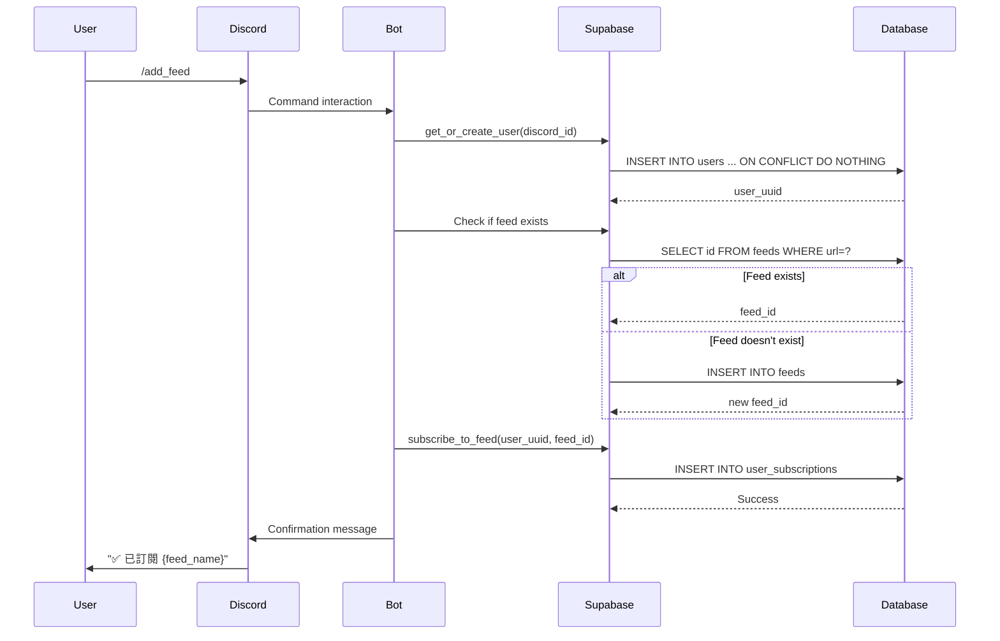
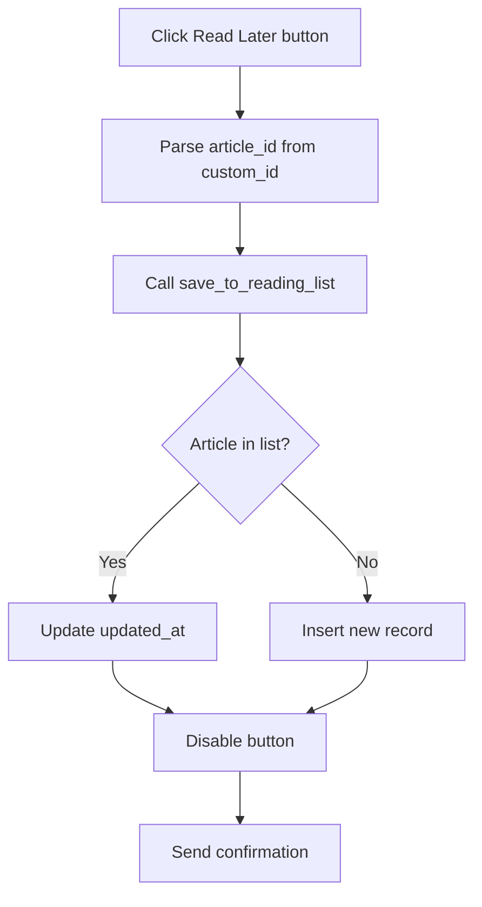

# Tech News Agent 開發者指南

## 目錄

1. [架構概述](#架構概述)
2. [多租戶架構](#多租戶架構)
3. [資料流程](#資料流程)
4. [API 參考](#api參考)
5. [測試指南](#測試指南)
6. [部署指南](#部署指南)

---

## 架構概述

### 系統元件

Tech News Agent 由四個主要元件組成：

1. **Discord Bot** - 使用者互動介面
2. **Supabase Service** - 資料庫存取層
3. **LLM Service** - AI 分析和推薦
4. **Background Scheduler** - 自動化任務

### 技術棧

- **Backend**: Python 3.11+, FastAPI
- **Database**: Supabase (PostgreSQL + pgvector)
- **Discord**: discord.py 2.0+
- **AI**: Groq (Llama 3.1 8B, Llama 3.3 70B)
- **Scheduler**: APScheduler
- **Testing**: pytest, Hypothesis

---

## 多租戶架構

### 核心概念

Phase 4 實現了真正的多租戶架構，每個 Discord 使用者視為獨立租戶：

- **獨立訂閱**：每個使用者可以訂閱不同的 RSS 來源
- **獨立閱讀清單**：每個使用者有自己的閱讀清單和評分
- **共用文章池**：背景排程器抓取的文章供所有使用者共用
- **資料隔離**：使用者之間的資料完全隔離

### 使用者註冊流程

```python
# app/bot/utils/decorators.py

async def ensure_user_registered(interaction: discord.Interaction) -> UUID:
    """
    確保使用者存在於資料庫

    Args:
        interaction: Discord interaction 物件

    Returns:
        使用者 UUID
    """
    discord_id = str(interaction.user.id)
    supabase = SupabaseService()
    user_uuid = await supabase.get_or_create_user(discord_id)
    return user_uuid
```

**特點：**

- 自動註冊：第一次執行指令時自動建立使用者記錄
- 冪等性：重複呼叫返回相同的 UUID
- 錯誤處理：註冊失敗時顯示友善的錯誤訊息

### 資料庫結構

```sql
-- 使用者表
CREATE TABLE users (
    id UUID PRIMARY KEY DEFAULT gen_random_uuid(),
    discord_id TEXT UNIQUE NOT NULL,
    created_at TIMESTAMPTZ DEFAULT NOW()
);

-- RSS 來源表
CREATE TABLE feeds (
    id UUID PRIMARY KEY DEFAULT gen_random_uuid(),
    name TEXT NOT NULL,
    url TEXT UNIQUE NOT NULL,
    category TEXT NOT NULL,
    is_active BOOLEAN DEFAULT TRUE,
    created_at TIMESTAMPTZ DEFAULT NOW()
);

-- 使用者訂閱表
CREATE TABLE user_subscriptions (
    id UUID PRIMARY KEY DEFAULT gen_random_uuid(),
    user_id UUID REFERENCES users(id) ON DELETE CASCADE,
    feed_id UUID REFERENCES feeds(id) ON DELETE CASCADE,
    subscribed_at TIMESTAMPTZ DEFAULT NOW(),
    UNIQUE(user_id, feed_id)
);

-- 文章表
CREATE TABLE articles (
    id UUID PRIMARY KEY DEFAULT gen_random_uuid(),
    feed_id UUID REFERENCES feeds(id) ON DELETE CASCADE,
    title TEXT NOT NULL,
    url TEXT UNIQUE NOT NULL,
    published_at TIMESTAMPTZ,
    tinkering_index INTEGER CHECK (tinkering_index BETWEEN 1 AND 5),
    ai_summary TEXT,
    embedding VECTOR(1536),
    created_at TIMESTAMPTZ DEFAULT NOW()
);

-- 閱讀清單表
CREATE TABLE reading_list (
    id UUID PRIMARY KEY DEFAULT gen_random_uuid(),
    user_id UUID REFERENCES users(id) ON DELETE CASCADE,
    article_id UUID REFERENCES articles(id) ON DELETE CASCADE,
    status TEXT CHECK (status IN ('Unread', 'Read', 'Archived')),
    rating INTEGER CHECK (rating BETWEEN 1 AND 5),
    added_at TIMESTAMPTZ DEFAULT NOW(),
    updated_at TIMESTAMPTZ DEFAULT NOW(),
    UNIQUE(user_id, article_id)
);
```

---

## 資料流程

### 訂閱管理流程



### 文章查詢流程

```mermaid
flowchart TD
    A[/news_now command] --> B[Register user]
    B --> C[Get user subscriptions]
    C --> D{Has subscriptions?}
    D -->|No| E[Prompt to subscribe]
    D -->|Yes| F[Query articles from subscribed feeds]
    F --> G{Articles found?}
    G -->|No| H[Inform user to wait]
    G -->|Yes| I[Build article list]
    I --> J[Create interactive view]
    J --> K[Send to Discord]
```

### 閱讀清單流程



---

## API 參考

### SupabaseService

#### get_or_create_user

```python
async def get_or_create_user(self, discord_id: str) -> UUID:
    """
    取得或建立使用者

    Args:
        discord_id: Discord 使用者 ID

    Returns:
        使用者 UUID

    Raises:
        SupabaseServiceError: 資料庫操作失敗
    """
```

#### subscribe_to_feed

```python
async def subscribe_to_feed(self, discord_id: str, feed_id: UUID) -> None:
    """
    訂閱 RSS 來源

    Args:
        discord_id: Discord 使用者 ID
        feed_id: Feed UUID

    Raises:
        SupabaseServiceError: 訂閱失敗
    """
```

#### get_user_subscriptions

```python
async def get_user_subscriptions(self, discord_id: str) -> List[Subscription]:
    """
    取得使用者訂閱清單

    Args:
        discord_id: Discord 使用者 ID

    Returns:
        訂閱清單
    """
```

#### save_to_reading_list

```python
async def save_to_reading_list(
    self,
    discord_id: str,
    article_id: UUID
) -> None:
    """
    儲存文章到閱讀清單

    Args:
        discord_id: Discord 使用者 ID
        article_id: 文章 UUID

    Raises:
        SupabaseServiceError: 儲存失敗
    """
```

#### update_article_status

```python
async def update_article_status(
    self,
    discord_id: str,
    article_id: UUID,
    status: str
) -> None:
    """
    更新文章狀態

    Args:
        discord_id: Discord 使用者 ID
        article_id: 文章 UUID
        status: 狀態 ('Unread', 'Read', 'Archived')

    Raises:
        SupabaseServiceError: 更新失敗
    """
```

#### update_article_rating

```python
async def update_article_rating(
    self,
    discord_id: str,
    article_id: UUID,
    rating: int
) -> None:
    """
    更新文章評分

    Args:
        discord_id: Discord 使用者 ID
        article_id: 文章 UUID
        rating: 評分 (1-5)

    Raises:
        SupabaseServiceError: 更新失敗
    """
```

### LLMService

#### generate_deep_dive

```python
async def generate_deep_dive(self, article: ArticleSchema) -> str:
    """
    生成深度分析

    Args:
        article: 文章資料

    Returns:
        深度分析文字

    Raises:
        LLMServiceError: 生成失敗
    """
```

#### generate_reading_recommendation

```python
async def generate_reading_recommendation(
    self,
    titles: List[str],
    categories: List[str]
) -> str:
    """
    生成閱讀推薦

    Args:
        titles: 文章標題列表
        categories: 文章分類列表

    Returns:
        推薦摘要

    Raises:
        LLMServiceError: 生成失敗
    """
```

---

## 測試指南

### 測試結構

```
tests/
├── bot/
│   ├── utils/
│   │   └── test_validators.py      # 資料驗證測試
│   └── test_performance.py         # 效能測試
├── integration/
│   └── test_multi_tenant_workflow.py  # 整合測試
├── test_config.py                  # 配置測試
├── test_database_properties.py     # 屬性測試
└── conftest.py                     # 測試配置
```

### 執行測試

```bash
# 執行所有測試
pytest -v

# 執行特定測試檔案
pytest tests/bot/utils/test_validators.py -v

# 執行效能測試
pytest tests/bot/test_performance.py -v

# 執行整合測試
pytest tests/integration/test_multi_tenant_workflow.py -v

# 執行屬性測試
pytest tests/test_database_properties.py -v

# 查看測試覆蓋率
pytest --cov=app --cov-report=html
```

### 測試類型

#### 1. 單元測試

測試個別函數和類別：

```python
def test_validate_feed_url():
    """測試 URL 驗證"""
    is_valid, error = validate_feed_url("https://example.com/feed.xml")
    assert is_valid is True
    assert error == ""
```

#### 2. 屬性測試

使用 Hypothesis 測試通用屬性：

```python
@given(st.integers(min_value=1, max_value=5))
def test_rating_validation_property(rating):
    """測試評分驗證屬性"""
    is_valid, error = validate_rating(rating)
    assert is_valid is True
```

#### 3. 整合測試

測試完整工作流程：

```python
@pytest.mark.asyncio
async def test_complete_user_journey():
    """測試完整使用者旅程"""
    # 1. 註冊
    # 2. 訂閱
    # 3. 查看文章
    # 4. 儲存到閱讀清單
    # 5. 評分
    # 6. 獲得推薦
```

#### 4. 效能測試

測試回應時間：

```python
@pytest.mark.asyncio
async def test_news_now_response_time():
    """測試 /news_now 回應時間 < 3 秒"""
    start_time = time.time()
    # ... 執行查詢
    elapsed_time = time.time() - start_time
    assert elapsed_time < 3.0
```

---

## 部署指南

### Docker 部署

1. **建立 .env 檔案**

```bash
cp .env.example .env
# 編輯 .env 填入你的設定
```

2. **啟動服務**

```bash
docker compose up -d
```

3. **查看日誌**

```bash
docker compose logs -f
```

4. **停止服務**

```bash
docker compose down
```

### 本地開發

1. **安裝依賴**

```bash
pip install -r requirements.txt
pip install -r requirements-dev.txt
```

2. **設定環境變數**

```bash
cp .env.example .env
# 編輯 .env
```

3. **初始化資料庫**

```bash
# 在 Supabase SQL Editor 執行
cat scripts/init_supabase.sql
```

4. **填充預設 feeds**

```bash
python scripts/seed_feeds.py
```

5. **啟動應用**

```bash
python -m app.main
```

### 環境變數

| 變數                 | 必填 | 說明                      |
| -------------------- | ---- | ------------------------- |
| `SUPABASE_URL`       | ✅   | Supabase 專案 URL         |
| `SUPABASE_KEY`       | ✅   | Supabase API key          |
| `DISCORD_TOKEN`      | ✅   | Discord bot token         |
| `DISCORD_CHANNEL_ID` | ✅   | Discord 頻道 ID           |
| `GROQ_API_KEY`       | ✅   | Groq API key              |
| `TIMEZONE`           | ⚪   | 時區（預設：Asia/Taipei） |

### 監控與日誌

#### 日誌級別

- `INFO`: 正常操作（指令執行、按鈕點擊）
- `WARNING`: 警告（URL 驗證失敗、訊息編輯失敗）
- `ERROR`: 錯誤（資料庫操作失敗、API 呼叫失敗）

#### 日誌格式

```python
logger.info(
    f"User {user_id} executed command {command_name}",
    extra={
        "user_id": user_id,
        "command": command_name,
        "timestamp": datetime.now(timezone.utc).isoformat()
    }
)
```

#### 查看日誌

```bash
# Docker
docker compose logs -f

# 本地
tail -f logs/app.log
```

---

## 開發最佳實踐

### 程式碼風格

- 使用 Black 格式化程式碼
- 使用 type hints
- 撰寫 docstrings（Google 風格）
- 遵循 PEP 8

### 錯誤處理

```python
try:
    # 資料庫操作
    result = await supabase.some_operation()
except SupabaseServiceError as e:
    logger.error(f"Database error: {e}", exc_info=True)
    await interaction.followup.send(
        "❌ 操作失敗，請稍後再試。",
        ephemeral=True
    )
except Exception as e:
    logger.error(f"Unexpected error: {e}", exc_info=True)
    await interaction.followup.send(
        "❌ 發生未預期的錯誤。",
        ephemeral=True
    )
```

### 資料驗證

```python
from app.bot.utils.validators import validate_feed_url

# 驗證輸入
is_valid, error_msg = validate_feed_url(url)
if not is_valid:
    await interaction.followup.send(
        f"❌ {error_msg}",
        ephemeral=True
    )
    return
```

### 效能優化

1. **使用資料庫索引**：確保常用查詢欄位有索引
2. **限制查詢結果**：使用 LIMIT 限制結果數量
3. **快取使用者資料**：在指令執行期間快取 user_uuid
4. **使用 defer()**：對可能超過 3 秒的操作使用 defer()

---

## 貢獻指南

### 提交 Pull Request

1. Fork 專案
2. 建立功能分支（`git checkout -b feature/amazing-feature`）
3. 提交變更（`git commit -m 'Add amazing feature'`）
4. 推送到分支（`git push origin feature/amazing-feature`）
5. 開啟 Pull Request

### 程式碼審查

- 確保所有測試通過
- 確保程式碼覆蓋率 ≥ 90%
- 確保程式碼符合風格指南
- 撰寫清楚的 commit 訊息

---

## 參考資料

- [Discord.py 文件](https://discordpy.readthedocs.io/)
- [Supabase 文件](https://supabase.com/docs)
- [Groq API 文件](https://console.groq.com/docs)
- [FastAPI 文件](https://fastapi.tiangolo.com/)
- [Hypothesis 文件](https://hypothesis.readthedocs.io/)
