# Architecture Refactoring Migration Guide

> **Complete Guide for Future Architecture Refactoring**
> This guide documents the migration process, patterns, and lessons learned from the comprehensive architecture refactoring.
> Use this as a reference for future refactoring projects.

---

## 📋 Overview

This guide provides a comprehensive roadmap for migrating from legacy architecture patterns to modern, maintainable patterns. It covers the complete refactoring process that transformed the Tech News Agent from a tightly-coupled monolith to a well-structured, layered architecture.

### Migration Scope

The refactoring addressed these key areas:

- **Frontend**: Unified API client, split contexts, state management
- **Backend**: Repository pattern, service layer, error handling
- **Cross-cutting**: Logging, configuration, testing, documentation
- **Database**: Audit trails, soft delete, business rule validation
- **Testing**: Hierarchical organization, property-based testing

---

## 🎯 Migration Strategy

### Phase-Based Approach

The migration followed a carefully planned phase-based approach to minimize risk and ensure system stability:

```mermaid
gantt
    title Architecture Refactoring Timeline
    dateFormat  X
    axisFormat %s

    section Foundation
    Config Manager           :done, config, 0, 1
    Logging System          :done, logging, 1, 2
    Error Handling          :done, errors, 2, 3

    section Backend
    Repository Layer        :done, repos, 3, 5
    Service Layer          :done, services, 5, 7
    API Standardization    :done, api, 7, 8

    section Frontend
    API Client             :done, client, 8, 10
    State Management       :done, state, 10, 12
    Migration & Testing    :done, migrate, 12, 14

    section Quality
    Test Organization      :done, tests, 14, 16
    Documentation         :done, docs, 16, 17
    Final Integration     :done, final, 17, 18
```



### Risk Mitigation Strategies

1. **Parallel Implementation**: Run old and new code side-by-side
2. **Feature Flags**: Enable gradual rollout and quick rollback
3. **Comprehensive Testing**: Property-based tests validate equivalence
4. **Incremental Migration**: Small, focused changes with validation
5. **Rollback Procedures**: Clear rollback steps for each phase

---

## 🏗️ Migration Patterns

### 1. Repository Pattern Migration

**Before (Direct Database Access)**:

```python
class ArticleService:
    def __init__(self, supabase_client: Client):
        self.client = supabase_client

    async def get_articles(self, user_id: str):
        # Direct database query
        response = self.client.table('articles')\
            .select('*')\
            .eq('user_id', user_id)\
            .execute()
        return response.data
```

**After (Repository Pattern)**:

```python
# 1. Define repository interface
class IArticleRepository(ABC):
    @abstractmethod
    async def get_by_user(self, user_id: str) -> List[Article]: ...

# 2. Implement concrete repository
class ArticleRepository(BaseRepository[Article]):
    def __init__(self, client: Client):
        super().__init__(client, "articles")

    async def get_by_user(self, user_id: str) -> List[Article]:
        return await self.list(filters={"user_id": user_id})

# 3. Update service to use repository
class ArticleService(BaseService):
    def __init__(self, article_repo: IArticleRepository):
        super().__init__()
        self.article_repo = article_repo

    async def get_articles(self, user_id: str) -> List[Article]:
        return await self.article_repo.get_by_user(user_id)
```

**Migration Steps**:

1. Create repository interface
2. Implement concrete repository
3. Update service constructor to accept repository
4. Replace direct database calls with repository methods
5. Update dependency injection
6. Test with both implementations
7. Remove old implementation

### 2. API Client Unification (Frontend)

**Before (Multiple API Clients)**:

```typescript
// auth.ts
const authClient = axios.create({ baseURL: '/api/auth' });

// articles.ts
const articlesClient = axios.create({ baseURL: '/api/articles' });

// users.ts
const usersClient = axios.create({ baseURL: '/api/users' });
```

**After (Unified API Client)**:

```typescript
// 1. Create singleton API client
class ApiClient {
  private static instance: ApiClient | null = null;
  private axiosInstance: AxiosInstance;

  public static getInstance(): ApiClient {
    if (!ApiClient.instance) {
      ApiClient.instance = new ApiClient();
    }
    return ApiClient.instance;
  }

  public async get<T>(url: string): Promise<T> {
    const response = await this.axiosInstance.get<T>(url);
    return response.data;
  }
}

// 2. Export singleton instance
export const apiClient = ApiClient.getInstance();

// 3. Update all API calls
export const authApi = {
  login: () => apiClient.post('/api/auth/login'),
  logout: () => apiClient.post('/api/auth/logout'),
};

export const articlesApi = {
  getArticles: () => apiClient.get('/api/articles'),
  createArticle: (data) => apiClient.post('/api/articles', data),
};
```

**Migration Steps**:

1. Create unified API client with singleton pattern
2. Add request/response interceptors
3. Implement error handling and retry logic
4. Create API modules using unified client
5. Update components to use new API modules
6. Test parallel implementation
7. Remove old API clients

### 3. Context Splitting (Frontend)

**Before (Monolithic Context)**:

```typescript
interface AppContextType {
  // Authentication
  isAuthenticated: boolean;
  user: User | null;
  login: () => void;
  logout: () => void;

  // Theme
  theme: Theme;
  setTheme: (theme: Theme) => void;

  // UI State
  sidebarOpen: boolean;
  setSidebarOpen: (open: boolean) => void;
}

// Single large context - causes unnecessary re-renders
export const AppContext = createContext<AppContextType>();
```

**After (Split Contexts)**:

```typescript
// 1. Authentication Context (only auth state)
interface AuthContextType {
  isAuthenticated: boolean;
  login: () => void;
  logout: () => void;
  checkAuth: () => Promise<void>;
}

export const AuthContext = createContext<AuthContextType>();

// 2. User Context (only user data)
interface UserContextType {
  user: User | null;
  updateUser: (user: User) => void;
  refreshUser: () => Promise<void>;
}

export const UserContext = createContext<UserContextType>();

// 3. Theme Context (only theme state)
interface ThemeContextType {
  theme: Theme;
  setTheme: (theme: Theme) => void;
}

export const ThemeContext = createContext<ThemeContextType>();
```

**Migration Steps**:

1. Identify distinct state concerns
2. Create separate context interfaces
3. Implement individual context providers
4. Update components to use specific contexts
5. Test re-render behavior
6. Remove monolithic context

### 4. Error Handling Standardization

**Before (Inconsistent Error Handling)**:

```python
# Different error formats across endpoints
@app.get("/articles")
async def get_articles():
    try:
        articles = get_articles_from_db()
        return articles
    except Exception as e:
        return {"error": str(e)}  # Inconsistent format

@app.get("/users")
async def get_users():
    try:
        users = get_users_from_db()
        return users
    except Exception as e:
        raise HTTPException(status_code=500, detail=str(e))  # Different format
```

**After (Standardized Error Handling)**:

```python
# 1. Define standard error types
class ErrorCode(str, Enum):
    VALIDATION_FAILED = "VALIDATION_FAILED"
    RESOURCE_NOT_FOUND = "RESOURCE_NOT_FOUND"
    INTERNAL_ERROR = "INTERNAL_ERROR"

class AppException(Exception):
    def __init__(self, message: str, error_code: ErrorCode, status_code: int = 500):
        self.message = message
        self.error_code = error_code
        self.status_code = status_code

# 2. Global exception handler
@app.exception_handler(AppException)
async def app_exception_handler(request: Request, exc: AppException):
    return JSONResponse(
        status_code=exc.status_code,
        content=error_response(
            error=exc.message,
            error_code=exc.error_code.value
        ).model_dump()
    )

# 3. Consistent error responses
@app.get("/articles")
async def get_articles():
    try:
        articles = await article_service.get_articles()
        return success_response(data=articles)
    except ServiceError as e:
        raise AppException(e.message, ErrorCode.INTERNAL_ERROR)
```

**Migration Steps**:

1. Define standard error codes and types
2. Create base exception classes
3. Implement global exception handlers
4. Update services to use standard exceptions
5. Update API routes to use standard responses
6. Test error scenarios
7. Remove old error handling

---

## 🔧 Implementation Patterns

### Dependency Injection Pattern

**Setup**:

```python
# dependencies.py
def get_database_client() -> Client:
    return create_supabase_client()

def get_user_repository(client: Client = Depends(get_database_client)) -> IUserRepository:
    return UserRepository(client)

def get_article_repository(client: Client = Depends(get_database_client)) -> IArticleRepository:
    return ArticleRepository(client)

def get_article_service(
    article_repo: IArticleRepository = Depends(get_article_repository),
    user_repo: IUserRepository = Depends(get_user_repository)
) -> ArticleService:
    return ArticleService(article_repo, user_repo)
```

**Usage**:

```python
# API route
@router.get("/articles")
async def get_articles(
    service: ArticleService = Depends(get_article_service)
):
    articles = await service.get_articles()
    return success_response(data=articles)
```

### Audit Trail Pattern

**Implementation**:

```python
class BaseRepository:
    def _add_audit_fields(self, data: Dict[str, Any], is_create: bool = False) -> Dict[str, Any]:
        if not self.enable_audit_trail:
            return data

        audit_data = data.copy()

        # Add modified_by if current user is set
        if self._current_user_id is not None:
            audit_data["modified_by"] = self._current_user_id

        return audit_data

    async def create(self, data: Dict[str, Any]) -> T:
        validated_data = self._add_audit_fields(data, is_create=True)
        # ... create implementation
```

### Soft Delete Pattern

**Implementation**:

```python
class BaseRepository:
    def _apply_soft_delete_filter(self, query):
        if self.enable_soft_delete:
            query = query.is_("deleted_at", "null")
        return query

    async def delete(self, entity_id: UUID) -> bool:
        if self.enable_soft_delete:
            delete_data = {"deleted_at": datetime.utcnow().isoformat()}
            delete_data = self._add_audit_fields(delete_data)

            response = self.client.table(self.table_name)\
                .update(delete_data)\
                .eq("id", str(entity_id))\
                .execute()
        else:
            # Hard delete
            response = self.client.table(self.table_name)\
                .delete()\
                .eq("id", str(entity_id))\
                .execute()
```

---

## 🧪 Testing Migration

### Property-Based Testing

**Purpose**: Validate that new implementation produces same results as old implementation.

**Example**:

```python
from hypothesis import given, strategies as st

@given(st.text(min_size=1, max_size=100))
def test_user_creation_equivalence(discord_id):
    """Property: New and old user creation should produce equivalent results"""
    # Old implementation
    old_result = old_user_service.create_user(discord_id)

    # New implementation
    new_result = new_user_service.create_user(discord_id)

    # Validate equivalence
    assert old_result.discord_id == new_result.discord_id
    assert old_result.created_at == new_result.created_at
```

### Migration Testing Strategy

```python
class MigrationTestSuite:
    def __init__(self):
        self.old_implementation = OldService()
        self.new_implementation = NewService()

    async def test_equivalence(self, test_data):
        """Test that both implementations produce same results"""
        old_result = await self.old_implementation.process(test_data)
        new_result = await self.new_implementation.process(test_data)

        assert self.normalize_result(old_result) == self.normalize_result(new_result)

    def normalize_result(self, result):
        """Normalize results for comparison (handle timestamps, IDs, etc.)"""
        # Implementation specific normalization
        pass
```

### Test Organization Migration

**Before**:

```
tests/
├── test_articles.py
├── test_users.py
├── test_auth.py
└── test_misc.py
```

**After**:

```
tests/
├── unit/
│   ├── api/
│   ├── services/
│   ├── repositories/
│   └── core/
├── integration/
│   ├── api/
│   ├── services/
│   └── workflows/
├── property/
│   ├── api/
│   ├── services/
│   └── core/
├── e2e/
└── fixtures/
```

---

## 📊 Performance Validation

### Baseline Establishment

Before migration, establish performance baselines:

```python
# Performance test suite
class PerformanceBaseline:
    async def measure_api_response_times(self):
        endpoints = ['/api/articles', '/api/users', '/api/auth/me']
        results = {}

        for endpoint in endpoints:
            times = []
            for _ in range(100):
                start = time.time()
                await self.client.get(endpoint)
                times.append(time.time() - start)

            results[endpoint] = {
                'mean': statistics.mean(times),
                'p95': statistics.quantiles(times, n=20)[18],  # 95th percentile
                'p99': statistics.quantiles(times, n=100)[98]  # 99th percentile
            }

        return results
```

### Performance Regression Testing

```python
class PerformanceRegressionTest:
    def __init__(self, baseline_results):
        self.baseline = baseline_results

    async def validate_performance(self):
        current_results = await self.measure_current_performance()

        for endpoint, current_metrics in current_results.items():
            baseline_metrics = self.baseline[endpoint]

            # Allow 10% performance degradation
            assert current_metrics['mean'] <= baseline_metrics['mean'] * 1.1
            assert current_metrics['p95'] <= baseline_metrics['p95'] * 1.1
            assert current_metrics['p99'] <= baseline_metrics['p99'] * 1.1
```

---

## 🔄 Rollback Procedures

### Database Rollback

Each migration includes rollback scripts:

```sql
-- Migration: 001_add_audit_fields.sql
ALTER TABLE users ADD COLUMN created_at TIMESTAMPTZ DEFAULT NOW();
ALTER TABLE users ADD COLUMN updated_at TIMESTAMPTZ DEFAULT NOW();
ALTER TABLE users ADD COLUMN modified_by TEXT;

-- Rollback: 001_rollback_audit_fields.sql
ALTER TABLE users DROP COLUMN IF EXISTS created_at;
ALTER TABLE users DROP COLUMN IF EXISTS updated_at;
ALTER TABLE users DROP COLUMN IF EXISTS modified_by;
```

### Code Rollback with Feature Flags

```python
# settings.py
class Settings(BaseSettings):
    # Feature flags for gradual rollout
    use_new_repository_layer: bool = False
    use_unified_error_handling: bool = False
    use_structured_logging: bool = False

# service.py
class ArticleService:
    async def get_articles(self, user_id: str):
        if settings.use_new_repository_layer:
            return await self.article_repo.get_by_user(user_id)
        else:
            # Legacy implementation
            return await self.legacy_get_articles(user_id)
```

### Deployment Rollback

```bash
#!/bin/bash
# rollback.sh

echo "Starting rollback procedure..."

# 1. Stop current services
docker-compose down

# 2. Restore previous version
docker tag tech-news-agent:backup tech-news-agent:latest

# 3. Restore database if needed
if [ "$RESTORE_DB" = "true" ]; then
    psql -h $DB_HOST -U $DB_USER -d $DB_NAME < backup.sql
fi

# 4. Start services with previous version
docker-compose up -d

# 5. Verify rollback
./verify-rollback.sh

echo "Rollback completed successfully"
```

---

## 📋 Migration Checklist

### Pre-Migration Phase

#### Planning

- [ ] Document current architecture and pain points
- [ ] Define target architecture and success criteria
- [ ] Create detailed migration plan with phases
- [ ] Identify rollback procedures for each phase
- [ ] Set up monitoring and alerting

#### Preparation

- [ ] Create comprehensive test suite for current functionality
- [ ] Establish performance baselines
- [ ] Set up feature flags for gradual rollout
- [ ] Prepare development and staging environments
- [ ] Create database backup and restore procedures

#### Team Preparation

- [ ] Train team on new patterns and practices
- [ ] Review and approve migration plan
- [ ] Assign responsibilities for each phase
- [ ] Set up communication channels for migration updates
- [ ] Prepare documentation templates

### Migration Phase

#### Foundation (Phase 1)

- [ ] Implement configuration management system
- [ ] Set up centralized logging infrastructure
- [ ] Create unified error handling framework
- [ ] Write property tests for core functionality
- [ ] Validate foundation components

#### Backend Refactoring (Phase 2-5)

- [ ] Create repository interfaces and base classes
- [ ] Implement concrete repositories with audit trails
- [ ] Add business rule validation layer
- [ ] Refactor services to use repository pattern
- [ ] Update API routes to use new service layer
- [ ] Standardize API response formats

#### Frontend Refactoring (Phase 6-10)

- [ ] Implement unified API client with singleton pattern
- [ ] Add request/response interceptors and error handling
- [ ] Split monolithic contexts into focused contexts
- [ ] Integrate React Query for server state management
- [ ] Migrate existing API calls to unified client
- [ ] Update components to use new state management

#### Testing and Quality (Phase 11-14)

- [ ] Reorganize test structure hierarchically
- [ ] Implement property-based testing
- [ ] Add integration and e2e tests
- [ ] Set up code quality enforcement
- [ ] Configure CI/CD pipeline improvements

#### Validation and Cleanup (Phase 15-18)

- [ ] Run comprehensive test suite
- [ ] Validate performance against baselines
- [ ] Test rollback procedures
- [ ] Remove old implementation code
- [ ] Update documentation

### Post-Migration Phase

#### Validation

- [ ] Monitor system performance and error rates
- [ ] Validate all functionality works as expected
- [ ] Check that rollback procedures are functional
- [ ] Verify monitoring and alerting systems
- [ ] Conduct user acceptance testing

#### Documentation

- [ ] Update architecture documentation
- [ ] Create API documentation
- [ ] Document new development workflows
- [ ] Update troubleshooting guides
- [ ] Create migration lessons learned document

#### Cleanup

- [ ] Remove feature flags and legacy code
- [ ] Clean up temporary migration artifacts
- [ ] Archive migration documentation
- [ ] Update team training materials
- [ ] Plan next iteration improvements

---

## 🎓 Lessons Learned

### What Worked Well

1. **Phase-Based Approach**: Breaking migration into small, focused phases reduced risk
2. **Property-Based Testing**: Validated equivalence between old and new implementations
3. **Feature Flags**: Enabled gradual rollout and quick rollback
4. **Parallel Implementation**: Running both versions side-by-side caught issues early
5. **Comprehensive Documentation**: Clear documentation helped team adoption

### Challenges and Solutions

| Challenge                  | Solution                                            |
| -------------------------- | --------------------------------------------------- |
| **Complex Dependencies**   | Created dependency injection framework              |
| **Data Migration**         | Used audit trails and soft delete for safety        |
| **Performance Regression** | Established baselines and regression testing        |
| **Team Adoption**          | Provided training and clear documentation           |
| **Testing Complexity**     | Organized tests hierarchically with shared fixtures |

### Best Practices

1. **Start with Foundation**: Implement core infrastructure first
2. **Test Everything**: Property-based tests catch edge cases
3. **Document as You Go**: Don't leave documentation for the end
4. **Monitor Continuously**: Set up monitoring before migration
5. **Plan for Rollback**: Every change should be reversible

### Anti-Patterns to Avoid

1. **Big Bang Migration**: Don't try to change everything at once
2. **Skipping Tests**: Don't assume new implementation is correct
3. **Ignoring Performance**: Monitor performance throughout migration
4. **Poor Communication**: Keep team informed of changes and progress
5. **Inadequate Rollback Planning**: Always have a way back

---

## 🔮 Future Migration Considerations

### Microservices Migration

The current modular architecture supports future microservices migration:

```
Current Architecture → Service Boundaries → Microservices
├── User Service (users, authentication)
├── Content Service (articles, feeds)
├── Notification Service (Discord, email)
├── Analytics Service (metrics, reporting)
└── Gateway Service (routing, aggregation)
```

### Event-Driven Architecture

Foundation for event-driven patterns:

```python
# Event system design
class DomainEvent:
    def __init__(self, event_type: str, aggregate_id: str, data: Dict[str, Any]):
        self.event_type = event_type
        self.aggregate_id = aggregate_id
        self.data = data
        self.timestamp = datetime.utcnow()
        self.event_id = str(uuid.uuid4())

# Event store
class EventStore:
    async def append(self, stream_id: str, events: List[DomainEvent]):
        # Append events to stream
        pass

    async def get_events(self, stream_id: str) -> List[DomainEvent]:
        # Get events from stream
        pass
```

### CQRS Implementation

Command Query Responsibility Segregation:

```python
# Command side (writes)
class CreateArticleCommand:
    def __init__(self, title: str, url: str, feed_id: str):
        self.title = title
        self.url = url
        self.feed_id = feed_id

class ArticleCommandHandler:
    async def handle(self, command: CreateArticleCommand) -> str:
        # Handle write operations
        pass

# Query side (reads)
class ArticleQueryService:
    async def get_articles_for_user(self, user_id: str) -> List[ArticleView]:
        # Handle read operations from optimized read models
        pass
```

---

## 📞 Support and Resources

### Migration Support

- **Architecture Review**: Schedule reviews at each phase
- **Code Review**: Mandatory reviews for all migration changes
- **Pair Programming**: Complex migrations benefit from pair programming
- **Knowledge Sharing**: Regular team sessions on new patterns

### Tools and Resources

- **Migration Scripts**: Automated scripts for common migration tasks
- **Testing Frameworks**: Property-based testing libraries
- **Monitoring Tools**: Performance and error monitoring
- **Documentation Tools**: API documentation generators

### Training Materials

- **Architecture Patterns**: Training on repository, service, and other patterns
- **Testing Strategies**: Property-based and integration testing
- **Performance Optimization**: Profiling and optimization techniques
- **Troubleshooting**: Common issues and solutions

---

**Document Version**: 1.0.0
**Last Updated**: 2024-12-19
**Next Review**: 2025-06-19

This migration guide serves as a comprehensive reference for future architecture refactoring projects. It captures the patterns, processes, and lessons learned from the successful transformation of the Tech News Agent architecture.
