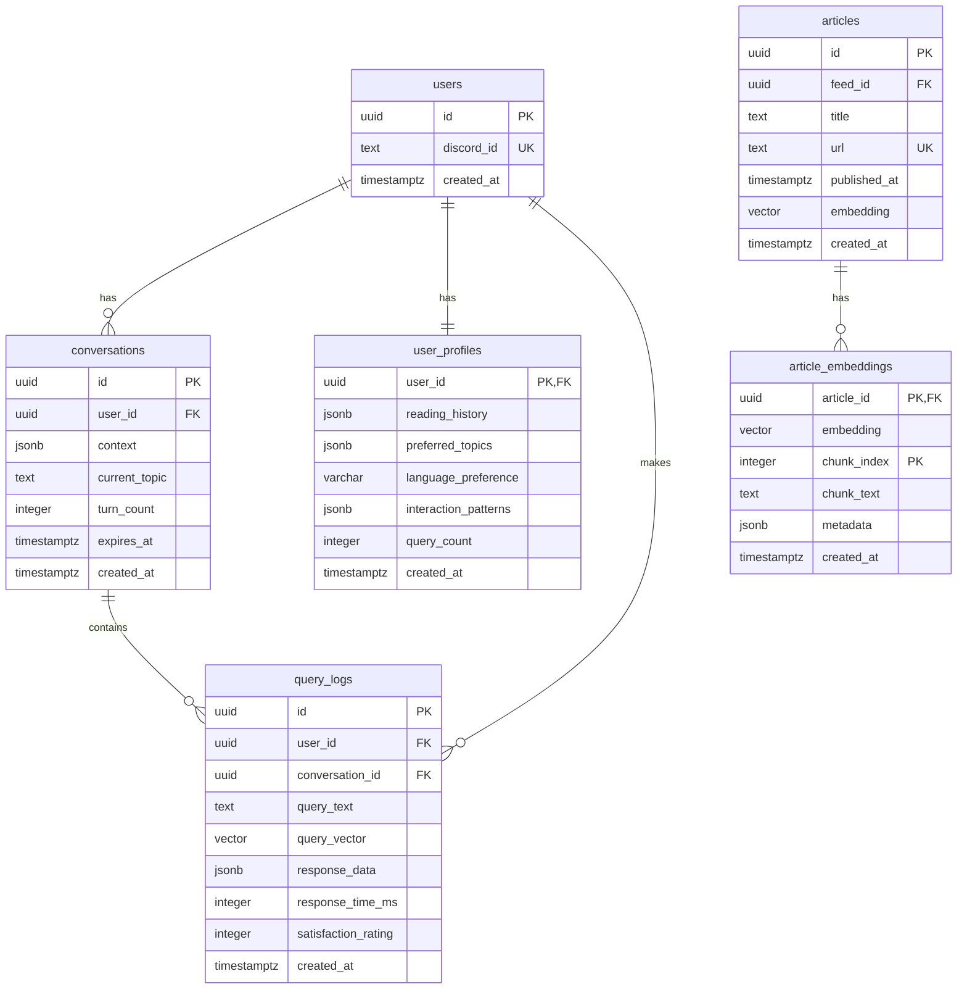

# Intelligent Q&A Agent Database Schema

This document describes the database schema for the Intelligent Q&A Agent feature, which extends the existing Tech News Agent with semantic search and conversational AI capabilities.

## Overview

The Intelligent Q&A Agent uses PostgreSQL with the pgvector extension to enable vector similarity search for semantic article retrieval. The schema includes four new tables that work alongside the existing article system to provide conversational AI functionality.

## Schema Architecture



## Table Descriptions

### article_embeddings

Stores vector embeddings for articles to enable semantic search functionality.

**Purpose**: Enable fast semantic similarity search across article content using pgvector.

**Key Features**:

- Supports chunked articles for long content
- Stores both the embedding vector and original text chunk
- Includes metadata for additional context
- Optimized with ivfflat index for cosine similarity

**Columns**:

- `article_id` (UUID, FK): Reference to articles table
- `embedding` (vector(1536)): Vector embedding (OpenAI dimension)
- `chunk_index` (INTEGER): Index for chunked articles (0 for single chunk)
- `chunk_text` (TEXT): The text chunk that was embedded
- `metadata` (JSONB): Additional metadata for the embedding
- Standard audit fields: `created_at`, `updated_at`, `modified_by`, `deleted_at`

**Indexes**:

- `idx_article_embeddings_cosine`: ivfflat index for vector similarity search
- `idx_article_embeddings_article_id`: Fast lookup by article
- `idx_article_embeddings_deleted_at`: Soft delete support

### conversations

Stores multi-turn conversation context and history for the Q&A agent.

**Purpose**: Maintain conversation state across multiple user interactions to enable contextual follow-up questions.

**Key Features**:

- Automatic expiration after 7 days
- Turn count tracking
- Topic detection and context management
- JSON storage for flexible conversation data

**Columns**:

- `id` (UUID, PK): Unique conversation identifier
- `user_id` (UUID, FK): Reference to users table
- `context` (JSONB): Conversation context and history
- `current_topic` (TEXT): Current conversation topic
- `turn_count` (INTEGER): Number of turns in conversation
- `expires_at` (TIMESTAMPTZ): Auto-expiration timestamp
- `last_updated` (TIMESTAMPTZ): Last activity timestamp
- Standard audit fields: `created_at`, `updated_at`, `modified_by`, `deleted_at`

**Indexes**:

- `idx_conversations_user_id`: Fast lookup by user
- `idx_conversations_expires_at`: Cleanup expired conversations
- `idx_conversations_last_updated`: Activity-based queries

### user_profiles

Stores user preferences, reading history, and interaction patterns for personalization.

**Purpose**: Enable personalized responses and recommendations based on user behavior and preferences.

**Key Features**:

- Reading history tracking
- Topic preference learning
- Multi-language support
- Satisfaction score tracking
- Flexible interaction pattern storage

**Columns**:

- `user_id` (UUID, PK, FK): Reference to users table
- `reading_history` (JSONB): Array of article IDs user has read
- `preferred_topics` (JSONB): Array of preferred topic strings
- `language_preference` (VARCHAR(10)): User's preferred language
- `interaction_patterns` (JSONB): User interaction patterns and preferences
- `query_count` (INTEGER): Total number of queries made
- `satisfaction_scores` (JSONB): Array of satisfaction ratings
- Standard audit fields: `created_at`, `updated_at`, `modified_by`, `deleted_at`

**Indexes**:

- `idx_user_profiles_language_preference`: Language-based queries
- `idx_user_profiles_query_count`: Usage analytics

### query_logs

Stores encrypted query logs for analytics, improvement, and user satisfaction tracking.

**Purpose**: Track user queries for system improvement while maintaining privacy through encryption.

**Key Features**:

- Query text encryption (at application level)
- Vector storage for query similarity analysis
- Response time tracking
- Satisfaction rating collection
- Privacy-compliant data retention

**Columns**:

- `id` (UUID, PK): Unique log entry identifier
- `user_id` (UUID, FK): Reference to users table
- `conversation_id` (UUID, FK): Reference to conversations table (nullable)
- `query_text` (TEXT): The user's query (encrypted at application level)
- `query_vector` (vector(1536)): Vector representation of the query
- `response_data` (JSONB): Structured response data
- `response_time_ms` (INTEGER): Response time in milliseconds
- `articles_found` (INTEGER): Number of articles found
- `satisfaction_rating` (INTEGER): User satisfaction rating (1-5)
- Standard audit fields: `created_at`, `updated_at`, `modified_by`, `deleted_at`

**Indexes**:

- `idx_query_logs_user_id`: User-specific queries
- `idx_query_logs_conversation_id`: Conversation-based analysis
- `idx_query_logs_vector_cosine`: Query similarity search
- `idx_query_logs_response_time`: Performance analytics
- `idx_query_logs_satisfaction`: Satisfaction analysis

## Vector Search Configuration

### pgvector Extension

The schema uses the pgvector extension for efficient vector similarity search:

```sql
CREATE EXTENSION IF NOT EXISTS vector;
```

### Vector Indexes

Two main vector indexes are created:

1. **Article Embeddings Index**:

   ```sql
   CREATE INDEX idx_article_embeddings_cosine
   ON article_embeddings USING ivfflat (embedding vector_cosine_ops)
   WITH (lists = 100);
   ```

2. **Query Logs Index**:
   ```sql
   CREATE INDEX idx_query_logs_vector_cosine
   ON query_logs USING ivfflat (query_vector vector_cosine_ops)
   WITH (lists = 100);
   ```

### Performance Tuning

The ivfflat indexes are configured with `lists = 100`, suitable for up to 100,000 vectors. For larger datasets:

- 100,000 vectors: `lists = 100`
- 1,000,000 vectors: `lists = 1000`
- 10,000,000 vectors: `lists = 10000`

## Business Rules and Constraints

### Data Validation

The schema includes comprehensive constraints to ensure data integrity:

1. **Non-negative Values**: Chunk indexes, turn counts, query counts
2. **Valid Ranges**: Satisfaction ratings (1-5), tinkering index (1-5)
3. **Required Fields**: Query text, user references, article references
4. **Language Validation**: Supported language codes (zh, en, zh-TW, etc.)
5. **Temporal Constraints**: Expiration dates must be after creation dates

### Audit Trail

All tables include standard audit fields:

- `created_at`: Record creation timestamp
- `updated_at`: Last modification timestamp (auto-updated via triggers)
- `modified_by`: Discord ID of the user who made the change
- `deleted_at`: Soft delete timestamp (NULL = not deleted)

### Data Retention

- **Conversations**: Auto-expire after 7 days
- **Query Logs**: Retained for analytics (with encryption)
- **User Profiles**: Persistent (user-controlled deletion)
- **Article Embeddings**: Tied to article lifecycle

## Security Considerations

### Data Encryption

- Query text is encrypted at the application level before storage
- Vector embeddings are not encrypted (mathematical representations)
- User data isolation enforced through foreign key constraints

### Access Control

- All tables reference the users table for access control
- Soft delete preserves audit trail while hiding data
- Row-level security can be implemented for multi-tenant scenarios

### Privacy Compliance

- User data deletion cascades appropriately
- Query logs support complete removal on user request
- Conversation expiration provides automatic cleanup

## Migration and Deployment

### Prerequisites

1. PostgreSQL database with pgvector extension support
2. Existing base schema (users, articles, feeds tables)
3. Appropriate database permissions for schema modifications

### Migration Scripts

1. **Apply Migration**:

   ```bash
   ./backend/scripts/run_intelligent_qa_migration.sh
   ```

2. **Verify Schema**:
   ```bash
   python backend/scripts/verify_intelligent_qa_schema.py
   ```

### Rollback Considerations

- Foreign key constraints prevent data loss
- Soft delete allows data recovery
- Migration includes verification steps
- Backup recommended before migration

## Performance Optimization

### Query Patterns

1. **Semantic Search**: Use vector similarity with LIMIT clauses
2. **User Queries**: Index on user_id for fast user-specific lookups
3. **Conversation Context**: Index on conversation_id and expires_at
4. **Analytics**: Indexes on timestamps and satisfaction ratings

### Monitoring

Key metrics to monitor:

- Vector search response times
- Index usage statistics
- Query log growth rate
- Conversation cleanup effectiveness
- User profile update frequency

### Scaling Considerations

- Vector index tuning based on data volume
- Partitioning for query_logs table (by date)
- Connection pooling for concurrent users
- Read replicas for analytics queries

## Integration with Existing Schema

The new tables integrate seamlessly with the existing schema:

1. **Users Table**: Central user management (no changes required)
2. **Articles Table**: Enhanced with vector embeddings (existing embedding column utilized)
3. **Feeds Table**: Unchanged (articles maintain feed relationships)
4. **Reading List**: Enhanced with user profile integration

This design ensures backward compatibility while adding powerful new capabilities for the intelligent Q&A agent.
