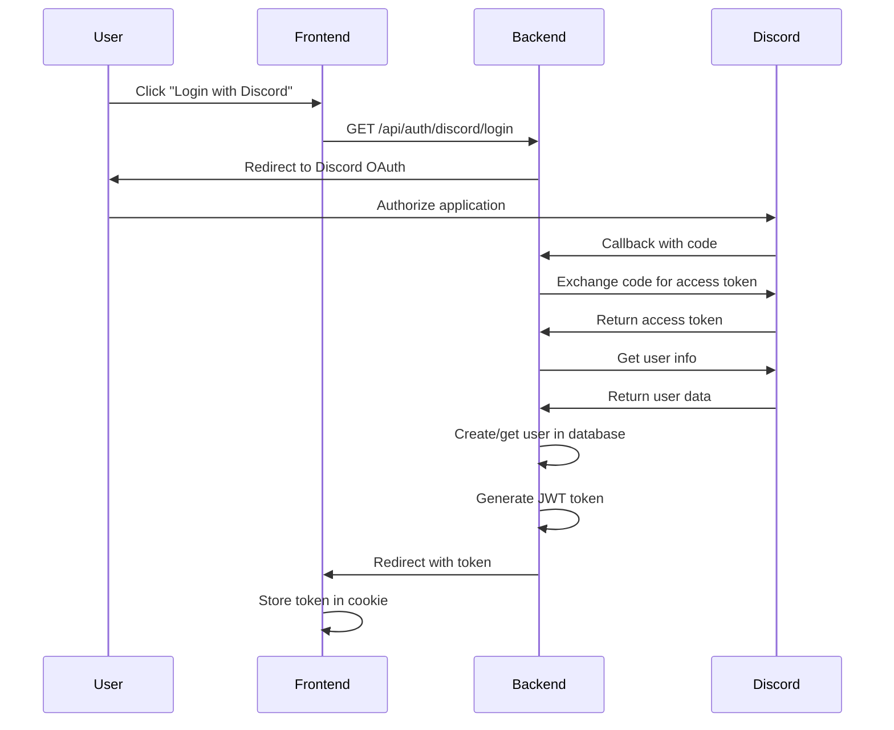

# Security Implementation Guide

## Overview

This document describes the comprehensive security measures implemented for the chat persistence system, including data encryption, authentication, audit logging, and rate limiting.

**Validates: Requirements 8.1, 8.2, 8.5**

## Table of Contents

- [Data Encryption (AES-256-GCM)](#data-encryption-aes-256-gcm)
- [JWT Authentication with Refresh Tokens](#jwt-authentication-with-refresh-tokens)
- [Security Audit Logging](#security-audit-logging)
- [API Rate Limiting](#api-rate-limiting)
- [DDoS Protection](#ddos-protection)
- [Content Integrity Verification](#content-integrity-verification)
- [Configuration](#configuration)
- [Testing](#testing)
- [Best Practices](#best-practices)

---

## Data Encryption (AES-256-GCM)

### Implementation

The system uses **AES-256-GCM** (Galois/Counter Mode) for encrypting sensitive conversation data at rest. This provides both confidentiality and authenticity.

**Location**: `backend/app/core/security.py`

### Key Features

- **Algorithm**: AES-256-GCM with 96-bit nonces
- **Key Derivation**: HKDF-SHA256 from JWT secret or dedicated encryption key
- **Format**: Base64-encoded `<nonce>.<ciphertext+tag>`
- **Graceful Degradation**: Falls back to plaintext if cryptography library unavailable

### Usage

```python
from app.core.security import encrypt_content, decrypt_content, is_encrypted

# Encrypt sensitive data
plaintext = "Sensitive conversation content"
encrypted = encrypt_content(plaintext)

# Decrypt when needed
decrypted = decrypt_content(encrypted)

# Check if content is encrypted
if is_encrypted(some_value):
    decrypted = decrypt_content(some_value)
```

### Key Management

**Priority order for encryption key:**

1. **`ENCRYPTION_KEY` environment variable** (recommended for production)
   - Must be 32 bytes, base64-encoded
   - Generate with: `openssl rand -base64 32`

2. **Derived from `JWT_SECRET`** (fallback)
   - Uses HKDF-SHA256 with salt `"chat-persistence-v1"`
   - Suitable for development/testing

**Production Setup:**

```bash
# Generate a dedicated encryption key
openssl rand -base64 32

# Add to .env
ENCRYPTION_KEY=<generated-key>
```

### Security Properties

- **Confidentiality**: AES-256 provides strong encryption
- **Authenticity**: GCM mode includes authentication tag
- **Uniqueness**: Random 96-bit nonce for each encryption
- **Non-deterministic**: Same plaintext produces different ciphertext

---

## JWT Authentication with Refresh Tokens

### Implementation

The system uses **JWT (JSON Web Tokens)** for stateless authentication with refresh token support.

**Location**: `backend/app/api/auth.py`

### Key Features

- **Algorithm**: HS256 (HMAC-SHA256)
- **Token Expiration**: Configurable (default 7 days)
- **Refresh Mechanism**: Secure token refresh with blacklist
- **Token Blacklist**: In-memory blacklist for revoked tokens
- **Cookie Support**: HttpOnly cookies for web clients

### Authentication Flow



### Token Structure

```json
{
  "sub": "user-uuid",
  "discord_id": "discord-user-id",
  "exp": 1234567890,
  "iat": 1234567890
}
```

### Usage

**Protecting Endpoints:**

```python
from fastapi import Depends
from app.api.auth import get_current_user

@router.get("/protected")
async def protected_endpoint(current_user: dict = Depends(get_current_user)):
    user_id = current_user["user_id"]
    discord_id = current_user["discord_id"]
    # ... endpoint logic
```

**Refreshing Tokens:**

```python
# POST /api/auth/refresh
# Requires valid current token
# Returns new token and blacklists old one
```

**Logging Out:**

```python
# POST /api/auth/logout
# Blacklists current token
# Clears cookie
```

### Security Properties

- **Stateless**: No server-side session storage required
- **Secure**: HMAC-SHA256 signature prevents tampering
- **HttpOnly Cookies**: Prevents XSS attacks
- **Token Blacklist**: Revoked tokens cannot be reused
- **Refresh Mechanism**: Limits token lifetime exposure

---

## Security Audit Logging

### Implementation

All security-sensitive operations are logged to the `security_audit_log` table for compliance and forensic analysis.

**Location**: `backend/app/core/security.py`

### Database Schema

```sql
CREATE TABLE security_audit_log (
    id UUID PRIMARY KEY DEFAULT gen_random_uuid(),
    user_id UUID NOT NULL REFERENCES users(id) ON DELETE CASCADE,
    event_type VARCHAR(50) NOT NULL,
    resource_type VARCHAR(50) NOT NULL,
    resource_id UUID,
    reason TEXT NOT NULL,
    metadata JSONB DEFAULT '{}',
    ip_address VARCHAR(45),
    user_agent TEXT,
    created_at TIMESTAMP DEFAULT NOW()
);
```

### Event Types

- `access_denied`: Unauthorized access attempts
- `data_deletion`: User-requested data deletion
- `data_export`: Data export operations
- `suspicious_activity`: Anomalous behavior detected
- `rate_limit_exceeded`: Rate limit violations

### Usage

```python
from app.core.security import log_security_event, log_access_denied, log_data_deletion, AuditEvent

# Log access denied
await log_access_denied(
    client,
    user_id=user_id,
    resource_type="conversation",
    resource_id=conversation_id,
    reason="User does not own this conversation",
    ip_address=request.client.host
)

# Log data deletion
await log_data_deletion(
    client,
    user_id=user_id,
    resource_type="conversation",
    resource_id=conversation_id,
    metadata={"message_count": 42}
)

# Custom audit event
event = AuditEvent(
    user_id=user_id,
    event_type="data_export",
    resource_type="conversation",
    reason="User requested data export",
    metadata={"format": "json", "size_bytes": 1024}
)
await log_security_event(client, event)
```

### Security Properties

- **Non-blocking**: Audit failures never break primary operations
- **Comprehensive**: Captures user, resource, reason, and context
- **Tamper-evident**: Immutable log entries with timestamps
- **Queryable**: Indexed for efficient forensic analysis

---

## API Rate Limiting

### Implementation

The system implements **dual-layer rate limiting**:

1. **Application-level** (in-process sliding window)
2. **Gateway-level** (slowapi middleware)

**Location**: `backend/app/core/security.py`, `backend/app/main.py`

### Rate Limit Tiers

| Tier                   | Limit   | Window | Use Case                      |
| ---------------------- | ------- | ------ | ----------------------------- |
| **Public API**         | 30 req  | 60s    | Unauthenticated endpoints     |
| **Conversation API**   | 120 req | 60s    | Authenticated CRUD operations |
| **Smart Conversation** | 20 req  | 60s    | LLM-backed features           |
| **Global (slowapi)**   | 100 req | 60s    | Per-IP protection             |

### Usage

**Application-level:**

```python
from app.core.security import conversation_api_limiter, RateLimitError

@router.post("/conversations")
async def create_conversation(current_user: dict = Depends(get_current_user)):
    user_id = str(current_user["user_id"])

    if not conversation_api_limiter.is_allowed(user_id):
        raise RateLimitError("Too many requests. Please try again later.")

    # ... endpoint logic
```

**Gateway-level (slowapi):**

```python
from slowapi import Limiter
from slowapi.util import get_remote_address

limiter = Limiter(key_func=get_remote_address)

@router.get("/public")
@limiter.limit("30/minute")
async def public_endpoint():
    # ... endpoint logic
```

### Monitoring

```python
# Check remaining requests
remaining = conversation_api_limiter.remaining(user_id)

# Reset limit for a user (admin operation)
conversation_api_limiter.reset(user_id)
```

### Security Properties

- **Sliding Window**: More accurate than fixed window
- **Per-user Tracking**: Prevents single user abuse
- **Graceful Degradation**: Returns 429 with Retry-After header
- **Configurable**: Limits adjustable per environment

---

## DDoS Protection

### Implementation

Multi-layered DDoS protection combining rate limiting, connection limits, and request validation.

### Protection Layers

#### 1. **Gateway Rate Limiting (slowapi)**

```python
# Global rate limit per IP address
limiter = Limiter(key_func=get_remote_address)
app.state.limiter = limiter
```

#### 2. **Connection Limits**

```python
# Database connection pool limits
database_pool_max_size: int = 10
database_pool_max_queries: int = 50000
```

#### 3. **Request Size Limits**

```python
# FastAPI automatic request size validation
# Configured in middleware
```

#### 4. **Timeout Protection**

```python
# Database command timeout
database_command_timeout: float = 60.0

# Connection timeout
database_connection_timeout: float = 30.0
```

### Best Practices

- **Use CDN**: Deploy behind Cloudflare or similar for L3/L4 protection
- **Enable CORS**: Restrict origins to prevent cross-origin abuse
- **Monitor Metrics**: Track request rates and error rates
- **Alert on Anomalies**: Set up alerts for unusual traffic patterns

---

## Content Integrity Verification

### Implementation

SHA-256 hashing for verifying content integrity and detecting tampering.

**Location**: `backend/app/core/security.py`

### Usage

```python
from app.core.security import compute_content_hash, verify_content_integrity

# Compute hash when storing
content = "Important message"
content_hash = compute_content_hash(content)

# Store both content and hash
await store_message(content=content, content_hash=content_hash)

# Verify integrity when retrieving
retrieved_content = await get_message(message_id)
if not verify_content_integrity(retrieved_content, stored_hash):
    raise IntegrityError("Content has been tampered with")
```

### Security Properties

- **Collision Resistance**: SHA-256 provides strong collision resistance
- **Timing-Safe Comparison**: Uses `hmac.compare_digest` to prevent timing attacks
- **Deterministic**: Same content always produces same hash
- **Fast**: Efficient for real-time verification

---

## Configuration

### Environment Variables

```bash
# JWT Configuration (Required)
JWT_SECRET=<64-character-hex-string>  # Generate with: openssl rand -hex 32
JWT_ALGORITHM=HS256
JWT_EXPIRATION_DAYS=7

# Encryption Configuration (Optional, recommended for production)
ENCRYPTION_KEY=<base64-encoded-32-bytes>  # Generate with: openssl rand -base64 32

# Rate Limiting Configuration
RATE_LIMIT_PER_MINUTE_UNAUTH=100
RATE_LIMIT_PER_MINUTE_AUTH=300

# Security Configuration
COOKIE_SECURE=true  # Must be true in production (requires HTTPS)

# CORS Configuration
CORS_ORIGINS=https://yourdomain.com,https://app.yourdomain.com
```

### Production Checklist

- [ ] Generate strong `JWT_SECRET` (≥32 characters)
- [ ] Generate dedicated `ENCRYPTION_KEY`
- [ ] Set `COOKIE_SECURE=true`
- [ ] Configure proper `CORS_ORIGINS`
- [ ] Enable HTTPS for all endpoints
- [ ] Set up monitoring and alerting
- [ ] Configure database connection limits
- [ ] Review and adjust rate limits
- [ ] Enable audit log retention policy
- [ ] Set up regular security audits

---

## Testing

### Test Coverage

The security module has **91% test coverage** with 39 comprehensive tests covering:

- ✅ Encryption/decryption roundtrip
- ✅ Nonce uniqueness and randomness
- ✅ Tamper detection
- ✅ Unicode and special character handling
- ✅ Audit logging success and failure cases
- ✅ Rate limiting enforcement
- ✅ Rate limit window expiration
- ✅ Content integrity verification
- ✅ Edge cases and error handling

### Running Tests

```bash
# Run all security tests
python3 -m pytest backend/tests/test_security.py -v

# Run with coverage
python3 -m pytest backend/tests/test_security.py --cov=app.core.security --cov-report=html

# Run specific test class
python3 -m pytest backend/tests/test_security.py::TestEncryption -v
```

### Test Examples

```python
def test_encrypt_decrypt_roundtrip():
    """Test that encryption and decryption are inverse operations"""
    plaintext = "Sensitive conversation data 🔒"
    encrypted = encrypt_content(plaintext)
    decrypted = decrypt_content(encrypted)
    assert decrypted == plaintext

def test_rate_limiter_blocks_requests_exceeding_limit():
    """Test that rate limiter blocks requests exceeding the limit"""
    limiter = RateLimiter(max_requests=3, window_seconds=60)
    key = "user-456"

    # First 3 requests allowed
    for i in range(3):
        assert limiter.is_allowed(key) is True

    # 4th request should be blocked
    assert limiter.is_allowed(key) is False
```

---

## Best Practices

### Encryption

1. **Always encrypt sensitive data** before storing in database
2. **Use dedicated encryption key** in production (not derived from JWT secret)
3. **Rotate encryption keys** periodically (implement key versioning)
4. **Never log encrypted content** or encryption keys
5. **Validate decryption** before using decrypted data

### Authentication

1. **Use HTTPS only** in production (enforce with `COOKIE_SECURE=true`)
2. **Set strong JWT secret** (≥32 characters, random)
3. **Implement token refresh** to limit exposure window
4. **Blacklist revoked tokens** until expiration
5. **Monitor authentication failures** for suspicious activity

### Audit Logging

1. **Log all security events** (access denied, data deletion, exports)
2. **Include context** (IP address, user agent, metadata)
3. **Never log sensitive data** (passwords, tokens, encrypted content)
4. **Implement log retention** policy (e.g., 90 days)
5. **Regular audit reviews** for compliance and forensics

### Rate Limiting

1. **Apply appropriate limits** per endpoint type
2. **Use per-user limits** for authenticated endpoints
3. **Use per-IP limits** for public endpoints
4. **Return 429 with Retry-After** header
5. **Monitor rate limit hits** for abuse patterns

### DDoS Protection

1. **Deploy behind CDN** (Cloudflare, AWS CloudFront)
2. **Enable WAF rules** for common attack patterns
3. **Set connection limits** at load balancer level
4. **Implement request timeouts** to prevent resource exhaustion
5. **Monitor traffic patterns** and set up alerts

---

## Troubleshooting

### Common Issues

#### Encryption Key Not Found

**Error**: `ENCRYPTION_KEY env var is set but invalid`

**Solution**: Ensure key is exactly 32 bytes, base64-encoded:

```bash
openssl rand -base64 32
```

#### JWT Token Expired

**Error**: `Token expired`

**Solution**: Use refresh token endpoint to get new token:

```bash
POST /api/auth/refresh
```

#### Rate Limit Exceeded

**Error**: `Rate limit exceeded`

**Solution**: Wait for rate limit window to reset or contact admin to reset limit.

#### Audit Logging Failure

**Error**: `Failed to persist security audit event`

**Solution**: Check database connectivity and `security_audit_log` table exists. Audit failures are non-fatal and logged as warnings.

---

## References

- [OWASP Top 10](https://owasp.org/www-project-top-ten/)
- [NIST Cryptographic Standards](https://csrc.nist.gov/projects/cryptographic-standards-and-guidelines)
- [JWT Best Practices](https://tools.ietf.org/html/rfc8725)
- [AES-GCM Specification](https://nvlpubs.nist.gov/nistpubs/Legacy/SP/nistspecialpublication800-38d.pdf)

---

**Last Updated**: 2024-12-22
**Version**: 1.0
**Maintainer**: Backend Team
