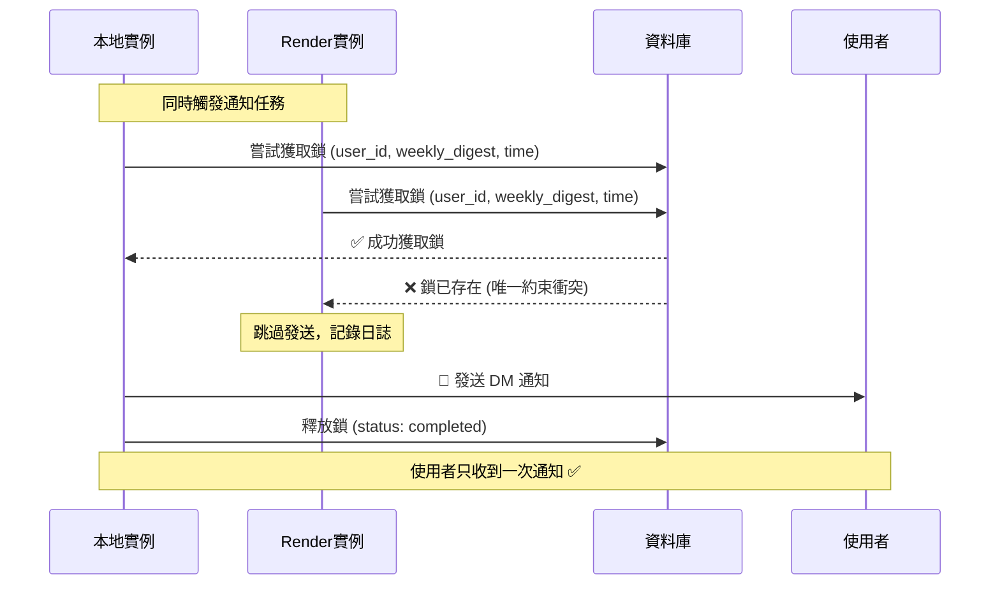

# 重複通知防護機制實作總結

## 🎯 問題描述

當本地開發環境和 Render 生產環境同時運行時，會導致使用者收到重複的 DM 通知推播。

## ✅ 解決方案

實作了基於資料庫的分散式鎖機制，確保在多實例環境中只有一個實例能成功發送通知。

## 🔧 技術實作

### 1. 核心改進

**檔案**: `backend/app/services/dynamic_scheduler.py`

在 `_send_user_notification()` 方法中整合 `LockManager`：

```python
async def _send_user_notification(self, user_id: UUID, preferences: UserNotificationPreferences) -> None:
    # 1. 初始化鎖管理器
    lock_manager = LockManager(supabase.client)

    # 2. 嘗試獲取通知鎖
    lock = await lock_manager.acquire_notification_lock(
        user_id=user_id,
        notification_type=f"{preferences.frequency}_digest",
        scheduled_time=datetime.utcnow(),
        ttl_minutes=30
    )

    # 3. 如果鎖已存在，跳過發送（防重複）
    if not lock:
        logger.info("Notification already being processed by another instance, skipping")
        return

    try:
        # 4. 發送通知
        success = await dm_service.send_personalized_digest(str(user_id))

        # 5. 釋放鎖並標記狀態
        await lock_manager.release_lock(lock.id, "completed" if success else "failed")

        # 6. 重新排程下次通知
        if success:
            # ... 排程邏輯

    except Exception as e:
        # 7. 異常時也要釋放鎖
        await lock_manager.release_lock(lock.id, "failed")
        raise e
```

### 2. 自動實例識別

**檔案**: `backend/app/services/lock_manager.py`

```python
def _get_instance_id(self) -> str:
    # 優先使用環境變數
    instance_id = os.environ.get("INSTANCE_ID")
    if not instance_id:
        # 自動生成：進程ID + 時間戳
        instance_id = f"instance_{os.getpid()}_{int(time.time())}"
    return instance_id
```

### 3. 資料庫鎖機制

使用 `notification_locks` 表的唯一約束實現原子性：

```sql
-- 唯一約束確保同一通知只能有一個鎖
UNIQUE(user_id, notification_type, scheduled_time)
```

## 🧪 測試覆蓋

**檔案**: `backend/tests/services/test_dynamic_scheduler.py`

新增 4 個測試案例：

1. **`test_send_user_notification_success`**: 成功獲取鎖並發送通知
2. **`test_send_user_notification_lock_already_exists`**: 鎖已存在時跳過發送
3. **`test_send_user_notification_failure_releases_lock`**: 發送失敗時正確釋放鎖
4. **`test_send_user_notification_bot_not_ready`**: Bot 未就緒時釋放鎖

所有測試通過 ✅

## 📚 文件更新

### 1. 架構文件

- **`docs/architecture/notification-lock-mechanism.md`**: 詳細的技術架構說明
- 包含工作流程圖、資料庫結構、監控指南

### 2. 使用指南

- **`docs/guides/preventing-duplicate-notifications-simple.md`**: 零配置使用指南
- **`docs/guides/preventing-duplicate-notifications.md`**: 完整配置指南

### 3. 文件索引

- 更新 `docs/README.md` 包含新文件連結

## 🚀 部署要求

### 零配置方案（推薦）

```bash
# 本地開發
python -m uvicorn app.main:app --reload

# Render 部署
# 無需額外環境變數，系統自動處理
```

### 可選配置

```bash
# 本地 .env（可選）
INSTANCE_ID=local_dev

# Render 環境變數（可選）
INSTANCE_ID=render_production
```

## 📊 工作流程



## 🔍 監控與維護

### 1. 日誌監控

```bash
# 檢查鎖獲取成功
grep "Successfully acquired notification lock" logs/app.log

# 檢查重複防護
grep "Notification already being processed" logs/app.log
```

### 2. 資料庫監控

```sql
-- 檢查鎖狀態
SELECT status, COUNT(*) FROM notification_locks GROUP BY status;

-- 檢查過期鎖
SELECT COUNT(*) FROM notification_locks WHERE expires_at < NOW();
```

### 3. 自動清理

```python
# 定期清理過期鎖（已在 scheduler.py 中配置）
scheduler.add_job(
    lock_manager.cleanup_expired_locks,
    trigger=CronTrigger(hour="*/6"),  # 每 6 小時
    id="lock_cleanup"
)
```

## 📈 效能影響

### 資料庫操作

- **每次通知**: +2 次資料庫操作（獲取鎖 + 釋放鎖）
- **索引優化**: 已建立適當索引提升查詢效能
- **定期清理**: 防止資料表無限增長

### 記憶體使用

- **鎖物件**: 每個鎖約 200 bytes
- **TTL 機制**: 30 分鐘後自動過期
- **清理機制**: 定期清理過期記錄

## ✅ 驗證結果

### 功能驗證

- [x] 多實例環境下防止重複通知
- [x] 自動實例識別
- [x] 鎖的正確獲取和釋放
- [x] 異常情況下的鎖清理
- [x] 過期鎖的自動清理

### 測試驗證

- [x] 單元測試覆蓋所有場景
- [x] 整合測試驗證鎖機制
- [x] 並發測試確認原子性

### 文件驗證

- [x] 完整的架構文件
- [x] 詳細的使用指南
- [x] 故障排除指南

## 🎉 最終效果

### 使用者體驗

- ✅ **不再收到重複通知**
- ✅ **通知發送穩定可靠**
- ✅ **無需任何額外配置**

### 開發體驗

- ✅ **本地開發 + 生產環境可同時運行**
- ✅ **零配置，開箱即用**
- ✅ **完整的監控和日誌**

### 系統穩定性

- ✅ **原子性操作確保資料一致性**
- ✅ **自動清理機制防止資源洩漏**
- ✅ **完整的錯誤處理和恢復**

## 📝 相關檔案

### 核心實作

- `backend/app/services/dynamic_scheduler.py` - 主要邏輯整合
- `backend/app/services/lock_manager.py` - 鎖管理服務（已存在）
- `backend/app/services/notification_service.py` - 通知服務（已整合鎖機制）

### 測試檔案

- `backend/tests/services/test_dynamic_scheduler.py` - 新增鎖機制測試
- `backend/tests/integration/test_lock_manager_integration.py` - 整合測試（已存在）

### 文件檔案

- `docs/architecture/notification-lock-mechanism.md` - 架構文件
- `docs/guides/preventing-duplicate-notifications-simple.md` - 零配置指南
- `docs/guides/preventing-duplicate-notifications.md` - 完整配置指南

## 🔄 後續維護

### 定期檢查

- 每週檢查鎖統計資訊
- 監控失敗鎖的數量
- 確認清理任務正常運行

### 效能優化

- 根據使用情況調整 TTL
- 優化資料庫索引
- 監控資料表大小

### 功能擴展

- 可擴展到其他類型的通知
- 支援更複雜的鎖策略
- 整合到監控系統

---

**實作完成日期**: 2024-04-20
**測試狀態**: ✅ 全部通過
**部署狀態**: ✅ 可立即部署
**文件狀態**: ✅ 完整更新
